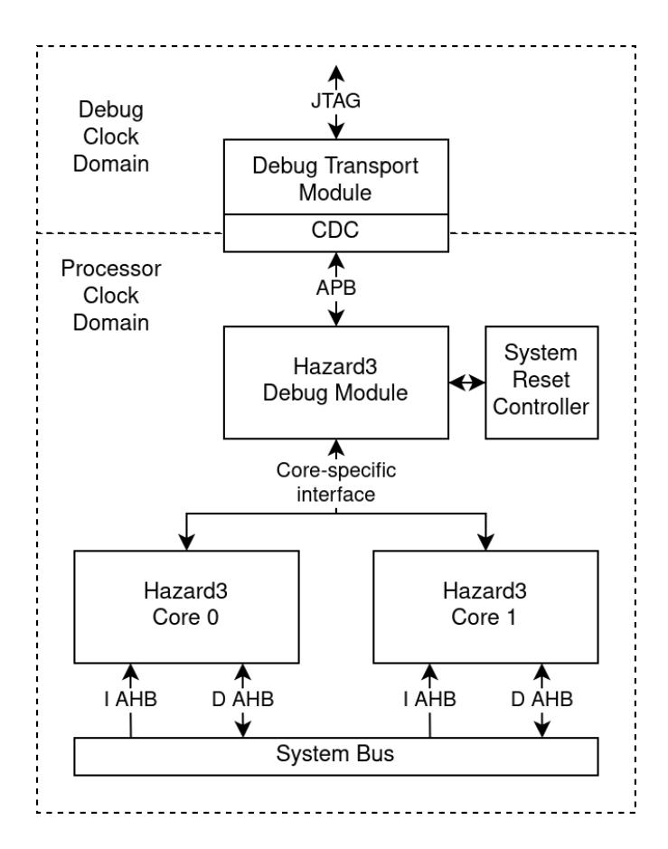

#  5.1. Debug Topologies

Hazard3's Debug Module (DM) has the following interfaces:

- An upstream AMBA 3 APB port the "Debug Module Interface" for host access to the Debug Module
- A downstream Hazard3-specific interface to one or more cores
- Some reset request/acknowledge signals which require careful handshaking with system-level reset logic

This is shown in the example topology below.

The DM *must* be connected directly to the processors without intervening registers. This implies the DM is in the same clock domain as the processors, so multiple processors on the same DM must share a common clock.

Upstream of the DM is at least one Debug Transport Module, which bridges some host-facing interface such as JTAG to the APB DM Interface. Hazard3 provides an implementation of a standard RISC-V JTAG-DTM, but any APB master could be used. The DM requires at least 7 bits of word addressing, i.e. 9 bits of byte address space.

An APB arbiter could be inserted here, to allow multiple transports to be used, provided the host(s) avoid using multiple transports concurrently. This also admits simple implementation of self-hosted debug, by mapping the DM to a system-level peripheral address space.

The clock domain crossing (if any) occurs on the downstream port of the Debug Transport Module. Hazard3's JTAG-DTM implementation runs entirely in the TCK domain, and instantiates a bus clockcrossing module internally to bridge a TCK-domain internal APB bus to an external bus in the processor clock domain.

It is possible to instantiate multiple DMs, one per core, and attach them to a single Debug Transport Module. This is not the preferred topology, but it does allow multiple cores to be independently clocked. In this case, the first DM must be located at address 0x0 in the DMI address space, and you must set the NEXT_DM_ADDR parameter on each DM so that the debugger can walk the (nullterminated) linked list and discover all the DMs.

