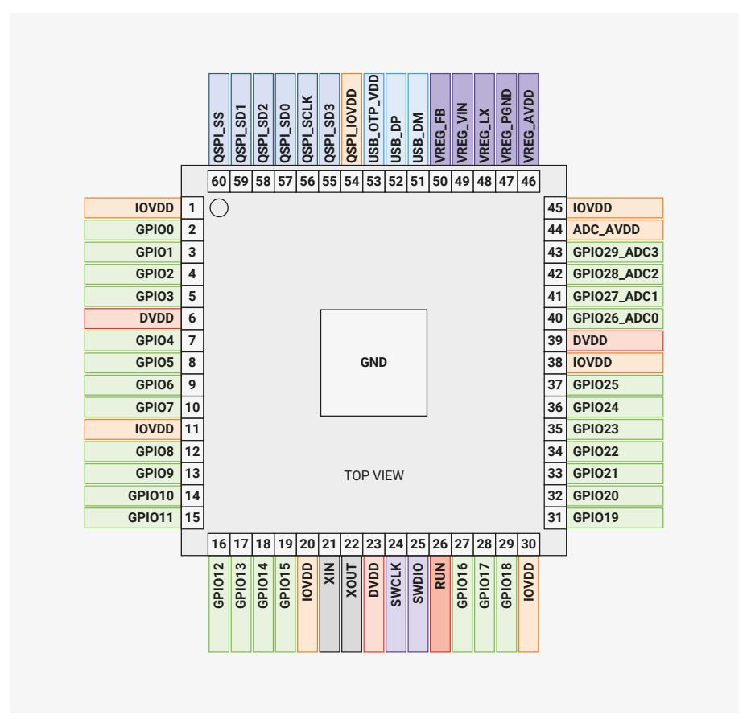
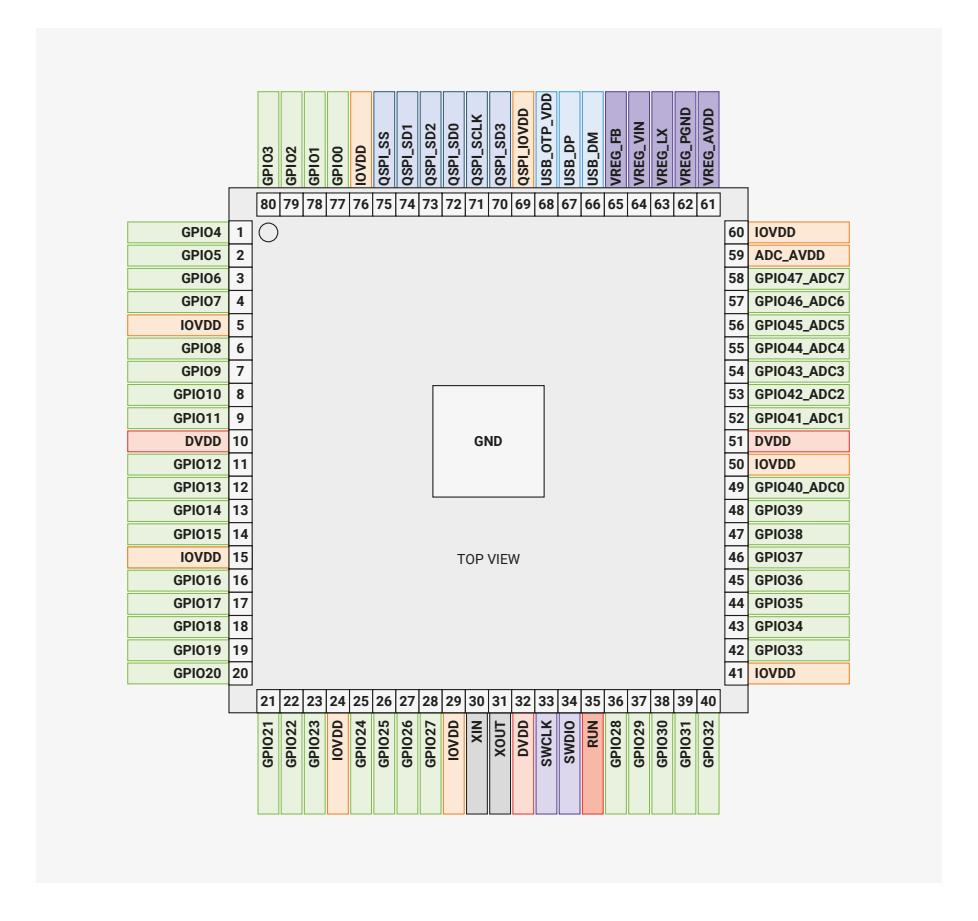

# 1.2.1 Pin Locations

#### **1.2.1.1. QFN-60 (RP2350A)**

#### 1.2.1.2. QFN-80 (RP2350B)

Figure 3. RP2350 Pinout for QFN-80 10×10mm (reduced ePad size)

# 1.2.2. Pin Descriptions

Table 2. The function of each pin is briefly described here. Full electrical specifications can be found in Chapter 14.

| Name                 | Description                                                                                                                                                                                                                                                                 |
|----------------------|-----------------------------------------------------------------------------------------------------------------------------------------------------------------------------------------------------------------------------------------------------------------------------|
| GPIOx                | General-purpose digital input and output. RP2350 can connect one of a number of internal peripherals to each GPIO, or control GPIOs directly from software.                                                                                                                 |
| GPIOx/ADCy           | General-purpose digital input and output, with analogue-to-digital converter function. The RP2350 ADC has an analogue multiplexer which can select any one of these pins, and sample the voltage.                                                                           |
| QSPIx                | Interface to a SPI, Dual-SPI or Quad-SPI flash or PSRAM device, with execute-in-place support.  These pins can also be used as software-controlled GPIOs, if they are not required for flash access.                                                                        |
| USB_DM and USB_DP | USB controller, supporting Full Speed device and Full/Low Speed host. A $27\Omega$ series termination resistor is required on each pin, but bus pullups and pulldowns are provided internally. These pins can be used as software-controlled GPIOs, if USB is not required. |
| XIN and XOUT         | Connect a crystal to RP2350's crystal oscillator. XIN can also be used as a single-ended CMOS clock input, with XOUT disconnected. The USB bootloader defaults to a 12MHz crystal or 12MHz clock input, but this can be configured via OTP.                                 |
| RUN                  | Global asynchronous reset pin. Reset when driven low, run when driven high. If no external reset is required, this pin can be tied directly to IOVDD.                                                                                                                       |
| SWCLK and SWDIO   | Access to the internal Serial Wire Debug multi-drop bus. Provides debug access to both processors, and can be used to download code.                                                                                                                                        |
| GND                  | Single external ground connection, bonded to a number of internal ground pads on the RP2350 die.                                                                                                                                                                            |

| Name        | Description                                                                                                                                                        |
|-------------|--------------------------------------------------------------------------------------------------------------------------------------------------------------------|
| IOVDD       | Power supply for digital GPIOs, nominal voltage 1.8V to 3.3V                                                                                                       |
| USB_OTP_VDD | Power supply for internal USB Full Speed PHY and OTP storage, nominal voltage 3.3V                                                                                 |
| ADC_AVDD    | Power supply for analogue-to-digital converter, nominal voltage 3.3V                                                                                               |
| QSPI_IOVDD  | Power supply for QSPI IOs, nominal voltage 1.8V to 3.3V                                                                                                            |
| VREG_AVDD   | Analogue power supply for internal core voltage regulator, nominal voltage 3.3V                                                                                    |
| VREG_PGND   | Power-ground connection for internal core voltage regulator, tie to ground externally                                                                              |
| VREG_LX     | Switched-mode output for internal core voltage regulator, connected to external inductor. Max current 200 mA, nominal voltage 1.1V after filtering.             |
| VREG_VIN    | Power input for internal core voltage regulator, nominal voltage 2.7V to 5.5V                                                                                      |
| VREG_FB     | Voltage feedback for internal core voltage regulator, connect to filtered VREG output (e.g. to DVDD, if the regulator is used to supply DVDD)                   |
| DVDD        | Digital core power supply, nominal voltage 1.1V. Must be connected externally, either to the voltage regulator output, or an external board-level power supply. |

