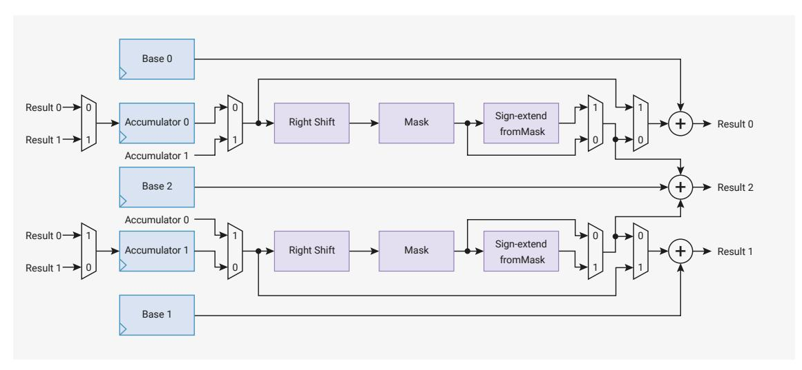
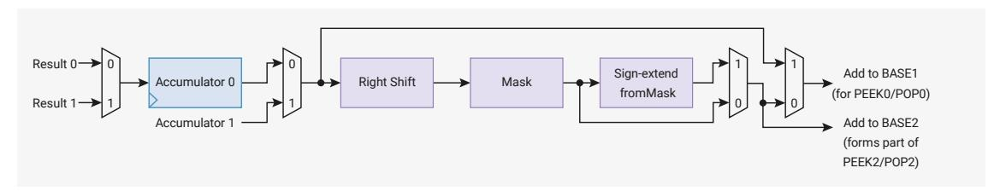
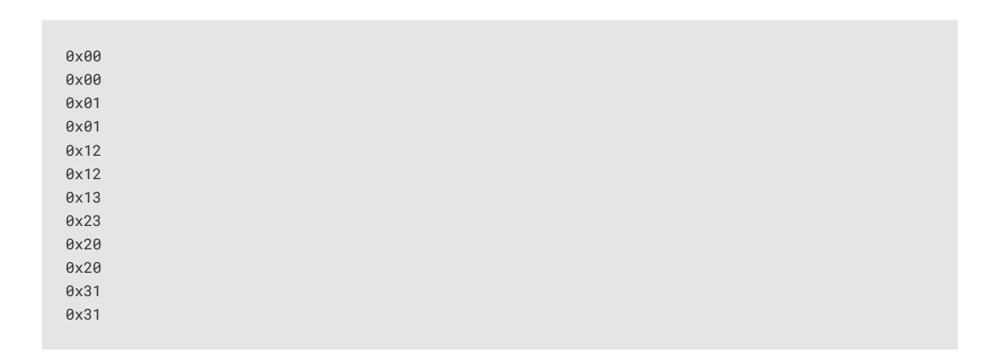

# 3.1.10 Interpolator

Each core is equipped with two *interpolators* (INTERP0 and INTERP1) which can accelerate tasks by combining certain preconfigured operations into a single processor cycle. Intended for cases where the pre-configured operation repeats many times, interpolators result in code which uses both fewer CPU cycles and fewer CPU registers in time-critical sections.

The interpolators already accelerate audio operations within the SDK. Their flexible configuration makes it possible to optimise many other tasks, including:

- quantization
- dithering
- table lookup address generation
- affine texture mapping
- decompression
- linear feedback

Figure 8. An interpolator. The two accumulator registers and three base registers have single cycle read/write access from the processor. The interpolator is organised into two lanes which perform masking, shifting and sign-extension onerations on the two accumulators. This produces three possible results, by adding the intermediate shift/mask values to the three hase right, the multiplexers on each lane are controlled by the following flags in the CTRL registers: CROSS RESULT, CROSS\_INPUT, SIGNED, and ADD RAW.



The processor can write or read any interpolator register in one cycle, and the results are ready on the next cycle. The processor can also perform an addition on one of the two accumulators ACCUM0 or ACCUM1 by writing to the corresponding ACCUMx\_ADD register.

The three results are available in the read-only locations PEEK0, PEEK1, PEEK2. Reading from these locations does not change the state of the interpolator. The results are also aliased at the locations POP0, POP1, POP2; reading from a POPx alias returns the same result as the corresponding PEEKx, and simultaneously writes back the lane results to the accumulators. Use the POPx aliases to advance the state of interpolator each time a result is read.

You can adjust interpolator behaviour with the following operational modes:

- fractional blending between two values
- clamping values to restrict them within a given range.

The following example shows a trivial example of popping a lane result to produce simple iterative feedback.

 $Pico\ Examples: https://github.com/raspberrypi/pico-examples/blob/master/interp/hello\_interp/hello\_interp.c\ Lines\ 11-23$ 

```
11 void times_table() {
12
       puts("9 times table:");
13
       // Initialise lane 0 on interp0 on this core
14
       interp_config cfg = interp_default_config();
15
       interp_set_config(interp0, 0, &cfg);
16
17
       interp0->accum[0] = 0;
18
       interp0->base[0] = 9;
19
20
21
       for (int i = 0; i < 10; ++i)
22
           printf("%d\n", interp0->pop[0]);
23 }
```

#### 3.1.10.1. Lane Operations

Figure 9. Each lane of each interpolator can be configured to perform mask, shift and sign-extension on one of the accumulators. This is fed into adders which produce final results, which may optionally he fed back into the accumulators with each read. The datanath can he configured using a handful of 32-bit multiplexers. From left to right, these are controlled by the following CTRL flags: For example, if: CROSS RESULT CROSS\_INPUT, SIGNED, and ADD\_RAW.



Each lane performs these three operations, in sequence:

- A right shift by CTRL\_LANEx\_SHIFT (0 to 31 bits)
- A mask of bits from CTRL\_LANEx\_MASK\_LSB to CTRL\_LANEx\_MASK\_MSB inclusive (each ranging from bit 0 to bit 31)
- A sign extension from the top of the mask, i.e. take bit CTRL\_LANEX\_MASK\_MSB and OR it into all more-significant bits, if CTRL\_LANEx\_SIGNED is set

- ACCUM0 = 0xdeadbeef
- CTRL\_LANE0\_SHIFT = 8
- CTRL LANEO MASK LSB = 4
- CTRL\_LANE0\_MASK\_MSB = 7
- CTRL SIGNED = 1

Then lane 0 would produce the following results at each stage:

- Right shift by 8 to produce 0x00deadbe
- Mask bits 7 to 4 to produce 0x00deadbe & 0x0000000f0 = 0x0000000b0
- Sign-extend up from bit 7 to produce 0xffffffb0

In software:

Pico Examples: https://github.com/raspberrypi/pico-examples/blob/master/interp/hello\_interp.c Lines 25 - 46

```
25 void moving_mask() {
26
   interp_config cfg = interp_default_config();
27
      interp\theta - accum[\theta] = \theta x 1234abcd;
28
29
     puts("Masking:");
30
       printf("ACCUM0 = %08x\n", interp0->accum[0]);
31
       for (int i = 0; i < 8; ++i) {
32
           // LSB, then MSB. These are inclusive, so 0,31 means "the entire 32 bit register"
33
           interp\_config\_set\_mask(\&cfg, i * 4, i * 4 + 3);
34
           interp_set_config(interp0, 0, &cfg);
35
           // Reading from ACCUMx_ADD returns the raw lane shift and mask value, without BASEx
  added
36
           printf("Nibble %d: %08x\n", i, interp0->add_raw[0]);
37
38
     puts("Masking with sign extension:");
39
40
      interp_config_set_signed(&cfg, true);
41
       for (int i = 0; i < 8; ++i) {
           interp\_config\_set\_mask(\&cfg, i * 4, i * 4 + 3);
42
43
           interp_set_config(interp0, 0, &cfg);
           printf("Nibble %d: %08x\n", i, interp0->add_raw[0]);
44
45
46 }
```

The above example should print the following:

```
ACCUM0 = 1234abcd
Nibble 0: 0000000d
Nibble 1: 000000c0
Nibble 2: 00000b00
Nibble 3: 0000a000
Nibble 4: 00040000
Nibble 5: 00300000
Nibble 6: 02000000
Nibble 7: 10000000
Masking with sign extension:
Nibble 0: fffffffd
Nibble 1: ffffffc0
Nibble 2: fffffb00
Nibble 3: ffffa000
Nibble 4: 00040000
Nibble 5: 00300000
Nibble 6: 02000000
Nibble 7: 10000000
```

Changing the result and input multiplexers can create feedback between the accumulators. This is useful for audio dithering.

*Pico Examples: [https://github.com/raspberrypi/pico-examples/blob/master/interp/hello\\_interp/hello\\_interp.c](https://github.com/raspberrypi/pico-examples/blob/master/interp/hello_interp/hello_interp.c#L48-L66) Lines 48 - 66*

```
48 void cross_lanes() {
49 interp_config cfg = interp_default_config();
50 interp_config_set_cross_result(&cfg, true);
51 // ACCUM0 gets lane 1 result:
52 interp_set_config(interp0, 0, &cfg);
53 // ACCUM1 gets lane 0 result:
54 interp_set_config(interp0, 1, &cfg);
55 
56 interp0->accum[0] = 123;
57 interp0->accum[1] = 456;
58 interp0->base[0] = 1;
59 interp0->base[1] = 0;
60 puts("Lane result crossover:");
61 for (int i = 0; i < 10; ++i) {
62 uint32_t peek0 = interp0->peek[0];
63 uint32_t pop1 = interp0->pop[1];
64 printf("PEEK0, POP1: %d, %d\n", peek0, pop1);
65 }
66 }
```

This should print the following :

```
PEEK0, POP1: 124, 456
PEEK0, POP1: 457, 124
PEEK0, POP1: 125, 457
PEEK0, POP1: 458, 125
PEEK0, POP1: 126, 458
PEEK0, POP1: 459, 126
PEEK0, POP1: 127, 459
PEEK0, POP1: 460, 127
PEEK0, POP1: 128, 460
PEEK0, POP1: 461, 128
```

#### **3.1.10.2. Blend Mode**

Blend mode is available on INTERP0 on each core, and is enabled by the CTRL\_LANE0\_BLEND control flag. It performs linear interpolation, which we define as follows:

$$x = x_0 + \alpha(x_1 - x_0)$$
, for  $0 \le \alpha < 1$ 

Where is the register BASE0, is the register BASE1, and is a fractional value formed from the least significant 8 bits of the lane 1 shift and mask value.

Blend mode differs from normal mode in the following ways:

- PEEK0, POP0 return the 8-bit alpha value (the 8 LSBs of the lane 1 shift and mask value), with zeroes in result bits 31 down to 24.
- PEEK1, POP1 return the linear interpolation between BASE0 and BASE1
- PEEK2, POP2 do not include lane 1 result in the addition (i.e. it is BASE2 + lane 0 shift and mask value)

The result of the linear interpolation is equal to BASE0 when the alpha value is 0, and equal to BASE0 + 255/256 \* (BASE1 - BASE0) when the alpha value is all-ones.

*Pico Examples: [https://github.com/raspberrypi/pico-examples/blob/master/interp/hello\\_interp/hello\\_interp.c](https://github.com/raspberrypi/pico-examples/blob/master/interp/hello_interp/hello_interp.c#L68-L87) Lines 68 - 87*

```
68 void simple_blend1() {
69 puts("Simple blend 1:");
70 
71 interp_config cfg = interp_default_config();
72 interp_config_set_blend(&cfg, true);
73 interp_set_config(interp0, 0, &cfg);
74 
75 cfg = interp_default_config();
76 interp_set_config(interp0, 1, &cfg);
77 
78 interp0->base[0] = 500;
79 interp0->base[1] = 1000;
80 
81 for (int i = 0; i <= 6; i++) {
82 // set fraction to value between 0 and 255
83 interp0->accum[1] = 255 * i / 6;
84 // ≈ 500 + (1000 - 500) * i / 6;
85 printf("%d\n", (int) interp0->peek[1]);
86 }
87 }
```

This should print the following (note the 255/256 resulting in 998 not 1000):

```
500
582
666
748
832
914
998
```

CTRL\_LANE1\_SIGNED controls whether BASE0 and BASE1 are sign-extended for this interpolation (this sign extension is required because the interpolation produces an intermediate product value 40 bits in size). CTRL\_LANE0\_SIGNED continues to control the sign extension of the lane 0 intermediate result in PEEK2, POP2 as normal.

*Pico Examples: [https://github.com/raspberrypi/pico-examples/blob/master/interp/hello\\_interp/hello\\_interp.c](https://github.com/raspberrypi/pico-examples/blob/master/interp/hello_interp/hello_interp.c#L90-L121) Lines 90 - 121*

```
 90 void print_simple_blend2_results(bool is_signed) {
 91 // lane 1 signed flag controls whether base 0/1 are treated as signed or unsigned
 92 interp_config cfg = interp_default_config();
 93 interp_config_set_signed(&cfg, is_signed);
 94 interp_set_config(interp0, 1, &cfg);
 95 
 96 for (int i = 0; i <= 6; i++) {
 97 interp0->accum[1] = 255 * i / 6;
 98 if (is_signed) {
 99 printf("%d\n", (int) interp0->peek[1]);
100 } else {
101 printf("0x%08x\n", (uint) interp0->peek[1]);
102 }
103 }
104 }
105 
106 void simple_blend2() {
107 puts("Simple blend 2:");
108 
109 interp_config cfg = interp_default_config();
110 interp_config_set_blend(&cfg, true);
111 interp_set_config(interp0, 0, &cfg);
112 
113 interp0->base[0] = (uint32_t) -1000;
114 interp0->base[1] = 1000;
115 
116 puts("signed:");
117 print_simple_blend2_results(true);
118 
119 puts("unsigned:");
120 print_simple_blend2_results(false);
121 }
```

This should print the following:

```
signed:
-1000
-672
-336
-8
328
656
992
unsigned:
0xfffffc18
0xd5fffd60
0xaafffeb0
0x80fffff8
0x56000148
0x2c000290
0x010003e0
```

Finally, in blend mode when using the BASE\_1AND0 register to send a 16-bit value to each of BASE0 and BASE1 with a single 32-bit write, the sign-extension of these 16-bit values to full 32-bit values during the write is controlled by CTRL\_LANE1\_SIGNED for both bases, as opposed to non-blend-mode operation, where CTRL\_LANE0\_SIGNED affects extension into BASE0 and CTRL\_LANE1\_SIGNED affects extension into BASE1.

*Pico Examples: [https://github.com/raspberrypi/pico-examples/blob/master/interp/hello\\_interp/hello\\_interp.c](https://github.com/raspberrypi/pico-examples/blob/master/interp/hello_interp/hello_interp.c#L124-L145) Lines 124 - 145*

```
124 void simple_blend3() {
125 puts("Simple blend 3:");
126 
127 interp_config cfg = interp_default_config();
128 interp_config_set_blend(&cfg, true);
129 interp_set_config(interp0, 0, &cfg);
130 
131 cfg = interp_default_config();
132 interp_set_config(interp0, 1, &cfg);
133 
134 interp0->accum[1] = 128;
135 interp0->base01 = 0x30005000;
136 printf("0x%08x\n", (int) interp0->peek[1]);
137 interp0->base01 = 0xe000f000;
138 printf("0x%08x\n", (int) interp0->peek[1]);
139 
140 interp_config_set_signed(&cfg, true);
141 interp_set_config(interp0, 1, &cfg);
142 
143 interp0->base01 = 0xe000f000;
144 printf("0x%08x\n", (int) interp0->peek[1]);
145 }
```

This should print the following:

```
0x00004000
0x0000e800
0xffffe800
```

#### **3.1.10.3. Clamp Mode**

Clamp mode is available on INTERP1 on each core. To enable clamp mode, set the CTRL\_LANE0\_CLAMP control flag to high. In clamp mode, the PEEK0/POP0 result is the lane value (shifted, masked, sign-extended ACCUM0) clamped between BASE0 and BASE1. In other words, if the lane value is less than BASE0, a value of BASE0 is produced; if greater than BASE1, a value of BASE1 is produced; otherwise, the value passes through. No addition is performed. The signedness of these comparisons is controlled by the CTRL\_LANE0\_SIGNED flag.

Other than this, the interpolator behaves the same as in normal mode.

*Pico Examples: [https://github.com/raspberrypi/pico-examples/blob/master/interp/hello\\_interp/hello\\_interp.c](https://github.com/raspberrypi/pico-examples/blob/master/interp/hello_interp/hello_interp.c#L193-L211) Lines 193 - 211*

```
193 void clamp() {
194 puts("Clamp:");
195 interp_config cfg = interp_default_config();
196 interp_config_set_clamp(&cfg, true);
197 interp_config_set_shift(&cfg, 2);
198 // set mask according to new position of sign bit..
199 interp_config_set_mask(&cfg, 0, 29);
200 // ...so that the shifted value is correctly sign extended
201 interp_config_set_signed(&cfg, true);
202 interp_set_config(interp1, 0, &cfg);
203 
204 interp1->base[0] = 0;
205 interp1->base[1] = 255;
206 
207 for (int i = -1024; i <= 1024; i += 256) {
```

```
208 interp1->accum[0] = i;
209 printf("%d\t%d\n", i, (int) interp1->peek[0]);
210 }
211 }
```

This should print the following:

```
-1024 0
-768 0
-512 0
-256 0
0 0
256 64
512 128
768 192
1024 255
```

#### **3.1.10.4. Sample Use Case: Linear Interpolation**

Linear interpolation combines blend mode with other interpolator functionality. In this example, ACCUM0 tracks a fixedpoint (integer/fraction) position within a list of values to be interpolated. Lane 0 is used to produce an address into the value array for the integer part of the position. The fractional part of the position is shifted to produce a value from 0- 255 for the blend. The blend is performed between two consecutive values in the array.

Finally the fractional position is updated via a single write to ACCUM0\_ADD\_RAW.

*Pico Examples: [https://github.com/raspberrypi/pico-examples/blob/master/interp/hello\\_interp/hello\\_interp.c](https://github.com/raspberrypi/pico-examples/blob/master/interp/hello_interp/hello_interp.c#L147-L191) Lines 147 - 191*

```
147 void linear_interpolation() {
148 puts("Linear interpolation:");
149 const int uv_fractional_bits = 12;
150 
151 // for lane 0
152 // shift and mask XXXX XXXX XXXX XXXX XXXX FFFF FFFF FFFF (accum 0)
153 // to 0000 0000 000X XXXX XXXX XXXX XXXX XXX0
154 // i.e. non fractional part times 2 (for uint16_t)
155 interp_config cfg = interp_default_config();
156 interp_config_set_shift(&cfg, uv_fractional_bits - 1);
157 interp_config_set_mask(&cfg, 1, 32 - uv_fractional_bits);
158 interp_config_set_blend(&cfg, true);
159 interp_set_config(interp0, 0, &cfg);
160 
161 // for lane 1
162 // shift XXXX XXXX XXXX XXXX XXXX FFFF FFFF FFFF (accum 0 via cross input)
163 // to 0000 XXXX XXXX XXXX XXXX FFFF FFFF FFFF
164 
165 cfg = interp_default_config();
166 interp_config_set_shift(&cfg, uv_fractional_bits - 8);
167 interp_config_set_signed(&cfg, true);
168 interp_config_set_cross_input(&cfg, true); // signed blending
169 interp_set_config(interp0, 1, &cfg);
170 
171 int16_t samples[] = {0, 10, -20, -1000, 500};
172 
173 // step is 1/4 in our fractional representation
174 uint step = (1 << uv_fractional_bits) / 4;
175 
176 interp0->accum[0] = 0; // initial sample_offset;
```

```
177 interp0->base[2] = (uintptr_t) samples;
178 for (int i = 0; i < 16; i++) {
179 // result2 = samples + (lane0 raw result)
180 // i.e. ptr to the first of two samples to blend between
181 int16_t *sample_pair = (int16_t *) interp0->peek[2];
182 interp0->base[0] = sample_pair[0];
183 interp0->base[1] = sample_pair[1];
184 uint32_t peek1 = interp0->peek[1];
185 uint32_t add_raw1 = interp0->add_raw[1];
186 printf("%d\t(%d%% between %d and %d)\n", (int) peek1,
187 100 * (add_raw1 & 0xff) / 0xff,
188 sample_pair[0], sample_pair[1]);
189 interp0->add_raw[0] = step;
190 }
191 }
```

This should print the following:

```
0 (0% between 0 and 10)
2 (25% between 0 and 10)
5 (50% between 0 and 10)
7 (75% between 0 and 10)
10 (0% between 10 and -20)
2 (25% between 10 and -20)
-5 (50% between 10 and -20)
-13 (75% between 10 and -20)
-20 (0% between -20 and -1000)
-265 (25% between -20 and -1000)
-510 (50% between -20 and -1000)
-755 (75% between -20 and -1000)
-1000 (0% between -1000 and 500)
-625 (25% between -1000 and 500)
-250 (50% between -1000 and 500)
125 (75% between -1000 and 500)
```

This method is used for fast approximate audio upscaling in the SDK.

#### **3.1.10.5. Sample Use Case: Simple Affine Texture Mapping**

Simple affine texture mapping can be implemented by using fixed-point arithmetic for texture coordinates, and stepping a fixed amount in each coordinate for every pixel in a scanline. The integer parts of the texture coordinates form an address into the texture. Reading from POP2 adds the offset to the texture base pointer. The processor loads the resulting address to sample a pixel colour from the texture.

By using two lanes, all three base values, and the CTRL\_LANEx\_ADD\_RAW flag, you can use the interpolator to reduce an expensive CPU operation to a single cycle iteration.

*Pico Examples: [https://github.com/raspberrypi/pico-examples/blob/master/interp/hello\\_interp/hello\\_interp.c](https://github.com/raspberrypi/pico-examples/blob/master/interp/hello_interp/hello_interp.c#L214-L272) Lines 214 - 272*

```
214 void texture_mapping_setup(uint8_t *texture, uint texture_width_bits, uint
  texture_height_bits,
215 uint uv_fractional_bits) {
216 interp_config cfg = interp_default_config();
217 // set add_raw flag to use raw (un-shifted and un-masked) lane accumulator value when
  adding
218 // it to the lane base to make the lane result
219 interp_config_set_add_raw(&cfg, true);
220 interp_config_set_shift(&cfg, uv_fractional_bits);
```

```
221 interp_config_set_mask(&cfg, 0, texture_width_bits - 1);
222 interp_set_config(interp0, 0, &cfg);
223 
224 interp_config_set_shift(&cfg, uv_fractional_bits - texture_width_bits);
225 interp_config_set_mask(&cfg, texture_width_bits, texture_width_bits +
  texture_height_bits - 1);
226 interp_set_config(interp0, 1, &cfg);
227 
228 interp0->base[2] = (uintptr_t) texture;
229 }
230 
231 void texture_mapped_span(uint8_t *output, uint32_t u, uint32_t v, uint32_t du, uint32_t dv,
  uint count) {
232 // u, v are texture coordinates in fixed point with uv_fractional_bits fractional bits
233 // du, dv are texture coordinate steps across the span in same fixed point.
234 interp0->accum[0] = u;
235 interp0->base[0] = du;
236 interp0->accum[1] = v;
237 interp0->base[1] = dv;
238 for (uint i = 0; i < count; i++) {
239 // equivalent to
240 // uint32_t sm_result0 = (accum0 >> uv_fractional_bits) & (1 << (texture_width_bits -
  1);
241 // uint32_t sm_result1 = (accum1 >> uv_fractional_bits) & (1 << (texture_height_bits -
  1);
242 // uint8_t *address = texture + sm_result0 + (sm_result1 << texture_width_bits);
243 // output[i] = *address;
244 // accum0 = du + accum0;
245 // accum1 = dv + accum1;
246 
247 // result2 is the texture address for the current pixel;
248 // popping the result advances to the next iteration
249 output[i] = *(uint8_t *) interp0->pop[2];
250 }
251 }
252 
253 void texture_mapping() {
254 puts("Affine Texture mapping (with texture wrap):");
255 
256 uint8_t texture[] = {
257 0x00, 0x01, 0x02, 0x03,
258 0x10, 0x11, 0x12, 0x13,
259 0x20, 0x21, 0x22, 0x23,
260 0x30, 0x31, 0x32, 0x33,
261 };
262 // 4x4 texture
263 texture_mapping_setup(texture, 2, 2, 16);
264 uint8_t output[12];
265 uint32_t du = 65536 / 2; // step of 1/2
266 uint32_t dv = 65536 / 3; // step of 1/3
267 texture_mapped_span(output, 0, 0, du, dv, 12);
268 
269 for (uint i = 0; i < 12; i++) {
270 printf("0x%02x\n", output[i]);
271 }
272 }
```

This should print the following:



<span id="page-54-0"></span>The SIO registers start at a base address of 0xd0000000 (defined as [SIO\\_BASE](#page-33-1) in SDK).

*Table 16. List of SIO registers*

<span id="page-54-1"></span>

| Offset | Name            | Info                                                                                                                                                                                                                                                                                                                                                                        |
|--------|-----------------|-----------------------------------------------------------------------------------------------------------------------------------------------------------------------------------------------------------------------------------------------------------------------------------------------------------------------------------------------------------------------------|
| 0x000  | CPUID           | Processor core identifier                                                                                                                                                                                                                                                                                                                                                   |
| 0x004  | GPIO_IN         | Input value for GPIO0…31.                                                                                                                                                                                                                                                                                                                                                   |
|        |                 | In the Non-secure SIO, Secure-only GPIOs (as per ACCESSCTRL)<br>appear as zero.                                                                                                                                                                                                                                                                                             |
| 0x008  | GPIO_HI_IN      | Input value on GPIO32…47, QSPI IOs and USB pins                                                                                                                                                                                                                                                                                                                             |
|        |                 | In the Non-secure SIO, Secure-only GPIOs (as per ACCESSCTRL)<br>appear as zero.                                                                                                                                                                                                                                                                                             |
| 0x010  | GPIO_OUT        | GPIO0…31 output value                                                                                                                                                                                                                                                                                                                                                       |
| 0x014  | GPIO_HI_OUT     | Output value for GPIO32…47, QSPI IOs and USB pins.                                                                                                                                                                                                                                                                                                                          |
|        |                 | Write to set output level (1/0 → high/low). Reading back gives<br>the last value written, NOT the input value from the pins. If core 0<br>and core 1 both write to GPIO_HI_OUT simultaneously (or to a<br>SET/CLR/XOR alias), the result is as though the write from core 0<br>took place first, and the write from core 1 was then applied to<br>that intermediate result. |
|        |                 | In the Non-secure SIO, Secure-only GPIOs (as per ACCESSCTRL)<br>ignore writes, and their output status reads back as zero. This is<br>also true for SET/CLR/XOR aliases of this register.                                                                                                                                                                                   |
| 0x018  | GPIO_OUT_SET    | GPIO0…31 output value set                                                                                                                                                                                                                                                                                                                                                   |
| 0x01c  | GPIO_HI_OUT_SET | Output value set for GPIO3247, QSPI IOs and USB pins.<br>Perform an atomic bit-set on GPIO_HI_OUT, i.e. GPIO_HI_OUT  =<br>wdata                                                                                                                                                                                                                                             |
| 0x020  | GPIO_OUT_CLR    | GPIO0…31 output value clear                                                                                                                                                                                                                                                                                                                                                 |
| 0x024  | GPIO_HI_OUT_CLR | Output value clear for GPIO3247, QSPI IOs and USB pins.<br>Perform an atomic bit-clear on GPIO_HI_OUT, i.e. GPIO_HI_OUT &=<br>~wdata                                                                                                                                                                                                                                        |
| 0x028  | GPIO_OUT_XOR    | GPIO0…31 output value XOR                                                                                                                                                                                                                                                                                                                                                   |
|        |                 |                                                                                                                                                                                                                                                                                                                                                                             |

| Offset | Name               | Info                                                                                                                                                                                                                                                                                                                               |
|--------|--------------------|------------------------------------------------------------------------------------------------------------------------------------------------------------------------------------------------------------------------------------------------------------------------------------------------------------------------------------|
| 0x02c  | GPIO_HI_OUT_XOR    | Output value XOR for GPIO3247, QSPI IOs and USB pins.<br>Perform an atomic bitwise XOR on GPIO_HI_OUT, i.e. GPIO_HI_OUT<br>^= wdata                                                                                                                                                                                                |
| 0x030  | GPIO_OE            | GPIO0…31 output enable                                                                                                                                                                                                                                                                                                             |
| 0x034  | GPIO_HI_OE         | Output enable value for GPIO32…47, QSPI IOs and USB pins.                                                                                                                                                                                                                                                                          |
|        |                    | Write output enable (1/0 → output/input). Reading back gives<br>the last value written. If core 0 and core 1 both write to<br>GPIO_HI_OE simultaneously (or to a SET/CLR/XOR alias), the<br>result is as though the write from core 0 took place first, and the<br>write from core 1 was then applied to that intermediate result. |
|        |                    | In the Non-secure SIO, Secure-only GPIOs (as per ACCESSCTRL)<br>ignore writes, and their output status reads back as zero. This is<br>also true for SET/CLR/XOR aliases of this register.                                                                                                                                          |
| 0x038  | GPIO_OE_SET        | GPIO0…31 output enable set                                                                                                                                                                                                                                                                                                         |
| 0x03c  | GPIO_HI_OE_SET     | Output enable set for GPIO32…47, QSPI IOs and USB pins.<br>Perform an atomic bit-set on GPIO_HI_OE, i.e. GPIO_HI_OE  = wdata                                                                                                                                                                                                       |
| 0x040  | GPIO_OE_CLR        | GPIO0…31 output enable clear                                                                                                                                                                                                                                                                                                       |
| 0x044  | GPIO_HI_OE_CLR     | Output enable clear for GPIO32…47, QSPI IOs and USB pins.<br>Perform an atomic bit-clear on GPIO_HI_OE, i.e. GPIO_HI_OE &=<br>~wdata                                                                                                                                                                                               |
| 0x048  | GPIO_OE_XOR        | GPIO0…31 output enable XOR                                                                                                                                                                                                                                                                                                         |
| 0x04c  | GPIO_HI_OE_XOR     | Output enable XOR for GPIO32…47, QSPI IOs and USB pins.<br>Perform an atomic bitwise XOR on GPIO_HI_OE, i.e. GPIO_HI_OE ^=<br>wdata                                                                                                                                                                                                |
| 0x050  | FIFO_ST            | Status register for inter-core FIFOs (mailboxes).                                                                                                                                                                                                                                                                                  |
| 0x054  | FIFO_WR            | Write access to this core's TX FIFO                                                                                                                                                                                                                                                                                                |
| 0x058  | FIFO_RD            | Read access to this core's RX FIFO                                                                                                                                                                                                                                                                                                 |
| 0x05c  | SPINLOCK_ST        | Spinlock state                                                                                                                                                                                                                                                                                                                     |
| 0x080  | INTERP0_ACCUM0     | Read/write access to accumulator 0                                                                                                                                                                                                                                                                                                 |
| 0x084  | INTERP0_ACCUM1     | Read/write access to accumulator 1                                                                                                                                                                                                                                                                                                 |
| 0x088  | INTERP0_BASE0      | Read/write access to BASE0 register.                                                                                                                                                                                                                                                                                               |
| 0x08c  | INTERP0_BASE1      | Read/write access to BASE1 register.                                                                                                                                                                                                                                                                                               |
| 0x090  | INTERP0_BASE2      | Read/write access to BASE2 register.                                                                                                                                                                                                                                                                                               |
| 0x094  | INTERP0_POP_LANE0  | Read LANE0 result, and simultaneously write lane results to both<br>accumulators (POP).                                                                                                                                                                                                                                            |
| 0x098  | INTERP0_POP_LANE1  | Read LANE1 result, and simultaneously write lane results to both<br>accumulators (POP).                                                                                                                                                                                                                                            |
| 0x09c  | INTERP0_POP_FULL   | Read FULL result, and simultaneously write lane results to both<br>accumulators (POP).                                                                                                                                                                                                                                             |
| 0x0a0  | INTERP0_PEEK_LANE0 | Read LANE0 result, without altering any internal state (PEEK).                                                                                                                                                                                                                                                                     |
| 0x0a4  | INTERP0_PEEK_LANE1 | Read LANE1 result, without altering any internal state (PEEK).                                                                                                                                                                                                                                                                     |

| Offset | Name               | Info                                                                                    |
|--------|--------------------|-----------------------------------------------------------------------------------------|
| 0x0a8  | INTERP0_PEEK_FULL  | Read FULL result, without altering any internal state (PEEK).                           |
| 0x0ac  | INTERP0_CTRL_LANE0 | Control register for lane 0                                                             |
| 0x0b0  | INTERP0_CTRL_LANE1 | Control register for lane 1                                                             |
| 0x0b4  | INTERP0_ACCUM0_ADD | Values written here are atomically added to ACCUM0                                      |
| 0x0b8  | INTERP0_ACCUM1_ADD | Values written here are atomically added to ACCUM1                                      |
| 0x0bc  | INTERP0_BASE_1AND0 | On write, the lower 16 bits go to BASE0, upper bits to BASE1<br>simultaneously.         |
| 0x0c0  | INTERP1_ACCUM0     | Read/write access to accumulator 0                                                      |
| 0x0c4  | INTERP1_ACCUM1     | Read/write access to accumulator 1                                                      |
| 0x0c8  | INTERP1_BASE0      | Read/write access to BASE0 register.                                                    |
| 0x0cc  | INTERP1_BASE1      | Read/write access to BASE1 register.                                                    |
| 0x0d0  | INTERP1_BASE2      | Read/write access to BASE2 register.                                                    |
| 0x0d4  | INTERP1_POP_LANE0  | Read LANE0 result, and simultaneously write lane results to both<br>accumulators (POP). |
| 0x0d8  | INTERP1_POP_LANE1  | Read LANE1 result, and simultaneously write lane results to both<br>accumulators (POP). |
| 0x0dc  | INTERP1_POP_FULL   | Read FULL result, and simultaneously write lane results to both<br>accumulators (POP).  |
| 0x0e0  | INTERP1_PEEK_LANE0 | Read LANE0 result, without altering any internal state (PEEK).                          |
| 0x0e4  | INTERP1_PEEK_LANE1 | Read LANE1 result, without altering any internal state (PEEK).                          |
| 0x0e8  | INTERP1_PEEK_FULL  | Read FULL result, without altering any internal state (PEEK).                           |
| 0x0ec  | INTERP1_CTRL_LANE0 | Control register for lane 0                                                             |
| 0x0f0  | INTERP1_CTRL_LANE1 | Control register for lane 1                                                             |
| 0x0f4  | INTERP1_ACCUM0_ADD | Values written here are atomically added to ACCUM0                                      |
| 0x0f8  | INTERP1_ACCUM1_ADD | Values written here are atomically added to ACCUM1                                      |
| 0x0fc  | INTERP1_BASE_1AND0 | On write, the lower 16 bits go to BASE0, upper bits to BASE1<br>simultaneously.         |
| 0x100  | SPINLOCK0          | Spinlock register 0                                                                     |
| 0x104  | SPINLOCK1          | Spinlock register 1                                                                     |
| 0x108  | SPINLOCK2          | Spinlock register 2                                                                     |
| 0x10c  | SPINLOCK3          | Spinlock register 3                                                                     |
| 0x110  | SPINLOCK4          | Spinlock register 4                                                                     |
| 0x114  | SPINLOCK5          | Spinlock register 5                                                                     |
| 0x118  | SPINLOCK6          | Spinlock register 6                                                                     |
| 0x11c  | SPINLOCK7          | Spinlock register 7                                                                     |
| 0x120  | SPINLOCK8          | Spinlock register 8                                                                     |
| 0x124  | SPINLOCK9          | Spinlock register 9                                                                     |

| Offset | Name             | Info                                                                                                                                                                                                              |
|--------|------------------|-------------------------------------------------------------------------------------------------------------------------------------------------------------------------------------------------------------------|
| 0x128  | SPINLOCK10       | Spinlock register 10                                                                                                                                                                                              |
| 0x12c  | SPINLOCK11       | Spinlock register 11                                                                                                                                                                                              |
| 0x130  | SPINLOCK12       | Spinlock register 12                                                                                                                                                                                              |
| 0x134  | SPINLOCK13       | Spinlock register 13                                                                                                                                                                                              |
| 0x138  | SPINLOCK14       | Spinlock register 14                                                                                                                                                                                              |
| 0x13c  | SPINLOCK15       | Spinlock register 15                                                                                                                                                                                              |
| 0x140  | SPINLOCK16       | Spinlock register 16                                                                                                                                                                                              |
| 0x144  | SPINLOCK17       | Spinlock register 17                                                                                                                                                                                              |
| 0x148  | SPINLOCK18       | Spinlock register 18                                                                                                                                                                                              |
| 0x14c  | SPINLOCK19       | Spinlock register 19                                                                                                                                                                                              |
| 0x150  | SPINLOCK20       | Spinlock register 20                                                                                                                                                                                              |
| 0x154  | SPINLOCK21       | Spinlock register 21                                                                                                                                                                                              |
| 0x158  | SPINLOCK22       | Spinlock register 22                                                                                                                                                                                              |
| 0x15c  | SPINLOCK23       | Spinlock register 23                                                                                                                                                                                              |
| 0x160  | SPINLOCK24       | Spinlock register 24                                                                                                                                                                                              |
| 0x164  | SPINLOCK25       | Spinlock register 25                                                                                                                                                                                              |
| 0x168  | SPINLOCK26       | Spinlock register 26                                                                                                                                                                                              |
| 0x16c  | SPINLOCK27       | Spinlock register 27                                                                                                                                                                                              |
| 0x170  | SPINLOCK28       | Spinlock register 28                                                                                                                                                                                              |
| 0x174  | SPINLOCK29       | Spinlock register 29                                                                                                                                                                                              |
| 0x178  | SPINLOCK30       | Spinlock register 30                                                                                                                                                                                              |
| 0x17c  | SPINLOCK31       | Spinlock register 31                                                                                                                                                                                              |
| 0x180  | DOORBELL_OUT_SET | Trigger a doorbell interrupt on the opposite core.                                                                                                                                                                |
|        |                  | Write 1 to a bit to set the corresponding bit in DOORBELL_IN on<br>the opposite core. This raises the opposite core's doorbell<br>interrupt.<br>Read to get the status of the doorbells currently asserted on the |
|        |                  | opposite core. This is equivalent to that core reading its own<br>DOORBELL_IN status.                                                                                                                             |

| Offset | Name             | Info                                                                                                                                                                                                                                                                                                                                                                                                                                                                                                                                                                     |  |
|--------|------------------|--------------------------------------------------------------------------------------------------------------------------------------------------------------------------------------------------------------------------------------------------------------------------------------------------------------------------------------------------------------------------------------------------------------------------------------------------------------------------------------------------------------------------------------------------------------------------|--|
| 0x184  | DOORBELL_OUT_CLR | Clear doorbells which have been posted to the opposite core.<br>This register is intended for debugging and initialisation<br>purposes.<br>Writing 1 to a bit in DOORBELL_OUT_CLR clears the<br>corresponding bit in DOORBELL_IN on the opposite core.<br>Clearing all bits will cause that core's doorbell interrupt to<br>deassert. Since the usual order of events is for software to send<br>events using DOORBELL_OUT_SET, and acknowledge incoming<br>events by writing to DOORBELL_IN_CLR, this register should be<br>used with caution to avoid race conditions. |  |
|        |                  | Reading returns the status of the doorbells currently asserted on<br>the other core, i.e. is equivalent to that core reading its own<br>DOORBELL_IN status.                                                                                                                                                                                                                                                                                                                                                                                                              |  |
| 0x188  | DOORBELL_IN_SET  | Write 1s to trigger doorbell interrupts on this core. Read to get<br>status of doorbells currently asserted on this core.                                                                                                                                                                                                                                                                                                                                                                                                                                                |  |
| 0x18c  | DOORBELL_IN_CLR  | Check and acknowledge doorbells posted to this core. This<br>core's doorbell interrupt is asserted when any bit in this register<br>is 1.<br>Write 1 to each bit to clear that bit. The doorbell interrupt<br>deasserts once all bits are cleared. Read to get status of<br>doorbells currently asserted on this core.                                                                                                                                                                                                                                                   |  |
| 0x190  | PERI_NONSEC      | Detach certain core-local peripherals from Secure SIO, and<br>attach them to Non-secure SIO, so that Non-secure software can<br>use them. Attempting to access one of these peripherals from<br>the Secure SIO when it is attached to the Non-secure SIO, or vice<br>versa, will generate a bus error.<br>This register is per-core, and is only present on the Secure SIO.                                                                                                                                                                                              |  |
|        |                  | Most SIO hardware is duplicated across the Secure and Non<br>secure SIO, so is not listed in this register.                                                                                                                                                                                                                                                                                                                                                                                                                                                              |  |
| 0x1a0  | RISCV_SOFTIRQ    | Control the assertion of the standard software interrupt<br>(MIP.MSIP) on the RISC-V cores.                                                                                                                                                                                                                                                                                                                                                                                                                                                                              |  |
|        |                  | Unlike the RISC-V timer, this interrupt is not routed to a normal<br>system-level interrupt line, so can not be used by the Arm cores.<br>It is safe for both cores to write to this register on the same<br>cycle. The set/clear effect is accumulated across both cores,<br>and then applied. If a flag is both set and cleared on the same<br>cycle, only the set takes effect.                                                                                                                                                                                       |  |

| Offset | Name             | Info                                                                                                                                                                                                                                                                                                                                                                                                                                                |
|--------|------------------|-----------------------------------------------------------------------------------------------------------------------------------------------------------------------------------------------------------------------------------------------------------------------------------------------------------------------------------------------------------------------------------------------------------------------------------------------------|
| 0x1a4  | MTIME_CTRL       | Control register for the RISC-V 64-bit Machine-mode timer. This<br>timer is only present in the Secure SIO, so is only accessible to<br>an Arm core in Secure mode or a RISC-V core in Machine mode.<br>Note whilst this timer follows the RISC-V privileged specification,<br>it is equally usable by the Arm cores. The interrupts are routed to<br>normal system-level interrupt lines as well as to the MIP.MTIP<br>inputs on the RISC-V cores. |
| 0x1b0  | MTIME            | Read/write access to the high half of RISC-V Machine-mode<br>timer. This register is shared between both cores. If both cores<br>write on the same cycle, core 1 takes precedence.                                                                                                                                                                                                                                                                  |
| 0x1b4  | MTIMEH           | Read/write access to the high half of RISC-V Machine-mode<br>timer. This register is shared between both cores. If both cores<br>write on the same cycle, core 1 takes precedence.                                                                                                                                                                                                                                                                  |
| 0x1b8  | MTIMECMP         | Low half of RISC-V Machine-mode timer comparator. This<br>register is core-local, i.e., each core gets a copy of this register,<br>with the comparison result routed to its own interrupt line.<br>The timer interrupt is asserted whenever MTIME is greater than<br>or equal to MTIMECMP. This comparison is unsigned, and<br>performed on the full 64-bit values.                                                                                 |
| 0x1bc  | MTIMECMPH        | High half of RISC-V Machine-mode timer comparator. This<br>register is core-local.<br>The timer interrupt is asserted whenever MTIME is greater than<br>or equal to MTIMECMP. This comparison is unsigned, and<br>performed on the full 64-bit values.                                                                                                                                                                                              |
| 0x1c0  | TMDS_CTRL        | Control register for TMDS encoder.                                                                                                                                                                                                                                                                                                                                                                                                                  |
| 0x1c4  | TMDS_WDATA       | Write-only access to the TMDS colour data register.                                                                                                                                                                                                                                                                                                                                                                                                 |
| 0x1c8  | TMDS_PEEK_SINGLE | Get the encoding of one pixel's worth of colour data, packed into<br>a 32-bit value (3x10-bit symbols).<br>The PEEK alias does not shift the colour register when read, but<br>still advances the running DC balance state of each encoder.<br>This is useful for pixel doubling.                                                                                                                                                                   |
| 0x1cc  | TMDS_POP_SINGLE  | Get the encoding of one pixel's worth of colour data, packed into<br>a 32-bit value. The packing is 5 chunks of 3 lanes times 2 bits (30<br>bits total). Each chunk contains two bits of a TMDS symbol per<br>lane. This format is intended for shifting out with the HSTX<br>peripheral on RP2350.                                                                                                                                                 |
|        |                  | The POP alias shifts the colour register when read, as well as<br>advancing the running DC balance state of each encoder.                                                                                                                                                                                                                                                                                                                           |

| Offset                      | Name                | Info                                                                                                                                                                                                                                                                                    |
|-----------------------------|---------------------|-----------------------------------------------------------------------------------------------------------------------------------------------------------------------------------------------------------------------------------------------------------------------------------------|
| 0x1d0                       | TMDS_PEEK_DOUBLE_L0 | Get lane 0 of the encoding of two pixels' worth of colour data.<br>Two 10-bit TMDS symbols are packed at the bottom of a 32-bit<br>word.<br>The PEEK alias does not shift the colour register when read, but                                                                            |
|                             |                     | still advances the lane 0 DC balance state. This is useful if all 3<br>lanes' worth of encode are to be read at once, rather than<br>processing the entire scanline for one lane before moving to the<br>next lane.                                                                     |
| 0x1d4                       | TMDS_POP_DOUBLE_L0  | Get lane 0 of the encoding of two pixels' worth of colour data.<br>Two 10-bit TMDS symbols are packed at the bottom of a 32-bit<br>word.                                                                                                                                                |
|                             |                     | The POP alias shifts the colour register when read, according to<br>the values of PIX_SHIFT and PIX2_NOSHIFT.                                                                                                                                                                           |
| 0x1d8                       | TMDS_PEEK_DOUBLE_L1 | Get lane 1 of the encoding of two pixels' worth of colour data.<br>Two 10-bit TMDS symbols are packed at the bottom of a 32-bit<br>word.                                                                                                                                                |
|                             |                     | The PEEK alias does not shift the colour register when read, but<br>still advances the lane 1 DC balance state. This is useful if all 3<br>lanes' worth of encode are to be read at once, rather than<br>processing the entire scanline for one lane before moving to the<br>next lane. |
| 0x1dc<br>TMDS_POP_DOUBLE_L1 |                     | Get lane 1 of the encoding of two pixels' worth of colour data.<br>Two 10-bit TMDS symbols are packed at the bottom of a 32-bit<br>word.                                                                                                                                                |
|                             |                     | The POP alias shifts the colour register when read, according to<br>the values of PIX_SHIFT and PIX2_NOSHIFT.                                                                                                                                                                           |
| 0x1e0                       | TMDS_PEEK_DOUBLE_L2 | Get lane 2 of the encoding of two pixels' worth of colour data.<br>Two 10-bit TMDS symbols are packed at the bottom of a 32-bit<br>word.                                                                                                                                                |
|                             |                     | The PEEK alias does not shift the colour register when read, but<br>still advances the lane 2 DC balance state. This is useful if all 3<br>lanes' worth of encode are to be read at once, rather than<br>processing the entire scanline for one lane before moving to the<br>next lane. |
| 0x1e4                       | TMDS_POP_DOUBLE_L2  | Get lane 2 of the encoding of two pixels' worth of colour data.<br>Two 10-bit TMDS symbols are packed at the bottom of a 32-bit<br>word.                                                                                                                                                |
|                             |                     | The POP alias shifts the colour register when read, according to<br>the values of PIX_SHIFT and PIX2_NOSHIFT.                                                                                                                                                                           |

#### <span id="page-60-0"></span>**[SIO](#page-54-1): CPUID Register**

**Offset**: 0x000

#### **Description**

Processor core identifier

*Table 17. CPUID Register*

| Bits | Description                                                                           | Type | Reset |
|------|---------------------------------------------------------------------------------------|------|-------|
| 31:0 | Value is 0 when read from processor core 0, and 1 when read from processor<br>core 1. | RO   | -     |

# <span id="page-61-0"></span>**[SIO](#page-54-1): GPIO\_IN Register**

**Offset**: 0x004

*Table 18. GPIO\_IN Register*

| Bits | Description                                                                                                  | Type | Reset      |
|------|--------------------------------------------------------------------------------------------------------------|------|------------|
| 31:0 | Input value for GPIO0…31.<br>In the Non-secure SIO, Secure-only GPIOs (as per ACCESSCTRL) appear as<br>zero. | RO   | 0x00000000 |

# <span id="page-61-1"></span>**[SIO](#page-54-1): GPIO\_HI\_IN Register**

**Offset**: 0x008 **Description**

Input value on GPIO32…47, QSPI IOs and USB pins

In the Non-secure SIO, Secure-only GPIOs (as per ACCESSCTRL) appear as zero.

*Table 19. GPIO\_HI\_IN Register*

| Bits  | Description                                                           | Type | Reset  |
|-------|-----------------------------------------------------------------------|------|--------|
| 31:28 | QSPI_SD: Input value on QSPI SD0 (MOSI), SD1 (MISO), SD2 and SD3 pins | RO   | 0x0    |
| 27    | QSPI_CSN: Input value on QSPI CSn pin                                 | RO   | 0x0    |
| 26    | QSPI_SCK: Input value on QSPI SCK pin                                 | RO   | 0x0    |
| 25    | USB_DM: Input value on USB D- pin                                     | RO   | 0x0    |
| 24    | USB_DP: Input value on USB D+ pin                                     | RO   | 0x0    |
| 23:16 | Reserved.                                                             | -    | -      |
| 15:0  | GPIO: Input value on GPIO32…47                                        | RO   | 0x0000 |

#### <span id="page-61-2"></span>**[SIO](#page-54-1): GPIO\_OUT Register**

**Offset**: 0x010

**Description**

GPIO0…31 output value

*Table 20. GPIO\_OUT Register*

| Bits | Description                                                                                                                                                                                                                           | Type | Reset      |
|------|---------------------------------------------------------------------------------------------------------------------------------------------------------------------------------------------------------------------------------------|------|------------|
| 31:0 | Set output level (1/0 → high/low) for GPIO0…31. Reading back gives the last<br>value written, NOT the input value from the pins.                                                                                                      | RW   | 0x00000000 |
|      | If core 0 and core 1 both write to GPIO_OUT simultaneously (or to a<br>SET/CLR/XOR alias), the result is as though the write from core 0 took place<br>first, and the write from core 1 was then applied to that intermediate result. |      |            |
|      | In the Non-secure SIO, Secure-only GPIOs (as per ACCESSCTRL) ignore writes,<br>and their output status reads back as zero. This is also true for SET/CLR/XOR<br>aliases of this register.                                             |      |            |

# <span id="page-62-0"></span>**[SIO](#page-54-1): GPIO\_HI\_OUT Register**

**Offset**: 0x014

#### **Description**

Output value for GPIO32…47, QSPI IOs and USB pins.

Write to set output level (1/0 → high/low). Reading back gives the last value written, NOT the input value from the pins. If core 0 and core 1 both write to GPIO\_HI\_OUT simultaneously (or to a SET/CLR/XOR alias), the result is as though the write from core 0 took place first, and the write from core 1 was then applied to that intermediate result.

In the Non-secure SIO, Secure-only GPIOs (as per ACCESSCTRL) ignore writes, and their output status reads back as zero. This is also true for SET/CLR/XOR aliases of this register.

*Table 21. GPIO\_HI\_OUT Register*

| Bits  | Description                                                             | Type | Reset  |
|-------|-------------------------------------------------------------------------|------|--------|
| 31:28 | QSPI_SD: Output value for QSPI SD0 (MOSI), SD1 (MISO), SD2 and SD3 pins | RW   | 0x0    |
| 27    | QSPI_CSN: Output value for QSPI CSn pin                                 | RW   | 0x0    |
| 26    | QSPI_SCK: Output value for QSPI SCK pin                                 | RW   | 0x0    |
| 25    | USB_DM: Output value for USB D- pin                                     | RW   | 0x0    |
| 24    | USB_DP: Output value for USB D+ pin                                     | RW   | 0x0    |
| 23:16 | Reserved.                                                               | -    | -      |
| 15:0  | GPIO: Output value for GPIO32…47                                        | RW   | 0x0000 |

#### <span id="page-62-1"></span>**[SIO](#page-54-1): GPIO\_OUT\_SET Register**

**Offset**: 0x018

#### **Description**

GPIO0…31 output value set

*Table 22. GPIO\_OUT\_SET Register*

| Bits | Description                                                   | Type | Reset      |
|------|---------------------------------------------------------------|------|------------|
| 31:0 | Perform an atomic bit-set on GPIO_OUT, i.e. GPIO_OUT  = wdata | WO   | 0x00000000 |

#### <span id="page-62-2"></span>**[SIO](#page-54-1): GPIO\_HI\_OUT\_SET Register**

**Offset**: 0x01c

#### **Description**

Output value set for GPIO32..47, QSPI IOs and USB pins. Perform an atomic bit-set on GPIO\_HI\_OUT, i.e. GPIO\_HI\_OUT |= wdata

*Table 23. GPIO\_HI\_OUT\_SET Register*

| Bits  | Description | Type | Reset  |
|-------|-------------|------|--------|
| 31:28 | QSPI_SD     | WO   | 0x0    |
| 27    | QSPI_CSN    | WO   | 0x0    |
| 26    | QSPI_SCK    | WO   | 0x0    |
| 25    | USB_DM      | WO   | 0x0    |
| 24    | USB_DP      | WO   | 0x0    |
| 23:16 | Reserved.   | -    | -      |
| 15:0  | GPIO        | WO   | 0x0000 |

# <span id="page-63-0"></span>**[SIO](#page-54-1): GPIO\_OUT\_CLR Register**

**Offset**: 0x020

#### **Description**

GPIO0…31 output value clear

*Table 24. GPIO\_OUT\_CLR Register*

| Bits | Description                                                      | Type | Reset      |
|------|------------------------------------------------------------------|------|------------|
| 31:0 | Perform an atomic bit-clear on GPIO_OUT, i.e. GPIO_OUT &= ~wdata | WO   | 0x00000000 |

# <span id="page-63-1"></span>**[SIO](#page-54-1): GPIO\_HI\_OUT\_CLR Register**

**Offset**: 0x024

#### **Description**

Output value clear for GPIO32..47, QSPI IOs and USB pins. Perform an atomic bit-clear on GPIO\_HI\_OUT, i.e. GPIO\_HI\_OUT &= ~wdata

*Table 25. GPIO\_HI\_OUT\_CLR Register*

| Bits  | Description | Type | Reset  |
|-------|-------------|------|--------|
| 31:28 | QSPI_SD     | WO   | 0x0    |
| 27    | QSPI_CSN    | WO   | 0x0    |
| 26    | QSPI_SCK    | WO   | 0x0    |
| 25    | USB_DM      | WO   | 0x0    |
| 24    | USB_DP      | WO   | 0x0    |
| 23:16 | Reserved.   | -    | -      |
| 15:0  | GPIO        | WO   | 0x0000 |

#### <span id="page-63-2"></span>**[SIO](#page-54-1): GPIO\_OUT\_XOR Register**

**Offset**: 0x028

#### **Description**

GPIO0…31 output value XOR

*Table 26. GPIO\_OUT\_XOR Register*

| Bits | Description                                                       | Type | Reset      |
|------|-------------------------------------------------------------------|------|------------|
| 31:0 | Perform an atomic bitwise XOR on GPIO_OUT, i.e. GPIO_OUT ^= wdata | WO   | 0x00000000 |

# <span id="page-63-3"></span>**[SIO](#page-54-1): GPIO\_HI\_OUT\_XOR Register**

**Offset**: 0x02c

Output value XOR for GPIO32..47, QSPI IOs and USB pins. Perform an atomic bitwise XOR on GPIO\_HI\_OUT, i.e. GPIO\_HI\_OUT ^= wdata

*Table 27. GPIO\_HI\_OUT\_XOR Register*

| Bits  | Description | Type | Reset  |
|-------|-------------|------|--------|
| 31:28 | QSPI_SD     | WO   | 0x0    |
| 27    | QSPI_CSN    | WO   | 0x0    |
| 26    | QSPI_SCK    | WO   | 0x0    |
| 25    | USB_DM      | WO   | 0x0    |
| 24    | USB_DP      | WO   | 0x0    |
| 23:16 | Reserved.   | -    | -      |
| 15:0  | GPIO        | WO   | 0x0000 |

# <span id="page-64-0"></span>**[SIO](#page-54-1): GPIO\_OE Register**

**Offset**: 0x030

#### **Description**

GPIO0…31 output enable

*Table 28. GPIO\_OE Register*

| Bits | Description                                                                                                                                                                                                                          | Type | Reset      |
|------|--------------------------------------------------------------------------------------------------------------------------------------------------------------------------------------------------------------------------------------|------|------------|
| 31:0 | Set output enable (1/0 → output/input) for GPIO0…31. Reading back gives the<br>last value written.                                                                                                                                   | RW   | 0x00000000 |
|      | If core 0 and core 1 both write to GPIO_OE simultaneously (or to a<br>SET/CLR/XOR alias), the result is as though the write from core 0 took place<br>first, and the write from core 1 was then applied to that intermediate result. |      |            |
|      | In the Non-secure SIO, Secure-only GPIOs (as per ACCESSCTRL) ignore writes,<br>and their output status reads back as zero. This is also true for SET/CLR/XOR<br>aliases of this register.                                            |      |            |

#### <span id="page-64-1"></span>**[SIO](#page-54-1): GPIO\_HI\_OE Register**

**Offset**: 0x034

#### **Description**

Output enable value for GPIO32…47, QSPI IOs and USB pins.

Write output enable (1/0 → output/input). Reading back gives the last value written. If core 0 and core 1 both write to GPIO\_HI\_OE simultaneously (or to a SET/CLR/XOR alias), the result is as though the write from core 0 took place first, and the write from core 1 was then applied to that intermediate result.

In the Non-secure SIO, Secure-only GPIOs (as per ACCESSCTRL) ignore writes, and their output status reads back as zero. This is also true for SET/CLR/XOR aliases of this register.

*Table 29. GPIO\_HI\_OE Register*

| Bits  | Description                                                                       | Type | Reset |
|-------|-----------------------------------------------------------------------------------|------|-------|
| 31:28 | QSPI_SD: Output enable value for QSPI SD0 (MOSI), SD1 (MISO), SD2 and SD3<br>pins | RW   | 0x0   |
| 27    | QSPI_CSN: Output enable value for QSPI CSn pin                                    | RW   | 0x0   |
| 26    | QSPI_SCK: Output enable value for QSPI SCK pin                                    | RW   | 0x0   |
| 25    | USB_DM: Output enable value for USB D- pin                                        | RW   | 0x0   |

| Bits  | Description                                | Type | Reset  |
|-------|--------------------------------------------|------|--------|
| 24    | USB_DP: Output enable value for USB D+ pin | RW   | 0x0    |
| 23:16 | Reserved.                                  | -    | -      |
| 15:0  | GPIO: Output enable value for GPIO32…47    | RW   | 0x0000 |

# <span id="page-65-0"></span>**[SIO](#page-54-1): GPIO\_OE\_SET Register**

**Offset**: 0x038

**Description**

GPIO0…31 output enable set

*Table 30. GPIO\_OE\_SET Register*

| Bits | Description                                                 | Type | Reset      |
|------|-------------------------------------------------------------|------|------------|
| 31:0 | Perform an atomic bit-set on GPIO_OE, i.e. GPIO_OE  = wdata | WO   | 0x00000000 |

# <span id="page-65-1"></span>**[SIO](#page-54-1): GPIO\_HI\_OE\_SET Register**

**Offset**: 0x03c **Description**

> Output enable set for GPIO32…47, QSPI IOs and USB pins. Perform an atomic bit-set on GPIO\_HI\_OE, i.e. GPIO\_HI\_OE |= wdata

*Table 31. GPIO\_HI\_OE\_SET Register*

| Bits  | Description | Type | Reset  |
|-------|-------------|------|--------|
| 31:28 | QSPI_SD     | WO   | 0x0    |
| 27    | QSPI_CSN    | WO   | 0x0    |
| 26    | QSPI_SCK    | WO   | 0x0    |
| 25    | USB_DM      | WO   | 0x0    |
| 24    | USB_DP      | WO   | 0x0    |
| 23:16 | Reserved.   | -    | -      |
| 15:0  | GPIO        | WO   | 0x0000 |

# <span id="page-65-2"></span>**[SIO](#page-54-1): GPIO\_OE\_CLR Register**

**Offset**: 0x040 **Description**

GPIO0…31 output enable clear

*Table 32. GPIO\_OE\_CLR Register*

| Bits | Description                                                    | Type | Reset      |
|------|----------------------------------------------------------------|------|------------|
| 31:0 | Perform an atomic bit-clear on GPIO_OE, i.e. GPIO_OE &= ~wdata | WO   | 0x00000000 |

#### <span id="page-65-3"></span>**[SIO](#page-54-1): GPIO\_HI\_OE\_CLR Register**

**Offset**: 0x044 **Description**

Output enable clear for GPIO32…47, QSPI IOs and USB pins.

Perform an atomic bit-clear on GPIO\_HI\_OE, i.e. GPIO\_HI\_OE &= ~wdata

*Table 33. GPIO\_HI\_OE\_CLR Register*

| Bits  | Description | Type | Reset  |
|-------|-------------|------|--------|
| 31:28 | QSPI_SD     | WO   | 0x0    |
| 27    | QSPI_CSN    | WO   | 0x0    |
| 26    | QSPI_SCK    | WO   | 0x0    |
| 25    | USB_DM      | WO   | 0x0    |
| 24    | USB_DP      | WO   | 0x0    |
| 23:16 | Reserved.   | -    | -      |
| 15:0  | GPIO        | WO   | 0x0000 |

# <span id="page-66-1"></span>**[SIO](#page-54-1): GPIO\_OE\_XOR Register**

**Offset**: 0x048

#### **Description**

GPIO0…31 output enable XOR

*Table 34. GPIO\_OE\_XOR Register*

| Bits | Description                                                     | Type | Reset      |
|------|-----------------------------------------------------------------|------|------------|
| 31:0 | Perform an atomic bitwise XOR on GPIO_OE, i.e. GPIO_OE ^= wdata | WO   | 0x00000000 |

# <span id="page-66-2"></span>**[SIO](#page-54-1): GPIO\_HI\_OE\_XOR Register**

**Offset**: 0x04c

#### **Description**

Output enable XOR for GPIO32…47, QSPI IOs and USB pins. Perform an atomic bitwise XOR on GPIO\_HI\_OE, i.e. GPIO\_HI\_OE ^= wdata

*Table 35. GPIO\_HI\_OE\_XOR Register*

| Bits  | Description | Type | Reset  |
|-------|-------------|------|--------|
| 31:28 | QSPI_SD     | WO   | 0x0    |
| 27    | QSPI_CSN    | WO   | 0x0    |
| 26    | QSPI_SCK    | WO   | 0x0    |
| 25    | USB_DM      | WO   | 0x0    |
| 24    | USB_DP      | WO   | 0x0    |
| 23:16 | Reserved.   | -    | -      |
| 15:0  | GPIO        | WO   | 0x0000 |

#### <span id="page-66-0"></span>**[SIO](#page-54-1): FIFO\_ST Register**

**Offset**: 0x050

#### **Description**

Status register for inter-core FIFOs (mailboxes).

There is one FIFO in the core 0 → core 1 direction, and one core 1 → core 0. Both are 32 bits wide and 8 words deep.

Core 0 can see the read side of the 1→0 FIFO (RX), and the write side of 0→1 FIFO (TX).

Core 1 can see the read side of the 0→1 FIFO (RX), and the write side of 1→0 FIFO (TX).

The SIO IRQ for each core is the logical OR of the VLD, WOF and ROE fields of its FIFO\_ST register.

*Table 36. FIFO\_ST Register*

| Bits | Description                                                                                           | Type | Reset |
|------|-------------------------------------------------------------------------------------------------------|------|-------|
| 31:4 | Reserved.                                                                                             | -    | -     |
| 3    | ROE: Sticky flag indicating the RX FIFO was read when empty. This read was<br>ignored by the FIFO.    | WC   | 0x0   |
| 2    | WOF: Sticky flag indicating the TX FIFO was written when full. This write was<br>ignored by the FIFO. | WC   | 0x0   |
| 1    | RDY: Value is 1 if this core's TX FIFO is not full (i.e. if FIFO_WR is ready for<br>more data)        | RO   | 0x1   |
| 0    | VLD: Value is 1 if this core's RX FIFO is not empty (i.e. if FIFO_RD is valid)                        | RO   | 0x0   |

# <span id="page-67-1"></span>**[SIO](#page-54-1): FIFO\_WR Register**

**Offset**: 0x054

*Table 37. FIFO\_WR Register*

| Bits | Description                         | Type | Reset      |
|------|-------------------------------------|------|------------|
| 31:0 | Write access to this core's TX FIFO | WF   | 0x00000000 |

# <span id="page-67-2"></span>**[SIO](#page-54-1): FIFO\_RD Register**

**Offset**: 0x058

*Table 38. FIFO\_RD Register*

| Bits | Description                        | Type | Reset |
|------|------------------------------------|------|-------|
| 31:0 | Read access to this core's RX FIFO | RF   | -     |

# <span id="page-67-0"></span>**[SIO](#page-54-1): SPINLOCK\_ST Register**

**Offset**: 0x05c

*Table 39. SPINLOCK\_ST Register*

| Bits | Description                                                                                                       | Type | Reset      |
|------|-------------------------------------------------------------------------------------------------------------------|------|------------|
| 31:0 | Spinlock state<br>A bitmap containing the state of all 32 spinlocks (1=locked).<br>Mainly intended for debugging. | RO   | 0x00000000 |

# <span id="page-67-3"></span>**[SIO](#page-54-1): INTERP0\_ACCUM0 Register**

**Offset**: 0x080

*Table 40. INTERP0\_ACCUM0 Register*

| Bits | Description                        | Type | Reset      |
|------|------------------------------------|------|------------|
| 31:0 | Read/write access to accumulator 0 | RW   | 0x00000000 |

# <span id="page-67-4"></span>**[SIO](#page-54-1): INTERP0\_ACCUM1 Register**

**Offset**: 0x084

*Table 41. INTERP0\_ACCUM1 Register*

| Bits | Description                        | Type | Reset      |
|------|------------------------------------|------|------------|
| 31:0 | Read/write access to accumulator 1 | RW   | 0x00000000 |

### <span id="page-67-5"></span>**[SIO](#page-54-1): INTERP0\_BASE0 Register**

**Offset**: 0x088

*Table 42. INTERP0\_BASE0 Register*

| Bits | Description                          | Type | Reset      |
|------|--------------------------------------|------|------------|
| 31:0 | Read/write access to BASE0 register. | RW   | 0x00000000 |

# <span id="page-68-0"></span>**[SIO](#page-54-1): INTERP0\_BASE1 Register**

**Offset**: 0x08c

*Table 43. INTERP0\_BASE1 Register*

| Bits | Description                          | Type | Reset      |
|------|--------------------------------------|------|------------|
| 31:0 | Read/write access to BASE1 register. | RW   | 0x00000000 |

# <span id="page-68-1"></span>**[SIO](#page-54-1): INTERP0\_BASE2 Register**

**Offset**: 0x090

*Table 44. INTERP0\_BASE2 Register*

| Bits | Description                          | Type | Reset      |
|------|--------------------------------------|------|------------|
| 31:0 | Read/write access to BASE2 register. | RW   | 0x00000000 |

# <span id="page-68-2"></span>**[SIO](#page-54-1): INTERP0\_POP\_LANE0 Register**

**Offset**: 0x094

*Table 45. INTERP0\_POP\_LANE0 Register*

| Bits | Description                                                                             | Type | Reset      |
|------|-----------------------------------------------------------------------------------------|------|------------|
| 31:0 | Read LANE0 result, and simultaneously write lane results to both<br>accumulators (POP). | RO   | 0x00000000 |

# <span id="page-68-3"></span>**[SIO](#page-54-1): INTERP0\_POP\_LANE1 Register**

**Offset**: 0x098

*Table 46. INTERP0\_POP\_LANE1 Register*

| Bits | Description                                                                             | Type | Reset      |
|------|-----------------------------------------------------------------------------------------|------|------------|
| 31:0 | Read LANE1 result, and simultaneously write lane results to both<br>accumulators (POP). | RO   | 0x00000000 |

# <span id="page-68-4"></span>**[SIO](#page-54-1): INTERP0\_POP\_FULL Register**

**Offset**: 0x09c

*Table 47. INTERP0\_POP\_FULL Register*

| Bits | Description                                                                            | Type | Reset      |
|------|----------------------------------------------------------------------------------------|------|------------|
| 31:0 | Read FULL result, and simultaneously write lane results to both accumulators<br>(POP). | RO   | 0x00000000 |

# <span id="page-68-5"></span>**[SIO](#page-54-1): INTERP0\_PEEK\_LANE0 Register**

**Offset**: 0x0a0

*Table 48. INTERP0\_PEEK\_LANE 0 Register*

| Bits | Description                                                    | Type | Reset      |
|------|----------------------------------------------------------------|------|------------|
| 31:0 | Read LANE0 result, without altering any internal state (PEEK). | RO   | 0x00000000 |

# <span id="page-68-6"></span>**[SIO](#page-54-1): INTERP0\_PEEK\_LANE1 Register**

**Offset**: 0x0a4

*Table 49. INTERP0\_PEEK\_LANE 1 Register*

| Bits | Description                                                    | Type | Reset      |
|------|----------------------------------------------------------------|------|------------|
| 31:0 | Read LANE1 result, without altering any internal state (PEEK). | RO   | 0x00000000 |

# <span id="page-69-0"></span>**[SIO](#page-54-1): INTERP0\_PEEK\_FULL Register**

**Offset**: 0x0a8

*Table 50. INTERP0\_PEEK\_FULL Register*

| Bits | Description                                                   | Type | Reset      |
|------|---------------------------------------------------------------|------|------------|
| 31:0 | Read FULL result, without altering any internal state (PEEK). | RO   | 0x00000000 |

# <span id="page-69-1"></span>**[SIO](#page-54-1): INTERP0\_CTRL\_LANE0 Register**

**Offset**: 0x0ac **Description**

Control register for lane 0

*Table 51. INTERP0\_CTRL\_LANE 0 Register*

| Bits  | Description                                                                                                                                                                                                                                                                                                                                                                                                                                                                                                                            | Type | Reset |
|-------|----------------------------------------------------------------------------------------------------------------------------------------------------------------------------------------------------------------------------------------------------------------------------------------------------------------------------------------------------------------------------------------------------------------------------------------------------------------------------------------------------------------------------------------|------|-------|
| 31:26 | Reserved.                                                                                                                                                                                                                                                                                                                                                                                                                                                                                                                              | -    | -     |
| 25    | OVERF: Set if either OVERF0 or OVERF1 is set.                                                                                                                                                                                                                                                                                                                                                                                                                                                                                          | RO   | 0x0   |
| 24    | OVERF1: Indicates if any masked-off MSBs in ACCUM1 are set.                                                                                                                                                                                                                                                                                                                                                                                                                                                                            | RO   | 0x0   |
| 23    | OVERF0: Indicates if any masked-off MSBs in ACCUM0 are set.                                                                                                                                                                                                                                                                                                                                                                                                                                                                            | RO   | 0x0   |
| 22    | Reserved.                                                                                                                                                                                                                                                                                                                                                                                                                                                                                                                              | -    | -     |
| 21    | BLEND: Only present on INTERP0 on each core. If BLEND mode is enabled:<br>- LANE1 result is a linear interpolation between BASE0 and BASE1, controlled<br>by the 8 LSBs of lane 1 shift and mask value (a fractional number between<br>0 and 255/256ths)<br>- LANE0 result does not have BASE0 added (yields only the 8 LSBs of lane 1<br>shift+mask value)<br>- FULL result does not have lane 1 shift+mask value added (BASE2 + lane 0<br>shift+mask)<br>LANE1 SIGNED flag controls whether the interpolation is signed or unsigned. | RW   | 0x0   |
| 20:19 | FORCE_MSB: ORed into bits 29:28 of the lane result presented to the<br>processor on the bus.<br>No effect on the internal 32-bit datapath. Handy for using a lane to generate<br>sequence<br>of pointers into flash or SRAM.                                                                                                                                                                                                                                                                                                           | RW   | 0x0   |
| 18    | ADD_RAW: If 1, mask + shift is bypassed for LANE0 result. This does not<br>affect FULL result.                                                                                                                                                                                                                                                                                                                                                                                                                                         | RW   | 0x0   |
| 17    | CROSS_RESULT: If 1, feed the opposite lane's result into this lane's<br>accumulator on POP.                                                                                                                                                                                                                                                                                                                                                                                                                                            | RW   | 0x0   |
| 16    | CROSS_INPUT: If 1, feed the opposite lane's accumulator into this lane's shift<br>+ mask hardware.<br>Takes effect even if ADD_RAW is set (the CROSS_INPUT mux is before the<br>shift+mask bypass)                                                                                                                                                                                                                                                                                                                                     | RW   | 0x0   |
| 15    | SIGNED: If SIGNED is set, the shifted and masked accumulator value is sign<br>extended to 32 bits<br>before adding to BASE0, and LANE0 PEEK/POP appear extended to 32 bits<br>when read by processor.                                                                                                                                                                                                                                                                                                                                  | RW   | 0x0   |

| Bits  | Description                                                                                                                                     | Type | Reset |
|-------|-------------------------------------------------------------------------------------------------------------------------------------------------|------|-------|
| 14:10 | MASK_MSB: The most-significant bit allowed to pass by the mask (inclusive)<br>Setting MSB < LSB may cause chip to turn inside-out               | RW   | 0x00  |
| 9:5   | MASK_LSB: The least-significant bit allowed to pass by the mask (inclusive)                                                                     | RW   | 0x00  |
| 4:0   | SHIFT: Right-rotate applied to accumulator before masking. By appropriately<br>configuring the masks, left and right shifts can be synthesised. | RW   | 0x00  |

# <span id="page-70-0"></span>**[SIO](#page-54-1): INTERP0\_CTRL\_LANE1 Register**

**Offset**: 0x0b0

#### **Description**

Control register for lane 1

*Table 52. INTERP0\_CTRL\_LANE 1 Register*

| Bits  | Description                                                                                                                                                                                                                  | Type | Reset |
|-------|------------------------------------------------------------------------------------------------------------------------------------------------------------------------------------------------------------------------------|------|-------|
| 31:21 | Reserved.                                                                                                                                                                                                                    | -    | -     |
| 20:19 | FORCE_MSB: ORed into bits 29:28 of the lane result presented to the<br>processor on the bus.<br>No effect on the internal 32-bit datapath. Handy for using a lane to generate<br>sequence<br>of pointers into flash or SRAM. | RW   | 0x0   |
| 18    | ADD_RAW: If 1, mask + shift is bypassed for LANE1 result. This does not<br>affect FULL result.                                                                                                                               | RW   | 0x0   |
| 17    | CROSS_RESULT: If 1, feed the opposite lane's result into this lane's<br>accumulator on POP.                                                                                                                                  | RW   | 0x0   |
| 16    | CROSS_INPUT: If 1, feed the opposite lane's accumulator into this lane's shift<br>+ mask hardware.<br>Takes effect even if ADD_RAW is set (the CROSS_INPUT mux is before the<br>shift+mask bypass)                           | RW   | 0x0   |
| 15    | SIGNED: If SIGNED is set, the shifted and masked accumulator value is sign<br>extended to 32 bits<br>before adding to BASE1, and LANE1 PEEK/POP appear extended to 32 bits<br>when read by processor.                        | RW   | 0x0   |
| 14:10 | MASK_MSB: The most-significant bit allowed to pass by the mask (inclusive)<br>Setting MSB < LSB may cause chip to turn inside-out                                                                                            | RW   | 0x00  |
| 9:5   | MASK_LSB: The least-significant bit allowed to pass by the mask (inclusive)                                                                                                                                                  | RW   | 0x00  |
| 4:0   | SHIFT: Right-rotate applied to accumulator before masking. By appropriately<br>configuring the masks, left and right shifts can be synthesised.                                                                              | RW   | 0x00  |

#### <span id="page-70-1"></span>**[SIO](#page-54-1): INTERP0\_ACCUM0\_ADD Register**

**Offset**: 0x0b4

*Table 53. INTERP0\_ACCUM0\_AD D Register*

| Bits  | Description                                                                                                               | Type | Reset    |
|-------|---------------------------------------------------------------------------------------------------------------------------|------|----------|
| 31:24 | Reserved.                                                                                                                 | -    | -        |
| 23:0  | Values written here are atomically added to ACCUM0<br>Reading yields lane 0's raw shift and mask value (BASE0 not added). | RW   | 0x000000 |

# <span id="page-71-0"></span>**[SIO](#page-54-1): INTERP0\_ACCUM1\_ADD Register**

**Offset**: 0x0b8

*Table 54. INTERP0\_ACCUM1\_AD D Register*

| Bits  | Description                                                                                                               | Type | Reset    |
|-------|---------------------------------------------------------------------------------------------------------------------------|------|----------|
| 31:24 | Reserved.                                                                                                                 | -    | -        |
| 23:0  | Values written here are atomically added to ACCUM1<br>Reading yields lane 1's raw shift and mask value (BASE1 not added). | RW   | 0x000000 |

# <span id="page-71-1"></span>**[SIO](#page-54-1): INTERP0\_BASE\_1AND0 Register**

**Offset**: 0x0bc

*Table 55. INTERP0\_BASE\_1AND 0 Register*

| Bits | Description                                                                                                                                              | Type | Reset      |
|------|----------------------------------------------------------------------------------------------------------------------------------------------------------|------|------------|
| 31:0 | On write, the lower 16 bits go to BASE0, upper bits to BASE1 simultaneously.<br>Each half is sign-extended to 32 bits if that lane's SIGNED flag is set. | WO   | 0x00000000 |

# <span id="page-71-2"></span>**[SIO](#page-54-1): INTERP1\_ACCUM0 Register**

**Offset**: 0x0c0

*Table 56. INTERP1\_ACCUM0 Register*

| Bits | Description                        | Type | Reset      |
|------|------------------------------------|------|------------|
| 31:0 | Read/write access to accumulator 0 | RW   | 0x00000000 |

# <span id="page-71-3"></span>**[SIO](#page-54-1): INTERP1\_ACCUM1 Register**

**Offset**: 0x0c4

*Table 57. INTERP1\_ACCUM1 Register*

| Bits | Description                        | Type | Reset      |
|------|------------------------------------|------|------------|
| 31:0 | Read/write access to accumulator 1 | RW   | 0x00000000 |

# <span id="page-71-4"></span>**[SIO](#page-54-1): INTERP1\_BASE0 Register**

**Offset**: 0x0c8

*Table 58. INTERP1\_BASE0 Register*

| Bits | Description                          | Type | Reset      |
|------|--------------------------------------|------|------------|
| 31:0 | Read/write access to BASE0 register. | RW   | 0x00000000 |

#### <span id="page-71-5"></span>**[SIO](#page-54-1): INTERP1\_BASE1 Register**

**Offset**: 0x0cc

*Table 59. INTERP1\_BASE1 Register*

| Bits | Description                          | Type | Reset      |
|------|--------------------------------------|------|------------|
| 31:0 | Read/write access to BASE1 register. | RW   | 0x00000000 |

# <span id="page-72-0"></span>**[SIO](#page-54-1): INTERP1\_BASE2 Register**

**Offset**: 0x0d0

*Table 60. INTERP1\_BASE2 Register*

| Bits |      | Description                          | Type | Reset      |
|------|------|--------------------------------------|------|------------|
|      | 31:0 | Read/write access to BASE2 register. | RW   | 0x00000000 |

# <span id="page-72-1"></span>**[SIO](#page-54-1): INTERP1\_POP\_LANE0 Register**

**Offset**: 0x0d4

*Table 61. INTERP1\_POP\_LANE0 Register*

| Bits | Description                                                      | Type | Reset      |
|------|------------------------------------------------------------------|------|------------|
| 31:0 | Read LANE0 result, and simultaneously write lane results to both | RO   | 0x00000000 |
|      | accumulators (POP).                                              |      |            |

# <span id="page-72-2"></span>**[SIO](#page-54-1): INTERP1\_POP\_LANE1 Register**

**Offset**: 0x0d8

*Table 62. INTERP1\_POP\_LANE1 Register*

| Bits | Description                                                                             | Type | Reset      |
|------|-----------------------------------------------------------------------------------------|------|------------|
| 31:0 | Read LANE1 result, and simultaneously write lane results to both<br>accumulators (POP). | RO   | 0x00000000 |

# <span id="page-72-3"></span>**[SIO](#page-54-1): INTERP1\_POP\_FULL Register**

**Offset**: 0x0dc

*Table 63. INTERP1\_POP\_FULL Register*

| Bits | Description                                                                            | Type | Reset      |
|------|----------------------------------------------------------------------------------------|------|------------|
| 31:0 | Read FULL result, and simultaneously write lane results to both accumulators<br>(POP). | RO   | 0x00000000 |

# <span id="page-72-4"></span>**[SIO](#page-54-1): INTERP1\_PEEK\_LANE0 Register**

**Offset**: 0x0e0

*Table 64. INTERP1\_PEEK\_LANE 0 Register*

| Bits | Description                                                    | Type | Reset      |
|------|----------------------------------------------------------------|------|------------|
| 31:0 | Read LANE0 result, without altering any internal state (PEEK). | RO   | 0x00000000 |

# <span id="page-72-5"></span>**[SIO](#page-54-1): INTERP1\_PEEK\_LANE1 Register**

**Offset**: 0x0e4

*Table 65. INTERP1\_PEEK\_LANE 1 Register*

| Bits | Description                                                    | Type | Reset      |
|------|----------------------------------------------------------------|------|------------|
| 31:0 | Read LANE1 result, without altering any internal state (PEEK). | RO   | 0x00000000 |

# <span id="page-72-6"></span>**[SIO](#page-54-1): INTERP1\_PEEK\_FULL Register**

**Offset**: 0x0e8

*Table 66. INTERP1\_PEEK\_FULL Register*

| Bits | Description                                                   | Type | Reset      |
|------|---------------------------------------------------------------|------|------------|
| 31:0 | Read FULL result, without altering any internal state (PEEK). | RO   | 0x00000000 |

# <span id="page-73-0"></span>**[SIO](#page-54-1): INTERP1\_CTRL\_LANE0 Register**

**Offset**: 0x0ec

#### **Description**

Control register for lane 0

*Table 67. INTERP1\_CTRL\_LANE 0 Register*

| Bits  | Description                                                                                                                                                                                                                                                      | Type | Reset |
|-------|------------------------------------------------------------------------------------------------------------------------------------------------------------------------------------------------------------------------------------------------------------------|------|-------|
| 31:26 | Reserved.                                                                                                                                                                                                                                                        | -    | -     |
| 25    | OVERF: Set if either OVERF0 or OVERF1 is set.                                                                                                                                                                                                                    | RO   | 0x0   |
| 24    | OVERF1: Indicates if any masked-off MSBs in ACCUM1 are set.                                                                                                                                                                                                      | RO   | 0x0   |
| 23    | OVERF0: Indicates if any masked-off MSBs in ACCUM0 are set.                                                                                                                                                                                                      | RO   | 0x0   |
| 22    | CLAMP: Only present on INTERP1 on each core. If CLAMP mode is enabled:<br>- LANE0 result is shifted and masked ACCUM0, clamped by a lower bound of<br>BASE0 and an upper bound of BASE1.<br>- Signedness of these comparisons is determined by LANE0_CTRL_SIGNED | RW   | 0x0   |
| 21    | Reserved.                                                                                                                                                                                                                                                        | -    | -     |
| 20:19 | FORCE_MSB: ORed into bits 29:28 of the lane result presented to the<br>processor on the bus.<br>No effect on the internal 32-bit datapath. Handy for using a lane to generate<br>sequence<br>of pointers into flash or SRAM.                                     | RW   | 0x0   |
| 18    | ADD_RAW: If 1, mask + shift is bypassed for LANE0 result. This does not<br>affect FULL result.                                                                                                                                                                   | RW   | 0x0   |
| 17    | CROSS_RESULT: If 1, feed the opposite lane's result into this lane's<br>accumulator on POP.                                                                                                                                                                      | RW   | 0x0   |
| 16    | CROSS_INPUT: If 1, feed the opposite lane's accumulator into this lane's shift<br>+ mask hardware.<br>Takes effect even if ADD_RAW is set (the CROSS_INPUT mux is before the<br>shift+mask bypass)                                                               | RW   | 0x0   |
| 15    | SIGNED: If SIGNED is set, the shifted and masked accumulator value is sign<br>extended to 32 bits<br>before adding to BASE0, and LANE0 PEEK/POP appear extended to 32 bits<br>when read by processor.                                                            | RW   | 0x0   |
| 14:10 | MASK_MSB: The most-significant bit allowed to pass by the mask (inclusive)<br>Setting MSB < LSB may cause chip to turn inside-out                                                                                                                                | RW   | 0x00  |
| 9:5   | MASK_LSB: The least-significant bit allowed to pass by the mask (inclusive)                                                                                                                                                                                      | RW   | 0x00  |
| 4:0   | SHIFT: Right-rotate applied to accumulator before masking. By appropriately<br>configuring the masks, left and right shifts can be synthesised.                                                                                                                  | RW   | 0x00  |

#### <span id="page-73-1"></span>**[SIO](#page-54-1): INTERP1\_CTRL\_LANE1 Register**

**Offset**: 0x0f0

#### **Description**

Control register for lane 1

*Table 68. INTERP1\_CTRL\_LANE 1 Register*

| Bits  | Description                                                                                                                                                                                                                  | Type | Reset |
|-------|------------------------------------------------------------------------------------------------------------------------------------------------------------------------------------------------------------------------------|------|-------|
| 31:21 | Reserved.                                                                                                                                                                                                                    | -    | -     |
| 20:19 | FORCE_MSB: ORed into bits 29:28 of the lane result presented to the<br>processor on the bus.<br>No effect on the internal 32-bit datapath. Handy for using a lane to generate<br>sequence<br>of pointers into flash or SRAM. | RW   | 0x0   |
| 18    | ADD_RAW: If 1, mask + shift is bypassed for LANE1 result. This does not<br>affect FULL result.                                                                                                                               | RW   | 0x0   |
| 17    | CROSS_RESULT: If 1, feed the opposite lane's result into this lane's<br>accumulator on POP.                                                                                                                                  | RW   | 0x0   |
| 16    | CROSS_INPUT: If 1, feed the opposite lane's accumulator into this lane's shift<br>+ mask hardware.<br>Takes effect even if ADD_RAW is set (the CROSS_INPUT mux is before the<br>shift+mask bypass)                           | RW   | 0x0   |
| 15    | SIGNED: If SIGNED is set, the shifted and masked accumulator value is sign<br>extended to 32 bits<br>before adding to BASE1, and LANE1 PEEK/POP appear extended to 32 bits<br>when read by processor.                        | RW   | 0x0   |
| 14:10 | MASK_MSB: The most-significant bit allowed to pass by the mask (inclusive)<br>Setting MSB < LSB may cause chip to turn inside-out                                                                                            | RW   | 0x00  |
| 9:5   | MASK_LSB: The least-significant bit allowed to pass by the mask (inclusive)                                                                                                                                                  | RW   | 0x00  |
| 4:0   | SHIFT: Right-rotate applied to accumulator before masking. By appropriately<br>configuring the masks, left and right shifts can be synthesised.                                                                              | RW   | 0x00  |

# <span id="page-74-0"></span>**[SIO](#page-54-1): INTERP1\_ACCUM0\_ADD Register**

**Offset**: 0x0f4

*Table 69. INTERP1\_ACCUM0\_AD D Register*

| Bits  | Description                                                                                                               | Type | Reset    |
|-------|---------------------------------------------------------------------------------------------------------------------------|------|----------|
| 31:24 | Reserved.                                                                                                                 | -    | -        |
| 23:0  | Values written here are atomically added to ACCUM0<br>Reading yields lane 0's raw shift and mask value (BASE0 not added). | RW   | 0x000000 |

## <span id="page-74-1"></span>**[SIO](#page-54-1): INTERP1\_ACCUM1\_ADD Register**

**Offset**: 0x0f8

*Table 70. INTERP1\_ACCUM1\_AD D Register*

| Bits  | Description                                                                                                               | Type | Reset    |
|-------|---------------------------------------------------------------------------------------------------------------------------|------|----------|
| 31:24 | Reserved.                                                                                                                 | -    | -        |
| 23:0  | Values written here are atomically added to ACCUM1<br>Reading yields lane 1's raw shift and mask value (BASE1 not added). | RW   | 0x000000 |

### <span id="page-74-2"></span>**[SIO](#page-54-1): INTERP1\_BASE\_1AND0 Register**

**Offset**: 0x0fc

*Table 71. INTERP1\_BASE\_1AND 0 Register*

| Bits | Description                                                                                                                                              | Type | Reset      |
|------|----------------------------------------------------------------------------------------------------------------------------------------------------------|------|------------|
| 31:0 | On write, the lower 16 bits go to BASE0, upper bits to BASE1 simultaneously.<br>Each half is sign-extended to 32 bits if that lane's SIGNED flag is set. | WO   | 0x00000000 |

# <span id="page-75-0"></span>**[SIO](#page-54-1): SPINLOCK0, SPINLOCK1, …, SPINLOCK30, SPINLOCK31 Registers**

**Offsets**: 0x100, 0x104, …, 0x178, 0x17c

*Table 72. SPINLOCK0, SPINLOCK1, …, SPINLOCK30, SPINLOCK31 Registers*

| Bits | Description                                                                                                                                                                           | Type | Reset      |
|------|---------------------------------------------------------------------------------------------------------------------------------------------------------------------------------------|------|------------|
| 31:0 | Reading from a spinlock address will:<br>- Return 0 if lock is already locked<br>- Otherwise return nonzero, and simultaneously claim the lock                                        | RW   | 0x00000000 |
|      | Writing (any value) releases the lock.<br>If core 0 and core 1 attempt to claim the same lock simultaneously, core 0<br>wins.<br>The value returned on success is 0x1 << lock number. |      |            |

# <span id="page-75-1"></span>**[SIO](#page-54-1): DOORBELL\_OUT\_SET Register**

**Offset**: 0x180

*Table 73. DOORBELL\_OUT\_SET Register*

| Bits | Description                                                                                                                                                                                     | Type | Reset |
|------|-------------------------------------------------------------------------------------------------------------------------------------------------------------------------------------------------|------|-------|
| 31:8 | Reserved.                                                                                                                                                                                       | -    | -     |
| 7:0  | Trigger a doorbell interrupt on the opposite core.<br>Write 1 to a bit to set the corresponding bit in DOORBELL_IN on the opposite<br>core. This raises the opposite core's doorbell interrupt. | RW   | 0x00  |
|      | Read to get the status of the doorbells currently asserted on the opposite<br>core. This is equivalent to that core reading its own DOORBELL_IN status.                                         |      |       |

#### <span id="page-75-2"></span>**[SIO](#page-54-1): DOORBELL\_OUT\_CLR Register**

**Offset**: 0x184

*Table 74. DOORBELL\_OUT\_CLR Register*

| Bits | Description                                                                                                                                                                                                                                                                                                                                                                                                                                                                                                                                                        | Type | Reset |
|------|--------------------------------------------------------------------------------------------------------------------------------------------------------------------------------------------------------------------------------------------------------------------------------------------------------------------------------------------------------------------------------------------------------------------------------------------------------------------------------------------------------------------------------------------------------------------|------|-------|
| 31:8 | Reserved.                                                                                                                                                                                                                                                                                                                                                                                                                                                                                                                                                          | -    | -     |
| 7:0  | Clear doorbells which have been posted to the opposite core. This register is<br>intended for debugging and initialisation purposes.<br>Writing 1 to a bit in DOORBELL_OUT_CLR clears the corresponding bit in<br>DOORBELL_IN on the opposite core. Clearing all bits will cause that core's<br>doorbell interrupt to deassert. Since the usual order of events is for software<br>to send events using DOORBELL_OUT_SET, and acknowledge incoming events<br>by writing to DOORBELL_IN_CLR, this register should be used with caution to<br>avoid race conditions. | WC   | 0x00  |
|      | Reading returns the status of the doorbells currently asserted on the other<br>core, i.e. is equivalent to that core reading its own DOORBELL_IN status.                                                                                                                                                                                                                                                                                                                                                                                                           |      |       |

# <span id="page-76-2"></span>**[SIO](#page-54-1): DOORBELL\_IN\_SET Register**

**Offset**: 0x188

*Table 75. DOORBELL\_IN\_SET Register*

| Bits | Description                                                                                                               | Type | Reset |
|------|---------------------------------------------------------------------------------------------------------------------------|------|-------|
| 31:8 | Reserved.                                                                                                                 | -    | -     |
| 7:0  | Write 1s to trigger doorbell interrupts on this core. Read to get status of<br>doorbells currently asserted on this core. | RW   | 0x00  |

# <span id="page-76-1"></span>**[SIO](#page-54-1): DOORBELL\_IN\_CLR Register**

**Offset**: 0x18c

*Table 76. DOORBELL\_IN\_CLR Register*

| Bits | Description                                                                                                                                                               | Type | Reset |
|------|---------------------------------------------------------------------------------------------------------------------------------------------------------------------------|------|-------|
| 31:8 | Reserved.                                                                                                                                                                 | -    | -     |
| 7:0  | Check and acknowledge doorbells posted to this core. This core's doorbell<br>interrupt is asserted when any bit in this register is 1.                                    | WC   | 0x00  |
|      | Write 1 to each bit to clear that bit. The doorbell interrupt deasserts once all<br>bits are cleared. Read to get status of doorbells currently asserted on this<br>core. |      |       |

## <span id="page-76-0"></span>**[SIO](#page-54-1): PERI\_NONSEC Register**

**Offset**: 0x190

#### **Description**

Detach certain core-local peripherals from Secure SIO, and attach them to Non-secure SIO, so that Non-secure software can use them. Attempting to access one of these peripherals from the Secure SIO when it is attached to the Non-secure SIO, or vice versa, will generate a bus error.

This register is per-core, and is only present on the Secure SIO.

Most SIO hardware is duplicated across the Secure and Non-secure SIO, so is not listed in this register.

*Table 77. PERI\_NONSEC Register*

| Bits | Description                                                                                              | Type | Reset |
|------|----------------------------------------------------------------------------------------------------------|------|-------|
| 31:6 | Reserved.                                                                                                | -    | -     |
| 5    | TMDS: IF 1, detach TMDS encoder (of this core) from the Secure SIO, and<br>attach to the Non-secure SIO. | RW   | 0x0   |

| Bits | Description                                                                                                   | Type | Reset |
|------|---------------------------------------------------------------------------------------------------------------|------|-------|
| 4:2  | Reserved.                                                                                                     | -    | -     |
| 1    | INTERP1: If 1, detach interpolator 1 (of this core) from the Secure SIO, and<br>attach to the Non-secure SIO. | RW   | 0x0   |
| 0    | INTERP0: If 1, detach interpolator 0 (of this core) from the Secure SIO, and<br>attach to the Non-secure SIO. | RW   | 0x0   |

# <span id="page-77-1"></span>**[SIO](#page-54-1): RISCV\_SOFTIRQ Register**

#### **Offset**: 0x1a0

#### **Description**

Control the assertion of the standard software interrupt (MIP.MSIP) on the RISC-V cores.

Unlike the RISC-V timer, this interrupt is not routed to a normal system-level interrupt line, so can not be used by the Arm cores.

It is safe for both cores to write to this register on the same cycle. The set/clear effect is accumulated across both cores, and then applied. If a flag is both set and cleared on the same cycle, only the set takes effect.

*Table 78. RISCV\_SOFTIRQ Register*

| Bits  | Description                                                                                                        | Type | Reset |
|-------|--------------------------------------------------------------------------------------------------------------------|------|-------|
| 31:10 | Reserved.                                                                                                          | -    | -     |
| 9     | CORE1_CLR: Write 1 to atomically clear the core 1 software interrupt flag.<br>Read to get the status of this flag. | RW   | 0x0   |
| 8     | CORE0_CLR: Write 1 to atomically clear the core 0 software interrupt flag.<br>Read to get the status of this flag. | RW   | 0x0   |
| 7:2   | Reserved.                                                                                                          | -    | -     |
| 1     | CORE1_SET: Write 1 to atomically set the core 1 software interrupt flag. Read<br>to get the status of this flag.   | RW   | 0x0   |
| 0     | CORE0_SET: Write 1 to atomically set the core 0 software interrupt flag. Read<br>to get the status of this flag.   | RW   | 0x0   |

# <span id="page-77-0"></span>**[SIO](#page-54-1): MTIME\_CTRL Register**

#### **Offset**: 0x1a4

#### **Description**

Control register for the RISC-V 64-bit Machine-mode timer. This timer is only present in the Secure SIO, so is only accessible to an Arm core in Secure mode or a RISC-V core in Machine mode.

Note whilst this timer follows the RISC-V privileged specification, it is equally usable by the Arm cores. The interrupts are routed to normal system-level interrupt lines as well as to the MIP.MTIP inputs on the RISC-V cores.

*Table 79. MTIME\_CTRL Register*

| Bits | Description                                                                                                                                                   | Type | Reset |
|------|---------------------------------------------------------------------------------------------------------------------------------------------------------------|------|-------|
| 31:4 | Reserved.                                                                                                                                                     | -    | -     |
| 3    | DBGPAUSE_CORE1: If 1, the timer pauses when core 1 is in the debug halt<br>state.                                                                             | RW   | 0x1   |
| 2    | DBGPAUSE_CORE0: If 1, the timer pauses when core 0 is in the debug halt<br>state.                                                                             | RW   | 0x1   |
| 1    | FULLSPEED: If 1, increment the timer every cycle (i.e. run directly from the<br>system clock), rather than incrementing on the system-level timer tick input. | RW   | 0x0   |

| Bits | Description                                                               | Type | Reset |
|------|---------------------------------------------------------------------------|------|-------|
| 0    | EN: Timer enable bit. When 0, the timer will not increment automatically. | RW   | 0x1   |

# <span id="page-78-0"></span>**[SIO](#page-54-1): MTIME Register**

**Offset**: 0x1b0

*Table 80. MTIME Register*

| Bits | Description                                                                                                                                                                        | Type | Reset      |
|------|------------------------------------------------------------------------------------------------------------------------------------------------------------------------------------|------|------------|
| 31:0 | Read/write access to the high half of RISC-V Machine-mode timer. This<br>register is shared between both cores. If both cores write on the same cycle,<br>core 1 takes precedence. | RW   | 0x00000000 |

# <span id="page-78-1"></span>**[SIO](#page-54-1): MTIMEH Register**

**Offset**: 0x1b4

*Table 81. MTIMEH Register*

| Bits | Description                                                                                                                                                                        | Type | Reset      |
|------|------------------------------------------------------------------------------------------------------------------------------------------------------------------------------------|------|------------|
| 31:0 | Read/write access to the high half of RISC-V Machine-mode timer. This<br>register is shared between both cores. If both cores write on the same cycle,<br>core 1 takes precedence. | RW   | 0x00000000 |

# <span id="page-78-2"></span>**[SIO](#page-54-1): MTIMECMP Register**

**Offset**: 0x1b8

*Table 82. MTIMECMP Register*

| Bits | Description                                                                                                                                                                                                                                                                                                                                                         | Type | Reset      |
|------|---------------------------------------------------------------------------------------------------------------------------------------------------------------------------------------------------------------------------------------------------------------------------------------------------------------------------------------------------------------------|------|------------|
| 31:0 | Low half of RISC-V Machine-mode timer comparator. This register is core<br>local, i.e., each core gets a copy of this register, with the comparison result<br>routed to its own interrupt line.<br>The timer interrupt is asserted whenever MTIME is greater than or equal to<br>MTIMECMP. This comparison is unsigned, and performed on the full 64-bit<br>values. | RW   | 0xffffffff |

# <span id="page-78-3"></span>**[SIO](#page-54-1): MTIMECMPH Register**

**Offset**: 0x1bc

*Table 83. MTIMECMPH Register*

| Bits | Description                                                                                                                                                                                                                                            | Type | Reset      |
|------|--------------------------------------------------------------------------------------------------------------------------------------------------------------------------------------------------------------------------------------------------------|------|------------|
| 31:0 | High half of RISC-V Machine-mode timer comparator. This register is core<br>local.<br>The timer interrupt is asserted whenever MTIME is greater than or equal to<br>MTIMECMP. This comparison is unsigned, and performed on the full 64-bit<br>values. | RW   | 0xffffffff |

#### <span id="page-78-4"></span>**[SIO](#page-54-1): TMDS\_CTRL Register**

**Offset**: 0x1c0 **Description**

Control register for TMDS encoder.

*Table 84. TMDS\_CTRL Register*

| Bits  | Description                                                                                                                                                                                                        | Type | Reset |
|-------|--------------------------------------------------------------------------------------------------------------------------------------------------------------------------------------------------------------------|------|-------|
| 31:29 | Reserved.                                                                                                                                                                                                          | -    | -     |
| 28    | CLEAR_BALANCE: Clear the running DC balance state of the TMDS encoders.<br>This bit should be written once at the beginning of each scanline.                                                                      | SC   | 0x0   |
| 27    | PIX2_NOSHIFT: When encoding two pixels's worth of symbols in one cycle (a<br>read of a PEEK/POP_DOUBLE register), the second encoder sees a shifted<br>version of the colour data register.                        | RW   | 0x0   |
|       | This control disables that shift, so that both encoder layers see the same pixel<br>data. This is used for pixel doubling.                                                                                         |      |       |
| 26:24 | PIX_SHIFT: Shift applied to the colour data register with each read of a POP<br>alias register.                                                                                                                    | RW   | 0x0   |
|       | Reading from the POP_SINGLE register, or reading from the POP_DOUBLE<br>register with PIX2_NOSHIFT set (for pixel doubling), shifts by the indicated<br>amount.                                                    |      |       |
|       | Reading from a POP_DOUBLE register when PIX2_NOSHIFT is clear will shift<br>by double the indicated amount. (Shift by 32 means no shift.)                                                                          |      |       |
|       | Enumerated values:                                                                                                                                                                                                 |      |       |
|       | 0x0 → 0: Do not shift the colour data register.                                                                                                                                                                    |      |       |
|       | 0x1 → 1: Shift the colour data register by 1 bit                                                                                                                                                                   |      |       |
|       | 0x2 → 2: Shift the colour data register by 2 bits                                                                                                                                                                  |      |       |
|       | 0x3 → 4: Shift the colour data register by 4 bits                                                                                                                                                                  |      |       |
|       | 0x4 → 8: Shift the colour data register by 8 bits                                                                                                                                                                  |      |       |
|       | 0x5 → 16: Shift the colour data register by 16 bits                                                                                                                                                                |      |       |
| 23    | INTERLEAVE: Enable lane interleaving for reads of<br>PEEK_SINGLE/POP_SINGLE.                                                                                                                                       | RW   | 0x0   |
|       | When interleaving is disabled, each of the 3 symbols appears as a contiguous<br>10-bit field, with lane 0 being the least-significant and starting at bit 0 of the<br>register.                                    |      |       |
|       | When interleaving is enabled, the symbols are packed into 5 chunks of 3 lanes<br>times 2 bits (30 bits total). Each chunk contains two bits of a TMDS symbol<br>per lane, with lane 0 being the least significant. |      |       |
| 22:21 | Reserved.                                                                                                                                                                                                          | -    | -     |
| 20:18 | L2_NBITS: Number of valid colour MSBs for lane 2 (1-8 bits, encoded as 0<br>through 7). Remaining LSBs are masked to 0 after the rotate.                                                                           | RW   | 0x0   |
| 17:15 | L1_NBITS: Number of valid colour MSBs for lane 1 (1-8 bits, encoded as 0<br>through 7). Remaining LSBs are masked to 0 after the rotate.                                                                           | RW   | 0x0   |
| 14:12 | L0_NBITS: Number of valid colour MSBs for lane 0 (1-8 bits, encoded as 0<br>through 7). Remaining LSBs are masked to 0 after the rotate.                                                                           | RW   | 0x0   |

| Bits | Description                                                                                                                                                                               | Type | Reset |
|------|-------------------------------------------------------------------------------------------------------------------------------------------------------------------------------------------|------|-------|
| 11:8 | L2_ROT: Right-rotate the 16 LSBs of the colour accumulator by 0-15 bits, in<br>order to get the MSB of the lane 2 (red) colour data aligned with the MSB of<br>the 8-bit encoder input.   | RW   | 0x0   |
|      | For example, for RGB565 (red most significant), red is bits 15:11, so should be<br>right-rotated by 8 bits to align with bits 7:3 of the encoder input.                                   |      |       |
| 7:4  | L1_ROT: Right-rotate the 16 LSBs of the colour accumulator by 0-15 bits, in<br>order to get the MSB of the lane 1 (green) colour data aligned with the MSB of<br>the 8-bit encoder input. | RW   | 0x0   |
|      | For example, for RGB565, green is bits 10:5, so should be right-rotated by 3<br>bits to align with bits 7:2 of the encoder input.                                                         |      |       |
| 3:0  | L0_ROT: Right-rotate the 16 LSBs of the colour accumulator by 0-15 bits, in<br>order to get the MSB of the lane 0 (blue) colour data aligned with the MSB of<br>the 8-bit encoder input.  | RW   | 0x0   |
|      | For example, for RGB565 (red most significant), blue is bits 4:0, so should be<br>right-rotated by 13 to align with bits 7:3 of the encoder input.                                        |      |       |

# <span id="page-80-0"></span>**[SIO](#page-54-1): TMDS\_WDATA Register**

**Offset**: 0x1c4

*Table 85. TMDS\_WDATA Register*

| Bits | Description                                         | Type | Reset      |
|------|-----------------------------------------------------|------|------------|
| 31:0 | Write-only access to the TMDS colour data register. | WO   | 0x00000000 |

## <span id="page-80-1"></span>**[SIO](#page-54-1): TMDS\_PEEK\_SINGLE Register**

**Offset**: 0x1c8

*Table 86. TMDS\_PEEK\_SINGLE Register*

| Bits | Description                                                                                                                                                            | Type | Reset      |
|------|------------------------------------------------------------------------------------------------------------------------------------------------------------------------|------|------------|
| 31:0 | Get the encoding of one pixel's worth of colour data, packed into a 32-bit value<br>(3x10-bit symbols).                                                                | RF   | 0x00000000 |
|      | The PEEK alias does not shift the colour register when read, but still advances<br>the running DC balance state of each encoder. This is useful for pixel<br>doubling. |      |            |

#### <span id="page-80-2"></span>**[SIO](#page-54-1): TMDS\_POP\_SINGLE Register**

**Offset**: 0x1cc

*Table 87. TMDS\_POP\_SINGLE Register*

| Bits | Description                                                                                                                                                                                                                                                                                      | Type | Reset      |
|------|--------------------------------------------------------------------------------------------------------------------------------------------------------------------------------------------------------------------------------------------------------------------------------------------------|------|------------|
| 31:0 | Get the encoding of one pixel's worth of colour data, packed into a 32-bit<br>value. The packing is 5 chunks of 3 lanes times 2 bits (30 bits total). Each<br>chunk contains two bits of a TMDS symbol per lane. This format is intended<br>for shifting out with the HSTX peripheral on RP2350. | RF   | 0x00000000 |
|      | The POP alias shifts the colour register when read, as well as advancing the<br>running DC balance state of each encoder.                                                                                                                                                                        |      |            |

# <span id="page-81-0"></span>**[SIO](#page-54-1): TMDS\_PEEK\_DOUBLE\_L0 Register**

**Offset**: 0x1d0

*Table 88. TMDS\_PEEK\_DOUBLE\_ L0 Register*

| Bits | Description                                                                                                                                                                                                                                                                                                                                                                                                                   | Type | Reset      |
|------|-------------------------------------------------------------------------------------------------------------------------------------------------------------------------------------------------------------------------------------------------------------------------------------------------------------------------------------------------------------------------------------------------------------------------------|------|------------|
| 31:0 | Get lane 0 of the encoding of two pixels' worth of colour data. Two 10-bit<br>TMDS symbols are packed at the bottom of a 32-bit word.<br>The PEEK alias does not shift the colour register when read, but still advances<br>the lane 0 DC balance state. This is useful if all 3 lanes' worth of encode are to<br>be read at once, rather than processing the entire scanline for one lane before<br>moving to the next lane. | RF   | 0x00000000 |

# <span id="page-81-1"></span>**[SIO](#page-54-1): TMDS\_POP\_DOUBLE\_L0 Register**

**Offset**: 0x1d4

*Table 89. TMDS\_POP\_DOUBLE\_L 0 Register*

| Bits | Description                                                                                                                                                                                                                                            | Type | Reset      |
|------|--------------------------------------------------------------------------------------------------------------------------------------------------------------------------------------------------------------------------------------------------------|------|------------|
| 31:0 | Get lane 0 of the encoding of two pixels' worth of colour data. Two 10-bit<br>TMDS symbols are packed at the bottom of a 32-bit word.<br>The POP alias shifts the colour register when read, according to the values of<br>PIX_SHIFT and PIX2_NOSHIFT. | RF   | 0x00000000 |

# <span id="page-81-2"></span>**[SIO](#page-54-1): TMDS\_PEEK\_DOUBLE\_L1 Register**

**Offset**: 0x1d8

*Table 90. TMDS\_PEEK\_DOUBLE\_ L1 Register*

| Bits | Description                                                                                                                                                                                                                                                                          | Type | Reset      |
|------|--------------------------------------------------------------------------------------------------------------------------------------------------------------------------------------------------------------------------------------------------------------------------------------|------|------------|
| 31:0 | Get lane 1 of the encoding of two pixels' worth of colour data. Two 10-bit<br>TMDS symbols are packed at the bottom of a 32-bit word.                                                                                                                                                | RF   | 0x00000000 |
|      | The PEEK alias does not shift the colour register when read, but still advances<br>the lane 1 DC balance state. This is useful if all 3 lanes' worth of encode are to<br>be read at once, rather than processing the entire scanline for one lane before<br>moving to the next lane. |      |            |

#### <span id="page-81-3"></span>**[SIO](#page-54-1): TMDS\_POP\_DOUBLE\_L1 Register**

**Offset**: 0x1dc

*Table 91. TMDS\_POP\_DOUBLE\_L 1 Register*

| Bits | Description                                                                                                                                                                                                                                            | Type | Reset      |
|------|--------------------------------------------------------------------------------------------------------------------------------------------------------------------------------------------------------------------------------------------------------|------|------------|
| 31:0 | Get lane 1 of the encoding of two pixels' worth of colour data. Two 10-bit<br>TMDS symbols are packed at the bottom of a 32-bit word.<br>The POP alias shifts the colour register when read, according to the values of<br>PIX_SHIFT and PIX2_NOSHIFT. | RF   | 0x00000000 |

# <span id="page-82-1"></span>**[SIO](#page-54-1): TMDS\_PEEK\_DOUBLE\_L2 Register**

**Offset**: 0x1e0

*Table 92. TMDS\_PEEK\_DOUBLE\_ L2 Register*

| Bits | Description                                                                                                                                                                                                                                                                                                                                                                                                                   | Type | Reset      |
|------|-------------------------------------------------------------------------------------------------------------------------------------------------------------------------------------------------------------------------------------------------------------------------------------------------------------------------------------------------------------------------------------------------------------------------------|------|------------|
| 31:0 | Get lane 2 of the encoding of two pixels' worth of colour data. Two 10-bit<br>TMDS symbols are packed at the bottom of a 32-bit word.<br>The PEEK alias does not shift the colour register when read, but still advances<br>the lane 2 DC balance state. This is useful if all 3 lanes' worth of encode are to<br>be read at once, rather than processing the entire scanline for one lane before<br>moving to the next lane. | RF   | 0x00000000 |

# <span id="page-82-2"></span>**[SIO](#page-54-1): TMDS\_POP\_DOUBLE\_L2 Register**

**Offset**: 0x1e4

*Table 93. TMDS\_POP\_DOUBLE\_L 2 Register*

| Bits | Description                                                                                                                                                                                                                                            | Type | Reset      |
|------|--------------------------------------------------------------------------------------------------------------------------------------------------------------------------------------------------------------------------------------------------------|------|------------|
| 31:0 | Get lane 2 of the encoding of two pixels' worth of colour data. Two 10-bit<br>TMDS symbols are packed at the bottom of a 32-bit word.<br>The POP alias shifts the colour register when read, according to the values of<br>PIX_SHIFT and PIX2_NOSHIFT. | RF   | 0x00000000 |

