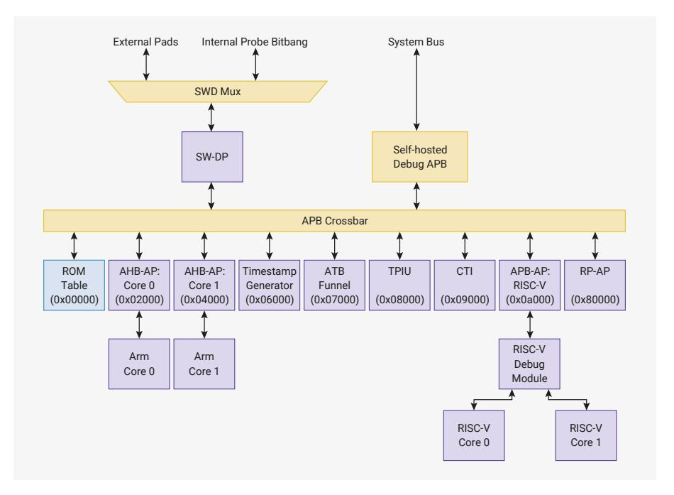

# 3.5 Debug

The Serial Wire Debug (SWD) bus provides access to hardware and software debug features including:

• Loading firmware into SRAM or external flash memory

3.3. Event Signals (Arm) **84**

- Control of processor execution: run/halt, step, set breakpoints, other standard debug functionality
- Access to processor architectural state
- Access to memory and memory-mapped IO via the system bus
- Configuring the CoreSight trace hardware (Arm processors only)

The SWD bus is exposed on two dedicated pins, SWCLK and SWDIO. See [Table 1429](#page-1333-0) for the pin definitions for SWCLK and SWDIO, and see [Table 1439](#page-1338-0) for additional information on their specifications.

A single SW-DP provides access to RP2350's debug subsystem from the external SWCLK and SWDIO pins. The DP is multidrop-capable, but use of multidrop SWD is not mandatory. All hardware in the debug subsystem, with the exception of the RP-AP, can also be accessed directly from the system bus using the self-hosted debug window starting at [CORESIGHT\\_PERIPH\\_BASE](#page-31-1).

*Figure 10. RP2350 debug topology. An SW-DP connects the external SWD pins to internal debug hardware. The ROM table lists debug components, for automatic discovery. AHB-APs provide debug access to Arm processors, and an APB-AP provides access to a standard RISC-V Debug Module. The RP-AP provides Raspberry-Pi-specific controls such as rescue reset and debug key entry. Remaining components are for Arm trace.*

The numbers in brackets in [Figure 10](#page-85-1) are the addresses of the debug components within the debug address space. These correspond to values written to the SW-DP SELECT register for SWD accesses, or offsets from [CORESIGHT\\_PERIPH\\_BASE](#page-31-1) for self-hosted debug access. All APs are accessible through the SW-DP, and all except the RP-AP are also accessible through self-hosted debug.

The SW-DP and RP-AP are in the always-on power domain, and are available once external power is applied and the power-on reset (POR) time has elapsed. All other APs in [Figure 10](#page-85-1) are available only once:

- 1. the power manager (POWMAN) has sequenced the first power up of the switched core domain
- 2. the OTP PSM has read critical hardware configuration flags from OTP
- 3. the system clock (clk\_sys) is running

#### **3.5.1. Connecting to the SW-DP**

The SW-DP defaults to the Dormant state at power-up or assertion of the external reset (RUN) pin. A Dormant-to-SWD sequence must be issued before beginning SWD operations. See the Arm Debug Interface specification, version 6, for details of Dormant/SWD state switching:<https://developer.arm.com/documentation/ihi0074/latest/>

After a power-on, the following sequence can be used to connect to the SW-DP:

1. At least 8 × SWCLK cycles with SWDIO high.

- 2. The 128-bit Selection Alert sequence: 0x19bc0ea2, 0xe3ddafe9, 0x86852d95, 0x6209f392, LSB-first.
- 3. Four SWCLK cycles with SWDIO low.
- 4. SWD activation code sequence : 0x1a, LSB first.
- 5. At least 50 × SWCLK cycles with SWDIO high (line reset).
- 6. A DPIDR read to exit the Reset state

In order to wake up the system from a low power (P1.x) state, set the CDBGPWRUPREQ in the DP CTRL/STAT register, then poll CDBGPWRUPACK in the same register until set. In low-power states, only the SW-DP and RP-AP are accessible, as the remaining debug logic is unpowered.

