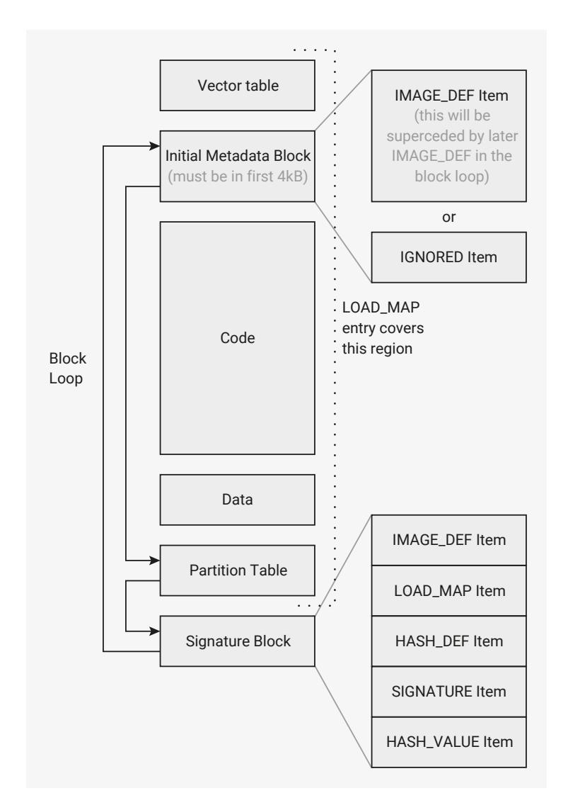

# 5.10.6 Custom Bootloader

In this scenario, a bootloader is run before booting into an image. This could perform additional validation, or set up peripherals for use by the image. For this to work, the block loop must contain both an IMAGE\_DEF for the bootloader and a PARTITION\_TABLE to define the flash layout.

In this example, we want to have A / B versions of the bootloader, so we use both slot 0 and slot 1. See [Section 5.1.15](#page-360-2) for more details of this, as you may well need to increase the size of slot 0 in order to fit the bootloader.

#### **WARNING**

Making a slot size change is not reversible, so feel free to leave out slot 1 if you try this in practice.

An example flash layout might resemble the following:

```
 Slot 0 (0x00000000-0x00008000)
  Bootloader Image 0
  Partition Table 0
 Slot 1 (0x00008000-0x00010000)
  Bootloader Image 1
  Partition Table 1
 Partition 0 (0x00010000-0x00020000)
  Binary A
 Partition 1 (0x00020000-0x00030000)
  Link Type: "A"
  Link Value: 0
  Binary B
```

The block loop with both IMAGE\_DEF and PARTITION\_TABLE might look like this (after signing in this case):



Note the 3 blocks in the block loop:

- 1. Original block in first 4 kB (contents doesn't matter, as it will be superseded by the later IMAGE\_DEF)
- 2. PARTITION\_TABLE at end of binary
- 3. Signed IMAGE\_DEF

#### **NOTE**

It is possible to sign both the PARTITION\_TABLE and the IMAGE\_DEF separately, however for the fastest boot speed, the bootrom also allows you to use a "covering" LOAD\_MAP in the IMAGE\_DEF. As long as the LOAD\_MAP defined area to be hashed/signed includes the entirety of the PARTITION\_TABLE block, the "covering" signature is used to validate the PARTITION\_TABLE too.

For the bootloader to find and launch a new image, it may wish to utilize various bootrom methods:

- [get\\_partition\\_table\\_info\(\)](#page-389-0) to get the full partition information.
- or [get\\_partition\\_table\\_info\(\)](#page-389-0) with SINGLE\_PARTITION, the chosen partition number, and PARTITION\_LOCATION\_AND\_FLAGS, to get the address of a single partition

```
uint32_t partition_info[3];
get_partition_table_info(partition_info, 3, PT_INFO_PARTITION_LOCATION_AND_FLAGS
  | PT_INFO_SINGLE_PARTITION | (boot_partition << 24));
uint16_t first_sector_number = (partition_info[1]
  & PICOBIN_PARTITION_LOCATION_FIRST_SECTOR_BITS)
  >> PICOBIN_PARTITION_LOCATION_FIRST_SECTOR_LSB;
uint16_t last_sector_number = (partition_info[1]
  & PICOBIN_PARTITION_LOCATION_LAST_SECTOR_BITS)
  >> PICOBIN_PARTITION_LOCATION_LAST_SECTOR_LSB;
uint32_t data_start_addr = first_sector_number * 0x1000;
uint32_t data_end_addr = (last_sector_number + 1) * 0x1000;
uint32_t data_size = data_end_addr - data_start_addr;
```

• [get\\_sys\\_info\(\)](#page-390-0) with BOOT\_INFO, to get the flash\_update\_boot\_window\_base if any:

```
uint32_t sys_info[5];
get_sys_info(sys_info, 5*4, SYS_INFO_BOOT_INFO);
uint32_t flash_update_boot_window_base = sys_info[3];
```

• [pick\\_ab\\_partition\(\)](#page-394-0) to pick the boot partition between A/B partitions if desired:

```
uint8_t boot_partition = pick_ab_partition(workarea, 0xC00, 0,
flash_update_boot_window_base);
```

- or [get\\_b\\_partition\(\)](#page-389-1) to find the other partition directly.
- [chain\\_image\(\)](#page-383-2) with data\_start\_addr and data\_size, to boot a chosen image:

```
// note a negative 3rd parameter indicates to chain_image that the image is being chanined as
// part of a "flash update" boot, so TBYB and/or version downgrade may be in play
chain_image( workarea,
  0xc00,
  (XIP_BASE + data_start_addr) * (info.boot_type == BOOT_TYPE_FLASH_UPDATE ? -1 :
1),
  data_size
);
```

#### **NOTE**

The workarea used must not overlap the image being chained into, so beware SRAM or packaged binaries. If the binary overlaps the workarea, the results are undefined, but hardly likely to be good.

