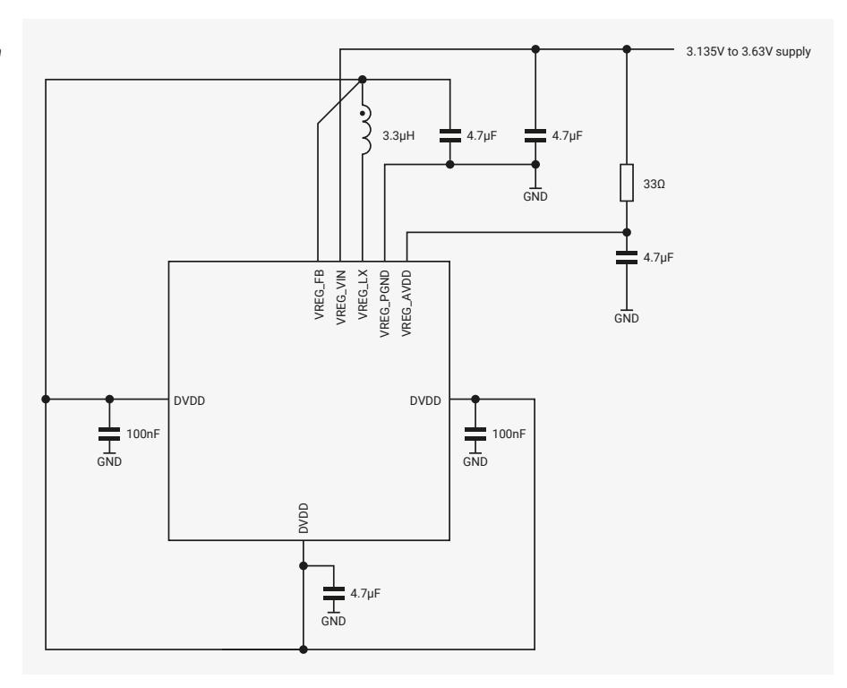
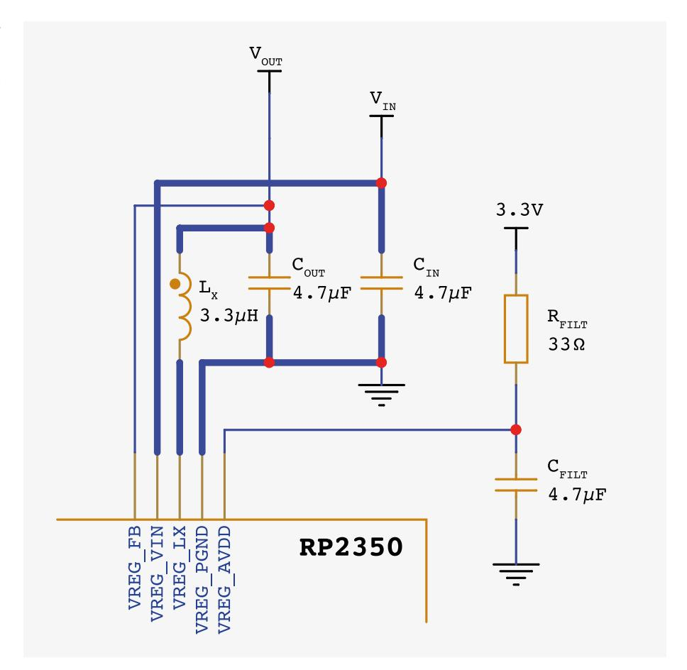
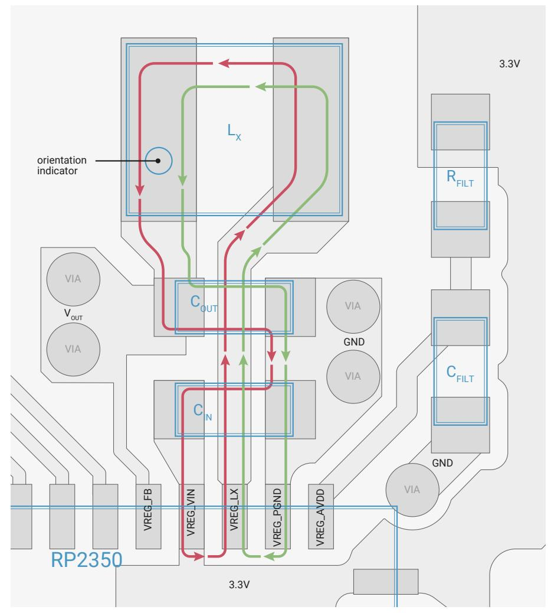
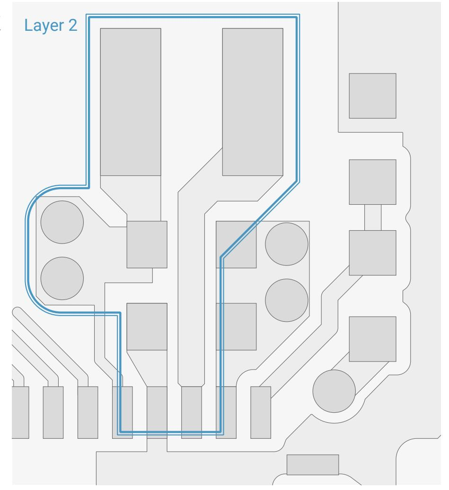
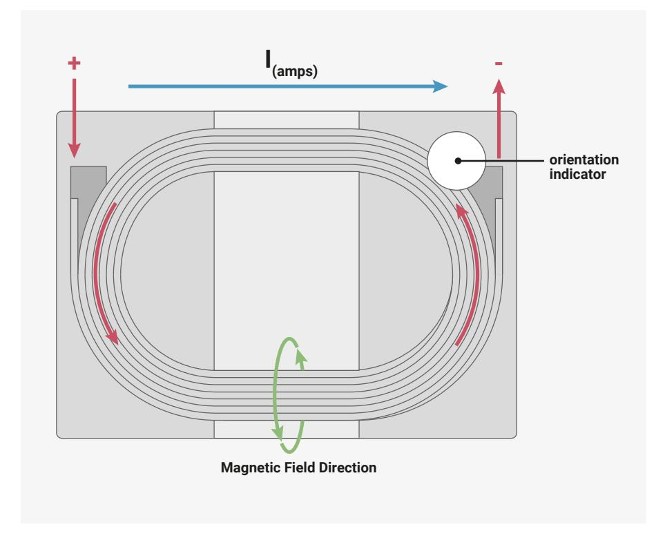
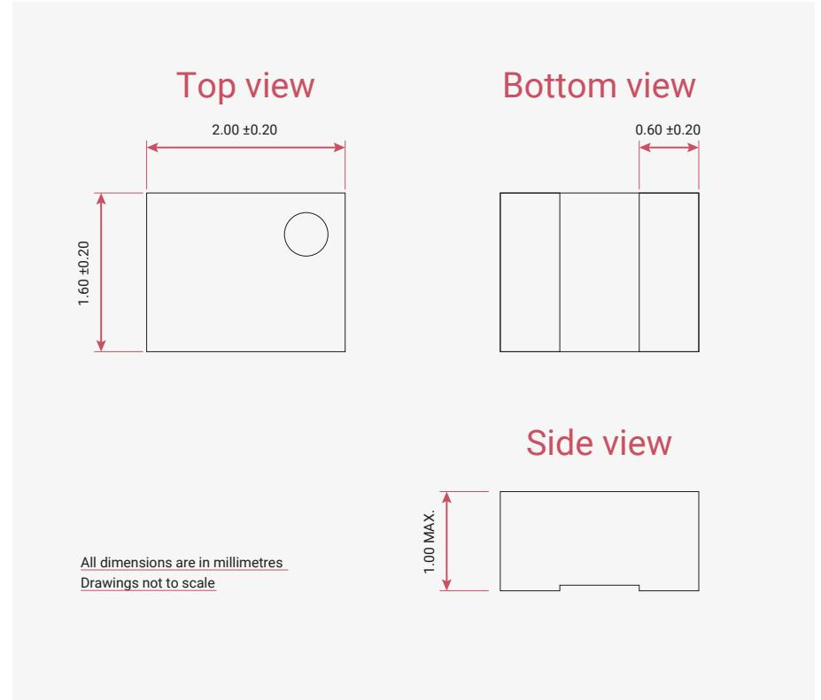

# 6.3.7 Application Circuit

The regulator requires two external power supplies, the input supply (VREG\_VIN), and a separate low noise supply for its analogue control circuits (VREG\_AVDD). VREG\_VIN must be in the range 2.7 V to 5.5 V, and VREG\_AVDD must be in the range 3.135 V to 3.63 V.

If VREG\_VIN is limited to the range 3.135 V to 3.63 V, a single combined supply can be used for both VREG\_VIN and VREG\_AVDD. This approach is shown in [Figure 19](#page-449-1). Care must be taken to minimise noise on VREG\_AVDD.

*Figure 19. core voltage regulator with combined supplies*

Alternatively, to support input voltages above 3.63 V, VREG\_VIN and VREG\_AVDD can be powered separately. This is shown in [Figure 20](#page-449-2).

*Figure 20. core voltage regulator with separate supplies*

#### **6.3.8. External Components and PCB layout requirements**

The most critical part of an RP2350 PCB layout is the core voltage regulator. This should be placed first on any board design and these guidelines must be strictly followed.

*Figure 21. Regulator section of the Raspberry Pi Pico 2 schematic. The nets highlighted in bold show the high switching current paths*

*Figure 22. Regulator section of the Raspberry Pi Pico 2 PCB layout showing the high current paths for each of the regulator's switching phases. The [AOTA-](https://abracon.com/datasheets/AOTA-B201610S3R3-101-T.pdf)[B201610S3R3-101-T](https://abracon.com/datasheets/AOTA-B201610S3R3-101-T.pdf) inductor's case size is 0806 (2016 metric), the resistor and capacitors are 0402 (1005 metric)*

Designers should follow the above schematic [Figure 21](#page-450-0) and layout [Figure 22](#page-451-0) as closely as possible as this has had the most verification and is considered our best practice layout. This circuit design is present on the Raspberry Pi Pico 2 and RP2350 reference design (see [Hardware design with RP2350,](https://datasheets.raspberrypi.com/rp2350/hardware-design-with-rp2350.pdf) [Minimal Design Example\)](https://datasheets.raspberrypi.com/rp2350/hardware-design-with-rp2350.pdf#minimal-design-example) and both of these designs are made available in either Cadence Allegro or Kicad formats respectively. [Figure 22](#page-451-0) shows the regulator layout on the top layer of the Raspberry Pi Pico 2 PCB. The bottom layer under the regulator is a ground plane which connects to the QFN GND central pad.

#### **6.3.8.1. Layout Recommendations**

- VREG\_AVDD is a noise sensitive signal and must be RC filtered as per [Figure 21.](#page-450-0)
  - Avoid doing anything that may couple noise into VREG\_AVDD.
  - CIN needs its own separate GND via / low impedance path back to the RP2350 GND pad.
- The red and green arrows in [Figure 22](#page-451-0) show the high current paths for each of the regulator's switching phases. It is critical keep the loop area of these current paths as small and low-impedance as possible, while also keeping them isolated (i.e. only connect to main GND at one point).
  - Follow this layout as closely as possibly.
  - Do not place any of CIN/LX/COUT on the opposite side of the PCB.
- Reduce parasitics on the VREG\_LX node.
- On the top layer make sure to cut away any extra copper underneath the inductor, cut back copper near the VREG\_LX trace where possible.

- For a multi-layer board (4 or more layers) please cut away any copper immediately underneath LX/VREG\_LX node. For example, [Figure 23](#page-452-0) illustrates this.
- The GND via placement is critical.
  - There must be a short-as-possible, low impedance GND path back to the Raspberry Pi Pico 2 QFN GND pad from the high-current GND at one single point (using 2 adjacent vias to reduce the impedance).
  - CFILT must also have a low impedance and short-as-possible path back to the QFN GND pad (Do not share any GND vias with the CIN/COUT high current GND).
- The VREG\_FB pin should be fed from the output of COUT, avoiding routing directly underneath LX.
- COUT is critical for regulator performance and EMI. It must be placed between VREG\_VIN and VREG\_PGND as close to the pins as practically possible.
  - In addition to COUT, for best performance we recommend a second 4.7μF capacitor is used on the VOUT net, located on the bottom edge of the package (DVDD pin 23 on the QFN-60). Do not place this near LX/COUT.

*Figure 23. Cut-out beneath LX/VREG\_LX net on layer 2 of 4 (or more) layer PCBs*

#### **6.3.8.2. Component Values**

- CIN should be at least 4.7μF and have a maximum parasitic resistance of 50mΩ.
- COUT must be 4.7μF ±20% with a maximum parasitic resistance of 250mΩ and a maximum inductance of 6nH.
- LX must be fully shielded, 3.3μH ±20% and with a maximum DC resistance of 250mΩ. Saturation current should be at least 1.5A. The inductor must be marked for polarity (see [Figure 24\)](#page-453-0) and placed on the layout as indicated in [Figure 22](#page-451-0). As discussed below, we recommend the [AOTA-B201610S3R3-101-T.](https://abracon.com/datasheets/AOTA-B201610S3R3-101-T.pdf)

#### **6.3.8.3. Regulator Sensitivities**

The RP2350 regulator has a few sensitivities:

- The VREG\_AVDD supply is noise sensitive.
- Efficiency is quite sensitive to inductance roll-off with inductor current, so an inductor with low roll-off is required for best operation (generally the higher saturation current the better).
- Even with nominally fully shielded inductors, leakage magnetic field coupling into the loop formed by the output VREG\_LX node through the inductor and output capacitor (COUT) seems to affect the regulator control loop and output voltage. Field orientation (and hence inductor orientation) matters - the inductor has to be the right way around to make sure the regulator operates properly especially at higher output currents and for higher load transients. This necessitates an inductor with marked polarity.

To meet the above requirements, Raspberry Pi have worked with Abracon to create a custom 2.0×1.6mm 3.3μH polaritymarked inductor, part number [AOTA-B201610S3R3-101-T](https://abracon.com/datasheets/AOTA-B201610S3R3-101-T.pdf) (see [Figure 24](#page-453-0) and [Figure 24\)](#page-453-0). These will be available in general distribution in time, but for now please contact Raspberry Pi to request samples / production volumes.

Raspberry Pi is still working with the regulator IP vendor to fully verify and qualify the regulator and custom inductor.

*Figure 24. [AOTA-](https://abracon.com/datasheets/AOTA-B201610S3R3-101-T.pdf)[B201610S3R3-101-T](https://abracon.com/datasheets/AOTA-B201610S3R3-101-T.pdf) inductor with orientation marking, showing current and magnetic field directions*

*Figure 25. Dimensions of the [AOTA-](https://abracon.com/datasheets/AOTA-B201610S3R3-101-T.pdf)[B201610S3R3-101-T](https://abracon.com/datasheets/AOTA-B201610S3R3-101-T.pdf) inductor*

The voltage regulator shares a register address space with other power management subsystems in the always-on domain. This address space is referred to as POWMAN elsewhere in this document, and a complete list of POWMAN registers is provided in [Section 6.4](#page-454-1). For reference information on POWMAN registers associated with the voltage regulator is repeated here.

The POWMAN registers start at a base address of 0x40100000 (defined as [POWMAN\\_BASE](#page-31-1) in the SDK).

- [VREG\\_CTRL](#page-460-0)
- [VREG\\_STS](#page-460-1)
- [VREG](#page-461-0)
- [VREG\\_LP\\_ENTRY](#page-462-0)
- [VREG\\_LP\\_EXIT](#page-463-0)

