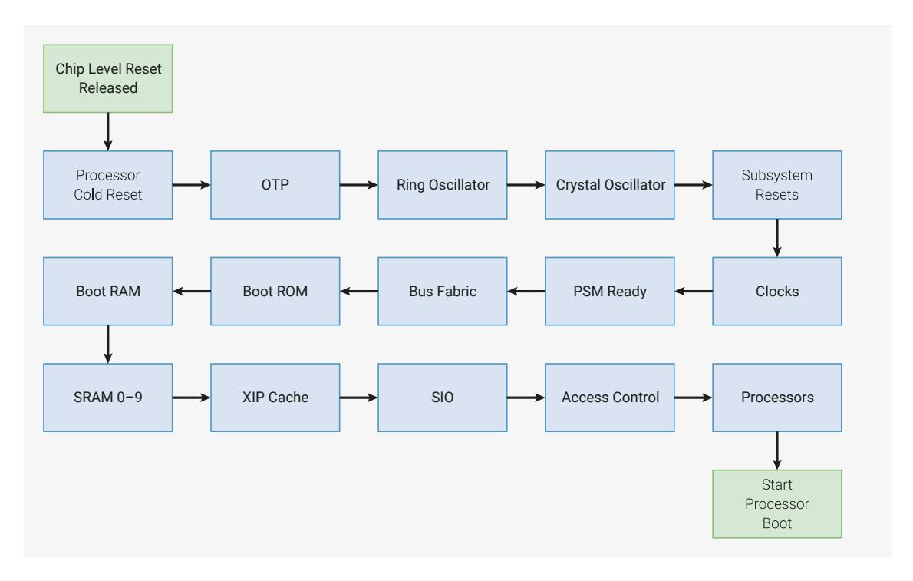

# 7.4 System Resets (Power-on State Machine)

*Figure 26. Power-on State Machine Sequence*

System Resets apply to components essential to processor operation. System components have interdependencies, therefore their resets are de-asserted in sequence by the Power-on State Machine (PSM). Each stage of the sequencer outputs a reset done signal when complete, rst\_done, which releases the reset input to the next stage. A partial sequence runs after a write to the FRCE\_OFF register or a watchdog timeout. Note that the FRCE\_ON register is intended for internal use only and is disabled in production devices.

The Power-on State Machine sequences system-level reset release following a power-up of the switched core power domain. It is distinct from the power manager (POWMAN) which controls power domain switching, see [Section 6.2,](#page-441-1) ["Power Management"](#page-441-1).

