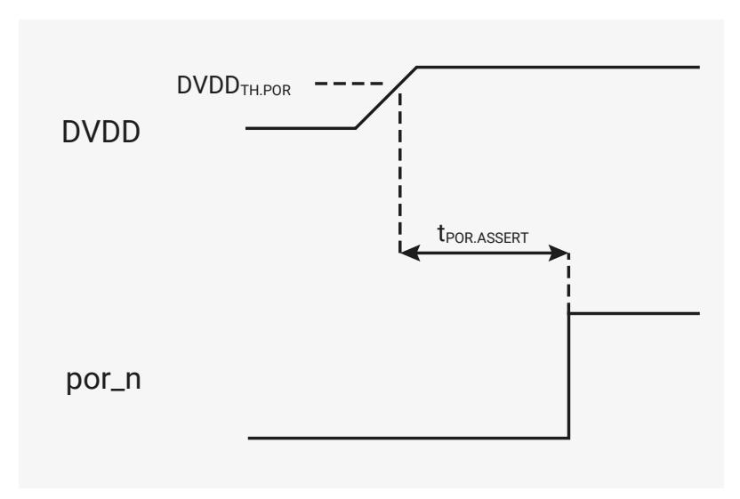

# 7.6.1 Power-on Reset (POR)

The power-on reset block ensures the chip starts up cleanly when power is first applied. It accomplishes this by holding the chip in reset until the digital core supply (DVDD) reaches a voltage high enough to reliably power the chip's core logic. The block holds its por\_n output low until DVDD exceeds the **power-on reset threshold** (DVDDTH.POR) for a period greater than the **power-on reset assertion delay** (tPOR.ASSERT). Once high, por\_n remains high even if DVDD subsequently falls below DVDDTH.POR. The behaviour of por\_n when power is applied is shown in [Figure 27, "A power-on reset cycle".](#page-506-2)

*Figure 27. A power-on reset cycle*

DVDDTH.POR is fixed at a nominal 0.957V, which should result in a threshold between 0.924V and 0.99V. The threshold assumes a nominal DVDD of 1.1V at initial power-on, and por\_n may never go high if a lower voltage is used. Once the chip is out of reset, DVDD can be reduced without por\_n going low.

#### **7.6.1.1. Detailed Specifications**

*Table 537. Power-on Reset Parameters*

| Parameter   | Description                       | Min   | Typ   | Max  | Units |
|-------------|-----------------------------------|-------|-------|------|-------|
| DVDDTH.POR  | power-on reset threshold       | 0.924 | 0.957 | 0.99 | V     |
| tPOR.ASSERT | power-on reset assertion delay |       | 3     | 10   | μs    |

