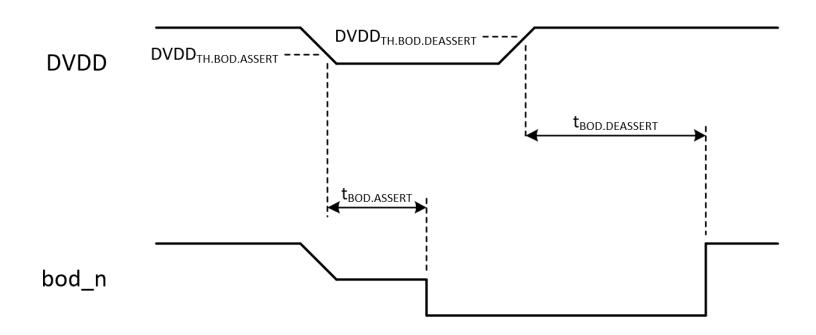

# 7.6.2 Brownout Detection (BOD)

The brownout detection block prevents unreliable operation when the digital core supply (DVDD) drops below a safe operating level. If enabled, the block resets the chip by taking its bor\_n output low when DVDD drops below the **brownout detection assertion threshold** (DVDDTH.BOD.ASSERT) for a period greater than the **brownout detection assertion delay** (tBOD.ASSERT). If DVDD subsequently rises above the **brownout detection de-assertion threshold** (DVDDTH.BOD.DEASSERT) for a period greater than the **brownout detection de-assertion delay** (tBOD.DEASSERT), the block releases reset by taking bor\_n high. A brownout, followed by supply recovery, is shown in [Figure 28, "A brownout detection cycle"](#page-507-0).

*Figure 28. A brownout detection cycle*

