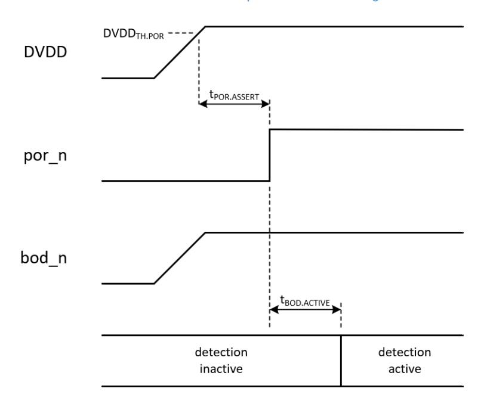
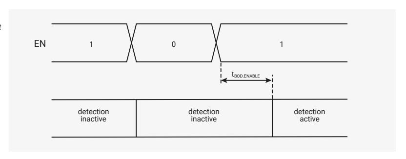
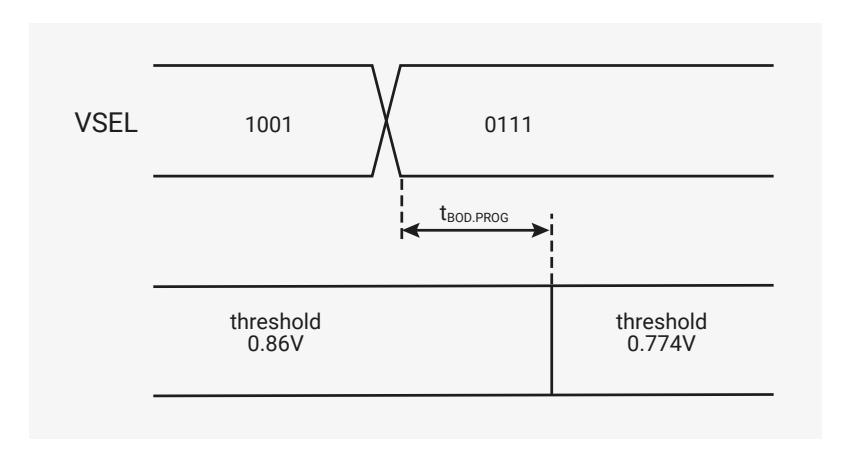

# 7.6.2.1 Detection Enable

Brownout detection is always enabled at initial power-on. There is, however, a short delay, the **brownout detection activation delay** (tBOD.ACTIVE), between por\_n going high and detection becoming active. This is shown in [Figure 29,](#page-507-1) ["Activation of brownout detection at initial power-on and following a brownout event."](#page-507-1).

*Figure 29. Activation of brownout detection at initial power-on and following a brownout event.*

Once the chip is out of reset, detection can be disabled under software control. This saves a small amount of power. If detection is subsequently re-enabled, there will be another short delay, the **brownout detection enable delay** (tBOD.ENABLE), before it becomes active again. This is shown in [Figure 30, "Disabling and enabling brownout detection".](#page-507-2)

Detection is disabled by writing a 0 to the EN field in the BOD register and is re-enabled by writing a 1 to the same field. The block's bod\_n output is high when detection is disabled.

*Figure 30. Disabling and enabling brownout detection*

Detection is re-enabled if the BOD register is reset, as this sets the register's EN field to 1. Again, detection will become

active after a delay equal to the brownout detection enable delay (tBOD.ENABLE).

If the BOD register is reset by a power-on or brownout-initiated reset, the delay between the register being reset and brownout detection becoming active will be equal to the brownout detection activation delay (tBOD.ACTIVE). The delay will be equal to the brownout detection enable delay (tBOD.ENABLE) for all other reset sources.

#### **7.6.2.2. Adjusting the Detection Threshold**

The **brownout detection threshold** (DVDDTH.BOD) has a nominal value of 0.946V at initial power-on or after a reset event. This should result in a detection threshold between 0.913V and 0.979V. Once out of reset, the threshold can be adjusted under software control. The new detection threshold will take effect after the **brownout detection programming delay** ((tBOD.PROG). An example of this is shown in [Figure 31, "Adjusting the brownout detection threshold"](#page-508-0).

The threshold is adjusted by writing to the VSEL field in the BOD register. See the BOD register description for details.

# **NOTE**

The nominal supply voltage for DVDD is 1.1 V. You should not increase the brownout detection threshold above the nominal supply voltage.

*Figure 31. Adjusting the brownout detection threshold*

#### **7.6.2.3. Detailed Specifications**

*Table 538. Brownout Detection Parameters*

| Parameter           | Description                                        | Min  | Typ | Max   | Units                              |
|---------------------|----------------------------------------------------|------|-----|-------|------------------------------------|
| DVDDTH.BOD.ASSERT   | brownout detection assertion threshold    | 96.5 | 100 | 103.5 | % of selected threshold voltage |
| DVDDTH.BOD.DEASSERT | brownout detection de assertion threshold | 97.4 | 101 | 105   | % of selected threshold voltage |
| tBOD.ACTIVE         | brownout detection activation delay          |      | 55  | 80    | μs                                 |
| tBOD.ASSERT         | brownout detection assertion delay           |      | 3   | 10    | μs                                 |

| Parameter     | Description                                   | Min | Typ | Max | Units |
|---------------|-----------------------------------------------|-----|-----|-----|-------|
| tBOD.DEASSERT | brownout detection de assertion delay   |     | 55  | 80  | μs    |
| tBOD.ENABLE   | brownout detection enable delay         |     | 35  | 55  | μs    |
| tBOD.PROG     | brownout detection programming delay |     | 20  | 30  | μs    |

