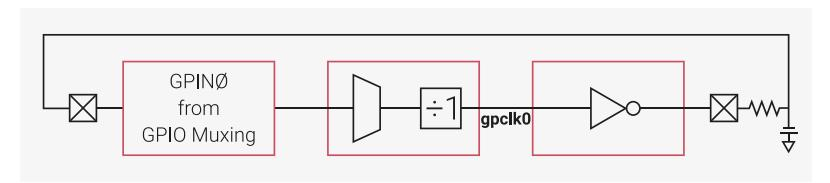

# 8.1.1 Clock sources

RP2350 can use a variety of clock sources. This flexibility allows the user to optimise the clock setup for performance, cost, board area and power consumption. RP2350 supports the following potential clock sources:

- on-chip 32kHz Low Power Oscillator ([Section 8.4, "Low Power Oscillator \(LPOSC\)"](#page-566-0))
- on-chip Ring Oscillator [\(Section 8.3, "Ring Oscillator \(ROSC\)"\)](#page-558-0)
- Crystal Oscillator [\(Section 8.2, "Crystal Oscillator \(XOSC\)"\)](#page-552-0)
- external clocks from GPIOs [\(Section 8.1.5.4, "Configuring a GPIO input clock"](#page-524-0)) and PLLs [\(Section 8.6, "PLL"](#page-572-0))

The list of clock sources is different per clock generator and can be found as enumerated values in the CTRL register. See [CLK\\_SYS\\_CTRL](#page-535-0) as an example.

#### **8.1.1.1. Low Power Oscillator**

The on-chip 32kHz Low Power Oscillator [\(Section 8.4, "Low Power Oscillator \(LPOSC\)"\)](#page-566-0) requires no external components. It starts automatically when the always-on domain is powered, providing a clock for the power manager and a tick for the Always-on Timer (AON Timer) when the switched-core power domain is powered off.

The LPOSC can be tuned to 1% accuracy, and the divider in the AON Timer tick generator can further tune the 1ms tick. However, the LPOSC frequency varies with voltage and temperature, so fine-tuning is only useful in systems with stable voltage and temperature.

When the switched-core is powered, the LPOSC clock can drive the reference clock (clk\_ref), which in turn can drive the system clock (clk\_sys). This allows another low power mode where the processors remain powered but, unlike the SLEEP and DORMANT modes, clocks are running. The LPOSC clock can also be sent to the frequency counter for calibration or output to a GPIO.

#### **8.1.1.2. Ring Oscillator**

The on-chip Ring Oscillator [\(Section 8.3, "Ring Oscillator \(ROSC\)"\)](#page-558-0) requires no external components. It starts automatically when the switched-core domain is powered and is used to clock the chip during the initial boot stages. During boot, the ROSC runs at a nominal 11MHz, but varies with PVT (Process, Voltage, and Temperature). The ROSC frequency is guaranteed to be in the range 4.6MHz to 19.6MHz.

For low-cost applications where frequency accuracy is unimportant, the chip can continue to run from the ROSC. If your application requires greater performance, the frequency can be increased by programming the registers as described in

[Section 8.3, "Ring Oscillator \(ROSC\)"](#page-558-0). Because the frequency varies with PVT (Process, Voltage, and Temperature), the user must take care to avoid exceeding the maximum frequencies described in the clock generators section. For information about reducing this variation when running the ROSC at frequencies close to the maximum, see [Section](#page-512-0) [8.1.1.2.1, "Mitigate ROSC frequency variation due to process"](#page-512-0). Alternatively, use an external clock or the XOSC to provide a stable reference clock and use the PLLs to generate higher frequencies. However, this approach requires external components, which will cost board area and increase power consumption.

When using an external clock or the XOSC, you can stop the ROSC to save power. Before stopping the ROSC, you must switch the reference clock generator and the system clock generator to an alternate source.

The ROSC is unpowered when the switched-core domain is powered down, but starts immediately when the switchedcore powers up. It is not affected by sleep mode. To save power, reduce the frequency before entering sleep mode. When entering DORMANT mode, the ROSC is automatically stopped. When exiting DORMANT mode, the ROSC restarts in the same configuration. If you drive clocks at close to their maximum frequencies with the ROSC, drop the frequency before entering SLEEP or DORMANT mode. This allows for frequency variation due to changes in environmental conditions during SLEEP or DORMANT mode.

To use ROSC clock externally, output it to a GPIO pin using one of the clk\_gpclk0-3 generators.

The following sections describe techniques for mitigating PVT variation of the ROSC frequency. They also provide some interesting design challenges for use in teaching both the effects of PVT and writing software to control real time functions.

Because the ROSC frequency varies with PVT (Process, Voltage, and Temperature), you can use the ROSC frequency to measure any one of the three PVT variables as long as you know the other two variables.

#### **8.1.1.2.1. Mitigate ROSC frequency variation due to process**

Process varies for the following reasons:

- Chips leave the factory with a spread of process parameters. This causes variation in the ROSC frequency across chips.
- Process parameters vary slightly as the chip ages. This is only observable over many thousands of hours of operation.

To mitigate process variation, the user can characterise individual chips and program the ROSC frequency accordingly. This is an adequate solution for small numbers of chips, but does not scale well to volume production. For high-volume applications, consider using [automatic mitigation.](#page-513-0)

#### **8.1.1.2.2. Mitigate ROSC frequency variation due to voltage**

Supply voltage varies for the following reasons:

- The power supply itself may vary.
- As chip activity varies, on-chip IR varies.

To mitigate voltage variation, calibrate for the minimum performance target of your application, then adjust the ROSC frequency to always exceed that minimum.

#### **8.1.1.2.3. Mitigate ROSC frequency variation due to temperature**

Temperature varies for the following reasons:

• The ambient temperature may vary.

• The chip temperature varies as chip activity varies due to self-heating.

To mitigate temperature variations, stabilise the temperature. You can use a temperature controlled environment, passive cooling, or active cooling. Alternatively, track the temperature using the on-chip temperature sensor and adjust the ROSC frequency so it remains within the required bounds.

#### **8.1.1.2.4. Automatic mitigation of ROSC frequency variation due to PVT**

Techniques for automatic ROSC frequency control avoid the need to calibrate individual chips, but require periodic access to a clock reference or to a time reference.

If a clock reference is available, you can use it to periodically measure the ROSC frequency and adjust accordingly. The on-chip XOSC is one potential clock reference. You can even run the XOSC intermittently to save power for very low power application where it is too costly to run the XOSC continuously or use the PLLs to achieve high frequencies.

If a time reference is available, you can clock the on-chip AON Timer from the ROSC and periodically compare it against the time reference, adjusting the ROSC frequency as necessary. Using these techniques, the ROSC frequency still drifts due to voltage and temperature variation. As a result, you should also implement mitigations for voltage and temperature to ensure that variations do not allow the ROSC frequency to drift out of the acceptable range.

#### **8.1.1.2.5. Automatic overclocking using the ROSC**

The datasheet maximum frequencies for any digital device are quoted for worst case PVT. Most chips in most normal environments can run significantly faster than the quoted maximum, and therefore support overclocking. When RP2350 runs from the ROSC, PVT affects both both the ROSC and the digital components. As the ROSC gets faster, the processors can also run faster. This means the user can overclock from the ROSC, then rely on the ROSC frequency tracking with PVT variations. The tracking of ROSC frequency and the processor capability is not perfect, and currently there is insufficient data to specify a safe ROSC setting for this mode of operation, so some experimentation is required.

This mode of operation maximises processor performance, but causes variations in the time taken to complete a task. Only use overclocking for applications where this variation is acceptable. If your application uses frequency sensitive interfaces such as USB or UART, you must use the XOSC and PLL to provide a precise clock for those components.

#### **8.1.1.3. Crystal Oscillator**

The Crystal Oscillator [\(Section 8.2, "Crystal Oscillator \(XOSC\)"](#page-552-0)) provides a precise, stable clock reference and should be used where accurate timing is required and no suitable external clocks are available. The XOSC requires an external crystal component. The external crystal determines the frequency. RP2350 supports 1MHz to 50MHz crystals and the RP2350 reference design (see [Hardware design with RP2350](https://datasheets.raspberrypi.com/rp2350/hardware-design-with-rp2350.pdf), [Minimal Design Example\)](https://datasheets.raspberrypi.com/rp2350/hardware-design-with-rp2350.pdf#minimal-design-example) uses a 12MHz crystal. Using the XOSC and the PLLs, you can run on-chip components at their maximum frequencies. Appropriate margin is built into the design to tolerate up to 1000ppm variation in the XOSC frequency.

The XOSC is unpowered when the switched-core domain is powered down. It remains inactive when the switched-core is powered up. If required, you must enable it in software. XOSC startup takes several milliseconds, and software must wait for the XOSC\_STABLE flag to be set before starting the PLLs and changing any clock generators. Before the XOSC completes startup, output may be non-existent or exhibit very short pulse widths; this will corrupt logic if used. Once XOSC startup is complete, the reference clock (clk\_ref) and the system clock (clk\_sys) can run from the XOSC. If you switch the system and reference clocks to run from the XOSC, you can stop the ROSC to save power.

The XOSC is not affected by sleep mode. It automatically stops and restarts in the same configuration when entering and exiting DORMANT mode.

To use the XOSC clock externally, output it to a GPIO pin using one of the clk\_gpclk0-clk\_gpclk03 generators. You cannot take XOSC output directly from the XIN (XI) or XOUT (XO) pins.

#### **8.1.1.4. External Clocks**

If external clocks exist in the hardware design, you can use them to clock RP2350. You can use clocks individually or in conjunction with the other (internal or external) clock sources. Use XIN and one of GPIN0-GPIN1 to input external clocks.

If you drive an external clock into XIN, you don't need an external crystal. When driving an external clock into XIN, you must configure the XOSC to pass through the XIN signal. When the switched-core powers down, this configuration will be lost, but the configuration is unaffected by SLEEP and DORMANT modes. The input is limited to 50MHz, but the onchip PLLs can synthesise higher frequencies from the XIN input if required.

GPIN0-GPIN1 can provide system and peripherals clocks, but is limited to 50MHz. This can potentially save power and allows components on RP2350 to run synchronously with external components, which simplifies data transfer between chips. If the frequency accuracy of the external clocks is poorer than 1000ppm, the generated clocks should not run at their maximum frequencies since they could exceed their design margins. Once the external clocks begin to run, the reference clock (clk\_ref) and the system clock (clk\_sys) can run from the external clocks and you can stop the ROSC to save power. When the switched-core powers down, GPIN0-GPIN1 configuration will be lost, but the configuration is unaffected by SLEEP and DORMANT modes.

To provide a more accurate tick to the AON Timer, use one of the GPIN0-GPIN3 inputs to replace the clock from the LPOSC. These inputs are limited to 29MHz. GPIN0-GPIN3 configuration is unaffected by switched-core power down, sleep mode, and DORMANT mode.

### **8.1.1.5. Relaxation Oscillators**

If there is no appropriate clock available, but you still want to replace or supplement external clocks with another clock source, you can construct one or two relaxation oscillators from external passive components. Send the clock source (GPIN0-GPIN1) to one of the clk\_gpclk0-clk\_gpclk03 generators, invert it through the GPIO inverter OUTOVER, and connect back to the clock source input via an RC circuit:

*Figure 33. Simple relaxation oscillator example*

The frequency of clocks generated from relaxation oscillators depend on the delay through the chip and the drive current from the GPIO output, both of which vary with PVT. The frequency and frequency accuracy depend on the quality and accuracy of the external components. More elaborate external components such as ceramic resonators, can improve performance, but also increase cost and complexity. Such an oscillator will not achieve 1000ppm, so they cannot drive internal clocks at their maximum frequencies. To drive internal clocks at the maximum possible frequency, use the XOSC.

The configuration of the relaxation oscillators will be lost when the switched-core powers down, but is not affected by sleep mode or DORMANT mode.

#### **8.1.1.6. PLLs**

The PLLs ([Section 8.6, "PLL"](#page-572-0)) are used to provide fast clocks when running from the XOSC or an external clock source driven into the XIN pin. In a fully-featured application, the USB PLL provides a fixed 48MHz clock to the ADC and USB while clk\_ref is driven from the XOSC or external clock source. This allows the user to drive clk\_sys from the system PLL and vary the frequency according to demand to save power without having to change the setups of the other clocks. clk\_peri can be driven either from the fixed frequency USB PLL or from the variable frequency system PLL. If clk\_sys never needs to exceed 48MHz, one PLL can be used and the divider in the clk\_sys clock generator can scale the clk\_sys frequency according to demand.

When a PLL starts, you cannot use the output until the PLL locks as indicated by the LOCK bit in the STATUS register. As a

result, the PLL output cannot be used during changes to the reference clock divider, the output dividers or the bypass mode. The output can be used during feedback divisor changes, though the output frequency may overshoot or undershoot during large changes to the feedback divisor. For more information, see [Section 8.6, "PLL".](#page-572-0)

The PLLs can drive clocks at their maximum frequency as long as the reference clock is accurate to 1000ppm, since this keeps the frequency of the generated clocks within design margins.

The PLLs are not affected by sleep mode. To save power in sleep mode, switch all clock generators away from the PLLs stop them in software before entering sleep mode.

The PLLs do not stop and restart automatically when entering and exiting DORMANT mode. If the PLLs are running when entering DORMANT mode, they will be corrupted because the reference clock in the XOSC stops. This generates out-of-control clocks that consume power unnecessarily. Before entering DORMANT mode, always switch all clock generators away from the PLLs and stop the PLLs in software.

