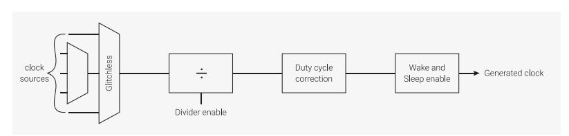
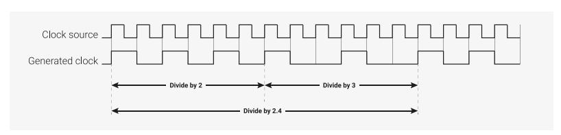
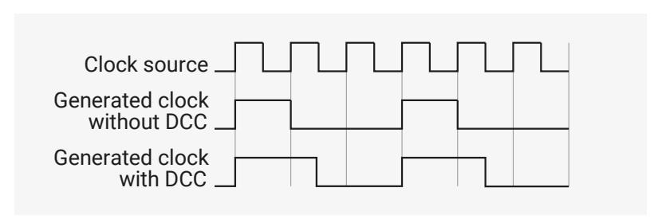

# 8.1.2 Clock Generators

The clock generators are built on a standard design which incorporates clock source multiplexing, division, duty cycle correction and sleep mode enabling. To save chip area and power, individual clock generators do not support all features.

*Figure 34. A generic clock generator*

#### **8.1.2.1. Instances**

RP2350 has several clock generators which are listed below.

*Table 540. RP2350 clock generators*

| Clock      | Description                                                                                                                                                                                 | Nominal Frequency |
|------------|---------------------------------------------------------------------------------------------------------------------------------------------------------------------------------------------|-------------------|
| clk_gpout0 | Clock output to GPIO. Can be used to                                                                                                                                                        | N/A               |
| clk_gpout1 | clock external devices or debug on chip clocks with a logic analyser or                                                                                                                  |                   |
| clk_gpout2 | oscilloscope.                                                                                                                                                                               |                   |
| clk_gpout3 |                                                                                                                                                                                             |                   |
| clk_ref    | Reference clock that is always running unless in DORMANT mode. Runs from Ring Oscillator (ROSC) at power-up but can be switched to Crystal Oscillator (XOSC) for more accuracy. | 6 - 12MHz         |
| clk_sys    | System clock that is always running unless in DORMANT mode. Runs from clk_ref at power-up, but is typically switched to a PLL.                                                     | 150MHz            |
| clk_peri   | Peripheral clock. Typically runs from clk_sys but allows peripherals to run at a consistent speed if clk_sys is changed by software.                                               | 12 - 150MHz       |
| clk_usb    | USB reference clock. Must be 48MHz.                                                                                                                                                         | 48MHz             |
| clk_adc    | ADC reference clock. Must be 48MHz.                                                                                                                                                         | 48MHz             |

| Clock    | Description | Nominal Frequency |
|----------|-------------|-------------------|
| clk_hstx | HSTX clock. | 150MHz            |

For a full list of clock sources for each clock generator, see the appropriate CTRL register. For example, [CLK\\_SYS\\_CTRL](#page-535-0).

#### **8.1.2.2. Multiplexers**

All clock generators have a multiplexer referred to as the auxiliary (aux) mux. This mux has a conventional design whose output will glitch when changing the select control. The reference clock (clk\_ref) and the system clock (clk\_sys) have an additional multiplexer referred to as the **glitchless mux**. The glitchless mux can switch between clock sources without generating a glitch on the output.

Before switching the clock source of an auxiliary mux you must either:

- temporarily switch the glitchless mux away from aux (if a glitchless mux is available)
- temporarily disable the clock generator using its CTRL\_ENABLE bit
- hold the destination in reset so that a potential clock glitch does not cause undefined operation

Failure to do at least one of the above may cause a glitch on the clock input of all hardware currently clocked by this clock generator. Avoid clock glitches at all costs: they may corrupt the logic running on the clock.

Clock generators require two cycles of the source clock to stop the output and two cycles of the new source to restart the output. Wait for the generator to stop before changing the auxiliary mux. When the destination clock is much slower than the system clock, there is a danger that software changes the aux mux source before the clock generator has come to a safe halt. Avoid this by polling the clock generator's CTRL\_ENABLED status until it matches the value of CTRL\_ENABLE.

The glitchless mux is only implemented for always-on clocks. On RP2350, the always-on clocks are the reference clock (clk\_ref) and the system clock (clk\_sys). Such clocks must run continuously unless the chip is in DORMANT mode. The glitchless mux has a status output (SELECTED) which indicates which source is selected. You can read this status output from software to confirm that a change of clock source has completed.

The recommended control sequences are as follows.

To switch between clock sources for the glitchless mux:

- 1. Switch the glitchless mux to an alternate source.
- 2. Poll the SELECTED register until the switch completes.

To switch between clock sources for the aux mux when the generator has a glitchless mux:

- 1. Switch the glitchless mux to a source that isn't the aux mux.
- 2. Poll the SELECTED register until the switch completes.
- 3. Change the auxiliary mux select control.
- 4. Switch the glitchless mux back to the aux mux.
- 5. If required, poll the SELECTED register until the switch completes.

To switch between clock sources for the aux mux when the generator does *not* have a glitchless mux:

- 1. Disable the clock divider.
- 2. Wait for the generated clock to stop (two cycles of the clock source).
- 3. Change the auxiliary mux select control.
- 4. Enable the clock divider.
- 5. If required, wait for the clock generator to restart (two cycles of the clock source).

See [Section 8.1.5.1, "Configuring a clock generator"](#page-519-2) for a code example of this.

#### **8.1.2.3. Divider**

A fully featured divider divides by a fractional number in the range 1.0 to 216. Fractional division is achieved by toggling between 2 integer divisors; this yields a jittery clock which may not be suitable for some applications. For example, when dividing by 2.4 the divider divides by 2 for 3 cycles and by 3 for 2 cycles. For divisors with large integer components, the jitter will be much smaller and less critical.

*Figure 35. An example of fractional division.*

All dividers support **on-the-fly divisor changes**: the output clock can switch cleanly from one divisor to another. The clock generator does not need to be stopped during clock divisor changes, because the dividers synchronise the divisor change to the end of the clock cycle. Similarly, dividers synchronise the enable to the end of the clock cycle to avoid glitches when the clock generator is enabled or disabled. Clock generators for always-on clocks are permanently enabled and therefore do not have an enable control.

In the event that a clock generator locks up and never completes the current clock cycle, it can be forced to stop using the KILL control. This may result in an output glitch, which may corrupt the logic driven by the clock. Always reset the destination logic before using the KILL control. Clock generators for always-on clocks are permanently active and therefore do not have a KILL control.

#### **NOTE**

This clock generator design has been used in numerous chips and has never been known to lock up. The KILL control is inelegant and unnecessary and should not be used as an alternative to the enable.

#### **8.1.2.4. Duty Cycle Correction**

The divider operates on the rising edge of the input clock, so it does not generate an even duty cycle clock when dividing by odd numbers. For example, divide by 3 gives a duty cycle of 33.3%, and divide by 5 gives a duty cycle of 40%.

If enabled, duty cycle correction logic will shift the falling edge of the output clock to the falling edge of the input clock and restore a 50% duty cycle. The duty cycle correction can be enabled and disabled while the clock is running. It will not operate when dividing by an even number.

*Figure 36. An example of duty\_cycle\_correction.*

#### **8.1.2.5. Clock Enables**

Each clock goes to multiple destinations. With a few exceptions, each destination has two enables. Use the WAKE\_EN registers to enable the clocks when the system is awake. Use the SLEEP\_EN registers to enable the clocks when the system is in sleep mode. Enables help reduce power in the clock distribution networks for unused components. Any component which is not clocked will retain its configuration so it can restart quickly.

# **NOTE**

By default, the WAKE\_EN and SLEEP\_EN registers reset to 0x1, which enables all clocks. Only use this feature for lowpower designs.

#### **8.1.2.5.1. Clock Enable Exceptions**

The following destinations do not have clock enables:

- the clk\_gpclk0-clk\_gpclk03 generators
- the processor cores, because they require a clock at all times to manage their own power-saving features
- clk\_sys\_busfabric (in wake mode), because that would prevent the cores from accessing any chip registers, including those that control the clock enables
- clk\_sys\_clocks (in wake mode), because that would prevent the cores from accessing the clocks control registers

#### **8.1.2.5.2. System Sleep Mode**

System sleep mode is entered automatically when both cores are in sleep and the DMA has no outstanding transactions. In system sleep mode, the clock enables described in the previous paragraphs are switched from the WAKE\_EN registers to the SLEEP\_EN registers. Sleep mode helps reduce power consumed in the clock distribution networks when the chip is inactive. If the user has not configured the WAKE\_EN and SLEEP\_EN registers, system sleep does nothing.

There is little value in using system sleep without taking other measures to reduce power before the cores are put to sleep. Things to consider include:

- stop unused clock sources such as the PLLs and Crystal Oscillator
- reduce the frequencies of generated clocks by increasing the clock divisors
- stop external clocks

For maximum power saving when the chip is inactive, the user should consider DORMANT (see [Section 6.5.3,](#page-486-2) ["DORMANT State"](#page-486-2)) mode in which clocks are sourced from the Crystal Oscillator and/or the Ring Oscillator and those clock sources are stopped.

For more information about sleep, see [Section 6.5.2, "SLEEP State"](#page-486-1).

#### **8.1.3. Frequency Counter**

The frequency counter measures the frequency of internal and external clocks by counting the clock edges seen over a test interval. The interval is defined by counting cycles of clk\_ref, which must be driven either from XOSC or a stable external source of known frequency.

The user can pick between accuracy and test time using the [FC0\\_INTERVAL](#page-543-0) register. [Table 541, "Frequency Counter](#page-518-2) [Test Interval vs Accuracy"](#page-518-2) shows this trade off:

*Table 541. Frequency Counter Test Interval vs Accuracy*

| Interval Register | Test Interval | Accuracy |
|-------------------|---------------|----------|
| 0                 | 1μs           | 2048kHz  |
| 1                 | 2μs           | 1024kHz  |
| 2                 | 4μs           | 512kHz   |
| 3                 | 8μs           | 256kHz   |
| 4                 | 16μs          | 128kHz   |
| 5                 | 32μs          | 64kHz    |

| Interval Register | Test Interval | Accuracy |
|-------------------|---------------|----------|
| 6                 | 64μs          | 32kHz    |
| 7                 | 125μs         | 16kHz    |
| 8                 | 250μs         | 8kHz     |
| 9                 | 500μs         | 4kHz     |
| 10                | 1ms           | 2kHz     |
| 11                | 2ms           | 1kHz     |
| 12                | 4ms           | 500Hz    |
| 13                | 8ms           | 250Hz    |
| 14                | 16ms          | 125Hz    |
| 15                | 32ms          | 62.5Hz   |

#### **8.1.4. Resus**

It is possible to write software that inadvertently stops clk\_sys. This normally causes an unrecoverable lock-up of the cores and the on-chip debugger, leaving the user unable to trace the problem. To mitigate against unrecoverable core lock-up, an automatic **resuscitation circuit** is provided; this switches clk\_sys to a known good clock source (clk\_ref) if it detects no edges over a user-defined interval. clk\_ref can be driven from the XOSC, ROSC or an external source. The interval is programmable via [CLK\\_SYS\\_RESUS\\_CTRL](#page-542-0).

#### **WARNING**

There is no way for resus to revive the chip if clk\_ref is also stopped.

To enable the resus:

- set the timeout interval
- set the ENABLE bit in [CLK\\_SYS\\_RESUS\\_CTRL](#page-542-0)

To detect a resus event:

- enable the CLK\_SYS\_RESUS interrupt by setting the interrupt enable bit in [INTE](#page-551-0)
- enable the CLOCKS\_DEFAULT\_IRQ processor interrupt (see [Section 3.2, "Interrupts"\)](#page-82-0)

Resus is intended as a debugging aid, so the user can trace the software error that triggered the resus, then correct the error and reboot. It is possible to continue running after a resus event by reconfiguring clk\_sys, then clearing the resus by writing the CLEAR bit in [CLK\\_SYS\\_RESUS\\_CTRL](#page-542-0).

# **WARNING**

Only use resus for debugging. If clk\_sys runs slower than expected, a resus could trigger. This could result in a clk\_sys glitch, which could corrupt the chip.

