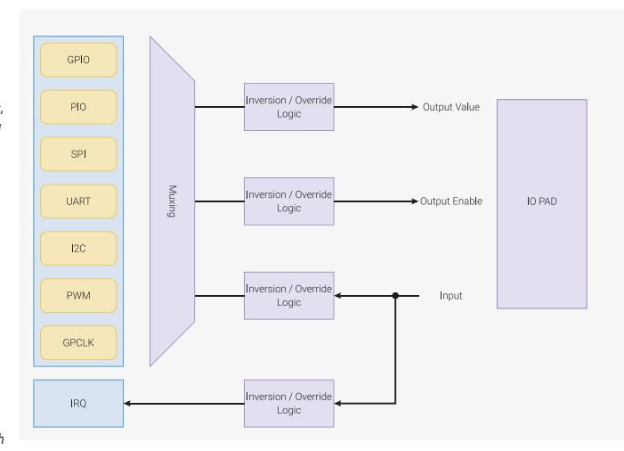

# 9.1 Overview

RP2350 has up to 54 multi-functional General Purpose Input / Output (GPIO) pins, divided into two banks:

#### **Bank 0**

30 user GPIOs in the QFN-60 package (RP2350A), or 48 user GPIOs in the QFN-80 package

#### **Bank 1**

six QSPI IOs, and the USB DP/DM pins

You can control each GPIO from software running on the processors, or by a number of other functional blocks. To meet USB rise and fall specifications, the analogue characteristics of the USB pins differ from the GPIO pads. As a result, we do not include them in the 54 GPIO total. However, you can still use them for UART, I2C, or processorcontrolled GPIO via the single-cycle IO subsystem (SIO).

In a typical use case, the QSPI IOs are used to execute code from an external flash device, leaving 30 or 48 Bank 0 GPIOs for the programmer to use. The QSPI pins may become available for general purpose use when booting the chip from internal OTP, or controlling the chip externally via SWD in an IO expander application.

All GPIOs support digital input and output. Several Bank 0 GPIOs can also be used as inputs to the chip's Analogue to Digital Converter (ADC):

- GPIOs 26 through 29 inclusive (four total) in the QFN-60 package
- GPIOs 40 through 47 (eight total) in the QFN-80 package

Bank 0 supports the following functions:

- Software control via SIO [Section 3.1.3, "GPIO Control"](#page-39-0)
- Programmable IO (PIO) [Chapter 11,](#page-873-0) *[PIO](#page-873-0)*
- 2 × SPI [Section 12.3, "SPI"](#page-1043-0)
- 2 × UART [Section 12.1, "UART"](#page-958-1)
- 2 × I2C (two-wire serial interface) [Section 12.2, "I2C"](#page-980-0)
- 8 × two-channel PWM in the QFN-60 package, or 12 × in QFN-80 [Section 12.5, "PWM"](#page-1073-0)
- 2 × external clock inputs [Section 8.1.1.4, "External Clocks"](#page-514-0)
- 4 × general purpose clock output [Section 8.1, "Overview"](#page-510-1)
- 4 × input to ADC in the QFN-60 package, or 8 × in QFN-80 [Section 12.4, "ADC and Temperature Sensor"](#page-1063-0)
- 1 × HSTX high-speed interface [Section 12.11, "HSTX"](#page-1199-1)
- 1 × auxiliary QSPI chip select, for a second XIP device [Section 12.14, "QSPI Memory Interface \(QMI\)"](#page-1223-0)
- CoreSight execution trace output [Section 3.5.7, "Trace"](#page-88-0)
- USB VBUS management [Section 12.7.3.10, "VBUS Control"](#page-1152-1)
- External interrupt requests, level or edge-sensitive [Section 9.5, "Interrupts"](#page-591-0)

Bank 1 contains the QSPI and USB DP/DM pins and supports the following functions:

- Software control via SIO [Section 3.1.3, "GPIO Control"](#page-39-0)
- Flash execute in place [\(Section 4.4, "External Flash and PSRAM \(XIP\)"\)](#page-340-0) via QSPI Memory Interface (QMI) [Section](#page-1223-0) [12.14, "QSPI Memory Interface \(QMI\)"](#page-1223-0)
- UART [Section 12.1, "UART"](#page-958-1)
- I2C (two-wire serial interface) [Section 12.2, "I2C"](#page-980-0)

The logical structure of an example IO is shown in [Figure 40.](#page-585-2)

*Figure 40. Logical structure of a GPIO. Each GPIO can be controlled by one of a number of peripherals, or by software control registers in the SIO. The function select (FSEL) selects which peripheral output is in control of the GPIO's direction and output level, and which peripheral input can see this GPIO's input level. These three signals (output level, output enable, input level) can also be inverted or forced high or low, using the GPIO control registers.*

