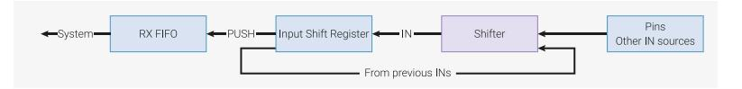

# 11.2.4.1 Input Shift Register (ISR)

*Figure 46. Input Shift Register (ISR). Data enters 1…32 bits at a time, and current contents is shifted left or right to make room. Once full, contents is written to the RX FIFO.*



- IN instructions shift 1…32 bits at a time into the register.
- PUSH instructions write the ISR contents to the RX FIFO.
- The ISR is cleared to all-zeroes when pushed.
- The state machine will automatically push the ISR on an IN instruction, once some shift threshold is reached, if autopush is enabled.
- Shift direction is configurable by the processor via configuration registers

Some peripherals, like UARTs, must shift in from the left to get correct bit order, since the wire order is LSB-first; however, the processor may expect the resulting byte to be right-aligned. This is solved by the special null input source, which allows the programmer to shift some number of zeroes into the ISR, following the data.

#### **11.2.4.2. Shift Counters**

State machines remember how many bits, in total, have been shifted out of the OSR via OUT instructions, and into the ISR via IN instructions. This information is tracked at all times by a pair of hardware counters: the output shift counter and the input shift counter. Each is capable of holding values from 0 to 32 inclusive. With each shift operation, the relevant counter increments by the shift count, up to the maximum value of 32 (equal to the width of the shift register). The state machine can be configured to perform certain actions when a counter reaches a configurable threshold:

- The OSR can be automatically refilled once some number of bits have been shifted out (see [Section 11.5.4\)](#page-903-0).
- The ISR can be automatically emptied once some number of bits have been shifted in (see [Section 11.5.4.](#page-903-0)

• PUSH or PULL instructions can be conditioned on the input or output shift counter, respectively.

On PIO reset, or the assertion of CTRL\_SM\_RESTART, the input shift counter is cleared to 0 (nothing yet shifted in), and the output shift counter is initialised to 32 (nothing remaining to be shifted out; fully exhausted). Some other instructions affect the shift counters:

- A successful PULL clears the output shift counter to 0
- A successful PUSH clears the input shift counter to 0
- MOV OSR, … (i.e. any MOV instruction that writes OSR) clears the output shift counter to 0
- MOV ISR, … (i.e. any MOV instruction that writes ISR) clears the input shift counter to 0
- OUT ISR, count sets the input shift counter to count

#### **11.2.4.3. Scratch Registers**

Each state machine has two 32-bit internal scratch registers, called X and Y.

They are used as:

- Source/destination for IN/OUT/SET/MOV
- Source for branch conditions

For example, suppose we wanted to produce a long pulse for "1" data bits, and a short pulse for "0" data bits:

```
 1 .program ws2812_led
 2 
 3 public entry_point:
 4 pull
 5 set x, 23 ; Loop over 24 bits
 6 bitloop:
 7 set pins, 1 ; Drive pin high
 8 out y, 1 [5] ; Shift 1 bit out, and write it to y
 9 jmp !y skip ; Skip the extra delay if the bit was 0
10 nop [5]
11 skip:
12 set pins, 0 [5]
13 jmp x-- bitloop ; Jump if x nonzero, and decrement x
14 jmp entry_point
```

Here X is used as a loop counter, and Y is used as a temporary variable for branching on single bits from the OSR. This program can be used to drive a WS2812 LED interface, although more compact implementations are possible (as few as 3 instructions).

MOV allows the use of the scratch registers to save/restore the shift registers if, for example, you would like to repeatedly shift out the same sequence.

#### **NOTE**

A much more compact WS2812 example (4 instructions total) is shown in [Section 11.6.2.](#page-916-0)

#### **11.2.4.4. FIFOs**

Each state machine has a pair of 4-word deep FIFOs, one for data transfer from system to state machine (TX), and the other for state machine to system (RX). The TX FIFO is written to by system bus masters, such as a processor or DMA controller, and the RX FIFO is written to by the state machine. FIFOs decouple the timing of the PIO state machines and the system bus, allowing state machines to go for longer periods without processor intervention.

FIFOs also generate data request (DREQ) signals, which allow a system DMA controller to pace its reads/writes based on the presence of data in an RX FIFO, or space for new data in a TX FIFO. This allows a processor to set up a long transaction, potentially involving many kilobytes of data, which will proceed with no further processor intervention.

Often, a state machine only transfers data in one direction. In this case, the SHIFTCTRL\_FJOIN option can merge the two FIFOs into a single 8-entry FIFO that only goes in one direction. This is useful for high-bandwidth interfaces such as DPI.

