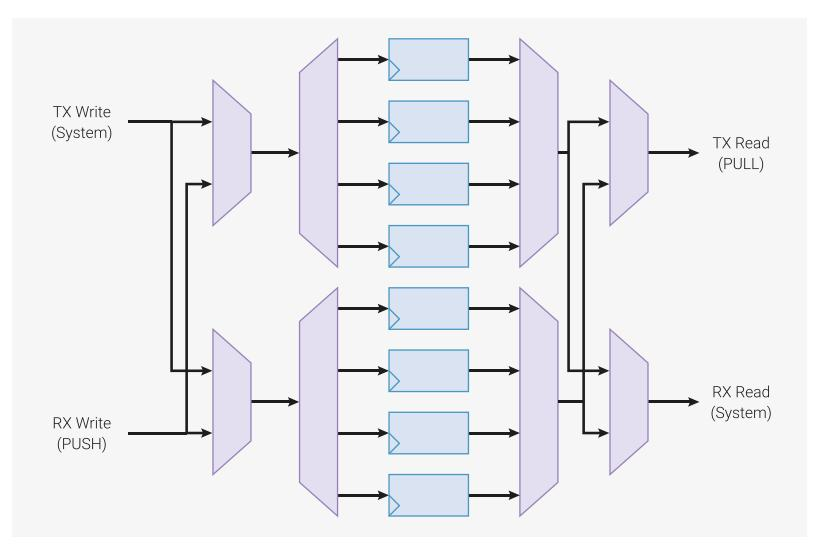

# 11.5.2 Program Wrapping

PIO programs often have an "outer loop": they perform the same sequence of steps, repetitively, as they transfer a stream of data between the FIFOs and the outside world. The square wave program from the introduction is a minimal example of this:

*Pico Examples: [https://github.com/raspberrypi/pico-examples/blob/master/pio/squarewave/squarewave.pio](https://github.com/raspberrypi/pico-examples/blob/master/pio/squarewave/squarewave.pio#L8-L13) Lines 8 - 13*

```
 8 .program squarewave
 9 set pindirs, 1 ; Set pin to output
10 again:
11 set pins, 1 [1] ; Drive pin high and then delay for one cycle
12 set pins, 0 ; Drive pin low
13 jmp again ; Set PC to label `again`
```

The main body of the program drives a pin high, and then low, producing one period of a square wave. The entire program then loops, driving a periodic output. The jump itself takes one cycle, as does each set instruction, so to keep the high and low periods of the same duration, the set pins, 1 has a single delay cycle added, which makes the state

machine idle for one cycle before executing the set pins, 0 instruction. In total, each loop takes four cycles. There are two frustrations here:

- The JMP takes up space in the instruction memory that could be used for other programs
- The extra cycle taken to execute the JMP ends up *halving* the maximum output rate

As the Program Counter (PC) naturally wraps to 0 when incremented past 31, we could solve the second of these by filling the entire instruction memory with a repeating pattern of set pins, 1 and set pins, 0, but this is wasteful. State machines have a hardware feature, configured via their EXECCTRL control register, which solves this common case.

*Pico Examples: [https://github.com/raspberrypi/pico-examples/blob/master/pio/squarewave/squarewave\\_wrap.pio](https://github.com/raspberrypi/pico-examples/blob/master/pio/squarewave/squarewave_wrap.pio#L12-L20) Lines 12 - 20*

```
12 .program squarewave_wrap
13 ; Like squarewave, but use the state machine's .wrap hardware instead of an
14 ; explicit jmp. This is a free (0-cycle) unconditional jump.
15 
16 set pindirs, 1 ; Set pin to output
17 .wrap_target
18 set pins, 1 [1] ; Drive pin high and then delay for one cycle
19 set pins, 0 [1] ; Drive pin low and then delay for one cycle
20 .wrap
```

After executing an instruction from the program memory, state machines use the following logic to update PC:

- 1. If the current instruction is a JMP, and the Condition is true, set PC to the Target
- 2. Otherwise, if PC matches EXECCTRL\_WRAP\_TOP, set PC to EXECCTRL\_WRAP\_BOTTOM
- 3. Otherwise, increment PC, or set to 0 if the current value is 31.

The .wrap\_target and .wrap assembly directives in pioasm are essentially labels. They export constants which can be written to the WRAP\_BOTTOM and WRAP\_TOP control fields, respectively:

*Pico Examples: [https://github.com/raspberrypi/pico-examples/blob/master/pio/squarewave/generated/squarewave\\_wrap.pio.h](https://github.com/raspberrypi/pico-examples/blob/master/pio/squarewave/generated/squarewave_wrap.pio.h)*

```
 1 // -------------------------------------------------- //
 2 // This file is autogenerated by pioasm; do not edit! //
 3 // -------------------------------------------------- //
 4 
 5 #pragma once
 6 
 7 #include "hardware/pio.h"
 8 
 9 // --------------- //
10 // squarewave_wrap //
11 // --------------- //
12 
13 #define squarewave_wrap_wrap_target 1
14 #define squarewave_wrap_wrap 2
15 #define squarewave_wrap_pio_version 0
16 
17 static const uint16_t squarewave_wrap_program_instructions[] = {
18 0xe081, // 0: set pindirs, 1
19 // .wrap_target
20 0xe101, // 1: set pins, 1 [1]
21 0xe100, // 2: set pins, 0 [1]
22 // .wrap
23 };
24 
25 static const struct pio_program squarewave_wrap_program = {
26 .instructions = squarewave_wrap_program_instructions,
27 .length = 3,
```

```
28 .origin = -1,
29 .pio_version = squarewave_wrap_pio_version,
30 .used_gpio_ranges = 0x0
31 #endif
32 };
33 
34 static inline pio_sm_config squarewave_wrap_program_get_default_config(uint offset) {
35 pio_sm_config c = pio_get_default_sm_config();
36 sm_config_set_wrap(&c, offset + squarewave_wrap_wrap_target, offset +
  squarewave_wrap_wrap);
37 return c;
38 }
```

This is raw output from the PIO assembler, pioasm, which has created a default pio\_sm\_config object containing the WRAP register values from the program listing. The control register fields could also be initialised directly.

# **NOTE**

WRAP\_BOTTOM and WRAP\_TOP are absolute addresses in the PIO instruction memory. If a program is loaded at an offset, the wrap addresses must be adjusted accordingly.

The squarewave\_wrap example has delay cycles inserted, so that it behaves identically to the original squarewave program. Thanks to program wrapping, these can now be removed, so that the output toggles twice as fast, while maintaining an even balance of high and low periods.

*Pico Examples: [https://github.com/raspberrypi/pico-examples/blob/master/pio/squarewave/squarewave\\_fast.pio](https://github.com/raspberrypi/pico-examples/blob/master/pio/squarewave/squarewave_fast.pio#L12-L18) Lines 12 - 18*

```
12 .program squarewave_fast
13 ; Like squarewave_wrap, but remove the delay cycles so we can run twice as fast.
14 set pindirs, 1 ; Set pin to output
15 .wrap_target
16 set pins, 1 ; Drive pin high
17 set pins, 0 ; Drive pin low
18 .wrap
```

## <span id="page-902-0"></span>**11.5.3. FIFO Joining**

By default, each state machine possesses a 4-entry FIFO in each direction: one for data transfer from system to state machine (TX), the other for the reverse direction (RX). However, many applications do not require bidirectional data transfer between the system and an individual state machine, but may benefit from deeper FIFOs: in particular, highbandwidth interfaces such as DPI. For these cases, SHIFTCTRL\_FJOIN can merge the two 4-entry FIFOs into a single 8-entry FIFO.

*Figure 47. Joinable dual FIFO. A pair of four-entry FIFOs, implemented with four data registers, a 1:4 decoder and a 4:1 multiplexer. Additional multiplexing allows write data and read data to cross between the TX and RX lanes, so that all 8 entries are accessible from both ports*



Another example is a UART: because the TX/CTS and RX/RTS parts a of a UART are asynchronous, they are implemented on two separate state machines. It would be wasteful to leave half of each state machine's FIFO resources idle. The ability to join the two halves into just a TX FIFO for the TX/CTS state machine, or just an RX FIFO in the case of the RX/RTS state machine, allows full utilisation. A UART equipped with an 8-deep FIFO can be left alone for twice as long between interrupts as one with only a 4-deep FIFO.

When one FIFO is increased in size (from 4 to 8), the other FIFO on that state machine is reduced to zero. For example, if joining to TX, the RX FIFO is unavailable, and any PUSH instruction will stall. The RX FIFO will appear both RXFULL and RXEMPTY in the FSTAT register. The converse is true if joining to RX: the TX FIFO is unavailable, and the TXFULL and TXEMPTY bits for this state machine will both be set in FSTAT. Setting both FJOIN\_RX and FJOIN\_TX makes both FIFOs unavailable.

8 FIFO entries is sufficient for 1 word per clock through the RP2350 system DMA, provided the DMA is not slowed by contention with other masters.

#### **CAUTION**

Changing FJOIN discards any data present in the state machine's FIFOs. If this data is irreplaceable, it must be drained beforehand.

