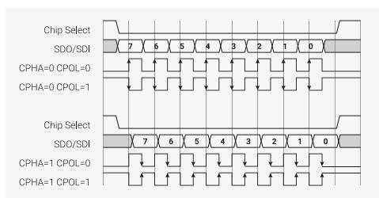

# 11.6 Examples

These examples illustrate some of PIO's hardware features, by implementing common I/O interfaces.


**TIP**

**[Raspberry Pi Pico-series C/C++ SDK](https://datasheets.raspberrypi.com/pico/raspberry-pi-pico-c-sdk.pdf)** has a comprehensive PIO chapter that begins with writing and building your first PIO application. Later chapters walk through some programs line-by-line. Finally, it covers broader topics such as using PIO with DMA, and how PIO can integrate into your software.

#### <span id="page-912-1"></span>**11.6.1. Duplex SPI**

*Figure 55. In SPI, a host and device exchange data over a bidirectional pair of serial data lines, synchronous with a clock (SCK). Two flags, CPOL and CPHA, specify the clock's behaviour. CPOL is the idle state of the clock: 0 for low, 1 for high. The clock pulses a number of times, transferring one bit in each direction per pulse, but always returns to its idle state. CPHA determines on which edge of the clock data is captured: 0 for leading edge, and 1 for trailing edge. The arrows in the figure show the clock edge where data is captured by both the host and device.*



SPI is a common serial interface with a twisty history. The following program implements full-duplex (i.e. transferring data in both directions simultaneously) SPI, with a CPHA parameter of 0.

*Pico Examples: [https://github.com/raspberrypi/pico-examples/blob/master/pio/spi/spi.pio](https://github.com/raspberrypi/pico-examples/blob/master/pio/spi/spi.pio#L14-L32) Lines 14 - 32*

```
14 .program spi_cpha0
15 .side_set 1
16 
17 ; Pin assignments:
18 ; - SCK is side-set pin 0
19 ; - MOSI is OUT pin 0
20 ; - MISO is IN pin 0
21 ;
22 ; Autopush and autopull must be enabled, and the serial frame size is set by
23 ; configuring the push/pull threshold. Shift left/right is fine, but you must
24 ; justify the data yourself. This is done most conveniently for frame sizes of
25 ; 8 or 16 bits by using the narrow store replication and narrow load byte
26 ; picking behaviour of RP2040's IO fabric.
27 
28 ; Clock phase = 0: data is captured on the leading edge of each SCK pulse, and
29 ; transitions on the trailing edge, or some time before the first leading edge.
30 
31 out pins, 1 side 0 [1] ; Stall here on empty (sideset proceeds even if
32 in pins, 1 side 1 [1] ; instruction stalls, so we stall with SCK low)
```

This code uses autopush and autopull to continuously stream data from the FIFOs. The entire program runs once for every bit that is transferred, and then loops. The state machine tracks how many bits have been shifted in/out, and automatically pushes/pulls the FIFOs at the correct point. A similar program handles the CPHA=1 case:

*Pico Examples: [https://github.com/raspberrypi/pico-examples/blob/master/pio/spi/spi.pio](https://github.com/raspberrypi/pico-examples/blob/master/pio/spi/spi.pio#L34-L42) Lines 34 - 42*

```
34 .program spi_cpha1
35 .side_set 1
36 
37 ; Clock phase = 1: data transitions on the leading edge of each SCK pulse, and
38 ; is captured on the trailing edge.
39 
40 out x, 1 side 0 ; Stall here on empty (keep SCK deasserted)
41 mov pins, x side 1 [1] ; Output data, assert SCK (mov pins uses OUT mapping)
42 in pins, 1 side 0 ; Input data, deassert SCK
```

# **NOTE**

These programs do not control the chip select line; chip select is often implemented as a software-controlled GPIO, due to wildly different behaviour between different SPI hardware. The full spi.pio source linked above contains some examples how PIO can implement a hardware chip select line.

A C helper function configures the state machine, connects the GPIOs, and sets the state machine running. Note that the SPI frame size — that is, the number of bits transferred for each FIFO record — can be programmed to any value from 1 to 32, without modifying the program. Once configured, the state machine is set running.

*Pico Examples: [https://github.com/raspberrypi/pico-examples/blob/master/pio/spi/spi.pio](https://github.com/raspberrypi/pico-examples/blob/master/pio/spi/spi.pio#L46-L72) Lines 46 - 72*

```
46 static inline void pio_spi_init(PIO pio, uint sm, uint prog_offs, uint n_bits,
47 float clkdiv, bool cpha, bool cpol, uint pin_sck, uint pin_mosi, uint pin_miso) {
48 pio_sm_config c = cpha ? spi_cpha1_program_get_default_config(prog_offs) :
  spi_cpha0_program_get_default_config(prog_offs);
49 sm_config_set_out_pins(&c, pin_mosi, 1);
50 sm_config_set_in_pins(&c, pin_miso);
51 sm_config_set_sideset_pins(&c, pin_sck);
52 // Only support MSB-first in this example code (shift to left, auto push/pull,
  threshold=nbits)
53 sm_config_set_out_shift(&c, false, true, n_bits);
54 sm_config_set_in_shift(&c, false, true, n_bits);
55 sm_config_set_clkdiv(&c, clkdiv);
56 
57 // MOSI, SCK output are low, MISO is input
58 pio_sm_set_pins_with_mask(pio, sm, 0, (1u << pin_sck) | (1u << pin_mosi));
59 pio_sm_set_pindirs_with_mask(pio, sm, (1u << pin_sck) | (1u << pin_mosi), (1u << pin_sck)
  | (1u << pin_mosi) | (1u << pin_miso));
60 pio_gpio_init(pio, pin_mosi);
61 pio_gpio_init(pio, pin_miso);
62 pio_gpio_init(pio, pin_sck);
63 
64 // The pin muxes can be configured to invert the output (among other things
65 // and this is a cheesy way to get CPOL=1
66 gpio_set_outover(pin_sck, cpol ? GPIO_OVERRIDE_INVERT : GPIO_OVERRIDE_NORMAL);
67 // SPI is synchronous, so bypass input synchroniser to reduce input delay.
68 hw_set_bits(&pio->input_sync_bypass, 1u << pin_miso);
69 
70 pio_sm_init(pio, sm, prog_offs, &c);
71 pio_sm_set_enabled(pio, sm, true);
72 }
```

The state machine will now immediately begin to shift out any data appearing in the TX FIFO, and push received data into the RX FIFO.

*Pico Examples: [https://github.com/raspberrypi/pico-examples/blob/master/pio/spi/pio\\_spi.c](https://github.com/raspberrypi/pico-examples/blob/master/pio/spi/pio_spi.c#L18-L34) Lines 18 - 34*

```
18 void __time_critical_func(pio_spi_write8_blocking)(const pio_spi_inst_t *spi, const uint8_t
  *src, size_t len) {
19 size_t tx_remain = len, rx_remain = len;
20 // Do 8 bit accesses on FIFO, so that write data is byte-replicated. This
21 // gets us the left-justification for free (for MSB-first shift-out)
22 io_rw_8 *txfifo = (io_rw_8 *) &spi->pio->txf[spi->sm];
23 io_rw_8 *rxfifo = (io_rw_8 *) &spi->pio->rxf[spi->sm];
24 while (tx_remain || rx_remain) {
25 if (tx_remain && !pio_sm_is_tx_fifo_full(spi->pio, spi->sm)) {
26 *txfifo = *src++;
27 --tx_remain;
28 }
```

```
29 if (rx_remain && !pio_sm_is_rx_fifo_empty(spi->pio, spi->sm)) {
30 (void) *rxfifo;
31 --rx_remain;
32 }
33 }
34 }
```

Putting this all together, this complete C program will loop back some data through a PIO SPI at 1 MHz, with all four CPOL/CPHA combinations:

*Pico Examples: [https://github.com/raspberrypi/pico-examples/blob/master/pio/spi/spi\\_loopback.c](https://github.com/raspberrypi/pico-examples/blob/master/pio/spi/spi_loopback.c)*

```
 1 /**
 2 * Copyright (c) 2020 Raspberry Pi (Trading) Ltd.
 3 *
 4 * SPDX-License-Identifier: BSD-3-Clause
 5 */
 6 
 7 #include <stdlib.h>
 8 #include <stdio.h>
 9 
10 #include "pico/stdlib.h"
11 #include "pio_spi.h"
12 
13 // This program instantiates a PIO SPI with each of the four possible
14 // CPOL/CPHA combinations, with the serial input and output pin mapped to the
15 // same GPIO. Any data written into the state machine's TX FIFO should then be
16 // serialised, deserialised, and reappear in the state machine's RX FIFO.
17 
18 #define PIN_SCK 18
19 #define PIN_MOSI 16
20 #define PIN_MISO 16 // same as MOSI, so we get loopback
21 
22 #define BUF_SIZE 20
23 
24 void test(const pio_spi_inst_t *spi) {
25 static uint8_t txbuf[BUF_SIZE];
26 static uint8_t rxbuf[BUF_SIZE];
27 printf("TX:");
28 for (int i = 0; i < BUF_SIZE; ++i) {
29 txbuf[i] = rand() >> 16;
30 rxbuf[i] = 0;
31 printf(" %02x", (int) txbuf[i]);
32 }
33 printf("\n");
34 
35 pio_spi_write8_read8_blocking(spi, txbuf, rxbuf, BUF_SIZE);
36 
37 printf("RX:");
38 bool mismatch = false;
39 for (int i = 0; i < BUF_SIZE; ++i) {
40 printf(" %02x", (int) rxbuf[i]);
41 mismatch = mismatch || rxbuf[i] != txbuf[i];
42 }
43 if (mismatch)
44 printf("\nNope\n");
45 else
46 printf("\nOK\n");
47 }
48 
49 int main() {
50 stdio_init_all();
```

```
51 
52 pio_spi_inst_t spi = {
53 .pio = pio0,
54 .sm = 0
55 };
56 float clkdiv = 31.25f; // 1 MHz @ 125 clk_sys
57 uint cpha0_prog_offs = pio_add_program(spi.pio, &spi_cpha0_program);
58 uint cpha1_prog_offs = pio_add_program(spi.pio, &spi_cpha1_program);
59 
60 for (int cpha = 0; cpha <= 1; ++cpha) {
61 for (int cpol = 0; cpol <= 1; ++cpol) {
62 printf("CPHA = %d, CPOL = %d\n", cpha, cpol);
63 pio_spi_init(spi.pio, spi.sm,
64 cpha ? cpha1_prog_offs : cpha0_prog_offs,
65 8, // 8 bits per SPI frame
66 clkdiv,
67 cpha,
68 cpol,
69 PIN_SCK,
70 PIN_MOSI,
71 PIN_MISO
72 );
73 test(&spi);
74 sleep_ms(10);
75 }
76 }
77 }
```

## <span id="page-916-0"></span>**11.6.2. WS2812 LEDs**

WS2812 LEDs are driven by a proprietary pulse-width serial format, with a wide positive pulse representing a "1" bit, and narrow positive pulse a "0". Each LED has a serial input and a serial output; LEDs are connected in a chain, with each serial input connected to the previous LED's serial output.

*Figure 56. WS2812 line format. Wide positive pulse for 1, narrow positive pulse for 0, very long negative pulse for latch enable*


LEDs consume 24 bits of pixel data, then pass any additional input data on to their output. In this way a single serial burst can individually program the colour of each LED in a chain. A long negative pulse latches the pixel data into the LEDs.

*Pico Examples: [https://github.com/raspberrypi/pico-examples/blob/master/pio/ws2812/ws2812.pio](https://github.com/raspberrypi/pico-examples/blob/master/pio/ws2812/ws2812.pio#L8-L31) Lines 8 - 31*

```
 8 .program ws2812
 9 .side_set 1
10 
11 ; The following constants are selected for broad compatibility with WS2812,
12 ; WS2812B, and SK6812 LEDs. Other constants may support higher bandwidths for
13 ; specific LEDs, such as (7,10,8) for WS2812B LEDs.
14 
15 .define public T1 3
16 .define public T2 3
17 .define public T3 4
18 
19 .lang_opt python sideset_init = pico.PIO.OUT_HIGH
20 .lang_opt python out_init = pico.PIO.OUT_HIGH
21 .lang_opt python out_shiftdir = 1
22 
23 .wrap_target
```

```
24 bitloop:
25 out x, 1 side 0 [T3 - 1] ; Side-set still takes place when instruction stalls
26 jmp !x do_zero side 1 [T1 - 1] ; Branch on the bit we shifted out. Positive pulse
27 do_one:
28 jmp bitloop side 1 [T2 - 1] ; Continue driving high, for a long pulse
29 do_zero:
30 nop side 0 [T2 - 1] ; Or drive low, for a short pulse
31 .wrap
```

This program shifts bits from the OSR into X, and produces a wide or narrow pulse on side-set pin 0, based on the value of each data bit. Autopull must be configured, with a threshold of 24. Software can then write 24-bit pixel values into the FIFO, and these will be serialised to a chain of WS2812 LEDs. The .pio file contains a C helper function to set this up:

*Pico Examples: [https://github.com/raspberrypi/pico-examples/blob/master/pio/ws2812/ws2812.pio](https://github.com/raspberrypi/pico-examples/blob/master/pio/ws2812/ws2812.pio#L36-L52) Lines 36 - 52*

```
36 static inline void ws2812_program_init(PIO pio, uint sm, uint offset, uint pin, float freq,
  bool rgbw) {
37 
38 pio_gpio_init(pio, pin);
39 pio_sm_set_consecutive_pindirs(pio, sm, pin, 1, true);
40 
41 pio_sm_config c = ws2812_program_get_default_config(offset);
42 sm_config_set_sideset_pins(&c, pin);
43 sm_config_set_out_shift(&c, false, true, rgbw ? 32 : 24);
44 sm_config_set_fifo_join(&c, PIO_FIFO_JOIN_TX);
45 
46 int cycles_per_bit = ws2812_T1 + ws2812_T2 + ws2812_T3;
47 float div = clock_get_hz(clk_sys) / (freq * cycles_per_bit);
48 sm_config_set_clkdiv(&c, div);
49 
50 pio_sm_init(pio, sm, offset, &c);
51 pio_sm_set_enabled(pio, sm, true);
52 }
```

Because the shift is MSB-first, and our pixels aren't a power of two size (so we can't rely on the narrow write replication behaviour on RP2350 to fan out the bits for us), we need to preshift the values written to the TX FIFO.

*Pico Examples: [https://github.com/raspberrypi/pico-examples/blob/master/pio/ws2812/ws2812.c](https://github.com/raspberrypi/pico-examples/blob/master/pio/ws2812/ws2812.c#L43-L45) Lines 43 - 45*

```
43 static inline void put_pixel(PIO pio, uint sm, uint32_t pixel_grb) {
44 pio_sm_put_blocking(pio, sm, pixel_grb << 8u);
45 }
```

To DMA the pixels, we could instead set the autopull threshold to 8 bits, set the DMA transfer size to 8 bits, and write a byte at a time into the FIFO. Each pixel would be 3 one-byte transfers. Because of how the bus fabric and DMA on RP2350 work, each byte the DMA transfers will appear replicated four times when written to a 32-bit IO register, so effectively your data is at *both ends* of the shift register, and you can shift in either direction without worry.

#### **TIP**

The WS2812 example is the subject of a tutorial in the **[Raspberry Pi Pico-series C/C++ SDK](https://datasheets.raspberrypi.com/pico/raspberry-pi-pico-c-sdk.pdf)** document, in the PIO chapter. The tutorial dissects the ws2812 program line by line, traces through how the program executes, and shows wave diagrams of the GPIO output at every point in the program.

