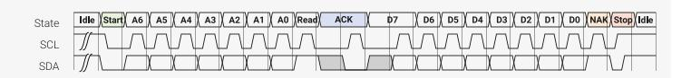
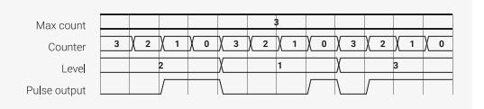

# 11.6.6 Differential Manchester (BMC) TX and RX

*Figure 59. Differential Manchester serial line code, also known as biphase mark code (BMC). The line transitions at the start of every bit period. The presence of a transition in the centre of the bit period signifies a* 1 *data bit, and the absence, a* 0 *bit. These encoding rules are the same whether the line has an initial high or low state.*

<span id="page-926-1"></span>

The transmit program is similar to the Manchester example: it repeatedly shifts a bit from the OSR into X (relying on autopull to refill the OSR in the background), branches, and drives a GPIO up and down based on the value of this bit. The added complication is that the pattern we drive onto the pin depends not just on the value of the data bit, as with vanilla Manchester encoding, but also on the state the line was left in at the end of the last bit period. This is illustrated in [Figure 59](#page-926-1), where the pattern is inverted if the line is initially high. To cope with this, there are two copies of the testand-drive code, one for each initial line state, and these are linked together in the correct order by a sequence of jumps.

*Pico Examples: [https://github.com/raspberrypi/pico-examples/blob/master/pio/differential\\_manchester/differential\\_manchester.pio](https://github.com/raspberrypi/pico-examples/blob/master/pio/differential_manchester/differential_manchester.pio#L8-L35) Lines 8 - 35*

```
 8 .program differential_manchester_tx
 9 .side_set 1 opt
10 
11 ; Transmit one bit every 16 cycles. In each bit period:
12 ; - A '0' is encoded as a transition at the start of the bit period
13 ; - A '1' is encoded as a transition at the start *and* in the middle
14 ;
15 ; Side-set bit 0 must be mapped to the data output pin.
16 ; Autopull must be enabled.
17 
18 public start:
19 initial_high:
20 out x, 1 ; Start of bit period: always assert transition
21 jmp !x high_0 side 1 [6] ; Test the data bit we just shifted out of OSR
22 high_1:
23 nop
24 jmp initial_high side 0 [6] ; For `1` bits, also transition in the middle
25 high_0:
26 jmp initial_low [7] ; Otherwise, the line is stable in the middle
27 
28 initial_low:
29 out x, 1 ; Always shift 1 bit from OSR to X so we can
30 jmp !x low_0 side 0 [6] ; branch on it. Autopull refills OSR for us.
31 low_1:
32 nop
33 jmp initial_low side 1 [6] ; If there are two transitions, return to
34 low_0:
35 jmp initial_high [7] ; the initial line state is flipped!
```

The .pio file also includes a helper function to initialise a state machine for differential Manchester TX, and connect it to a chosen GPIO. We arbitrarily choose a 32-bit frame size and LSB-first serialisation (shift\_to\_right is true in sm\_config\_set\_out\_shift), but as the program operates on one bit at a time, we could change this by reconfiguring the state machine.

*Pico Examples: [https://github.com/raspberrypi/pico-examples/blob/master/pio/differential\\_manchester/differential\\_manchester.pio](https://github.com/raspberrypi/pico-examples/blob/master/pio/differential_manchester/differential_manchester.pio#L38-L53) Lines 38 - 53*

```
38 static inline void differential_manchester_tx_program_init(PIO pio, uint sm, uint offset,
  uint pin, float div) {
39 pio_sm_set_pins_with_mask(pio, sm, 0, 1u << pin);
40 pio_sm_set_consecutive_pindirs(pio, sm, pin, 1, true);
41 pio_gpio_init(pio, pin);
42 
43 pio_sm_config c = differential_manchester_tx_program_get_default_config(offset);
44 sm_config_set_sideset_pins(&c, pin);
45 sm_config_set_out_shift(&c, true, true, 32);
46 sm_config_set_fifo_join(&c, PIO_FIFO_JOIN_TX);
47 sm_config_set_clkdiv(&c, div);
48 pio_sm_init(pio, sm, offset + differential_manchester_tx_offset_start, &c);
49 
50 // Execute a blocking pull so that we maintain the initial line state until data is
  available
51 pio_sm_exec(pio, sm, pio_encode_pull(false, true));
52 pio_sm_set_enabled(pio, sm, true);
53 }
```

The RX program uses the following strategy:

- 1. Wait until the initial transition at the start of the bit period, so we stay aligned to the transmit clock
- 2. Then, wait 3/4 of the configured bit period, so that we are centred on the second half-bit-period (see [Figure 59\)](#page-926-1)
- 3. Sample the line at this point to determine whether there are one or two transitions in this bit period
- 4. Repeat

*Pico Examples: [https://github.com/raspberrypi/pico-examples/blob/master/pio/differential\\_manchester/differential\\_manchester.pio](https://github.com/raspberrypi/pico-examples/blob/master/pio/differential_manchester/differential_manchester.pio#L55-L85) Lines 55 - 85*

```
55 .program differential_manchester_rx
56 
57 ; Assumes line is idle low
58 ; One bit is 16 cycles. In each bit period:
59 ; - A '0' is encoded as a transition at time 0
60 ; - A '1' is encoded as a transition at time 0 and a transition at time T/2
61 ;
62 ; The IN mapping and the JMP pin select must both be mapped to the GPIO used for
63 ; RX data. Autopush must be enabled.
64 
65 public start:
66 initial_high: ; Find rising edge at start of bit period
67 wait 1 pin, 0 [11] ; Delay to eye of second half-period (i.e 3/4 of way
68 jmp pin high_0 ; through bit) and branch on RX pin high/low.
69 high_1:
70 in x, 1 ; Second transition detected (a `1` data symbol)
71 jmp initial_high
72 high_0:
73 in y, 1 [1] ; Line still high, no centre transition (data is `0`)
74 ; Fall-through
75 
76 .wrap_target
77 initial_low: ; Find falling edge at start of bit period
78 wait 0 pin, 0 [11] ; Delay to eye of second half-period
79 jmp pin low_1
80 low_0:
81 in y, 1 ; Line still low, no centre transition (data is `0`)
82 jmp initial_high
83 low_1: ; Second transition detected (data is `1`)
84 in x, 1 [1]
```

```
85 .wrap
```

This code assumes that X and Y have the values 1 and 0, respectively. This is arranged for by the included C helper function:

*Pico Examples: [https://github.com/raspberrypi/pico-examples/blob/master/pio/differential\\_manchester/differential\\_manchester.pio](https://github.com/raspberrypi/pico-examples/blob/master/pio/differential_manchester/differential_manchester.pio#L88-L104) Lines 88 - 104*

```
 88 static inline void differential_manchester_rx_program_init(PIO pio, uint sm, uint offset,
  uint pin, float div) {
 89 pio_sm_set_consecutive_pindirs(pio, sm, pin, 1, false);
 90 pio_gpio_init(pio, pin);
 91 
 92 pio_sm_config c = differential_manchester_rx_program_get_default_config(offset);
 93 sm_config_set_in_pins(&c, pin); // for WAIT
 94 sm_config_set_jmp_pin(&c, pin); // for JMP
 95 sm_config_set_in_shift(&c, true, true, 32);
 96 sm_config_set_fifo_join(&c, PIO_FIFO_JOIN_RX);
 97 sm_config_set_clkdiv(&c, div);
 98 pio_sm_init(pio, sm, offset, &c);
 99 
100 // X and Y are set to 0 and 1, to conveniently emit these to ISR/FIFO.
101 pio_sm_exec(pio, sm, pio_encode_set(pio_x, 1));
102 pio_sm_exec(pio, sm, pio_encode_set(pio_y, 0));
103 pio_sm_set_enabled(pio, sm, true);
104 }
```

All the pieces now exist to loopback some serial data over a wire between two GPIOs.

*Pico Examples: [https://github.com/raspberrypi/pico-examples/blob/master/pio/differential\\_manchester/differential\\_manchester.c](https://github.com/raspberrypi/pico-examples/blob/master/pio/differential_manchester/differential_manchester.c)*

```
 1 /**
 2 * Copyright (c) 2020 Raspberry Pi (Trading) Ltd.
 3 *
 4 * SPDX-License-Identifier: BSD-3-Clause
 5 */
 6 
 7 #include <stdio.h>
 8 
 9 #include "pico/stdlib.h"
10 #include "hardware/pio.h"
11 #include "differential_manchester.pio.h"
12 
13 // Differential serial transmit/receive example
14 // Need to connect a wire from GPIO2 -> GPIO3
15 
16 const uint pin_tx = 2;
17 const uint pin_rx = 3;
18 
19 int main() {
20 stdio_init_all();
21 
22 PIO pio = pio0;
23 uint sm_tx = 0;
24 uint sm_rx = 1;
25 
26 uint offset_tx = pio_add_program(pio, &differential_manchester_tx_program);
27 uint offset_rx = pio_add_program(pio, &differential_manchester_rx_program);
28 printf("Transmit program loaded at %d\n", offset_tx);
29 printf("Receive program loaded at %d\n", offset_rx);
30
```

```
31 // Configure state machines, set bit rate at 5 Mbps
32 differential_manchester_tx_program_init(pio, sm_tx, offset_tx, pin_tx, 125.f / (16 * 5));
33 differential_manchester_rx_program_init(pio, sm_rx, offset_rx, pin_rx, 125.f / (16 * 5));
34 
35 pio_sm_set_enabled(pio, sm_tx, false);
36 pio_sm_put_blocking(pio, sm_tx, 0);
37 pio_sm_put_blocking(pio, sm_tx, 0x0ff0a55a);
38 pio_sm_put_blocking(pio, sm_tx, 0x12345678);
39 pio_sm_set_enabled(pio, sm_tx, true);
40 
41 for (int i = 0; i < 3; ++i)
42 printf("%08x\n", pio_sm_get_blocking(pio, sm_rx));
43 }
```

#### <span id="page-929-0"></span>**11.6.7. I2C**

*Figure 60. A 1-byte I2C read transfer. In the idle state, both lines float high. The initiator drives SDA low (a Start condition), followed by 7 address bits A6-A0, and a direction bit (Read/nWrite). The target drives SDA low to acknowledge the address (ACK). Data bytes follow. The target serialises data on SDA, clocked out by SCL. Every 9th clock, the* **initiator** *pulls SDA low to acknowledge the data, except on the last byte, where it leaves the line high (NAK). Releasing SDA whilst SCL is high is a Stop condition, returning*

*the bus to idle.*



I2C is an ubiquitous serial bus first described in the Dead Sea Scrolls, and later used by Philips Semiconductor. Two wires with pullup resistors form an open-drain bus, and multiple agents address and signal one another over this bus by driving the bus lines low, or releasing them to be pulled high. It has a number of unusual attributes:

- SCL can be held low at any time, for any duration, by any member of the bus (not necessarily the target or initiator of the transfer). This is known as clock stretching. The bus does not advance until all drivers release the clock.
- Members of the bus can be a target of one transfer and initiate other transfers (the master/slave roles are not fixed). However this is poorly supported by most I2C hardware.
- SCL is not an edge-sensitive clock, rather SDA must be valid the entire time SCL is high.
- In spite of the transparency of SDA against SCL, transitions of SDA whilst SCL is high are used to mark beginning and end of transfers (Start/Stop), or a new address phase within one (Restart).

The PIO program listed below handles serialisation, clock stretching, and checking of ACKs in the initiator role. It provides a mechanism for escaping PIO instructions in the FIFO datastream, to issue Start/Stop/Restart sequences at appropriate times. Provided no unexpected NAKs are received, this can perform long sequences of I2C transfers from a DMA buffer, without processor intervention.

*Pico Examples: [https://github.com/raspberrypi/pico-examples/blob/master/pio/i2c/i2c.pio](https://github.com/raspberrypi/pico-examples/blob/master/pio/i2c/i2c.pio#L8-L73) Lines 8 - 73*

```
 8 .program i2c
 9 .side_set 1 opt pindirs
10 
11 ; TX Encoding:
12 ; | 15:10 | 9 | 8:1 | 0 |
13 ; | Instr | Final | Data | NAK |
14 ;
15 ; If Instr has a value n > 0, then this FIFO word has no
16 ; data payload, and the next n + 1 words will be executed as instructions.
17 ; Otherwise, shift out the 8 data bits, followed by the ACK bit.
18 ;
19 ; The Instr mechanism allows stop/start/repstart sequences to be programmed
20 ; by the processor, and then carried out by the state machine at defined points
21 ; in the datastream.
22 ;
23 ; The "Final" field should be set for the final byte in a transfer.
24 ; This tells the state machine to ignore a NAK: if this field is not
25 ; set, then any NAK will cause the state machine to halt and interrupt.
```

```
26 ;
27 ; Autopull should be enabled, with a threshold of 16.
28 ; Autopush should be enabled, with a threshold of 8.
29 ; The TX FIFO should be accessed with halfword writes, to ensure
30 ; the data is immediately available in the OSR.
31 ;
32 ; Pin mapping:
33 ; - Input pin 0 is SDA, 1 is SCL (if clock stretching used)
34 ; - Jump pin is SDA
35 ; - Side-set pin 0 is SCL
36 ; - Set pin 0 is SDA
37 ; - OUT pin 0 is SDA
38 ; - SCL must be SDA + 1 (for wait mapping)
39 ;
40 ; The OE outputs should be inverted in the system IO controls!
41 ; (It's possible for the inversion to be done in this program,
42 ; but costs 2 instructions: 1 for inversion, and one to cope
43 ; with the side effect of the MOV on TX shift counter.)
44 
45 do_nack:
46 jmp y-- entry_point ; Continue if NAK was expected
47 irq wait 0 rel ; Otherwise stop, ask for help
48 
49 do_byte:
50 set x, 7 ; Loop 8 times
51 bitloop:
52 out pindirs, 1 [7] ; Serialise write data (all-ones if reading)
53 nop side 1 [2] ; SCL rising edge
54 wait 1 pin, 1 [4] ; Allow clock to be stretched
55 in pins, 1 [7] ; Sample read data in middle of SCL pulse
56 jmp x-- bitloop side 0 [7] ; SCL falling edge
57 
58 ; Handle ACK pulse
59 out pindirs, 1 [7] ; On reads, we provide the ACK.
60 nop side 1 [7] ; SCL rising edge
61 wait 1 pin, 1 [7] ; Allow clock to be stretched
62 jmp pin do_nack side 0 [2] ; Test SDA for ACK/NAK, fall through if ACK
63 
64 public entry_point:
65 .wrap_target
66 out x, 6 ; Unpack Instr count
67 out y, 1 ; Unpack the NAK ignore bit
68 jmp !x do_byte ; Instr == 0, this is a data record.
69 out null, 32 ; Instr > 0, remainder of this OSR is invalid
70 do_exec:
71 out exec, 16 ; Execute one instruction per FIFO word
72 jmp x-- do_exec ; Repeat n + 1 times
73 .wrap
```

The IO mapping required by the I2C program is quite complex, due to the different ways that the two serial lines must be driven and sampled. One interesting feature is that state machine must drive the output enable high when the output is low, since the bus is open-drain, so the sense of the data is inverted. This could be handled in the PIO program (e.g. mov osr, ~osr), but instead we can use the IO controls on RP2350 to perform this inversion in the GPIO muxes, saving an instruction.

*Pico Examples: [https://github.com/raspberrypi/pico-examples/blob/master/pio/i2c/i2c.pio](https://github.com/raspberrypi/pico-examples/blob/master/pio/i2c/i2c.pio#L81-L121) Lines 81 - 121*

```
 81 static inline void i2c_program_init(PIO pio, uint sm, uint offset, uint pin_sda, uint
  pin_scl) {
 82 assert(pin_scl == pin_sda + 1);
 83 pio_sm_config c = i2c_program_get_default_config(offset);
```

```
 84 
 85 // IO mapping
 86 sm_config_set_out_pins(&c, pin_sda, 1);
 87 sm_config_set_set_pins(&c, pin_sda, 1);
 88 sm_config_set_in_pins(&c, pin_sda);
 89 sm_config_set_sideset_pins(&c, pin_scl);
 90 sm_config_set_jmp_pin(&c, pin_sda);
 91 
 92 sm_config_set_out_shift(&c, false, true, 16);
 93 sm_config_set_in_shift(&c, false, true, 8);
 94 
 95 float div = (float)clock_get_hz(clk_sys) / (32 * 100000);
 96 sm_config_set_clkdiv(&c, div);
 97 
 98 // Try to avoid glitching the bus while connecting the IOs. Get things set
 99 // up so that pin is driven down when PIO asserts OE low, and pulled up
100 // otherwise.
101 gpio_pull_up(pin_scl);
102 gpio_pull_up(pin_sda);
103 uint32_t both_pins = (1u << pin_sda) | (1u << pin_scl);
104 pio_sm_set_pins_with_mask(pio, sm, both_pins, both_pins);
105 pio_sm_set_pindirs_with_mask(pio, sm, both_pins, both_pins);
106 pio_gpio_init(pio, pin_sda);
107 gpio_set_oeover(pin_sda, GPIO_OVERRIDE_INVERT);
108 pio_gpio_init(pio, pin_scl);
109 gpio_set_oeover(pin_scl, GPIO_OVERRIDE_INVERT);
110 pio_sm_set_pins_with_mask(pio, sm, 0, both_pins);
111 
112 // Clear IRQ flag before starting, and make sure flag doesn't actually
113 // assert a system-level interrupt (we're using it as a status flag)
114 pio_set_irq0_source_enabled(pio, (enum pio_interrupt_source) ((uint) pis_interrupt0 +
  sm), false);
115 pio_set_irq1_source_enabled(pio, (enum pio_interrupt_source) ((uint) pis_interrupt0 +
  sm), false);
116 pio_interrupt_clear(pio, sm);
117 
118 // Configure and start SM
119 pio_sm_init(pio, sm, offset + i2c_offset_entry_point, &c);
120 pio_sm_set_enabled(pio, sm, true);
121 }
```

We can also use the PIO assembler to generate a table of instructions for passing through the FIFO, for Start/Stop/Restart conditions.

*Pico Examples: [https://github.com/raspberrypi/pico-examples/blob/master/pio/i2c/i2c.pio](https://github.com/raspberrypi/pico-examples/blob/master/pio/i2c/i2c.pio#L126-L136) Lines 126 - 136*

```
126 .program set_scl_sda
127 .side_set 1 opt
128 
129 ; Assemble a table of instructions which software can select from, and pass
130 ; into the FIFO, to issue START/STOP/RSTART. This isn't intended to be run as
131 ; a complete program.
132 
133 set pindirs, 0 side 0 [7] ; SCL = 0, SDA = 0
134 set pindirs, 1 side 0 [7] ; SCL = 0, SDA = 1
135 set pindirs, 0 side 1 [7] ; SCL = 1, SDA = 0
136 set pindirs, 1 side 1 [7] ; SCL = 1, SDA = 1
```

The example code does blocking software IO on the state machine's FIFOs, to avoid the extra complexity of setting up the system DMA. For example, an I2C start condition is enqueued like so:

*Pico Examples: [https://github.com/raspberrypi/pico-examples/blob/master/pio/i2c/pio\\_i2c.c](https://github.com/raspberrypi/pico-examples/blob/master/pio/i2c/pio_i2c.c#L69-L73) Lines 69 - 73*

```
69 void pio_i2c_start(PIO pio, uint sm) {
70 pio_i2c_put_or_err(pio, sm, 1u << PIO_I2C_ICOUNT_LSB); // Escape code for 2 instruction
  sequence
71 pio_i2c_put_or_err(pio, sm, set_scl_sda_program_instructions[I2C_SC1_SD0]); // We are
  already in idle state, just pull SDA low
72 pio_i2c_put_or_err(pio, sm, set_scl_sda_program_instructions[I2C_SC0_SD0]); // Also
  pull clock low so we can present data
73 }
```

Because I2C can go wrong at so many points, we need to be able to check the error flag asserted by the state machine, clear the halt and restart it, before asserting a Stop condition and releasing the bus.

*Pico Examples: [https://github.com/raspberrypi/pico-examples/blob/master/pio/i2c/pio\\_i2c.c](https://github.com/raspberrypi/pico-examples/blob/master/pio/i2c/pio_i2c.c#L15-L17) Lines 15 - 17*

```
15 bool pio_i2c_check_error(PIO pio, uint sm) {
16 return pio_interrupt_get(pio, sm);
17 }
```

*Pico Examples: [https://github.com/raspberrypi/pico-examples/blob/master/pio/i2c/pio\\_i2c.c](https://github.com/raspberrypi/pico-examples/blob/master/pio/i2c/pio_i2c.c#L19-L23) Lines 19 - 23*

```
19 void pio_i2c_resume_after_error(PIO pio, uint sm) {
20 pio_sm_drain_tx_fifo(pio, sm);
21 pio_sm_exec(pio, sm, (pio->sm[sm].execctrl & PIO_SM0_EXECCTRL_WRAP_BOTTOM_BITS) >>
  PIO_SM0_EXECCTRL_WRAP_BOTTOM_LSB);
22 pio_interrupt_clear(pio, sm);
23 }
```

We need some higher-level functions to pass correctly-formatted data though the FIFOs and insert Starts, Stops, NAKs and so on at the correct points. This is enough to present a similar interface to the other hardware I2Cs on RP2350.

*Pico Examples: [https://github.com/raspberrypi/pico-examples/blob/master/pio/i2c/i2c\\_bus\\_scan.c](https://github.com/raspberrypi/pico-examples/blob/master/pio/i2c/i2c_bus_scan.c#L13-L42) Lines 13 - 42*

```
13 int main() {
14 stdio_init_all();
15 
16 PIO pio = pio0;
17 uint sm = 0;
18 uint offset = pio_add_program(pio, &i2c_program);
19 i2c_program_init(pio, sm, offset, PIN_SDA, PIN_SCL);
20 
21 printf("\nPIO I2C Bus Scan\n");
22 printf(" 0 1 2 3 4 5 6 7 8 9 A B C D E F\n");
23 
24 for (int addr = 0; addr < (1 << 7); ++addr) {
25 if (addr % 16 == 0) {
26 printf("%02x ", addr);
27 }
28 // Perform a 0-byte read from the probe address. The read function
29 // returns a negative result NAK'd any time other than the last data
30 // byte. Skip over reserved addresses.
31 int result;
32 if (reserved_addr(addr))
33 result = -1;
34 else
35 result = pio_i2c_read_blocking(pio, sm, addr, NULL, 0);
36
```

```
37 printf(result < 0 ? "." : "@");
38 printf(addr % 16 == 15 ? "\n" : " ");
39 }
40 printf("Done.\n");
41 return 0;
42 }
```

#### <span id="page-933-0"></span>**11.6.8. PWM**

*Figure 61. Pulse width modulation (PWM). The state machine outputs positive voltage pulses at regular intervals. The width of these pulses is controlled, so that the line is high for some controlled fraction of the time (the duty cycle). One use of this is to smoothly vary the brightness of an LED, by pulsing it faster than human persistence of vision.*



This program repeatedly counts down to 0 with the Y register, whilst comparing the Y count to a pulse width held in the X register. The output is asserted low before counting begins, and asserted high when the value in Y reaches X. Once Y reaches 0, the process repeats, and the output is once more driven low. The fraction of time that the output is high is therefore proportional to the pulse width stored in X.

*Pico Examples: [https://github.com/raspberrypi/pico-examples/blob/master/pio/pwm/pwm.pio](https://github.com/raspberrypi/pico-examples/blob/master/pio/pwm/pwm.pio#L10-L22) Lines 10 - 22*

```
10 .program pwm
11 .side_set 1 opt
12 
13 pull noblock side 0 ; Pull from FIFO to OSR if available, else copy X to OSR.
14 mov x, osr ; Copy most-recently-pulled value back to scratch X
15 mov y, isr ; ISR contains PWM period. Y used as counter.
16 countloop:
17 jmp x!=y noset ; Set pin high if X == Y, keep the two paths length matched
18 jmp skip side 1
19 noset:
20 nop ; Single dummy cycle to keep the two paths the same length
21 skip:
22 jmp y-- countloop ; Loop until Y hits 0, then pull a fresh PWM value from FIFO
```

Often, a PWM can be left at a particular pulse width for thousands of pulses, rather than supplying a new pulse width each time. This example highlights how a non-blocking PULL ([Section 11.4.7\)](#page-892-0) can achieve this: if the TX FIFO is empty, a non-blocking PULL will copy X to the OSR. After pulling, the program copies the OSR into X, so that it can be compared to the count value in Y. The net effect is that, if a new duty cycle value has not been supplied through the TX FIFO at the start of this period, the duty cycle from the previous period (which has been copied from X to OSR via the failed PULL, and then back to X via the MOV) is *reused*, for as many periods as necessary.

Another useful technique shown here is using the ISR as a configuration register, if IN instructions are not required. System software can load an arbitrary 32-bit value into the ISR (by executing instructions directly on the state machine), and the program will copy this value into Y each time it begins counting. The ISR can be used to configure the range of PWM counting, and the state machine's clock divider controls the rate of counting.

To start modulating some pulses, we first need to map the state machine's side-set pins to the GPIO we want to output PWM on, and tell the state machine where the program is loaded in the PIO instruction memory:

*Pico Examples: [https://github.com/raspberrypi/pico-examples/blob/master/pio/pwm/pwm.pio](https://github.com/raspberrypi/pico-examples/blob/master/pio/pwm/pwm.pio#L25-L31) Lines 25 - 31*

```
25 static inline void pwm_program_init(PIO pio, uint sm, uint offset, uint pin) {
26 pio_gpio_init(pio, pin);
27 pio_sm_set_consecutive_pindirs(pio, sm, pin, 1, true);
28 pio_sm_config c = pwm_program_get_default_config(offset);
29 sm_config_set_sideset_pins(&c, pin);
```

```
30 pio_sm_init(pio, sm, offset, &c);
31 }
```

A little footwork is required to load the ISR with the desired counting range:

*Pico Examples: [https://github.com/raspberrypi/pico-examples/blob/master/pio/pwm/pwm.c](https://github.com/raspberrypi/pico-examples/blob/master/pio/pwm/pwm.c#L14-L20) Lines 14 - 20*

```
14 void pio_pwm_set_period(PIO pio, uint sm, uint32_t period) {
15 pio_sm_set_enabled(pio, sm, false);
16 pio_sm_put_blocking(pio, sm, period);
17 pio_sm_exec(pio, sm, pio_encode_pull(false, false));
18 pio_sm_exec(pio, sm, pio_encode_out(pio_isr, 32));
19 pio_sm_set_enabled(pio, sm, true);
20 }
```

Once this is done, the state machine can be enabled, and PWM values written directly to its TX FIFO.

*Pico Examples: [https://github.com/raspberrypi/pico-examples/blob/master/pio/pwm/pwm.c](https://github.com/raspberrypi/pico-examples/blob/master/pio/pwm/pwm.c#L23-L25) Lines 23 - 25*

```
23 void pio_pwm_set_level(PIO pio, uint sm, uint32_t level) {
24 pio_sm_put_blocking(pio, sm, level);
25 }
```

*Pico Examples: [https://github.com/raspberrypi/pico-examples/blob/master/pio/pwm/pwm.c](https://github.com/raspberrypi/pico-examples/blob/master/pio/pwm/pwm.c#L27-L51) Lines 27 - 51*

```
27 int main() {
28 stdio_init_all();
29 #ifndef PICO_DEFAULT_LED_PIN
30 #warning pio/pwm example requires a board with a regular LED
31 puts("Default LED pin was not defined");
32 #else
33 
34 // todo get free sm
35 PIO pio = pio0;
36 int sm = 0;
37 uint offset = pio_add_program(pio, &pwm_program);
38 printf("Loaded program at %d\n", offset);
39 
40 pwm_program_init(pio, sm, offset, PICO_DEFAULT_LED_PIN);
41 pio_pwm_set_period(pio, sm, (1u << 16) - 1);
42 
43 int level = 0;
44 while (true) {
45 printf("Level = %d\n", level);
46 pio_pwm_set_level(pio, sm, level * level);
47 level = (level + 1) % 256;
48 sleep_ms(10);
49 }
50 #endif
51 }
```

If the TX FIFO is kept topped up with fresh pulse width values, this program will consume a new pulse width for each pulse. Once the FIFO runs dry, the program will again start reusing the most recently supplied value.

