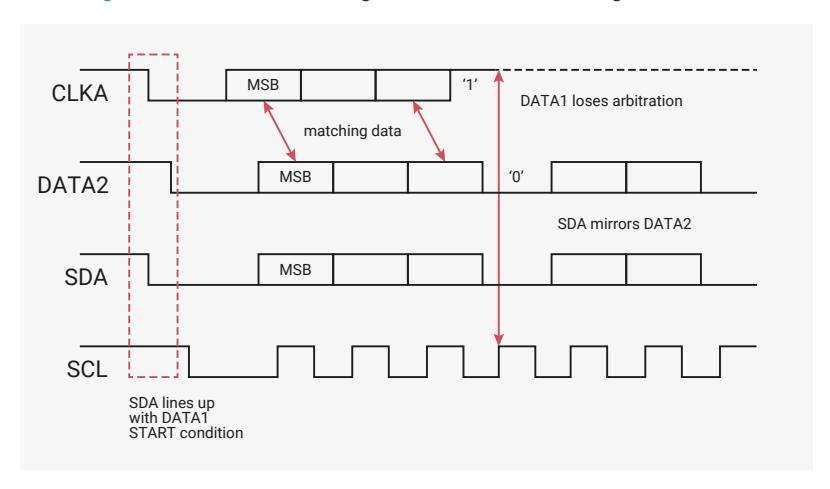
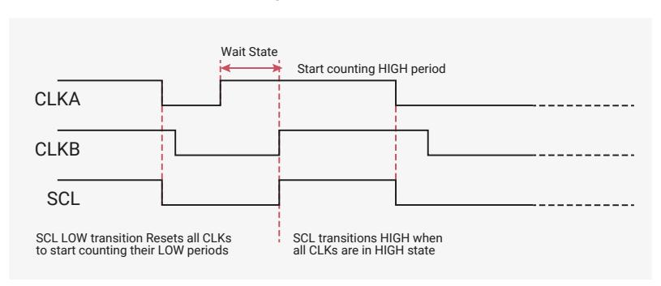

# 12.2.8 Multiple Master Arbitration

The DW\_apb\_i2c bus protocol allows multiple masters to reside on the same bus. If there are two masters on the same I2C bus, there is an arbitration procedure if both try to take control of the bus at the same time by generating a START condition at the same time. Once a master (for example, a microcontroller) has control of the bus, no other master can take control until the first master sends a STOP condition and places the bus in an idle state.

Arbitration takes place on the SDA line, while the SCL line is set to 1. The master, which transmits a one while the other master transmits zero, loses arbitration and turns off its data output stage. The master that lost arbitration can continue to generate clocks until the end of the byte transfer. If both masters address the same slave device, the arbitration could go into the data phase.

Upon detecting that it has lost arbitration to another master, the DW\_apb\_i2c stops generating SCL by disabling the output driver. [Figure 84](#page-992-3) illustrates the timing of two masters arbitrating on the bus.

*Figure 84. Multiple Master Arbitration*

Control of the bus is determined by address or master code and data sent by competing masters, so there is no central master nor any order of priority on the bus.

Arbitration is not allowed between the following conditions:

- A RESTART condition and a data bit
- A STOP condition and a data bit
- A RESTART condition and a STOP condition

Slaves do not participate in the arbitration process.

## **12.2.9. Clock Synchronization**

When two or more masters try to transfer information on the bus at the same time, they must arbitrate and synchronize the SCL clock. All masters generate their own clock to transfer messages. Data is valid only during the high period of SCL

clock. Clock synchronization is performed using the wired-AND connection to the SCL signal. When the master transitions the SCL clock to zero, the master starts counting the low time of the SCL clock and transitions the SCL clock signal to one at the beginning of the next clock period. However, if another master is holding the SCL line to 0, then the master goes into a HIGH wait state until the SCL clock line transitions to one.

All masters then count off their high time, and the master with the shortest high time transitions the SCL line to zero. The masters then count out their low time and the one with the longest low time forces the other masters into a HIGH wait state. Therefore, a synchronized SCL clock is generated, which is illustrated in [Figure 85](#page-993-1). Optionally, slaves may hold the SCL line low to slow down the timing on the I2C bus.

*Figure 85. Multi-Master Clock Synchronization*

