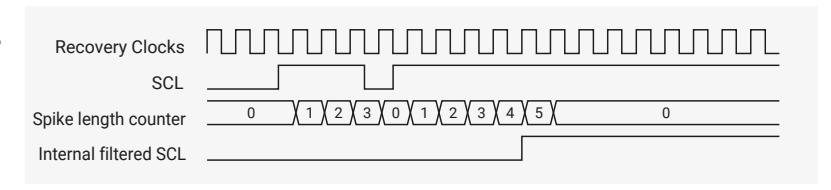

# 12.2.10 Operation Modes

This section provides information about operation modes.

Only set the DW\_apb\_i2c to operate as an I2C Master *or* an I2C Slave. Never set the DW\_apb\_i2c to operate as both simultaneously. To avoid this, never simultaneously set [IC\\_CON.](#page-1007-0)IC\_SLAVE\_DISABLE and [IC\\_CON.](#page-1007-0)MASTER\_MODE to zero and one, respectively.

#### **12.2.10.1. Slave Mode Operation**

This section discusses slave mode procedures.

#### **12.2.10.1.1. Initial Configuration**

To use the DW\_apb\_i2c as a slave, perform the following steps:

- 1. Disable the DW\_apb\_i2c by writing a 0 to [IC\\_ENABLE.](#page-1028-0)ENABLE.
- 2. Write to the [IC\\_SAR](#page-1010-0) register (bits 9:0) to set the slave address. This is the address to which the DW\_apb\_i2c responds.
- 3. Write to the [IC\\_CON](#page-1007-0) register to specify which type of addressing is supported (7-bit or 10-bit by setting bit 3). Enable the DW\_apb\_i2c in slave-only mode by writing a 0 into bit six [\(IC\\_CON.](#page-1007-0)IC\_SLAVE\_DISABLE) and a 0 to bit zero ([IC\\_CON](#page-1007-0).MASTER\_MODE).

# **NOTE**

Slaves and masters can use different addressing settings. For instance, a slave can be programmed with 7-bit addressing and a master with 10-bit addressing, and vice versa.

4. Enable the DW\_apb\_i2c by writing a 1 to [IC\\_ENABLE](#page-1028-0).ENABLE.

# **NOTE**

Depending on the reset values chosen, steps two and three may not be necessary because the reset values can be configured. For instance, if the device is only going to be a master, there would be no need to set the slave address because you can configure DW\_apb\_i2c to have the slave disabled after reset and to enable the master after reset. The values stored are static and do not need to be reprogrammed if the DW\_apb\_i2c is disabled.

#### **WARNING**

Only bring the DW\_apb\_i2c Slave out of reset when the I2C bus is IDLE. De-asserting the reset when a transfer is ongoing on the bus causes internal synchronization flip-flops used to synchronize SDA and SCL to toggle from a reset value of one to the actual value on the bus. This can result in SDA toggling from one to zero while SCL is one, thereby causing a false START condition to be detected by the DW\_apb\_i2c Slave. This scenario can also be avoided by configuring the DW\_apb\_i2c with IC\_SLAVE\_DISABLE = 1 and MASTER\_MODE = 1 so that the Slave interface is disabled after reset. It can then be enabled by programming [IC\\_CON\0] = 0 and [IC\\_CON\6] = 0 after the internal SDA and SCL have synchronized to the value on the bus; this takes approximately six ic\_clk cycles after reset de-assertion.

#### **12.2.10.1.2. Slave-Transmitter Operation for a Single Byte**

When another I2C master device on the bus addresses the DW\_apb\_i2c and requests data, the DW\_apb\_i2c acts as a slavetransmitter. The following steps occur:

- 1. The other I2C master device initiates an I2C transfer with an address that matches the slave address in the [IC\\_SAR](#page-1010-0) register of the DW\_apb\_i2c.
- 2. The DW\_apb\_i2c acknowledges the sent address and recognizes the direction of the transfer to indicate that it is acting as a slave-transmitter.
- 3. The DW\_apb\_i2c asserts the RD\_REQ interrupt (bit five of the [IC\\_RAW\\_INTR\\_STAT](#page-1020-0) register) and holds the SCL line low. It remains in a wait state until software responds. If the RD\_REQ interrupt has been masked, due to [IC\\_INTR\\_MASK](#page-1017-0).M\_RD\_REQ being set to zero, use a hardware and/or software timing routine to instruct the CPU to perform periodic reads of the [IC\\_RAW\\_INTR\\_STAT](#page-1020-0) register.
  - Reads that indicate [IC\\_RAW\\_INTR\\_STAT.](#page-1020-0)RD\_REQ being set to one must be treated as the equivalent of the RD\_REQ interrupt being asserted.
  - Software must then act to satisfy the I2C transfer.
  - The timing interval used should be in the order of 10 times the fastest SCL clock period the DW\_apb\_i2c can handle. For example, for 400 kb/s, the timing interval is 25μs.

#### **NOTE**

The value of 10 is recommended here because this is approximately the amount of time required for a single byte of data transferred on the I2C bus.

4. If there is any data remaining in the TX FIFO before receiving the read request, the DW\_apb\_i2c asserts a TX\_ABRT interrupt (bit six of the [IC\\_RAW\\_INTR\\_STAT](#page-1020-0) register) to flush the old data from the TX FIFO. If the TX\_ABRT interrupt has been masked, due to [IC\\_INTR\\_MASK](#page-1017-0).M\_TX\_ABRT being set to zero, re-use the timing routine described in the previous step to read the [IC\\_RAW\\_INTR\\_STAT](#page-1020-0) register.

# **NOTE**

Because the DW\_apb\_i2c's TX FIFO is forced into a flushed/reset state whenever a TX\_ABRT event occurs, software must release the DW\_apb\_i2c from this state by reading the [IC\\_CLR\\_TX\\_ABRT](#page-1026-0) register before attempting to write into the TX FIFO. See register [IC\\_RAW\\_INTR\\_STAT](#page-1020-0) for more details.

- Reads that indicate bit six (R\_TX\_ABRT) being set to one must be treated as the equivalent of the TX\_ABRT interrupt being asserted.
- There is no further action required from software.
- The timing interval used should be similar to that described in the previous step for the [IC\\_RAW\\_INTR\\_STAT](#page-1020-0).RD\_REQ register.
- 5. Software writes to the [IC\\_DATA\\_CMD](#page-1011-0) register with the data to be written (by writing a 0 in bit 8).
- 6. Software must clear the RD\_REQ and TX\_ABRT interrupts (bits five and six, respectively) of the [IC\\_RAW\\_INTR\\_STAT](#page-1020-0) register before proceeding. If the RD\_REQ or TX\_ABRT interrupts have been masked, then clearing of the [IC\\_RAW\\_INTR\\_STAT](#page-1020-0) register will have already been performed when either the R\_RD\_REQ or R\_TX\_ABRT bit has been read as one.
- 7. The DW\_apb\_i2c releases the SCL and transmits the byte.
- 8. The master may hold the I2C bus by issuing a RESTART condition or release the bus by issuing a STOP condition.

# **NOTE**

Slave-Transmitter Operation for a single byte is not applicable in Ultra-Fast mode, since this mode does not support read transfers.

#### **12.2.10.1.3. Slave-Receiver Operation for a Single Byte**

When another I2C master device on the bus addresses the DW\_apb\_i2c and is sending data, the DW\_apb\_i2c acts as a slavereceiver and the following steps occur:

- 1. The other I2C master device initiates an I2C transfer with an address that matches the DW\_apb\_i2c's slave address in the [IC\\_SAR](#page-1010-0) register.
- 2. The DW\_apb\_i2c acknowledges the sent address and recognizes the direction of the transfer to indicate that the DW\_apb\_i2c is acting as a slave-receiver.
- 3. DW\_apb\_i2c receives the transmitted byte and places it in the receive buffer.

## **NOTE**

If the Rx (receive) FIFO is completely filled with data when a byte is pushed, then the DW\_apb\_i2c slave holds the I2C SCL line low until the Rx FIFO has some space, and then continues with the next read request.

- 4. DW\_apb\_i2c asserts the RX\_FULL interrupt [IC\\_RAW\\_INTR\\_STAT](#page-1020-0).RX\_FULL. If the RX\_FULL interrupt has been masked, due to setting [IC\\_INTR\\_MASK.](#page-1017-0)M\_RX\_FULL to zero or setting [IC\\_TX\\_TL](#page-1024-0) to a value larger than zero, you should implement a timing routine (described in [Section 12.2.10.1.2\)](#page-994-0) for periodic reads of the [IC\\_STATUS](#page-1029-0) register. This timing routine should treat reads of the [IC\\_STATUS](#page-1029-0) register, with bit 3 (RFNE) set at one as the equivalent of an RX\_FULL interrupt.
- 5. Software may read the byte from the [IC\\_DATA\\_CMD](#page-1011-0) register (bits 7:0).
- 6. The other master device may hold the I2C bus by issuing a RESTART condition, or release the bus by issuing a STOP condition.

#### **12.2.10.1.4. Slave-Transfer Operation For Bulk Transfers**

In the standard I2C protocol, all transactions are single byte transactions; the programmer responds to a remote master read request by writing one byte into the slave's TX FIFO. When a slave (slave-transmitter) receives a read request (RD\_REQ) from the remote master (master-receiver), at a minimum there should be at least one entry placed into the slave-transmitter's TX FIFO.

DW\_apb\_i2c handles more data in the TX FIFO. This enables subsequent read requests to take data without raising an interrupt. This eliminates latencies incurred between interrupts. This mode only occurs when DW\_apb\_i2c acts as a slavetransmitter. If the remote master acknowledges the data sent by the slave-transmitter and there is no data in the slave's TX FIFO, the DW\_apb\_i2c holds the I2C SCL line low while it raises the read request interrupt (RD\_REQ) and waits for a data write into the TX FIFO.

If the RD\_REQ interrupt is masked by setting [IC\\_INTR\\_STAT.](#page-1015-0)R\_RD\_REQ to zero, use a timing routine to activate periodic reads of the [IC\\_RAW\\_INTR\\_STAT](#page-1020-0) register. Reads of [IC\\_RAW\\_INTR\\_STAT](#page-1020-0) that return bit five (RD\_REQ) set to one must be treated as the equivalent of RD\_REQ. This timing routine is similar to that described in [Section 12.2.10.1.2.](#page-994-0)

The RD\_REQ interrupt is raised upon a read request. Always clear this interrupt when exiting the interrupt service handling routine (ISR). The ISR allows you to either write one byte or more than one byte into the TX FIFO. The master can request additional data at the end of a transmission by acknowledging the last byte. In this scenario, the slave must raise RD\_REQ again.

If you know in advance that the remote master requests a packet of n bytes, you can write n byte to the TX FIFO. Then, when another master addresses DW\_apb\_i2c and requests data, the remote master will receive a continuous stream of data. This happens because the DW\_apb\_i2c slave continues to send data to the remote master as long as the remote master acknowledges the data sent and there is data available in the TX FIFO. There is no need to hold the SCL line low or to issue RD\_REQ again.

If the remote master doesn't read all of the bytes from the TX FIFO, the DW\_apb\_i2c ignores the excess bytes with the following procedure:

- The DW\_apb\_i2c clears the TX FIFO.
- The DW\_apb\_i2c generates a transmit abort (TX\_ABRT) event.

At the time an ACK/NACK is expected, if a NACK is received, then the remote master has all the data it wants. At this time, a flag is raised within the slave's state machine to clear the leftover data in the TX FIFO. This flag is transferred to the processor bus clock domain where the FIFO exists and the contents of the TX FIFO is cleared at that time.

#### **12.2.10.2. Master Mode Operation**

This section discusses master mode procedures.

#### **12.2.10.2.1. Initial Configuration**

To use the DW\_apb\_i2c as a master, perform the following steps:

- 1. Disable the DW\_apb\_i2c by writing zero to [IC\\_ENABLE](#page-1028-0).ENABLE.
- 2. Write to the [IC\\_CON](#page-1007-0) register to set the maximum speed mode supported (bits 2:1) and the desired speed of the DW\_apb\_i2c master-initiated transfers, either 7-bit or 10-bit addressing (bit 4). Ensure that bit six (IC\_SLAVE\_DISABLE) is written with a 1 and bit zero (MASTER\_MODE) is written with a 1.

# **NOTE**

Slaves and masters can use different addressing settings. For instance, a slave can be programmed with 7-bit addressing and a master with 10-bit addressing, and vice versa.

- 3. Write the address of the I2C device to be addressed to bits 9:0 of the [IC\\_TAR](#page-1009-0) register. This register also determines whether the I2C will perform a General Call or a START BYTE command.
- 4. Enable the DW\_apb\_i2c by writing a one to [IC\\_ENABLE](#page-1028-0).ENABLE.
- 5. Write the transfer direction and the data to be sent to the [IC\\_DATA\\_CMD](#page-1011-0) register. This step generates the START condition and the address byte on the DW\_apb\_i2c. Once DW\_apb\_i2c is enabled and there is data in the TX FIFO, DW\_apb\_i2c starts reading the data.

#### **NOTE**

If you write to the [IC\\_DATA\\_CMD](#page-1011-0) register before enabling the DW\_apb\_i2c, the data and commands are lost: the buffers are kept cleared when DW\_apb\_i2c is disabled.

The values stored are static and do not need to be reprogrammed when the DW\_apb\_i2c is disabled *except for* transfer direction and data. As a result, you may not need to perform steps two, three, four, and five if you already configured the reset values.

#### **12.2.10.2.2. Master Transmit and Master Receive**

The DW\_apb\_i2c supports switching back and forth between reading and writing dynamically. To transmit data, write data to the lower byte of the I2C RX/TX Data Buffer and Command Register [\(IC\\_DATA\\_CMD\)](#page-1011-0). For I2C write operations, write zero to the CMD bit [8]. Subsequently, to issue a read command, write a one to the CMD bit and write don't care to the lower byte of the [IC\\_DATA\\_CMD](#page-1011-0) register. The DW\_apb\_i2c master continues to initiate transfers as long as there are commands present in the TX FIFO. If the TX FIFO becomes empty, the master performs one of the following actions based on the value of [IC\\_DATA\\_CMD](#page-1011-0):

- If set to one, it issues a STOP condition after completing the current transfer.
- If set to zero, it holds SCL low until next command is written to the TX FIFO.

For more details, refer to [Section 12.2.7.](#page-990-0)

#### **12.2.10.3. Disabling DW\_apb\_i2c**

The [IC\\_ENABLE\\_STATUS](#page-1039-0) register allows software to unambiguously determine when the I2C hardware has completely shut down.

# **NOTE**

Earlier versions of DW\_apb\_i2c required the programmer to monitor two registers: ([IC\\_STATUS](#page-1029-0) and [IC\\_RAW\\_INTR\\_STAT](#page-1020-0)). RP2350 only requires the programmer to monitor [IC\\_ENABLE\\_STATUS](#page-1039-0).

To shut down I2C hardware, write a zero to [IC\\_ENABLE](#page-1028-0).ENABLE. The DW\_apb\_i2c master can be disabled only if the command currently processing when the de-assertion occurs has the STOP bit set to one. If you attempt to disable the DW\_apb\_i2c master while processing a command without the STOP bit set, the DW\_apb\_i2c master continues to remain active, holding the SCL line low until a new command is received in the TX FIFO.

To relinquish the I2C bus and disable DW\_apb\_i2c while the DW\_apb\_i2c master is processing a command *without* the STOP bit set, issue an [ABORT](#page-998-1) [request](#page-998-1).

#### **12.2.10.3.1. Procedure**

- 1. Define a timer interval (ti2c\_poll) equal to the 10 times the signalling period for the highest I2C transfer speed used in the system and supported by DW\_apb\_i2c. For example, if the highest I2C transfer mode is 400 kb/s, ti2c\_poll is 25μs.
- 2. Define a maximum time-out parameter, MAX\_T\_POLL\_COUNT, such that if any repeated polling operation exceeds this maximum value, an error is reported.
- 3. Execute a blocking thread, process, or function that prevents any further I2C master transactions from starting from software, but allows any pending transfers to be completed.

# **NOTE**

This step can be ignored if DW\_apb\_i2c is programmed to operate as an I2C slave only.

- 1. The variable POLL\_COUNT is initialized to zero.
- 2. Set bit zero of the [IC\\_ENABLE](#page-1028-0) register to zero.
- 3. Read the [IC\\_ENABLE\\_STATUS](#page-1039-0) register and test the IC\_EN bit (bit 0). Increment POLL\_COUNT by one. If POLL\_COUNT >= MAX\_T\_POLL\_COUNT, exit with the relevant error code.
- 4. If [IC\\_ENABLE\\_STATUS](#page-1039-0)[0] is one, sleep for ti2c\_poll and proceed to the previous step. Otherwise, exit with a relevant success code.

#### **12.2.10.4. Aborting I2C Transfers**

The ABORT control bit of the [IC\\_ENABLE](#page-1028-0) register allows the software to relinquish the I2C bus before completing the issued transfer commands from the TX FIFO. In response to an ABORT request, the controller issues the STOP condition over the I2C bus, followed by a TX FIFO flush. Aborting the transfer is allowed only in master mode of operation.

#### **12.2.10.4.1. Procedure**

- 1. Stop filling the TX FIFO ([IC\\_DATA\\_CMD](#page-1011-0)) with new commands.
- 2. When operating in DMA mode, disable the transmit DMA by setting TDMAE to zero.
- 3. Set [IC\\_ENABLE.](#page-1028-0)ABORT to one.
- 4. Wait for the M\_TX\_ABRT interrupt.
- 5. Read the [IC\\_TX\\_ABRT\\_SOURCE](#page-1032-0) register to identify the source as ABRT\_USER\_ABRT.

#### **12.2.11. Spike Suppression**

The DW\_apb\_i2c contains programmable spike suppression logic that matches requirements imposed by the I2C Bus Specification for SS/FS modes. This logic is based on counters that monitor the input signals (SCL and SDA), checking if they remain stable for a predetermined amount of ic\_clk cycles before they are sampled internally. There is one separate counter for each signal (SCL and SDA). The number of ic\_clk cycles can be programmed by the user. The value should account for the frequency of ic\_clk and the relevant spike length specification. Each counter starts whenever its input signal changes value. Depending on the behaviour of the input signal, one of the following scenarios occurs:

- The input signal remains unchanged until the counter reaches its count limit value. When this happens, the counter resets and stops, and the internal version of the signal updates to the input value.
- The input signal changes again before the counter reaches its count limit value. When this happens, the counter resets and stops, but the internal version of the signal does not update.

The timing diagram in [Figure 86](#page-999-2) illustrates the behaviour described above.

*Figure 86. Spike Suppression Example*

# **NOTE**

There is a 2-stage synchronizer on the SCL input. For the sake of simplicity, this synchronization delay was not included in the timing diagram in [Figure 86.](#page-999-2)

The I2C Bus Specification calls for different maximum spike lengths according to the operating mode (50 ns for SS and FS). Register [IC\\_FS\\_SPKLEN](#page-1041-0) holds the maximum spike length for SS and FS modes.

This register is 8 bits wide and accessible through the APB interface for reads and writes. However, you can only write to this register when the DW\_apb\_i2c is disabled. The minimum value that can be programmed into these registers is one; attempting to program a value smaller than one results in the value one being written.

The default value for these registers is based on the value of 100 ns for ic\_clk period, so should be updated for the clk\_sys period in use on RP2350.

# **NOTE**

- Because the minimum value that can be programmed into the [IC\\_FS\\_SPKLEN](#page-1041-0) register is one, the spike length specification can be exceeded for low frequencies of ic\_clk. Consider the simple example of a 10 MHz (100 ns period) ic\_clk; in this case, the minimum spike length that can be programmed is 100 ns, which means that spikes up to this length are suppressed.
- Standard synchronization logic (two flip-flops in series) is implemented upstream of the spike suppression logic and is not affected in any way by the contents of the spike length registers or the operation of the spike suppression logic; the two operations (synchronization and spike suppression) are completely independent. Because the SCL and SDA inputs are asynchronous to ic\_clk, there is one ic\_clk cycle uncertainty in the sampling of these signals. Depending on when they occur relative to the rising edge of ic\_clk, spikes of the same original length might show a difference of one ic\_clk cycle after being sampled.
- Spike suppression is symmetrical; the behaviour is exactly the same for transitions from zero to one and from one to zero.

