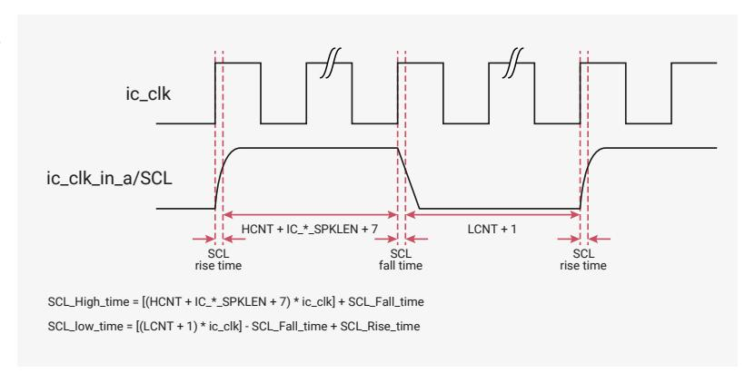

# 12.2.14 IC\_CLK Frequency Configuration

When the DW\_apb\_i2c is configured as a Standard (SS), Fast (FS), or Fast-Mode Plus (FM+), the \*CNT registers must be set before any I2C bus transaction can take place in order to ensure proper I/O timing. The \*CNT registers are:

- [IC\\_SS\\_SCL\\_HCNT](#page-1013-0)
- [IC\\_SS\\_SCL\\_LCNT](#page-1013-1)
- [IC\\_FS\\_SCL\\_HCNT](#page-1014-1)
- [IC\\_FS\\_SCL\\_LCNT](#page-1014-0)

#### **NOTE**

The tBUF timing and setup/hold time of START, STOP and RESTART registers uses \*HCNT/\*LCNT register settings for the corresponding speed mode.

# **NOTE**

It is not necessary to program any of the \*CNT registers if the DW\_apb\_i2c is enabled to operate only as an I2C slave, since these registers are used only to determine the SCL timing requirements for operation as an I2C master.

[Table 1051](#page-1001-0) lists the derivation of I2C timing parameters from the \*CNT programming registers.

*Table 1051. Derivation of I2C Timing Parameters from \*CNT Registers*

| Timing Parameter                                         | Symbol  | Standard Speed | Fast Speed / Fast Speed Plus |
|----------------------------------------------------------|---------|----------------|------------------------------|
| LOW period of the SCL clock                              | tLOW    | IC_SS_SCL_LCNT | IC_FS_SCL_LCNT               |
| HIGH period of the SCL clock                             | tHIGH   | IC_SS_SCL_HCNT | IC_FS_SCL_HCNT               |
| Setup time for a repeated START condition             | tSU;STA | IC_SS_SCL_LCNT | IC_FS_SCL_HCNT               |
| Hold time (repeated) START condition                  | tHD;STA | IC_SS_SCL_HCNT | IC_FS_SCL_HCNT               |
| Setup time for STOP condition                         | tSU;STO | IC_SS_SCL_HCNT | IC_FS_SCL_HCNT               |
| Bus free time between a STOP and a START condition | tBUF    | IC_SS_SCL_LCNT | IC_FS_SCL_LCNT               |
| Spike length                                             | tSP     | IC_FS_SPKLEN   | IC_FS_SPKLEN                 |
| Data hold time                                           | tHD;DAT | IC_SDA_HOLD    | IC_SDA_HOLD                  |
| Data setup time                                          | tSU;DAT | IC_SDA_SETUP   | IC_SDA_SETUP                 |

#### **12.2.14.1. Minimum High and Low Counts in SS, FS, and FM+ Modes.**

When the DW\_apb\_i2c operates as an I2C master, in both transmit and receive transfers:

- [IC\\_SS\\_SCL\\_LCNT](#page-1013-1) and [IC\\_FS\\_SCL\\_LCNT](#page-1014-0) register values must be larger than [IC\\_FS\\_SPKLEN](#page-1041-0) + 7.
- [IC\\_SS\\_SCL\\_HCNT](#page-1013-0) and [IC\\_FS\\_SCL\\_HCNT](#page-1014-1) register values must be larger than [IC\\_FS\\_SPKLEN](#page-1041-0) + 5.

Details regarding the DW\_apb\_i2c high and low counts are as follows:

- The minimum value of IC\_\*\_SPKLEN + 7 for the \*\_LCNT registers is due to the time required for the DW\_apb\_i2c to drive SDA after a negative edge of SCL.
- The minimum value of IC\_\*\_SPKLEN + 5 for the \*\_HCNT registers is due to the time required for the DW\_apb\_i2c to sample SDA during the high period of SCL.
- The DW\_apb\_i2c adds one cycle to the programmed \*\_LCNT value in order to generate the low period of the SCL clock; this is due to the counting logic for SCL low counting to (\*\_LCNT + 1).
- The DW\_apb\_i2c adds IC\_\*\_SPKLEN + 7 cycles to the programmed \*\_HCNT value in order to generate the high period of the SCL clock, due to the following factors:
  - The counting logic for SCL high counts to (\*\_HCNT + 1).
  - The digital filtering applied to the SCL line incurs a delay of SPKLEN + 2 ic\_clk cycles, where SPKLEN is [IC\\_FS\\_SPKLEN](#page-1041-0) if the component is operating in SS or FS.
  - Whenever SCL is driven one to zero by the DW\_apb\_i2c (completing the SCL high time) an internal logic latency of three ic\_clk cycles is incurred. Consequently, the minimum SCL low time of which the DW\_apb\_i2c is capable is nine ic\_clk periods (7 + 1 + 1), while the minimum SCL high time is thirteen ic\_clk periods (6 + 1 + 3 + 3).

# **NOTE**

The total high time and low time of SCL generated by the DW\_apb\_i2c master is also influenced by the rise time and fall time of the SCL line, as shown in the illustration and equations in [Figure 89](#page-1002-1). SCL rise and fall time parameters vary depending on external factors such as:

- Characteristics of the IO driver
- Pull-up resistor value
- Total capacitance on SCL line

These characteristics are beyond the control of the DW\_apb\_i2c.

*Figure 89. Impact of* SCL *Rise Time and Fall Time on Generated*

