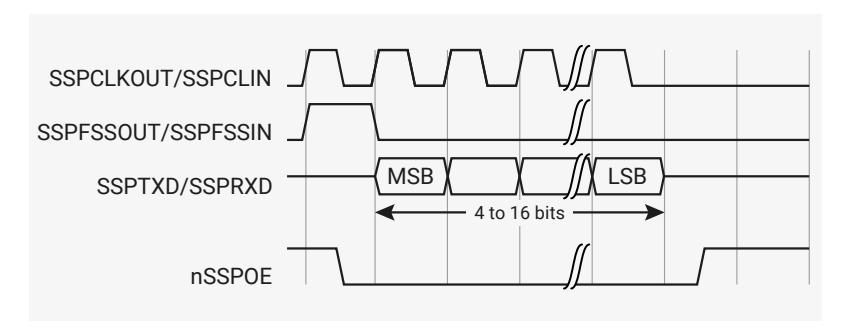
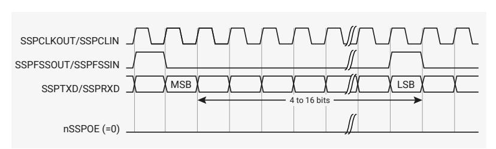

# 12.3.4 Operation

#### **12.3.4.1. Interface reset**

The PrimeCell SSP is reset by the global reset signal, PRESETn, and a block-specific reset signal, nSSPRST. The device reset controller asserts nSSPRST asynchronously and negates it synchronously to SSPCLK.

#### **12.3.4.2. Configuring the SSP**

Following reset, the PrimeCell SSP logic is disabled and must be configured when in this state. It is necessary to program control registers SSPCR0 and SSPCR1 to configure the peripheral as a master or slave operating under one of the following protocols:

- Motorola SPI
- Texas Instruments SSI
- National Semiconductor

The bit rate, derived from the external SSPCLK, requires the programming of the clock prescale register SSPCPSR.

#### **12.3.4.3. Enable PrimeCell SSP operation**

You can either prime the transmit FIFO, by writing up to eight 16-bit values when the PrimeCell SSP is disabled, or permit the transmit FIFO service request to interrupt the CPU. Once enabled, transmission or reception of data begins on the transmit, SSPTXD, and receive, SSPRXD, pins.

#### **12.3.4.4. Clock ratios**

There is a constraint on the ratio of the frequencies of PCLK to SSPCLK. The frequency of SSPCLK must be less than or equal to that of PCLK. This ensures that control signals from the SSPCLK domain to the PCLK domain are guaranteed to get synchronized before one frame duration:

$$F_{SSPCLK} < = F_{PCLK}$$

In the slave mode of operation, the SSPCLKIN signal from the external master is double-synchronized and then delayed to detect an edge. It takes three SSPCLKs to detect an edge on SSPCLKIN. SSPTXD has less setup time to the falling edge of SSPCLKIN on which the master is sampling the line.

The setup and hold times on SSPRXD, with reference to SSPCLKIN, must be more conservative to ensure that it is at the right value when the actual sampling occurs within the SSPMS. To ensure correct device operation, SSPCLK must be at least 12 times faster than the maximum expected frequency of SSPCLKIN.

The frequency selected for SSPCLK must accommodate the desired range of bit clock rates. The ratio of minimum SSPCLK frequency to SSPCLKOUT maximum frequency in the case of the slave mode is 12, and for the master mode, it is two.

For example, at the maximum SSPCLK (clk\_peri) frequency on RP2350 of 150MHz, the maximum peak bit rate in master mode is 70.5Mb/s. This is achieved with the SSPCPSR register programmed with a value of 2, and the SCR[7:0] field in the SSPCR0 register programmed with a value of 0.

In slave mode, the same maximum SSPCLK frequency of 150MHz can achieve a peak bit rate of 150 / 12 = 12.5Mb/s. The SSPCPSR register can be programmed with a value of 12, and the SCR[7:0] field in the SSPCR0 register can be programmed with a value of 0. Similarly, the ratio of SSPCLK maximum frequency to SSPCLKOUT minimum frequency is 254 × 256.

The minimum frequency of SSPCLK is governed by the following inequalities, both of which must be satisfied:

, for master mode

, for slave mode.

The maximum frequency of SSPCLK is governed by the following inequalities, both of which must be satisfied:

, for master mode

, for slave mode.

#### **12.3.4.5. Programming the SSPCR0 Control Register**

The SSPCR0 register is used to:

- program the serial clock rate
- select one of the three protocols
- select the data word size, where applicable.

The Serial Clock Rate (SCR) value, in conjunction with the SSPCPSR clock prescale divisor value, CPSDVSR, is used to derive the PrimeCell SSP transmit and receive bit rate from the external SSPCLK.

The frame format is programmed through the FRF bits, and the data word size through the DSS bits.

Bit phase and polarity, applicable to Motorola SPI format only, are programmed through the SPH and SPO bits.

#### **12.3.4.6. Programming the SSPCR1 Control Register**

The SSPCR1 register is used to:

- select master or slave mode
- enable a loop back test feature
- enable the PrimeCell SSP peripheral.

To configure the PrimeCell SSP as a master, clear the SSPCR1 register master or slave selection bit, MS, to 0. This is the default value on reset.

Setting the SSPCR1 register MS bit to 1 configures the PrimeCell SSP as a slave. When configured as a slave, use the SSPCR1 slave mode SSPTXD output disable bit (SOD) to enable or disable of the PrimeCell SSP SSPTXD signal. You can use this in some multi-slave environments where masters might parallel broadcast.

To enable the PrimeCell SSP, set the Synchronous Serial Port Enable (SSE) bit to 1.

#### **12.3.4.6.1. Bit rate generation**

The serial bit rate is derived by dividing down the input clock, SSPCLK. The clock is first divided by an even prescale value CPSDVSR in the range 2-254, and is programmed in SSPCPSR. The clock is divided again by a value in the range 1-256, that is 1 + SCR, where SCR is the value programmed in SSPCR0.

The following equation defines the frequency of the output signal bit clock, SSPCLKOUT:

$$F_{SSPCLKOUT} = \frac{F_{SSPCLK}}{CPSDVSR \times (1 + SCR)}$$

For example, if SSPCLK is 125MHz, and CPSDVSR = 2, then SSPCLKOUT has a frequency range from 244kHz - 62.5MHz.

#### **12.3.4.7. Frame format**

Each data frame is between 4-16 bits long, depending on the size of data programmed, and is transmitted starting with the MSB. You can select the following basic frame types:

- Texas Instruments synchronous serial
- Motorola SPI
- National Semiconductor Microwire.

For all formats, the serial clock, SSPCLKOUT, is held inactive while the PrimeCell SSP is idle, and transitions at the programmed frequency only during active transmission or reception of data. The idle state of SSPCLKOUT is utilized to provide a receive timeout indication that occurs when the receive FIFO still contains data after a timeout period.

For Motorola SPI and National Semiconductor Microwire frame formats, the serial frame, SSPFSSOUT, pin is active-LOW, and is asserted, pulled-down, during the entire transmission of the frame.

For Texas Instruments synchronous serial frame format, the SSPFSSOUT pin is pulsed for one serial clock period, starting at its rising edge, prior to the transmission of each frame. For this frame format, both the PrimeCell SSP and the off-chip slave device drive their output data on the rising edge of SSPCLKOUT, and latch data from the other device on the falling edge.

Unlike the full-duplex transmission of the other two frame formats, the National Semiconductor Microwire format uses a special master-slave messaging technique that operates at half-duplex. In this mode, when a frame begins, an 8-bit control message is transmitted to the off-chip slave. During this transmit, the SSS receives no incoming data. After the message has been sent, the off-chip slave decodes it and, after waiting one serial clock after the last bit of the 8-bit control message has been sent, responds with the requested data. The returned data can be 4-16 bits in length, making the total frame length in the range 13-25 bits.

#### **12.3.4.8. Texas Instruments synchronous serial frame format**

[Figure 91](#page-1049-0) shows the Texas Instruments synchronous serial frame format for a single transmitted frame.

*Figure 91. Texas Instruments synchronous serial frame format, single transfer*

In this mode, SSPCLKOUT and SSPFSSOUT are forced LOW, and the transmit data line, SSPTXD is tristated whenever the PrimeCell SSP is idle. When the bottom entry of the transmit FIFO contains data, SSPFSSOUT is pulsed HIGH for one SSPCLKOUT period. The value to be transmitted is also transferred from the transmit FIFO to the serial shift register of the transmit logic. On the next rising edge of SSPCLKOUT, the MSB of the 4-bit to 16-bit data frame is shifted out on the SSPTXD pin. In a similar way, the MSB of the received data is shifted onto the SSPRXD pin by the off-chip serial slave device.

Both the PrimeCell SSP and the off-chip serial slave device then clock each data bit into their serial shifter on the falling edge of each SSPCLKOUT. The received data is transferred from the serial shifter to the receive FIFO on the first rising edge of PCLK after the LSB has been latched.

[Figure 92](#page-1049-1) shows the Texas Instruments synchronous serial frame format when back-to-back frames are transmitted.

*Figure 92. Texas Instruments synchronous serial frame format, continuous transfer*

#### **12.3.4.9. Motorola SPI frame format**

The Motorola SPI interface is a four-wire interface where the SSPFSSOUT signal behaves as a slave select. The main feature of the Motorola SPI format is that you can program the inactive state and phase of the SSPCLKOUT signal using the SPO and SPH bits of the SSPSCR0 control register.

#### **12.3.4.9.1. SPO, clock polarity**

When the SPO clock polarity control bit is LOW, it produces a steady state LOW value on the SSPCLKOUT pin. If the SPO clock polarity control bit is HIGH, a steady state HIGH value is placed on the SSPCLKOUT pin when data is not being transferred.

#### **12.3.4.9.2. SPH, clock phase**

The SPH control bit selects the clock edge that captures data and enables it to change state. It has the most impact on the first bit transmitted by either permitting or not permitting a clock transition before the first data capture edge.

When the SPH phase control bit is LOW, data is captured on the first clock edge transition.

When the SPH clock phase control bit is HIGH, data is captured on the second clock edge transition.

