# 12.3.4.10 Motorola SPI Format with SPO=0, SPH=0

[Figure 93](#page-1050-0) and [Figure 94](#page-1050-1) shows a continuous transmission signal sequence for Motorola SPI frame format with SPO=0, SPH=0. [Figure 93](#page-1050-0) shows a single transmission signal sequence for Motorola SPI frame format with SPO=0, SPH=0.

*Figure 93. Motorola SPI frame format, single transfer, with SPO=0 and SPH=0*

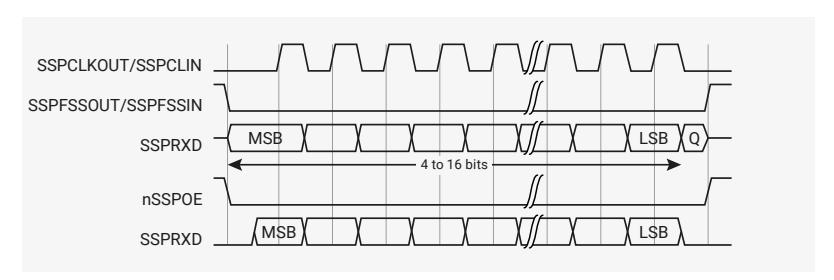

[Figure 94](#page-1050-1) shows a continuous transmission signal sequence for Motorola SPI frame format with SPO=0, SPH=0.

*Figure 94. Motorola SPI frame format, single transfer, with SPO=0 and SPH=0*

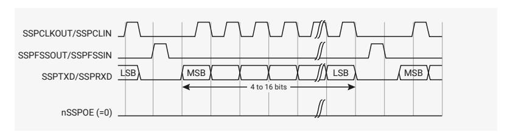

In this configuration, during idle periods:

- the SSPCLKOUT signal is forced LOW
- the SSPFSSOUT signal is forced HIGH
- the transmit data line SSPTXD is arbitrarily forced LOW
- the nSSPOE pad enable signal is forced HIGH (this is not connected to the pad in RP2350)
- when the PrimeCell SSP is configured as a master, the nSSPCTLOE line is driven LOW, enabling the SSPCLKOUT pad, active-LOW enable
- when the PrimeCell SSP is configured as a slave, the nSSPCTLOE line is driven HIGH, disabling the SSPCLKOUT pad, active-LOW enable

If the PrimeCell SSP is enable, and there is valid data within the transmit FIFO, the start of transmission is signified by the SSPFSSOUT master signal being driven LOW. This causes slave data to be enabled onto the SSPRXD input line of the master. The nSSPOE line is driven LOW, enabling the master SSPTXD output pad.

One-half SSPCLKOUT period later, valid master data is transferred to the SSPTXD pin. Now that both the master and slave data have been set, the SSPCLKOUT master clock pin goes HIGH after one additional half SSPCLKOUT period.

The data is now captured on the rising and propagated on the falling edges of the SSPCLKOUT signal.

In the case of a single word transmission, after all bits of the data word have been transferred, the SSPFSSOUT line is returned to its idle HIGH state one SSPCLKOUT period after the last bit has been captured.

However, in the case of continuous back-to-back transmissions, the SSPFSSOUT signal pulse HIGH between each data word transfer. This is because the slave select pin freezes the data in its serial peripheral register and does not permit it to be altered if the SPH bit is logic zero. Therefore, the master device must raise the SSPFSSIN pin of the slave device between each data transfer to enable the serial peripheral data write. On completion of the continuous transfer, the SSPFSSOUT pin is returned to its idle state one SSPCLKOUT period after the last bit has been captured.

#### **12.3.4.11. Motorola SPI Format with SPO=0, SPH=1**

[Figure 95](#page-1051-0) shows the transfer signal sequence for Motorola SPI format with SPO=0, SPH=1, and it covers both single and continuous transfers.

*Figure 95. Motorola SPI frame format with SPO=0 and SPH=1, single and continuous transfers*

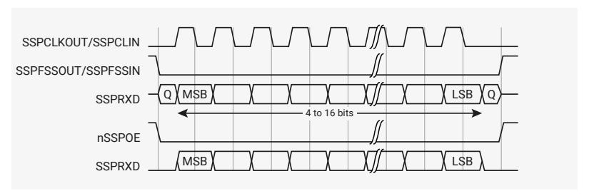

In this configuration, during idle periods:

- the SSPCLKOUT signal is forced LOW
- The SSPFSSOUT signal is forced HIGH
- the transmit data line SSPTXD is arbitrarily forced LOW
- the nSSPOE pad enable signal is forced HIGH (not connected to the pad in RP2350)
- when the PrimeCell SSP is configured as a master, the nSSPCTLOE line is driven LOW, enabling the SSPCLKOUT pad, active-LOW enable
- when the PrimeCell SSP is configured as a slave, the nSSPCTLOE line is driven HIGH, disabling the SSPCLKOUT pad, active-LOW enable

If the PrimeCell SSP is enabled, and there is valid data within the transmit FIFO, the start of transmission is signified by the SSPFSSOUT master signal being driven LOW. The nSSPOE line is driven LOW, enabling the master SSPTXD output pad. After an additional one half SSPCLKOUT period, both master and slave valid data is enabled onto their respective transmission lines. At the same time, the SSPCLKOUT is enabled with a rising edge transition.

Data is then captured on the falling edges and propagated on the rising edges of the SSPCLKOUT signal.

In the case of a single word transfer, after all bits have been transferred, the SSPFSSOUT line is returned to its idle HIGH state one SSPCLKOUT period after the last bit has been captured. For continuous back-to-back transfers, the SSPFSSOUT pin is held LOW between successive data words and termination is the same as that of the single word transfer.

#### **12.3.4.12. Motorola SPI Format with SPO=1, SPH=0**

[Figure 96](#page-1052-0) and [Figure 97](#page-1052-1) show single and continuous transmission signal sequences for Motorola SPI format with SPO=1, SPH=0.

[Figure 96](#page-1052-0) shows a single transmission signal sequence for Motorola SPI format with SPO=1, SPH=0.

*Figure 96. Motorola SPI frame format, single transfer, with SPO=1 and SPH=0*

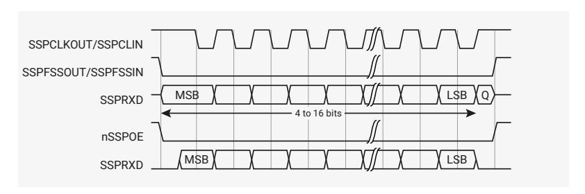

[Figure 97](#page-1052-1) shows a continuous transmission signal sequence for Motorola SPI format with SPO=1, SPH=0.

#### **NOTE**

In [Figure 96,](#page-1052-0) Q is an undefined signal.

*Figure 97. Motorola SPI frame format, continuous transfer, with SPO=1 and SPH=0*

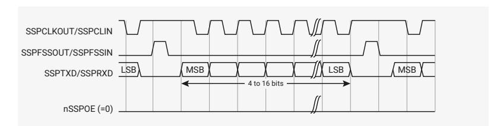

In this configuration, during idle periods:

- the SSPCLKOUT signal is forced HIGH
- the SSPFSSOUT signal is forced HIGH
- the transmit data line SSPTXD is arbitrarily forced LOW
- the nSSPOE pad enable signal is forced HIGH (not connected to the pad in RP2350)
- when the PrimeCell SSP is configured as a master, the nSSPCTLOE line is driven LOW, enabling the SSPCLKOUT pad, active-LOW enable
- when the PrimeCell SSP is configured as a slave, the nSSPCTLOE line is driven HIGH, disabling the SSPCLKOUT pad, active-LOW enable

If the PrimeCell SSP is enabled, and there is valid data within the transmit FIFO, the start of transmission is signified by the SSPFSSOUT master signal being driven LOW, and this causes slave data to be immediately transferred onto the SSPRXD line of the master. The nSSPOE line is driven LOW, enabling the master SSPTXD output pad.

One half period later, valid master data is transferred to the SSPTXD line. Now that both the master and slave data have been set, the SSPCLKOUT master clock pin becomes LOW after one additional half SSPCLKOUT period. This means that data is captured on the falling edges and be propagated on the rising edges of the SSPCLKOUT signal.

In the case of a single word transmission, after all bits of the data word are transferred, the SSPFSSOUT line is returned to its idle HIGH state one SSPCLKOUT period after the last bit has been captured.

However, in the case of continuous back-to-back transmissions, the SSPFSSOUT signal must be pulsed HIGH between each data word transfer. This is because the slave select pin freezes the data in its serial peripheral register and does not permit it to be altered if the SPH bit is logic zero. Therefore, the master device must raise the SSPFSSIN pin of the slave device between each data transfer to enable the serial peripheral data write. On completion of the continuous transfer, the SSPFSSOUT pin is returned to its idle state one SSPCLKOUT period after the last bit has been captured.

#### **12.3.4.13. Motorola SPI Format with SPO=1, SPH=1**

[Figure 98](#page-1053-0) shows the transfer signal sequence for Motorola SPI format with SPO=1, SPH=1, and it covers both single and continuous transfers.

*Figure 98. Motorola SPI frame format with SPO=1 and SPH=1, single and continuous transfers*

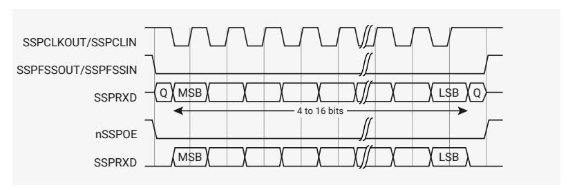

#### **NOTE**

In [Figure 98,](#page-1053-0) Q is an undefined signal.

In this configuration, during idle periods:

- the SSPCLKOUT signal is forced HIGH
- the SSPFSSOUT signal is forced HIGH
- the transmit data line SSPTXD is arbitrarily forced LOW
- the nSSPOE pad enable signal is forced HIGH (not connected to the pad in RP2350)
- when the PrimeCell SSP is configured as a master, the nSSPCTLOE line is driven LOW, enabling the SSPCLKOUT pad, active-LOW enable
- when the PrimeCell SSP is configured as a slave, the nSSPCTLOE line is driven HIGH, disabling the SSPCLKOUT pad, active-LOW enable.

If the PrimeCell SSP is enabled, and there is valid data within the transmit FIFO, the start of transmission is signified by the SSPFSSOUT master signal being driven LOW. The nSSPOE line is driven LOW, enabling the master SSPTXD output pad. After an additional one half SSPCLKOUT period, both master and slave data are enabled onto their respective transmission lines. At the same time, the SSPCLKOUT is enabled with a falling edge transition. Data is then captured on the rising edges and propagated on the falling edges of the SSPCLKOUT signal.

After all bits have been transferred, in the case of a single word transmission, the SSPFSSOUT line is returned to its idle HIGH state one SSPCLKOUT period after the last bit has been captured.

For continuous back-to-back transmissions, the SSPFSSOUT pin remains in its active-LOW state, until the final bit of the last word has been captured, and then returns to its idle state as the previous section describes.

For continuous back-to-back transfers, the SSPFSSOUT pin is held LOW between successive data words and termination is the same as that of the single word transfer.

#### **12.3.4.14. National Semiconductor Microwire frame format**

[Figure 99](#page-1054-0) shows the National Semiconductor Microwire frame format for a single frame. [Figure 100](#page-1054-1) shows the same format when back to back frames are transmitted.

*Figure 99. Microwire frame format, single transfer*

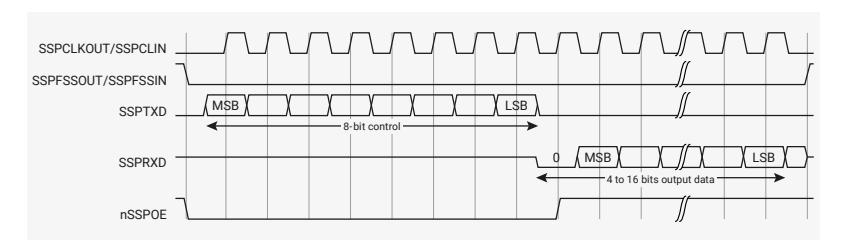

Microwire format is very similar to SPI format, except that transmission is half-duplex instead of full-duplex, using a master-slave message passing technique. Each serial transmission begins with an 8-bit control word that is transmitted from the PrimeCell SSP to the off-chip slave device. During this transmission, the PrimeCell SSP receives no incoming data. After the message has been sent, the off-chip slave decodes it and, after waiting one serial clock after the last bit of the 8-bit control message has been sent, responds with the required data. The returned data is 4 to 16 bits in length, making the total frame length in the range 13-25 bits.

In this configuration, during idle periods:

- SSPCLKOUT is forced LOW
- SSPFSSOUT is forced HIGH
- the transmit data line, SSPTXD, is arbitrarily forced LOW
- the nSSPOE pad enable signal is forced HIGH (not connected to the pad in RP2350)

A transmission is triggered by writing a control byte to the transmit FIFO. The falling edge of SSPFSSOUT causes the value contained in the bottom entry of the transmit FIFO to be transferred to the serial shift register of the transmit logic, and the MSB of the 8-bit control frame to be shifted out onto the SSPTXD pin. SSPFSSOUT remains LOW for the duration of the frame transmission. The SSPRXD pin remains tristated during this transmission.

The off-chip serial slave device latches each control bit into its serial shifter on the rising edge of each SSPCLKOUT. After the last bit is latched by the slave device, the control byte is decoded during a one clock wait-state, and the slave responds by transmitting data back to the PrimeCell SSP. Each bit is driven onto SSPRXD line on the falling edge of SSPCLKOUT. The PrimeCell SSP in turn latches each bit on the rising edge of SSPCLKOUT. At the end of the frame, for single transfers, the SSPFSSOUT signal is pulled HIGH one clock period after the last bit has been latched in the receive serial shifter, that causes the data to be transferred to the receive FIFO.

#### **NOTE**

The off-chip slave device can tristate the receive line either on the falling edge of SSPCLKOUT after the LSB has been latched by the receive shifter, or when the SSPFSSOUT pin goes HIGH.

For continuous transfers, data transmission begins and ends in the same manner as a single transfer. However, the SSPFSSOUT line is continuously asserted, held LOW, and transmission of data occurs back-to-back. The control byte of the next frame follows directly after the LSB of the received data from the current frame. Each of the received values is transferred from the receive shifter on the falling edge SSPCLKOUT, after the LSB of the frame has been latched into the PrimeCell SSP.

[Figure 100](#page-1054-1) shows the National Semiconductor Microwire frame format when back-to-back frames are transmitted.

*Figure 100. Microwire frame format, continuous transfers*

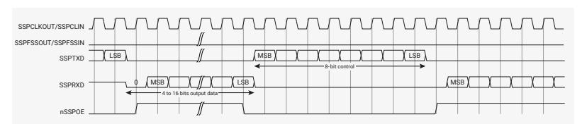

In Microwire mode, the PrimeCell SSP slave samples the first bit of receive data on the rising edge of SSPCLKIN after SSPFSSIN has gone LOW. Masters that drive a free-running SSPCKLIN must ensure that the SSPFSSIN signal has sufficient setup and hold margins with respect to the rising edge of SSPCLKIN.

[Figure 101](#page-1055-0) shows these setup and hold time requirements.

With respect to the SSPCLKIN rising edge on which the first bit of receive data is to be sampled by the PrimeCell SSP slave, SSPFSSIN must have a setup of at least two times the period of SSPCLK on which the PrimeCell SSP operates.

With respect to the SSPCLKIN rising edge previous to this edge, SSPFSSIN must have a hold of at least one SSPCLK period.

*Figure 101. Microwire frame format, SSPFSSIN input setup and hold requirements*

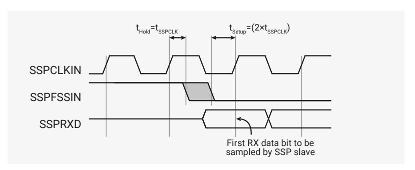

#### **12.3.4.15. Examples of master and slave configurations**

[Figure 102](#page-1055-1), [Figure 103,](#page-1056-1) and [Figure 104](#page-1056-2) shows how you can connect the PrimeCell SSP (PL022) peripheral to other synchronous serial peripherals, when it is configured as a master or a slave.

## **NOTE**

The SSP (PL022) does not support dynamic switching between master and slave in a system. Each instance is configured and connected either as a master or slave.

[Figure 102](#page-1055-1) shows the PrimeCell SSP (PL022) instanced twice, as a single master and one slave. The master can broadcast to the slave through the master SSPTXD line. In response, the slave drives its nSSPOE signal HIGH, enabling its SSPTXD data onto the SSPRXD line of the master.

*Figure 102. PrimeCell SSP master coupled to a PL022 slave*

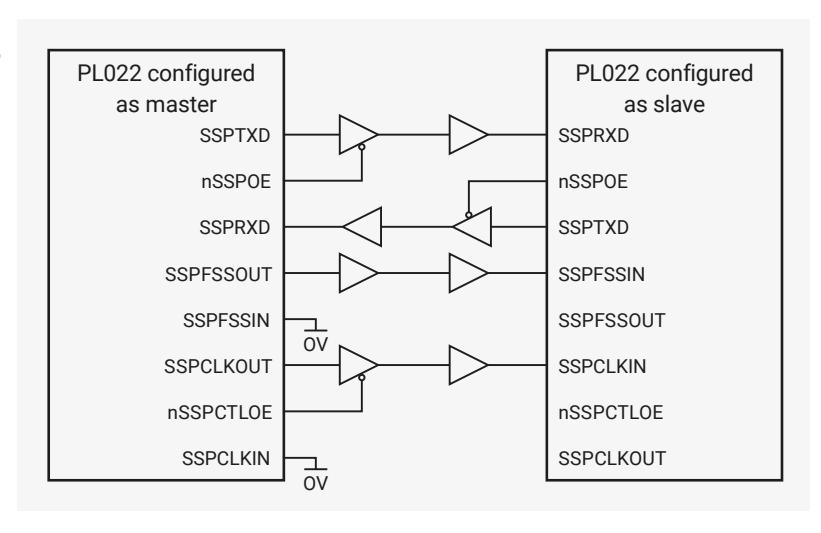

[Figure 103](#page-1056-1) shows how an PrimeCell SSP (PL022), configured as master, interfaces to a Motorola SPI slave. The SPI Slave Select (SS) signal is permanently tied LOW and configures it as a slave. Similar to the above operation, the master can broadcast to the slave through the master PrimeCell SSP SSPTXD line. In response, the slave drives its SPI MISO port onto the SSPRXD line of the master.

*Figure 103. PrimeCell SSP master coupled to an SPI slave*

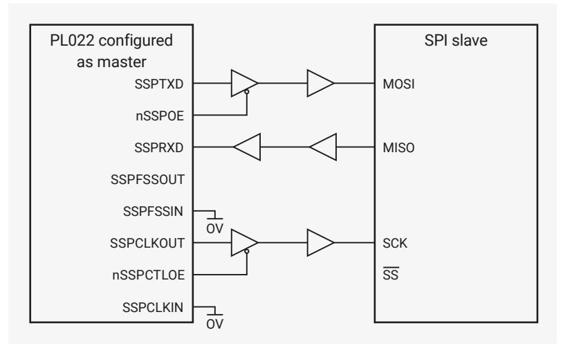

[Figure 104](#page-1056-2) shows a Motorola SPI configured as a master and interfaced to an instance of a PrimeCell SSP (PL022) configured as a slave. In this case, the slave Select Signal (SS) is permanently tied HIGH to configure it as a master. The master can broadcast to the slave through the master SPI MOSI line and in response, the slave drives its nSSPOE signal LOW. This enables its SSPTXD data onto the MISO line of the master.

*Figure 104. SPI master coupled to a PrimeCell SSP slave*

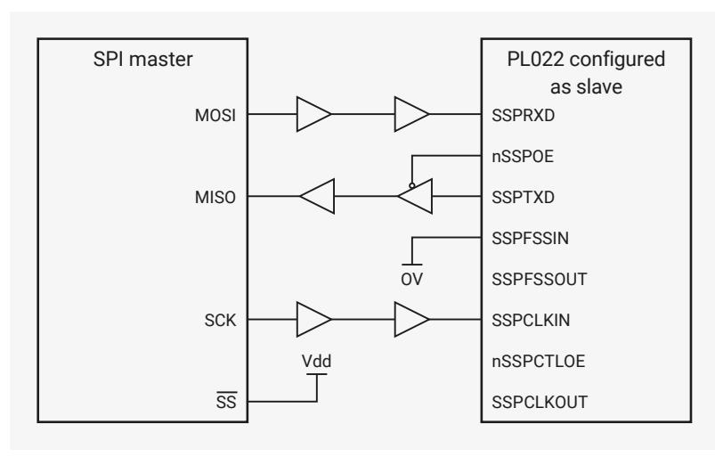

#### **12.3.4.16. PrimeCell DMA interface**

The PrimeCell SSP provides an interface to connect to the DMA controller. The PrimeCell SSP DMA control register, SSPDMACR controls the DMA operation of the PrimeCell SSP.

The DMA interface includes the following signals, for receive:

#### **SSPRXDMASREQ**

Single-character DMA transfer request, asserted by the SSP. This signal is asserted when the receive FIFO contains at least one character.

#### **SSPRXDMABREQ**

Burst DMA transfer request, asserted by the SSP. This signal is asserted when the receive FIFO contains four or more characters.

#### **SSPRXDMACLR**

DMA request clear, asserted by the DMA controller to clear the receive request signals. If DMA burst transfer is requested, the clear signal is asserted during the transfer of the last data in the burst.

The DMA interface includes the following signals, for transmit:

#### **SSPTXDMASREQ**

Single-character DMA transfer request, asserted by the SSP. This signal is asserted when there is at least one empty location in the transmit FIFO.

#### **SSPTXDMABREQ**

Burst DMA transfer request, asserted by the SSP. This signal is asserted when the transmit FIFO contains four characters or fewer.

#### **SSPTXDMACLR**

DMA request clear, asserted by the DMA controller, to clear the transmit request signals. If a DMA burst transfer is requested, the clear signal is asserted during the transfer of the last data in the burst.

The burst transfer and single transfer request signals are not mutually exclusive. They can both be asserted at the same time. For example, when there is more data than the watermark level of four in the receive FIFO, the burst transfer request, and the single transfer request, are asserted. When the amount of data left in the receive FIFO is less than the watermark level, the single request only is asserted. This is useful for situations where the number of characters left to be received in the stream is less than a burst.

For example, if 19 characters must be received, the DMA controller then transfers four bursts of four characters, and three single transfers to complete the stream.

For the remaining three characters, the PrimeCell SSP does not assert the burst request.

Each request signal remains asserted until the relevant DMA clear signal is asserted. After the request clear signal is deasserted, a request signal can become active again, depending on the conditions that previous sections describe. All request signals are de-asserted if the PrimeCell SSP is disabled, or the DMA enable signal is cleared.

[Table 1097](#page-1057-1) shows the trigger points for DMABREQ, for both the transmit and receive FIFOs.

*Table 1097. DMA trigger points for the transmit and receive FIFOs*

| Burst length    |                                     |                                     |  |
|-----------------|-------------------------------------|-------------------------------------|--|
| Watermark level | Transmit, number of empty locations | Receive, number of filled locations |  |
| 1/2             | 4                                   | 4                                   |  |

[Figure 105](#page-1057-2) shows the timing diagram for both a single transfer request, and a burst transfer request, with the appropriate DMA clear signal. The signals are all synchronous to PCLK.

*Figure 105. DMA transfer waveforms*

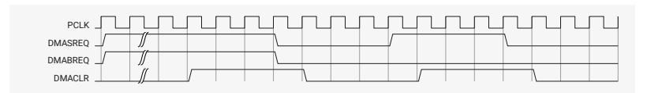

## **12.3.5. List of Registers**

The SPI0 and SPI1 registers start at base addresses of 0x40080000 and 0x40088000 respectively (defined as [SPI0\\_BASE](#page-31-1) and [SPI1\\_BASE](#page-31-1) in SDK).

*Table 1098. List of SPI registers*

| Offset | Name    | Info                                         |
|--------|---------|----------------------------------------------|
| 0x000  | SSPCR0  | Control register 0, SSPCR0 on page 3-4       |
| 0x004  | SSPCR1  | Control register 1, SSPCR1 on page 3-5       |
| 0x008  | SSPDR   | Data register, SSPDR on page 3-6             |
| 0x00c  | SSPSR   | Status register, SSPSR on page 3-7           |
| 0x010  | SSPCPSR | Clock prescale register, SSPCPSR on page 3-8 |

| Offset | Name         | Info                                                             |
|--------|--------------|------------------------------------------------------------------|
| 0x014  | SSPIMSC      | Interrupt mask set or clear register, SSPIMSC on page 3-9        |
| 0x018  | SSPRIS       | Raw interrupt status register, SSPRIS on page 3-10               |
| 0x01c  | SSPMIS       | Masked interrupt status register, SSPMIS on page 3-11            |
| 0x020  | SSPICR       | Interrupt clear register, SSPICR on page 3-11                    |
| 0x024  | SSPDMACR     | DMA control register, SSPDMACR on page 3-12                      |
| 0xfe0  | SSPPERIPHID0 | Peripheral identification registers, SSPPeriphID0-3 on page 3-13 |
| 0xfe4  | SSPPERIPHID1 | Peripheral identification registers, SSPPeriphID0-3 on page 3-13 |
| 0xfe8  | SSPPERIPHID2 | Peripheral identification registers, SSPPeriphID0-3 on page 3-13 |
| 0xfec  | SSPPERIPHID3 | Peripheral identification registers, SSPPeriphID0-3 on page 3-13 |
| 0xff0  | SSPPCELLID0  | PrimeCell identification registers, SSPPCellID0-3 on page 3-16   |
| 0xff4  | SSPPCELLID1  | PrimeCell identification registers, SSPPCellID0-3 on page 3-16   |
| 0xff8  | SSPPCELLID2  | PrimeCell identification registers, SSPPCellID0-3 on page 3-16   |
| 0xffc  | SSPPCELLID3  | PrimeCell identification registers, SSPPCellID0-3 on page 3-16   |

# **[SPI:](#page-1057-3) SSPCR0 Register**

**Offset**: 0x000

**Description**

Control register 0, SSPCR0 on page 3-4

*Table 1099. SSPCR0 Register*

| Bits  | Description                                                                                                                                                                                                                                                                                                                                                                        | Type | Reset |
|-------|------------------------------------------------------------------------------------------------------------------------------------------------------------------------------------------------------------------------------------------------------------------------------------------------------------------------------------------------------------------------------------|------|-------|
| 31:16 | Reserved.                                                                                                                                                                                                                                                                                                                                                                          | -    | -     |
| 15:8  | SCR: Serial clock rate. The value SCR is used to generate the transmit and receive bit rate of the PrimeCell SSP. The bit rate is: F SSPCLK CPSDVSR x (1+SCR) where CPSDVSR is an even value from 2-254, programmed through the SSPCPSR register and SCR is a value from 0-255.                                                                                           | RW   | 0x00  |
| 7     | SPH: SSPCLKOUT phase, applicable to Motorola SPI frame format only. See Motorola SPI frame format on page 2-10.                                                                                                                                                                                                                                                                 | RW   | 0x0   |
| 6     | SPO: SSPCLKOUT polarity, applicable to Motorola SPI frame format only. See Motorola SPI frame format on page 2-10.                                                                                                                                                                                                                                                              | RW   | 0x0   |
| 5:4   | FRF: Frame format: 00 Motorola SPI frame format. 01 TI synchronous serial frame format. 10 National Microwire frame format. 11 Reserved, undefined operation.                                                                                                                                                                                                                | RW   | 0x0   |
| 3:0   | DSS: Data Size Select: 0000 Reserved, undefined operation. 0001 Reserved, undefined operation. 0010 Reserved, undefined operation. 0011 4-bit data. 0100 5-bit data. 0101 6-bit data. 0110 7-bit data. 0111 8-bit data. 1000 9-bit data. 1001 10-bit data. 1010 11-bit data. 1011 12-bit data. 1100 13-bit data. 1101 14-bit data. 1110 15-bit data. 1111 16-bit data. | RW   | 0x0   |

#### **[SPI:](#page-1057-3) SSPCR1 Register**

**Offset**: 0x004

#### **Description**

Control register 1, SSPCR1 on page 3-5

*Table 1100. SSPCR1 Register*

| Bits | Description                                                                                                                                                                                                                                                                                                                                                                                                                                                                                                                                                                                                            | Type | Reset |
|------|------------------------------------------------------------------------------------------------------------------------------------------------------------------------------------------------------------------------------------------------------------------------------------------------------------------------------------------------------------------------------------------------------------------------------------------------------------------------------------------------------------------------------------------------------------------------------------------------------------------------|------|-------|
| 31:4 | Reserved.                                                                                                                                                                                                                                                                                                                                                                                                                                                                                                                                                                                                              | -    | -     |
| 3    | SOD: Slave-mode output disable. This bit is relevant only in the slave mode, MS=1. In multiple-slave systems, it is possible for an PrimeCell SSP master to broadcast a message to all slaves in the system while ensuring that only one slave drives data onto its serial output line. In such systems the RXD lines from multiple slaves could be tied together. To operate in such systems, the SOD bit can be set if the PrimeCell SSP slave is not supposed to drive the SSPTXD line: 0 SSP can drive the SSPTXD output in slave mode. 1 SSP must not drive the SSPTXD output in slave mode. | RW   | 0x0   |
| 2    | MS: Master or slave mode select. This bit can be modified only when the PrimeCell SSP is disabled, SSE=0: 0 Device configured as master, default. 1 Device configured as slave.                                                                                                                                                                                                                                                                                                                                                                                                                                  | RW   | 0x0   |
| 1    | SSE: Synchronous serial port enable: 0 SSP operation disabled. 1 SSP operation enabled.                                                                                                                                                                                                                                                                                                                                                                                                                                                                                                                             | RW   | 0x0   |
| 0    | LBM: Loop back mode: 0 Normal serial port operation enabled. 1 Output of transmit serial shifter is connected to input of receive serial shifter internally.                                                                                                                                                                                                                                                                                                                                                                                                                                                        | RW   | 0x0   |

# **[SPI:](#page-1057-3) SSPDR Register**

**Offset**: 0x008 **Description**

Data register, SSPDR on page 3-6

*Table 1101. SSPDR Register*

| Bits  | Description                                                                                                                                                                                                                                                                                      | Type | Reset |
|-------|--------------------------------------------------------------------------------------------------------------------------------------------------------------------------------------------------------------------------------------------------------------------------------------------------|------|-------|
| 31:16 | Reserved.                                                                                                                                                                                                                                                                                        | -    | -     |
| 15:0  | DATA: Transmit/Receive FIFO: Read Receive FIFO. Write Transmit FIFO. You must right-justify data when the PrimeCell SSP is programmed for a data size that is less than 16 bits. Unused bits at the top are ignored by transmit logic. The receive logic automatically right-justifies. | RWF  | -     |

#### **[SPI:](#page-1057-3) SSPSR Register**

**Offset**: 0x00c

#### **Description**

Status register, SSPSR on page 3-7

*Table 1102. SSPSR Register*

| Bits | Description                                                                                                                                     | Type | Reset |
|------|-------------------------------------------------------------------------------------------------------------------------------------------------|------|-------|
| 31:5 | Reserved.                                                                                                                                       | -    | -     |
| 4    | BSY: PrimeCell SSP busy flag, RO: 0 SSP is idle. 1 SSP is currently transmitting and/or receiving a frame or the transmit FIFO is not empty. | RO   | 0x0   |
| 3    | RFF: Receive FIFO full, RO: 0 Receive FIFO is not full. 1 Receive FIFO is full.                                                                 | RO   | 0x0   |
| 2    | RNE: Receive FIFO not empty, RO: 0 Receive FIFO is empty. 1 Receive FIFO is not empty.                                                       | RO   | 0x0   |
| 1    | TNF: Transmit FIFO not full, RO: 0 Transmit FIFO is full. 1 Transmit FIFO is not full.                                                       | RO   | 0x1   |
| 0    | TFE: Transmit FIFO empty, RO: 0 Transmit FIFO is not empty. 1 Transmit FIFO is empty.                                                        | RO   | 0x1   |

# **[SPI:](#page-1057-3) SSPCPSR Register**

**Offset**: 0x010

#### **Description**

Clock prescale register, SSPCPSR on page 3-8

*Table 1103. SSPCPSR Register*

| Bits | Description                                                                                                                                                             | Type | Reset |
|------|-------------------------------------------------------------------------------------------------------------------------------------------------------------------------|------|-------|
| 31:8 | Reserved.                                                                                                                                                               | -    | -     |
| 7:0  | CPSDVSR: Clock prescale divisor. Must be an even number from 2-254, depending on the frequency of SSPCLK. The least significant bit always returns zero on reads. | RW   | 0x00  |

#### **[SPI:](#page-1057-3) SSPIMSC Register**

**Offset**: 0x014 **Description**

Interrupt mask set or clear register, SSPIMSC on page 3-9

*Table 1104. SSPIMSC Register*

| Bits | Description                                                                                                                                                                                                         | Type | Reset |
|------|---------------------------------------------------------------------------------------------------------------------------------------------------------------------------------------------------------------------|------|-------|
| 31:4 | Reserved.                                                                                                                                                                                                           | -    | -     |
| 3    | TXIM: Transmit FIFO interrupt mask: 0 Transmit FIFO half empty or less condition interrupt is masked. 1 Transmit FIFO half empty or less condition interrupt is not masked.                                   | RW   | 0x0   |
| 2    | RXIM: Receive FIFO interrupt mask: 0 Receive FIFO half full or less condition interrupt is masked. 1 Receive FIFO half full or less condition interrupt is not masked.                                        | RW   | 0x0   |
| 1    | RTIM: Receive timeout interrupt mask: 0 Receive FIFO not empty and no read prior to timeout period interrupt is masked. 1 Receive FIFO not empty and no read prior to timeout period interrupt is not masked. | RW   | 0x0   |
| 0    | RORIM: Receive overrun interrupt mask: 0 Receive FIFO written to while full condition interrupt is masked. 1 Receive FIFO written to while full condition interrupt is not masked.                            | RW   | 0x0   |

## **[SPI:](#page-1057-3) SSPRIS Register**

**Offset**: 0x018

#### **Description**

Raw interrupt status register, SSPRIS on page 3-10

*Table 1105. SSPRIS Register*

| Bits | Description                                                                           | Type | Reset |
|------|---------------------------------------------------------------------------------------|------|-------|
| 31:4 | Reserved.                                                                             | -    | -     |
| 3    | TXRIS: Gives the raw interrupt state, prior to masking, of the SSPTXINTR interrupt | RO   | 0x1   |
| 2    | RXRIS: Gives the raw interrupt state, prior to masking, of the SSPRXINTR interrupt | RO   | 0x0   |
| 1    | RTRIS: Gives the raw interrupt state, prior to masking, of the SSPRTINTR interrupt | RO   | 0x0   |

| Bits | Description                                                                | Type | Reset |
|------|----------------------------------------------------------------------------|------|-------|
| 0    | RORRIS: Gives the raw interrupt state, prior to masking, of the SSPRORINTR | RO   | 0x0   |
|      | interrupt                                                                  |      |       |

# **[SPI:](#page-1057-3) SSPMIS Register**

**Offset**: 0x01c

#### **Description**

Masked interrupt status register, SSPMIS on page 3-11

*Table 1106. SSPMIS Register*

| Bits | Description                                                                                               | Type | Reset |
|------|-----------------------------------------------------------------------------------------------------------|------|-------|
| 31:4 | Reserved.                                                                                                 | -    | -     |
| 3    | TXMIS: Gives the transmit FIFO masked interrupt state, after masking, of the SSPTXINTR interrupt       | RO   | 0x0   |
| 2    | RXMIS: Gives the receive FIFO masked interrupt state, after masking, of the SSPRXINTR interrupt        | RO   | 0x0   |
| 1    | RTMIS: Gives the receive timeout masked interrupt state, after masking, of the SSPRTINTR interrupt     | RO   | 0x0   |
| 0    | RORMIS: Gives the receive over run masked interrupt status, after masking, of the SSPRORINTR interrupt | RO   | 0x0   |

# **[SPI:](#page-1057-3) SSPICR Register**

**Offset**: 0x020

#### **Description**

Interrupt clear register, SSPICR on page 3-11

*Table 1107. SSPICR Register*

| Bits | Description                            | Type | Reset |
|------|----------------------------------------|------|-------|
| 31:2 | Reserved.                              | -    | -     |
| 1    | RTIC: Clears the SSPRTINTR interrupt   | WC   | 0x0   |
| 0    | RORIC: Clears the SSPRORINTR interrupt | WC   | 0x0   |

### **[SPI:](#page-1057-3) SSPDMACR Register**

**Offset**: 0x024

#### **Description**

DMA control register, SSPDMACR on page 3-12

*Table 1108. SSPDMACR Register*

| Bits | Description                                                                                    | Type | Reset |
|------|------------------------------------------------------------------------------------------------|------|-------|
| 31:2 | Reserved.                                                                                      | -    | -     |
| 1    | TXDMAE: Transmit DMA Enable. If this bit is set to 1, DMA for the transmit FIFO is enabled. | RW   | 0x0   |
| 0    | RXDMAE: Receive DMA Enable. If this bit is set to 1, DMA for the receive FIFO is enabled.   | RW   | 0x0   |

# **[SPI:](#page-1057-3) SSPPERIPHID0 Register**

**Offset**: 0xfe0

Peripheral identification registers, SSPPeriphID0-3 on page 3-13

*Table 1109. SSPPERIPHID0 Register*

| Bits | Description                               | Type | Reset |
|------|-------------------------------------------|------|-------|
| 31:8 | Reserved.                                 | -    | -     |
| 7:0  | PARTNUMBER0: These bits read back as 0x22 | RO   | 0x22  |

# **[SPI:](#page-1057-3) SSPPERIPHID1 Register**

**Offset**: 0xfe4

#### **Description**

Peripheral identification registers, SSPPeriphID0-3 on page 3-13

*Table 1110. SSPPERIPHID1 Register*

| Bits | Description                              | Type | Reset |
|------|------------------------------------------|------|-------|
| 31:8 | Reserved.                                | -    | -     |
| 7:4  | DESIGNER0: These bits read back as 0x1   | RO   | 0x1   |
| 3:0  | PARTNUMBER1: These bits read back as 0x0 | RO   | 0x0   |

# **[SPI:](#page-1057-3) SSPPERIPHID2 Register**

**Offset**: 0xfe8 **Description**

Peripheral identification registers, SSPPeriphID0-3 on page 3-13

*Table 1111. SSPPERIPHID2 Register*

| Bits | Description                                         | Type | Reset |
|------|-----------------------------------------------------|------|-------|
| 31:8 | Reserved.                                           | -    | -     |
| 7:4  | REVISION: These bits return the peripheral revision | RO   | 0x3   |
| 3:0  | DESIGNER1: These bits read back as 0x4              | RO   | 0x4   |

# **[SPI:](#page-1057-3) SSPPERIPHID3 Register**

**Offset**: 0xfec

#### **Description**

Peripheral identification registers, SSPPeriphID0-3 on page 3-13

*Table 1112. SSPPERIPHID3 Register*

| Bits | Description                                 | Type | Reset |
|------|---------------------------------------------|------|-------|
| 31:8 | Reserved.                                   | -    | -     |
| 7:0  | CONFIGURATION: These bits read back as 0x00 | RO   | 0x00  |

#### **[SPI:](#page-1057-3) SSPPCELLID0 Register**

**Offset**: 0xff0

#### **Description**

PrimeCell identification registers, SSPPCellID0-3 on page 3-16

*Table 1113. SSPPCELLID0 Register*

| Bits | Description                               | Type | Reset |
|------|-------------------------------------------|------|-------|
| 31:8 | Reserved.                                 | -    | -     |
| 7:0  | SSPPCELLID0: These bits read back as 0x0D | RO   | 0x0d  |

# **[SPI:](#page-1057-3) SSPPCELLID1 Register**

**Offset**: 0xff4

#### **Description**

PrimeCell identification registers, SSPPCellID0-3 on page 3-16

*Table 1114. SSPPCELLID1 Register*

| Bits | Description                               | Type | Reset |
|------|-------------------------------------------|------|-------|
| 31:8 | Reserved.                                 | -    | -     |
| 7:0  | SSPPCELLID1: These bits read back as 0xF0 | RO   | 0xf0  |

# **[SPI:](#page-1057-3) SSPPCELLID2 Register**

**Offset**: 0xff8 **Description**

PrimeCell identification registers, SSPPCellID0-3 on page 3-16

*Table 1115. SSPPCELLID2 Register*

| Bits | Description                               | Type | Reset |
|------|-------------------------------------------|------|-------|
| 31:8 | Reserved.                                 | -    | -     |
| 7:0  | SSPPCELLID2: These bits read back as 0x05 | RO   | 0x05  |

# **[SPI:](#page-1057-3) SSPPCELLID3 Register**

**Offset**: 0xffc

#### **Description**

PrimeCell identification registers, SSPPCellID0-3 on page 3-16

*Table 1116. SSPPCELLID3 Register*

| Bits | Description                               | Type | Reset |
|------|-------------------------------------------|------|-------|
| 31:8 | Reserved.                                 | -    | -     |
| 7:0  | SSPPCELLID3: These bits read back as 0xB1 | RO   | 0xb1  |

