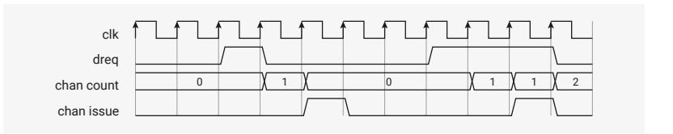

# 12.6.4 Data Request (DREQ)

Peripherals produce or consume data at their own pace. If the DMA transferred data as fast as possible, loss or corruption of data would ensue. DREQs are a communication channel between peripherals and the DMA which enables the DMA to pace transfers according to the needs of the peripheral.

The CTRL.TREQ\_SEL (transfer request) field selects an external DREQ. It can also be used to select one of the internal pacing timers, or select no TREQ at all (the transfer proceeds as fast as possible), e.g. for memory-to-memory transfers.

#### **12.6.4.1. System DREQ Table**

DREQ numbers use the following global assignment to peripheral DREQ channels:

| Table 1145. DREQs | DREQ | DREQ Channel  | DREQ | DREQ Channel  | DREQ | DREQ Channel   | DREQ | DREQ Channel    |
|-------------------|------|---------------|------|---------------|------|----------------|------|-----------------|
|                   | 0    | DREQ_PIO0_TX0 | 14   | DREQ_PIO1_RX2 | 28   | DREQ_UART0_TX  | 42   | DREQ_PWM_WRAP10 |
|                   | 1    | DREQ_PIO0_TX1 | 15   | DREQ_PIO1_RX3 | 29   | DREQ_UART0_RX  | 43   | DREQ_PWM_WRAP11 |
|                   | 2    | DREQ_PIO0_TX2 | 16   | DREQ_PIO2_TX0 | 30   | DREQ_UART1_TX  | 44   | DREQ_I2C0_TX    |
|                   | 3    | DREQ_PIO0_TX3 | 17   | DREQ_PIO2_TX1 | 31   | DREQ_UART1_RX  | 45   | DREQ_I2C0_RX    |
|                   | 4    | DREQ_PIO0_RX0 | 18   | DREQ_PIO2_TX2 | 32   | DREQ_PWM_WRAP0 | 46   | DREQ_I2C1_TX    |
|                   | 5    | DREQ_PIO0_RX1 | 19   | DREQ_PIO2_TX3 | 33   | DREQ_PWM_WRAP1 | 47   | DREQ_I2C1_RX    |
|                   | 6    | DREQ_PIO0_RX2 | 20   | DREQ_PIO2_RX0 | 34   | DREQ_PWM_WRAP2 | 48   | DREQ_ADC        |
|                   | 7    | DREQ_PIO0_RX3 | 21   | DREQ_PIO2_RX1 | 35   | DREQ_PWM_WRAP3 | 49   | DREQ_XIP_STREAM |
|                   | 8    | DREQ_PIO1_TX0 | 22   | DREQ_PIO2_RX2 | 36   | DREQ_PWM_WRAP4 | 50   | DREQ_XIP_QMITX  |
|                   | 9    | DREQ_PIO1_TX1 | 23   | DREQ_PIO2_RX3 | 37   | DREQ_PWM_WRAP5 | 51   | DREQ_XIP_QMIRX  |
|                   | 10   | DREQ_PIO1_TX2 | 24   | DREQ_SPI0_TX  | 38   | DREQ_PWM_WRAP6 | 52   | DREQ_HSTX       |
|                   | 11   | DREQ_PIO1_TX3 | 25   | DREQ_SPI0_RX  | 39   | DREQ_PWM_WRAP7 | 53   | DREQ_CORESIGHT  |
|                   | 12   | DREQ_PIO1_RX0 | 26   | DREQ_SPI1_TX  | 40   | DREQ_PWM_WRAP8 | 54   | DREQ_SHA256     |
|                   | 13   | DREQ_PIO1_RX1 | 27   | DREQ_SPI1_RX  | 41   | DREQ_PWM_WRAP9 |      |                 |

#### **12.6.4.2. Credit-based DREQ Scheme**

The RP2350 DMA is designed for systems where:

- The area and power cost of large peripheral data FIFOs is prohibitive.
- The bandwidth demands of individual peripherals may be high, e.g. >50% bus injection rate for short periods.
- Bus latency is low, but multiple managers may compete for bus access.

In addition, the DMA's transfer FIFOs and dual-manager-port structure permit multiple accesses to the same peripheral to be in-flight at once to improve throughput. Choice of DREQ mechanism is therefore critical:

- The traditional "turn on the tap" method can cause overflow if multiple writes are backed up in the TDF. Some systems solve this by over-provisioning peripheral FIFOs and setting the DREQ threshold below the full level at the expense of precious area and power.
- The Arm-style single and burst handshake does not permit additional requests to be registered while the current request is being served. This limits performance when FIFOs are very shallow.

The RP2350 DMA uses a credit-based DREQ mechanism. For each peripheral, the DMA attempts to keep as many transfers in-flight as the peripheral has capacity for. This enables full bus throughput (1 word per clock) through an 8 deep peripheral FIFO with no possibility of overflow or underflow in the absence of fabric latency or contention.

For each channel, the DMA maintains a counter. Each 1-clock pulse on the dreq signal increments this counter. When non-zero, the channel requests a transfer from the DMA's internal arbiter. The counter decrements when the transfer is issued to the address FIFOs. At this point the transfer is in flight, but has not yet necessarily completed.

The counter is saturating, and six bits in size. The counter ignores increments at the maximum value or decrements at zero. The six-bit counter size supports counts up to the depth of any FIFO on RP2350.

*Figure 122. DREQ counting*

The effect is to upper bound the number of in-flight transfers based on the amount of room or data available in the peripheral FIFO. In the steady state, this gives maximum throughput, but can't underflow or underflow. This approach has the following caveats:

- The user *must not* access a FIFO currently being serviced by the DMA. This causes the channel and peripheral to become desynchronised, and can cause corruption or loss of data.
- Multiple channels *must not* be connected to the same DREQ.

