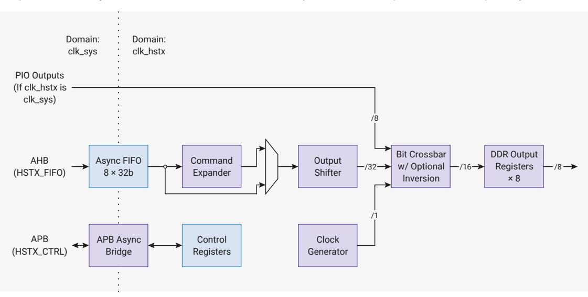

# 12.10.8 Using a Tick Faster than 1ms

The tick rate can be increased by scaling the value written to the LPOSC and XOSC frequency registers. For example, if the frequency value is divided by 4 then the AON Timer will tick 4 times per ms. The minimum value that can be written to the frequency registers is 2.0, therefore the maximum upscaling using this method with LPOSC is 16, giving a time resolution of 1/16th of 1 ms (= 62.5us).

As described previously, the external tick is limited to 16kHz, so the maximum upscaling using this method is also 16. This gives a time resolution of 1/16th of 1 ms (62.5μs).

These limitations can be overcome either by using a faster external clock (see [Section 12.10.5.2](#page-1197-0)) or keeping the chip core powered so the AON Timer is always running from the XOSC. If a faster external clock is used then the power sequencer timings will also need to be adjusted.

For example, suppose 1µsec timer precision is required. The user could supply an external 2-25MHz clock in place of the LPOSC and program both the LPOSC and XOSC frequency registers in MHz units rather than kHz. The maximum frequency of the external clock is 29MHz.

## 12.10.9. List of Registers

The AON Timer shares a register address space with the power management subsystems in the always-on domain. The address space is referred to as POWMAN elsewhere in this document and a complete list of POWMAN registers is provided in Section 6.4. The registers associated with the AON Timer are:

- SET\_TIME\_63TO48
- SET\_TIME\_47T032
- SET\_TIME\_31T016
- SET\_TIME\_15T00
- READ\_TIME\_UPPER
- READ\_TIME\_LOWER
- ALARM\_TIME\_63TO48
- ALARM TIME 47T032
- ALARM\_TIME\_31T016
- ALARM\_TIME\_15T00
- TIMER

# 12.11. HSTX

The high-speed serial transmit (HSTX) streams data from the system clock domain to up to 8 GPIOs at a rate independent of the system clock. On RP2350, GPIOs 12 through 19 are HSTX-capable. HSTX is output-only.

Figure 125. A 32-bitwide asynchronous FIFO provides highbandwidth access from the system DMA The command expander manipulates the datastream, and the output shift reaister portions the 32-bit data over successive HSTX clock cycles, swizzled by the bit crossbar. Outputs are double data-rate: two bits per pin per cycle.

HSTX drives data through GPIOs using DDR output registers to transfer up to two bits per clock cycle per pin. The HSTX balances all delays to GPIO outputs within 300 picoseconds, minimising common-mode components when using neighbouring GPIOs as a pseudo-differential driver. This also helps maintain destination setup and hold time when a clock is driven alongside the output data.

The maximum frequency for the HSTX clock is 150 MHz, the same as the system clock. With DDR output operation, this

is a maximum data rate of 300 Mb/s per pin. There are no limits on the frequency ratio of the system and HSTX clocks, however each clock must be individually fast enough to maintain your required throughput. Very low system clock frequencies coupled with very high HSTX frequencies may encounter system DMA bandwidth limitations, since the DMA is capped at one HSTX FIFO write per system clock cycle.

#### 12.11.1. Data FIFO

An 8-entry, 32-bit-wide FIFO buffers data between the system clock domain (clk\_sys) and the HSTX clock domain (clk\_hstx). This is accessed through the AHB FASTPERI arbiter, providing single-cycle write access from the DMA. The FIFO status is also available through this same bus interface, for faster polled processor IO; see Section 12.11.8.

The FIFO is accessed through a bus interface separate from the control registers (Section 12.11.7), which take multiple cycles to access due to the asynchronous bus crossing. This design avoids incurring bus stalls on the system DMA or the FASTPERI arbiter when accessing the FIFO.

The HSTX side also pops 32 bits at a time from the FIFO. The word data stream from the FIFO is optionally manipulated by the command expander (Section 12.11.5) before being passed to the output shift register.

# 12.11.2. Output Shift Register

Figure 126. Every cycle, the output shift register either refills 32 bits from the FIFO or recirculates data through a right-rotate function. The rotate can be used to perform left or right shifts, and to repeat data.

The HSTX's internal data paths are 32 bits wide, but the output is narrower: no more than 16 bits can be output per HSTX cycle (8 GPIOs × DDR). The output shift register adapts these mismatched data widths. The output shift register is a 32-bit shift register, which always refills 32 bits at a time, either from the command expander output or directly from the data FIFO.

The source of data for the output shift register is configured by the CSR.EXPAND\_EN field:

- when set, the command expander interposes the FIFO and the output shift register
- when clear, the command expander is bypassed, popping the FIFO directly into the shift register

Whenever CSR.EN is low, the shift register is flushed to empty. Once HSTX has been configured, and EN is set high, the shift register is ready to accept data, and will pop data as soon as it becomes available.

After popping the first data word, the shift register will now shift every HSTX clock cycle until it becomes empty. The shift behaviour is configured by:

- CSR.N\_SHIFTS, which determines how many times to shift before the register is considered empty
- CSR.SHIFT, which is a right-rotate applied to the shift register every cycle

CSR.N\_SHIFTS and CSR.SHIFT must only be changed when CSR.EN is low. It is safe to change these fields in the same register write that sets EN from low to high.

SHIFT  $\times$  N\_SHIFTS is not necessarily less than or equal to 32. For example, a SHIFT of 31 might be used to shift the register *left* by one bit per cycle, since right-rotate is a modular operation, and -1 is equal to 31 under a modulus of 32.

When the shift register is about to become empty, it will immediately refill with fresh data from the command expander or FIFO if data is available. When data is available, the shift register is never empty for any cycle. If data is not available,

the shift register becomes empty and stops shifting until more data is provided. Once data is provided, the shift register refills and begins shifting once again.

