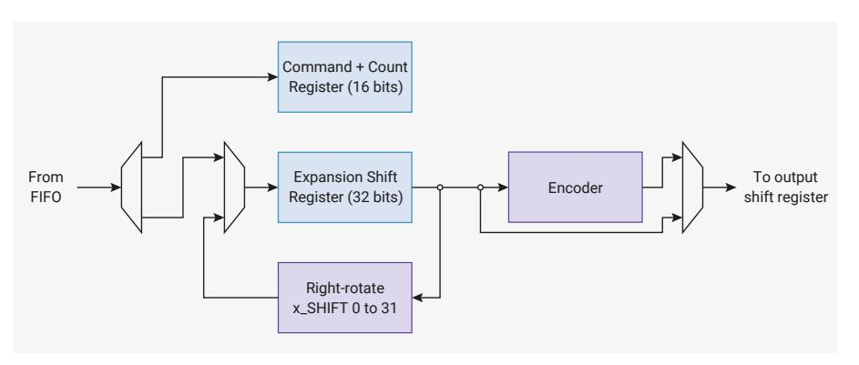

# 12.11.4 Clock Generator

The clock generator is a counter which provides a periodic signal over the course of n HSTX clock cycles, configured by [CSR.](#page-1205-2)CLKDIV. The clock period is always an integer number of HSTX clock cycles, in the range 1 to 16 inclusive. The clock generator supports both odd and even periods, using the DDR outputs to support mid-HSTX-cycle output transitions. There is only a single clock generator — to emulate multiple clocks, pack pseudo-clock bits into FIFO data.

The clock generator increments on cycles where the output shift register is shifted. Generally, the clock period will be a divisor of [CSR.](#page-1205-2)N\_SHIFTS so that clock and data maintain a consistent alignment. In the TMDS example in the previous section, a CLKDIV of 5 would be suitable, so that the clock repeats every time the shift register refreshes. This matches the requirement for a TMDS clock period of 10 bit periods, since two bits are transferred every cycle.

The clock generator output is connected to any pin whose BITx.CLK bit is set (e.g. [BIT0](#page-1207-0).CLK). To produce differential

clock outputs, connect the clock to two pins, and invert one of them.

The [CSR.](#page-1205-2)CLKPHASE field defines the initial phase (count) of the clock generator, configured in units of one half HSTX clock cycle. The clock generator resets whenever [CSR.](#page-1205-2)EN is low and holds at this initial phase. Once [CSR.](#page-1205-2)EN is set and the output shift register begins to shift, the clock generator advances.

Clock generator output whilst [CSR.](#page-1205-2)EN is low is determined by the relation of clock period and initial clock phase: if the initial clock phase is less than one half clock period, then the output is initially low. Otherwise, it is initially high. The clock generator can be thought of as being low for the first half of each generation period, and high for the second half.

The maximum [CSR](#page-1205-2).CLKPHASE is only 15 *half* HSTX clock cycles. The maximum [CSR](#page-1205-2).CLKDIV is 16 *full* HSTX clock cycles: initial phases of greater than or equal to 180 degrees with the maximum clock period require the inversion of the clock using the bit crossbar inversion controls.

Only change [CSR](#page-1205-2).CLKPHASE and [CSR.](#page-1205-2)CLKDIV when [CSR](#page-1205-2).EN is low. It is safe to modify them in the same register write that sets EN from low to high.

#### **12.11.4.1. Example: Centre-aligned Clock**

When transmitting source-synchronous data, the data sink (the receiver) must not see data transitions too late before or too soon after the active edges of the clock. Violating these setup and hold constraints can lead to undefined operation of the external data sink.

Since the HSTX output delays are all mutually balanced, you can meet these constraints by placing clock transitions halfway between data transitions, known as centre-aligned clocking.

Since this positions the clock with a temporal resolution of one half of a bit time, the maximum data rate is one bit per HSTX clock cycle per pin. Because the clock already uses DDR, you cannot use DDR to increase the data rate. Therefore for all [BIT0](#page-1207-0) through [BIT7,](#page-1207-0) BITx.SEL\_N is equal to BITx.SEL\_P.

For single-data-rate data, with an active rising edge, use the following clock generator settings:

- [CSR.](#page-1205-2)CLKDIV = 1 (1 HSTX clock period)
- [CSR.](#page-1205-2)CLKPHASE = 1 (1/2 HSTX clock period)

The clock is delayed by half an HSTX cycle, to offset it from the launch of the first data.

For single-data-rate data, with an active *falling* edge, use the following clock generator settings:

- [CSR.](#page-1205-2)CLKDIV = 1 (1 HSTX clock period)
- [CSR.](#page-1205-2)CLKPHASE = 2 (1 HSTX clock period)

Alternatively, you could use the same settings as an active-rising edge clock, with the clock output inverted via the bit crossbar configuration.

For double-data-rate data, with active rising and active falling edges, use the following clock generator settings:

- [CSR.](#page-1205-2)CLKDIV = 2 (2 HSTX clock period)
- [CSR.](#page-1205-2)CLKPHASE = 1 (1/2 HSTX clock period)

In all three cases, the data rate is the same, at 1 bit per HSTX clock cycle, per pin.

#### **12.11.5. Command Expander**

*Figure 127. A mixture of commands and data are popped from the FIFO. Data can be repeated or shifted through the expansion shift register, and optionally passed through an encoder before passing on to the output shift register.*

The command expander can be inserted inline between the data FIFO and the output shift register to manipulate the stream of data words. In general, the output stream is larger than the input stream, hence the name expander. The commander expander is enabled by setting [CSR.](#page-1205-2)EXPAND\_EN. Only modify this field when [CSR.](#page-1205-2)EN is low. It is safe to modify this field in the same register write that sets EN from low to high. When the command expander is disabled, data passes directly from the data FIFO to the output shift register without being modified by the expander.

When the command expander is enabled, the data FIFO carries a mixture of data and commands for the expander. Each command consists of a 4-bit opcode and a 12-bit length, packed in the 16 LSBs of a data FIFO word, with the opcode in bits 15 through 12, and the length in bits 11 through 0. The available commands are:

- 0x0: RAW
- 0x1: RAW\_REPEAT
- 0x2: TMDS
- 0x3: TMDS\_REPEAT
- 0xf: NOP

When the HSTX is first enabled, if the command expander is enabled, it expects the first word in the data FIFO to be a command. If this command is not a NOP, it will be followed by some amount of data, then another command. Operation continues in this manner, with runs of data interspersed with commands. A command always acts as a prefix to the data that follows it in the FIFO.

The count field determines the number of words output by this command to the output shift register downstream, from 1 to 4095. A count of 0 is reserved to mean "infinite". The number of words that this command reads from the data FIFO in order to produce the specified quantity of downstream data depends on the command and the [EXPAND\\_SHIFT](#page-1208-0).ENC\_N\_SHIFTS and [EXPAND\\_SHIFT](#page-1208-0).RAW\_N\_SHIFTS register fields.

The expansion shift register always pops from the FIFO once at the beginning of the command. After this point, commands bearing the x\_REPEAT suffix continue to circulate the same contents through the shift register, rotating right by [EXPAND\\_SHIFT](#page-1208-0).ENC\_SHIFT or [EXPAND\\_SHIFT.](#page-1208-0)RAW\_SHIFT each time the output shift register pulls new data from the command expander. Use a shift of 0 to repeat identical data without shifting. This is useful, for example, for transmitting runs of the same TMDS control symbol during horizontal blanking periods in DVI.

RP2350 only implements a TMDS encoder, reserving the remaining opcode space for additional encoders in the future. RAW and RAW\_REPEAT commands bypass the encoder. TMDS and TMDS\_REPEAT commands are TMDS-encoded before being passed to the output shift register. NOP commands have no data, therefore whether they bypass the encoder or not is a philosophical question beyond the scope of this datasheet.

The [EXPAND\\_SHIFT](#page-1208-0) register has two copies for each of its fields. Fields prefixed with RAW\_ are used for RAW and RAW\_REPEAT commands. All other commands use fields prefixed with ENC\_, which pass through the encoder. For example, in DVI, TMDS control symbols using RAW\_REPEAT commands may be unshifted. Pixel data using TMDS commands may be shifted out one pixel at a time, so it is useful to have banked shift controls.

The [EXPAND\\_SHIFT](#page-1208-0).ENC\_N\_SHIFTS and [EXPAND\\_SHIFT](#page-1208-0).RAW\_N\_SHIFTS fields control how often the expansion shift register is refilled for encoded and raw commands respectively. x\_REPEAT commands ignore these fields since they never refill from the FIFO, and function similarly to the [CSR](#page-1205-2).N\_SHIFTS field which controls the output shift register.

The command expander can only pop from the data FIFO once per cycle, so heavy use of commands (particularly NOP

commands) can impact HSTX throughput. For use cases that output from the HSTX on every cycle, configure the output shift register with [CSR](#page-1205-2).N\_SHIFTS > 1. This is required because the command expander cannot output data on the cycle where it pops a command from the FIFO, so the expansion shift register is empty for at least one cycle.

## **12.11.6. PIO-to-HSTX Coupled Mode**

HSTX can connect up to 8 PIO pin outputs to the bit crossbar. Only use the bit crossbar when clk\_hstx connects directly to clk\_sys ( [CLK\\_HSTX\\_CTRL](#page-537-2).AUXSRC must select clk\_sys).

Running the two clocks at the same frequency is not sufficient. You must select clk\_sys directly.

To enable coupled mode, set [CSR.](#page-1205-2)COUPLED\_MODE. The COUPLED\_SEL field in the same register selects the PIO instance, 0 through 2, to couple to HSTX. When coupled mode is enabled, IO outputs 12 through 19 inclusive on the selected PIO instance appear at bit crossbar PSEL\_N and PSEL\_P indices 31:24, replacing the most significant 8 bits of the output shift register from the point of view of the bit crossbar.

This mode allows PIO programs to make use of the HSTX's DDR outputs. You can use this mode to drive a clock at the full system clock rate or to position clock transitions relative to data transitions with half-system-clock-cycle resolution.

The PIO outputs used for couple mode are always bits 19 through 12 of the pin outputs driven from that GPIO, independent of [GPIOBASE](#page-953-0). When GPIOBASE is 0, the PIO outputs used for coupled mode are those that would normally appear on the HSTX pins. When GPIOBASE is 16, this uses the PIO outputs that would appear on GPIOs 28 through 35.

The operation of PIO is not affected in any way by coupled mode being enabled.

Outputs presented through the HSTX coupled mode interface have one additional system clock cycle of delay compared to those presented directly from PIO to the pads.

## **12.11.7. List of Control Registers**

The control registers start at a base address of 0x400c0000 (defined as [HSTX\\_CTRL\\_BASE](#page-31-1) in the SDK). They are accessed through an asynchronous bus crossing, so each bus access takes several cycles, the exact figure depending on the ratio of clk\_sys and clk\_hstx.

*Table 1252. List of HSTX\_CTRL registers*

| Offset | Name         | Info                                                               |
|--------|--------------|--------------------------------------------------------------------|
| 0x00   | CSR          |                                                                    |
| 0x04   | BIT0         | Data control register for output bit 0                             |
| 0x08   | BIT1         | Data control register for output bit 1                             |
| 0x0c   | BIT2         | Data control register for output bit 2                             |
| 0x10   | BIT3         | Data control register for output bit 3                             |
| 0x14   | BIT4         | Data control register for output bit 4                             |
| 0x18   | BIT5         | Data control register for output bit 5                             |
| 0x1c   | BIT6         | Data control register for output bit 6                             |
| 0x20   | BIT7         | Data control register for output bit 7                             |
| 0x24   | EXPAND_SHIFT | Configure the optional shifter inside the command expander         |
| 0x28   | EXPAND_TMDS  | Configure the optional TMDS encoder inside the command expander |

# **[HSTX\\_CTRL:](#page-1205-3) CSR Register**

**Offset**: 0x00

*Table 1253. CSR Register*

| Bits  | Description                                                                                                                                                                                                                                                                                                                                                                                                                                                                                                                                                                                                                                                                                                                                                                                                                                                                                                                                                                             | Type | Reset |
|-------|-----------------------------------------------------------------------------------------------------------------------------------------------------------------------------------------------------------------------------------------------------------------------------------------------------------------------------------------------------------------------------------------------------------------------------------------------------------------------------------------------------------------------------------------------------------------------------------------------------------------------------------------------------------------------------------------------------------------------------------------------------------------------------------------------------------------------------------------------------------------------------------------------------------------------------------------------------------------------------------------|------|-------|
| 31:28 | CLKDIV: Clock period of the generated clock, measured in HSTX clock cycles. Can be odd or even. The generated clock advances only on cycles where the shift register shifts. For example, a clkdiv of 5 would generate a complete output clock period for every 5 HSTX clocks (or every 10 half-clocks). A CLKDIV value of 0 is mapped to a period of 16 HSTX clock cycles.                                                                                                                                                                                                                                                                                                                                                                                                                                                                                                                                                                                              | RW   | 0x1   |
| 27:24 | CLKPHASE: Set the initial phase of the generated clock. A CLKPHASE of 0 means the clock is initially low, and the first rising edge occurs after one half period of the generated clock (i.e. CLKDIV/2 cycles of clk_hstx). Incrementing CLKPHASE by 1 will advance the initial clock phase by one half clk_hstx period. For example, if CLKDIV=2 and CLKPHASE=1: * The clock will be initially low * The first rising edge will be 0.5 clk_hstx cycles after asserting first data * The first falling edge will be 1.5 clk_hstx cycles after asserting first data This configuration would be suitable for serialising at a bit rate of clk_hstx with a centre-aligned DDR clock. When the HSTX is halted by clearing CSR_EN, the clock generator will return to its initial phase as configured by the CLKPHASE field. Note CLKPHASE must be strictly less than double the value of CLKDIV (one full period), else its operation is undefined. | RW   | 0x0   |
| 23:21 | Reserved.                                                                                                                                                                                                                                                                                                                                                                                                                                                                                                                                                                                                                                                                                                                                                                                                                                                                                                                                                                               | -    | -     |
| 20:16 | N_SHIFTS: Number of times to shift the shift register before refilling it from the FIFO. (A count of how many times it has been shifted, not the total shift distance.) A register value of 0 means shift 32 times.                                                                                                                                                                                                                                                                                                                                                                                                                                                                                                                                                                                                                                                                                                                                                            | RW   | 0x05  |
| 15:13 | Reserved.                                                                                                                                                                                                                                                                                                                                                                                                                                                                                                                                                                                                                                                                                                                                                                                                                                                                                                                                                                               | -    | -     |
| 12:8  | SHIFT: How many bits to right-rotate the shift register by each cycle. The use of a rotate rather than a shift allows left shifts to be emulated, by subtracting the left-shift amount from 32. It also allows data to be repeated, when the product of SHIFT and N_SHIFTS is greater than 32.                                                                                                                                                                                                                                                                                                                                                                                                                                                                                                                                                                                                                                                                                 | RW   | 0x06  |
| 7     | Reserved.                                                                                                                                                                                                                                                                                                                                                                                                                                                                                                                                                                                                                                                                                                                                                                                                                                                                                                                                                                               | -    | -     |
| 6:5   | COUPLED_SEL: Select which PIO to use for coupled mode operation.                                                                                                                                                                                                                                                                                                                                                                                                                                                                                                                                                                                                                                                                                                                                                                                                                                                                                                                        | RW   | 0x0   |

| Bits | Description                                                                                                                                                                                                                                                            | Type | Reset |
|------|------------------------------------------------------------------------------------------------------------------------------------------------------------------------------------------------------------------------------------------------------------------------|------|-------|
| 4    | COUPLED_MODE: Enable the PIO-to-HSTX 1:1 connection. The HSTX must be clocked directly from the system clock (not just from some other clock source of the same frequency) for this synchronous interface to function correctly.                                 | RW   | 0x0   |
|      | When COUPLED_MODE is set, BITx_SEL_P and SEL_N indices 24 through 31 will select bits from the 8-bit PIO-to-HSTX path, rather than shifter bits. Indices of 0 through 23 will still index the shift register as normal.                                          |      |       |
|      | The PIO outputs connected to the PIO-to-HSTX bus are those same outputs that would appear on the HSTX-capable pins if those pins' FUNCSELs were set to PIO instead of HSTX.                                                                                      |      |       |
|      | For example, if HSTX is on GPIOs 12 through 19, then PIO outputs 12 through 19 are connected to the HSTX when coupled mode is engaged.                                                                                                                              |      |       |
| 3:2  | Reserved.                                                                                                                                                                                                                                                              | -    | -     |
| 1    | EXPAND_EN: Enable the command expander. When 0, raw FIFO data is passed directly to the output shift register. When 1, the command expander can perform simple operations such as run length decoding on data between the FIFO and the shift register.        | RW   | 0x0   |
|      | Do not change CXPD_EN whilst EN is set. It's safe to set CXPD_EN simultaneously with setting EN.                                                                                                                                                                    |      |       |
| 0    | EN: When EN is 1, the HSTX will shift out data as it appears in the FIFO. As long as there is data, the HSTX shift register will shift once per clock cycle, and the frequency of popping from the FIFO is determined by the ratio of SHIFT and SHIFT_THRESH. | RW   | 0x0   |
|      | When EN is 0, the FIFO is not popped. The shift counter and clock generator are also reset to their initial state for as long as EN is low. Note the initial phase of the clock generator can be configured by the CLKPHASE field.                               |      |       |
|      | Once the HSTX is enabled again, and data is pushed to the FIFO, the generated clock's first rising edge will be one half-period after the first data is launched.                                                                                                   |      |       |

## **[HSTX\\_CTRL:](#page-1205-3) BIT0, BIT1, …, BIT6, BIT7 Registers**

**Offsets**: 0x04, 0x08, …, 0x1c, 0x20

#### **Description**

Data control register for output bit *n*

*Table 1254. BIT0, BIT1, …, BIT6, BIT7 Registers*

| Bits  | Description                                                                                                                                                                                          | Type | Reset |
|-------|------------------------------------------------------------------------------------------------------------------------------------------------------------------------------------------------------|------|-------|
| 31:18 | Reserved.                                                                                                                                                                                            | -    | -     |
| 17    | CLK: Connect this output to the generated clock, rather than the data shift register. SEL_P and SEL_N are ignored if this bit is set, but INV can still be set to generate an antiphase clock. | RW   | 0x0   |
| 16    | INV: Invert this data output (logical NOT)                                                                                                                                                           | RW   | 0x0   |
| 15:13 | Reserved.                                                                                                                                                                                            | -    | -     |
| 12:8  | SEL_N: Shift register data bit select for the second half of the HSTX clock cycle                                                                                                                 | RW   | 0x00  |

| Bits | Description                                                                      | Type | Reset |
|------|----------------------------------------------------------------------------------|------|-------|
| 7:5  | Reserved.                                                                        | -    | -     |
| 4:0  | SEL_P: Shift register data bit select for the first half of the HSTX clock cycle | RW   | 0x00  |

# **[HSTX\\_CTRL:](#page-1205-3) EXPAND\_SHIFT Register**

**Offset**: 0x24

#### **Description**

Configure the optional shifter inside the command expander

*Table 1255. EXPAND\_SHIFT Register*

| Bits  | Description                                                                                                                                                                                                            | Type | Reset |
|-------|------------------------------------------------------------------------------------------------------------------------------------------------------------------------------------------------------------------------|------|-------|
| 31:29 | Reserved.                                                                                                                                                                                                              | -    | -     |
| 28:24 | ENC_N_SHIFTS: Number of times to consume from the shift register before refilling it from the FIFO, when the current command is an encoded data command (e.g. TMDS). A register value of 0 means shift 32 times. |      | 0x01  |
| 23:21 | Reserved.                                                                                                                                                                                                              | -    | -     |
| 20:16 | ENC_SHIFT: How many bits to right-rotate the shift register by each time data is pushed to the output shifter, when the current command is an encoded data command (e.g. TMDS).                                  | RW   | 0x00  |
| 15:13 | Reserved.                                                                                                                                                                                                              | -    | -     |
| 12:8  | RAW_N_SHIFTS: Number of times to consume from the shift register before refilling it from the FIFO, when the current command is a raw data command. A register value of 0 means shift 32 times.                  | RW   | 0x01  |
| 7:5   | Reserved.                                                                                                                                                                                                              | -    | -     |
| 4:0   | RAW_SHIFT: How many bits to right-rotate the shift register by each time data is pushed to the output shifter, when the current command is a raw data command.                                                   | RW   | 0x00  |

# **[HSTX\\_CTRL:](#page-1205-3) EXPAND\_TMDS Register**

**Offset**: 0x28

#### **Description**

Configure the optional TMDS encoder inside the command expander

*Table 1256. EXPAND\_TMDS Register*

| Bits  | Description                                                                                                                                                        | Type | Reset |
|-------|--------------------------------------------------------------------------------------------------------------------------------------------------------------------|------|-------|
| 31:24 | Reserved.                                                                                                                                                          | -    | -     |
| 23:21 | L2_NBITS: Number of valid data bits for the lane 2 TMDS encoder, starting from bit 7 of the rotated data. Field values of 0 → 7 encode counts of 1 → 8 bits. | RW   | 0x0   |
| 20:16 | L2_ROT: Right-rotate applied to the current shifter data before the lane 2 TMDS encoder.                                                                        | RW   | 0x00  |
| 15:13 | L1_NBITS: Number of valid data bits for the lane 1 TMDS encoder, starting from bit 7 of the rotated data. Field values of 0 → 7 encode counts of 1 → 8 bits. | RW   | 0x0   |
| 12:8  | L1_ROT: Right-rotate applied to the current shifter data before the lane 1 TMDS encoder.                                                                        | RW   | 0x00  |

| Bits | Description                                                                                                                                                        | Type | Reset |
|------|--------------------------------------------------------------------------------------------------------------------------------------------------------------------|------|-------|
| 7:5  | L0_NBITS: Number of valid data bits for the lane 0 TMDS encoder, starting from bit 7 of the rotated data. Field values of 0 → 7 encode counts of 1 → 8 bits. | RW   | 0x0   |
| 4:0  | L0_ROT: Right-rotate applied to the current shifter data before the lane 0 TMDS encoder.                                                                        | RW   | 0x00  |

