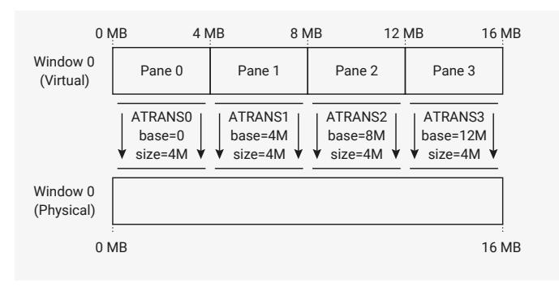
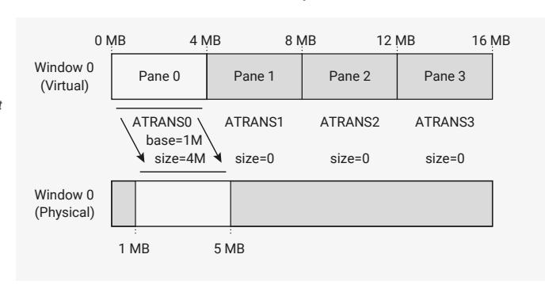

# 12.14.4 Address Translation

QMI applies a configurable mapping from the *virtual* address requested by the processor or DMA to the *physical* address transmitted to the external QSPI device. This is performed separately for each of the 16 MB chip select windows. You cannot map contents between devices.

Each window is divided into four *panes*, each independently mapped onto the physical address space for that window. The default configuration applied on QMI reset, as shown in [Figure 139,](#page-1231-1) is a 1:1 identity mapping between virtual and physical addresses. In this state the address mapping has no effect, and the entire 16 MB address space of the external QSPI device is mapped directly into the system address space.

*Figure 139. By default, each window is set up to map the full 16 MB virtual address space directly 1:1 with the 16 MB physical address space.*

Each pane corresponds to the one of the four ATRANSx registers for that window: [ATRANS0](#page-1244-0) through [ATRANS3](#page-1246-2) for window 0, and [ATRANS4](#page-1244-0) through [ATRANS7](#page-1246-2) for window 1.

The virtual base address of each pane is fixed and assigned in 4 MB increments. There are two configurable parameters for the mapping of that pane into physical address space:

- BASE: defines the physical address corresponding to offset 0 in the virtual address pane. Configured in units of 4 kB (one flash sector), ranging from 0 to (16 MB minus 4 kB).
- SIZE: defines the amount of address space mapped by this pane. Configured in units of 4 kB (one flash sector) ranging from 0 to 4 MB.

The mapping grows from the start of the pane. A SIZE of 1 MB maps the first 1 MB of that pane's virtual address range to downstream memory, and the remainder is unmapped. A SIZE of 0 means that no address within this virtual address pane is accessible. Accesses beyond the currently configured SIZE return a bus error, and do not pass through to the downstream QSPI bus. As a result, they have no effect on the external memory device.

*Figure 140. The BASE of a pane defines where its physical mapping begins. The SIZE defines how far it extends. A SIZE of 0 means no addresses are mapped through that pane.*

[Figure 140](#page-1231-2) shows an example mapping, where the first 4 MB of virtual address space for chip select 0 (virtual address offsets 0x000000 through 0x3fffff inclusive) map to a 4 MB physical address window starting at a 1 MB offset (physical address offsets 0x100000 through 0x4fffff inclusive). This mapping could be used for flash that contains a 1 MB

bootloader application followed by a 4 MB user application. Ideally, the user application should not be aware of the flash layout defined by the bootloader; that way, the same application can run under different bootloader implementations. The virtual-to-physical mapping solves this problem by making the storage location of the user application (starting at 1 MB) independent of the address it appears at in the system address space (starting at 0 MB).

#### **12.14.4.1. Bootrom Support for Address Translation**

The bootrom can automatically configure address translation at boot time, so that a binary stored at some arbitrary location in physical flash storage can appear at a runtime flash address of 0.

This is done automatically when the booted image is inside of a flash partition [\(Section 5.1.2](#page-354-2)), and can be adjusted manually based on a rolling window delta specified in the IMAGE\_DEF of the launched executable [\(Section 5.1.4\)](#page-355-1).

The bootrom source code and bootrom documentation often refers to the QMI ATRANS mapping as "rolling windows", due to the modulo address wrapping on 16 MB boundaries — see [Section 5.1.19](#page-363-0).

#### **12.14.4.2. Translation and the XIP Cache**

The QMI address translation is performed downstream of the system XIP cache [\(Section 4.4.1\)](#page-341-0). Therefore, the XIP cache is a *virtual cache* with respect to this translation, because the address translation performed inside QMI is opaque to the XIP cache.

Consequently, changes to the QMI address translation necessitate a flush of the XIP cache. From the cache's point of view, the translation change has moved QMI memory contents around in the cache's downstream address space in a way that is incoherent with the cache contents, so a flush is required to restore coherence. At a minimum, any virtual address whose ATRANSx register ([ATRANS0](#page-1244-0) through [ATRANS7](#page-1246-2)) has been modified, and which may be allocated in the cache in either the clean or the dirty state, must be flushed. It may be simplest to flush the entire cache.

QMI's address mapping creates another hazard: the same physical address may map to multiple virtual addresses, and therefore may be allocated multiple times in the XIP cache. When you write to a physical address through a cached virtual address alias, the XIP cache does not propagate the change to other aliases. To avoid this issue, do not allow multiple aliases of the same writable physical address at the same instant. Aliasing read-only memory is usually safe. Aliases that exist at different points in time (for example, across an RTOS context switch boundary) can be kept coherent with appropriate cleaning and flushing when the translation is changed.

## **12.14.5. Direct Mode**

In direct mode, the AHB XIP address window is disconnected from the QSPI bus, and the bus is controlled through a TX/RX FIFO pair, similar to a normal SPI peripheral. In this state, the XIP window becomes inaccessible. Attempting to access it generates a bus fault. This mode is used for low-level access to the QSPI bus, for example when issuing flash erase/programming commands, or when accessing QSPI device status registers.

All direct-mode operation is controlled through [DIRECT\\_CSR](#page-1234-0), with data being exchanged through [DIRECT\\_TX](#page-1236-0) and [DIRECT\\_RX](#page-1237-1). To enable direct mode, first set [DIRECT\\_CSR.](#page-1234-0)EN, and then poll for [DIRECT\\_CSR.](#page-1234-0)BUSY to go low to ensure that any in-progress XIP transfer at the point direct mode was enabled has completed.

Direct mode has its own clock divisor and RX sampling delay, configured by [DIRECT\\_CSR](#page-1234-0).CLKDIV and [DIRECT\\_CSR](#page-1234-0).RXDELAY. These are separate from the per-window settings configured in [M0\\_TIMING/M1\\_TIMING,](#page-1237-0) because serial commands used for control purposes may have different frequency limits than data accesses used for execute-in-place.

For each push to [DIRECT\\_TX,](#page-1236-0) QMI will issue 8 or 16 bits of FIFO data to the QSPI bus. Optionally, the same number of bits are simultaneously sampled and returned in [DIRECT\\_RX.](#page-1237-1) The clock is initially low, and data is always captured on the rising edge of SCK, transitioning on the subsequent falling edge.

After pushing to [DIRECT\\_TX,](#page-1236-0) [DIRECT\\_CSR](#page-1234-0).BUSY will go high, and remain high until all direct-mode activity has completed. This works even if no RX data is returned, so is more reliable than polling the RX FIFO status. The BUSY flag stays high for half an SCK period after the transfer finishes, to ensure safe chip select timing when this is used to drive the chip selects — see [Section 12.14.5.2.](#page-1233-1)

QMI will never push to a full RX FIFO, or drop data as a result of the FIFO being full — instead, the interface is paused until the system pops [DIRECT\\_RX](#page-1237-1). This avoids a common trap of RX data being lost when the processor is heavily interrupted during direct-mode operation, but software must take care not to poll for [DIRECT\\_CSR](#page-1234-0).BUSY low without also checking the RX FIFO, as this can cause a deadlock when the FIFO fills.

#### **12.14.5.1. Controls in DIRECT\_TX**

The TX FIFO carries control information as well as data, with data in the 16 LSBs, and control information in the immediately more-significant bits:

- [DIRECT\\_TX](#page-1236-0).NOPUSH inhibits the [DIRECT\\_RX](#page-1237-1) push which would match this TX data. This avoids creating garbage when pushing control/address information at the start of a transfer.
- [DIRECT\\_TX](#page-1236-0).DWIDTH is the data width of this FIFO record. 0 means the 8 LSBs contain data, and 1 means the 16 LSBs contain data. This also determines the amount of data returned in the matching [DIRECT\\_RX](#page-1237-1) entry.
- [DIRECT\\_TX](#page-1236-0).IWIDTH is the interface width (single-dual/quad) used to clock out this FIFO record. The corresponding RX data is sampled at the same width.
- [DIRECT\\_TX](#page-1236-0).OE controls the pad direction for bidirectional transfers. It is ignored for serial IWIDTH, since SD0 is always an output and SD1 always an input. At dual/quad width, it must be set in order to enable the output drivers for the duration of this FIFO record. The TX data is don't-care when IWIDTH is dual/quad and OE is not set.

The default when all control bits are zero is an 8-bit serial transfer, with 8 bits of sampled data returned. Therefore, you can ignore the control bits and treat this as a plain 8-bit data FIFO.

#### **12.14.5.2. Chip Select Control**

There are two options for driving the chip selects, both via [DIRECT\\_CSR:](#page-1234-0)

- [DIRECT\\_CSR](#page-1234-0).ASSERT\_CS0N and [DIRECT\\_CSR.](#page-1234-0)ASSERT\_CS1N will *immediately* drive the corresponding chip select low when set
- [DIRECT\\_CSR](#page-1234-0).AUTO\_CS0N and [DIRECT\\_CSR](#page-1234-0).AUTO\_CS1N configure the corresponding chip select to be set low whenever the interface is busy, i.e. when the [DIRECT\\_CSR.](#page-1234-0)BUSY flag is high due to a previous [DIRECT\\_TX](#page-1236-0) push

#### **IMPORTANT**

The ASSERT\_CSxN fields assert the chip select *unconditionally*, including when [DIRECT\\_CSR](#page-1234-0).EN is clear. Software must take care not to set these fields when XIP transfers may be active.

