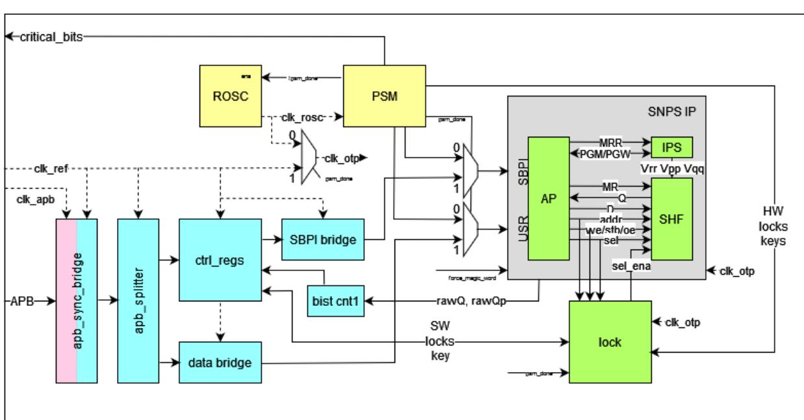

# 13.3 Background: OTP Hardware Architecture

This diagram shows the integration of the three Synopsys IP components, and the Raspberry Pi hardware added to make this all function in the context of RP2350's system and security architecture. More specifically:

- APB interface(s) to connect to the SoC
- Internal ring oscillator with clock edge randomisation
- Power-up state machine, running off the ring oscillator
- Lock shim, sitting between the SNPS RTL and the memory core (fuse)

*Figure 141. OTP architecture*

The OTP subsystem clock is initially provided by the OTP boot oscillator ([Section 13.3.3](#page-1269-0)) during hardware startup, but switches to clk\_ref before any software runs on the processors. The frequency of clk\_ref must not exceed 25 MHz when accessing the OTP.

