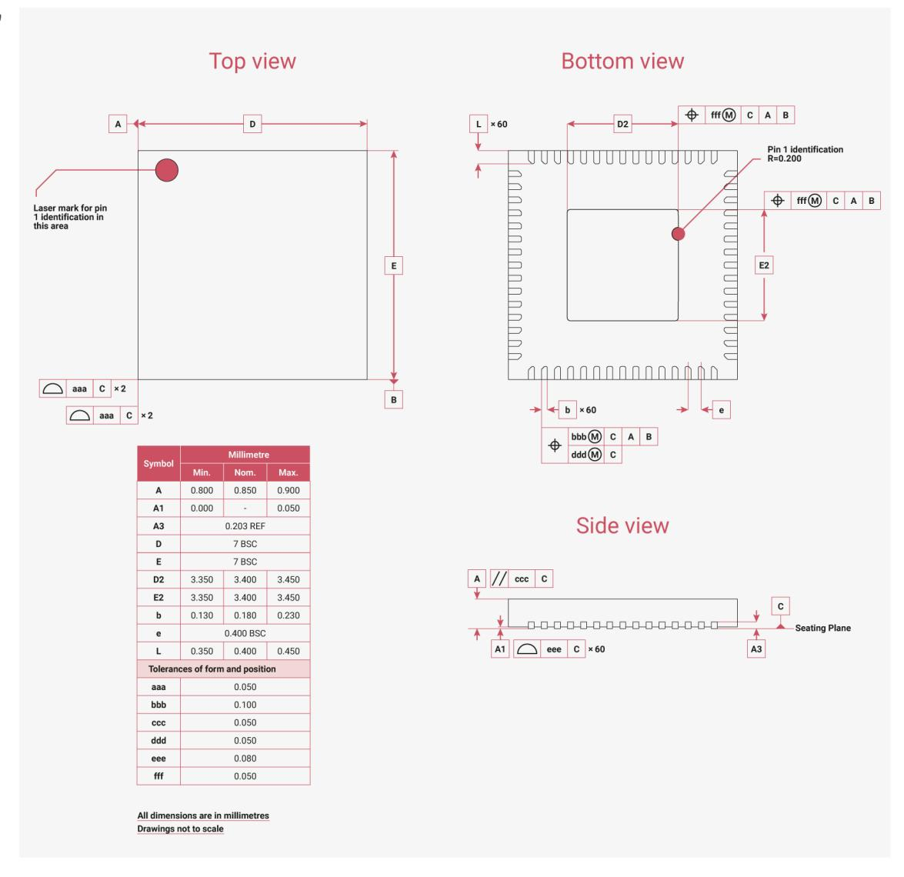

# 14.1 QFN-60 Package

*Figure 142. Top down view (left, top) and side view (right, bottom), along with bottom view (right, top) of the RP2350 QFN-60 package*

14.1. QFN-60 Package **1323**

# **NOTE**

Leads have a matte Tin (Sn) finish. Annealing is done post-plating, baking at 150°C for 1 hour. Minimum thickness for lead plating is 8 microns, and the intermediate layer material is CuFe2P (roughened Copper (Cu)).

