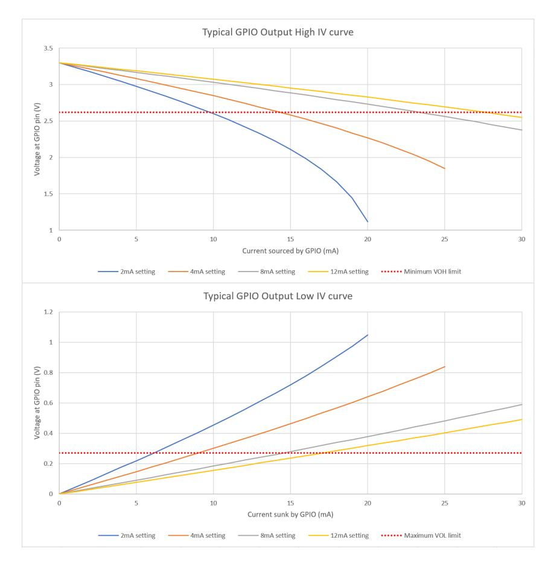

# 14.9.4 IO Electrical Characteristics

*Table 1435. Digital IO characteristics - Standard and FT unless otherwise stated. In this table IOVDD also refers to QSPI\_IOVDD where appropriate*

| Parameter                       | Symbol | Conditions | Minimum      | Maximum      | Units | Comment                                   |
|---------------------------------|--------|------------|--------------|--------------|-------|-------------------------------------------|
| Pin Input Leakage Current | IIN    |            |              | 1            | μA    |                                           |
| Input Voltage                   | VIH    | IOVDD=1.8V | 0.65 * IOVDD | IOVDD + 0.3  | V     |                                           |
| High (Standard IO)           |        | IOVDD=2.5V | 1.7          | IOVDD + 0.3  | V     |                                           |
|                                 |        | IOVDD=3.3V | 2            | IOVDD + 0.3  | V     |                                           |
| Input Voltage High (FT)      | VIH    | IOVDD=1.8V | 0.65 * IOVDD | 3.63         | V     | IOVDD must be powered to               |
|                                 |        | IOVDD=2.5V | 1.7          | 4.2          | V     | tolerate input voltages above 3.63V |
|                                 |        | IOVDD=3.3V | 2            | 5.5          | V     |                                           |
| Input Voltage                   | VIL    | IOVDD=1.8V | -0.3         | 0.35 * IOVDD | V     |                                           |
| Low                             |        | IOVDD=2.5V | -0.3         | 0.7          | V     |                                           |
|                                 |        | IOVDD=3.3V | -0.3         | 0.8          | V     |                                           |

| Parameter                                                   | Symbol          | Conditions | Minimum     | Maximum | Units | Comment                                                |
|-------------------------------------------------------------|-----------------|------------|-------------|---------|-------|--------------------------------------------------------|
| Input Hysteresis Voltage                              | VHYS            | IOVDD=1.8V | 0.1 * IOVDD |         | V     | Schmitt Trigger                                        |
|                                                             |                 | IOVDD=2.5V | 0.2         |         | V     | enabled                                                |
|                                                             |                 | IOVDD=3.3V | 0.2         |         | V     |                                                        |
| Output Voltage High                                      | VOH             | IOVDD=1.8V | 1.24        | IOVDD   | V     | IOH = 2, 4, 8 or                                       |
|                                                             |                 | IOVDD=2.5V | 1.78        | IOVDD   | V     | 12mA depending on                                   |
|                                                             |                 | IOVDD=3.3V | 2.62        | IOVDD   | V     | setting                                                |
| Output Voltage                                              | VOL             | IOVDD=1.8V | 0           | 0.3     | V     | IOL = 2, 4, 8 or                                       |
| Low                                                         |                 | IOVDD=2.5V | 0           | 0.4     | V     | 12mA depending on                                   |
|                                                             |                 | IOVDD=3.3V | 0           | 0.5     | V     | setting                                                |
| Pull-Up                                                     | RPU             | IOVDD=1.8V | 32          | 106     | kΩ    |                                                        |
| Resistance                                                  |                 | IOVDD=2.5V | 42          | 123     | kΩ    |                                                        |
|                                                             |                 | IOVDD=3.3V | 32          | 86      | kΩ    |                                                        |
| Pull-Down                                                   | RPD             | IOVDD=1.8V | 35          | 189     | kΩ    |                                                        |
| Resistance                                                  |                 | IOVDD=2.5V | 49          | 180     | kΩ    |                                                        |
|                                                             |                 | IOVDD=3.3V | 36          | 113     | kΩ    |                                                        |
| Maximum Total IOVDD current                              | IIOVDD_MAX      |            |             | 100     | mA    | Sum of all current being sourced by GPIO pins |
| Maximum Total QSPI_IOVDD current                      | IQSPI_IOVDD_MAX |            |             | 20      | mA    | Sum of all current being sourced by QSPI pins |
| Maximum Total VSS current due to GPIO (IOVSS)      | IIOVSS_MAX      |            |             | 100     | mA    | Sum of all current being sunk into GPIO pins  |
| Maximum Total VSS current due to QSPI (QSPI_IOVSS) | IQSPI_IOVSS_MAX |            |             | 20      | mA    | Sum of all current being sunk into QSPI pins  |

*Table 1436. USB IO characteristics*

| Parameter                          | Symbol  | Minimum | Maximum | Units | Comment |
|------------------------------------|---------|---------|---------|-------|---------|
| Pin Input Leakage Current       | IIN     |         | 1       | μA    |         |
| Single Ended Input Voltage High | VIHSE   | 2       |         | V     |         |
| Single Ended Input Voltage Low  | VILSE   |         | 0.8     | V     |         |
| Differential Input Voltage High | VIHDIFF | 0.2     |         | V     |         |

| Parameter                         | Symbol  | Minimum | Maximum     | Units | Comment |
|-----------------------------------|---------|---------|-------------|-------|---------|
| Differential Input Voltage Low | VILDIFF |         | -0.2        | V     |         |
| Output Voltage High            | VOH     | 2.8     | USB_OTG_VDD | V     |         |
| Output Voltage Low             | VOL     | 0       | 0.3         | V     |         |
| Pull-Up Resistance - RPU2      | RPU2    | 0.873   | 1.548       | kΩ    |         |
| Pull-Up Resistance - RPU1&2    | RPU1&2  | 1.398   | 3.063       | kΩ    |         |
| Pull-Down Resistance           | RPD     | 14.25   | 15.75       | kΩ    |         |

*Table 1437. ADC characteristics*

| Parameter                   | Symbol   | Minimum | Typical | Maximum  | Units | Comment |
|-----------------------------|----------|---------|---------|----------|-------|---------|
| ADC Input Voltage Range  | VPIN_ADC | 0       |         | ADC_AVDD | V     |         |
| Effective Number of Bits | ENOB     | 9       | 9.5     |          | bits  |         |
| Resolved Bits               |          |         |         | 12       | bits  |         |
| ADC Input Impedance      | RIN_ADC  | 100     |         |          | kΩ    |         |

*Table 1438. Oscillator pin characteristics*

| Parameter             | Symbol | Minimum    | Typical | Maximum     | Units | Comment                                                                                      |
|-----------------------|--------|------------|---------|-------------|-------|----------------------------------------------------------------------------------------------|
| Input Frequency    | fosc   | 1          | 12      | 50          | MHz   | See Section 8.6.3 for restrictions imposed by PLLs.                              |
|                       |        |            |         |             |       | See Section 5.2.8.1 for restrictions imposed by the USB and UART bootloaders. |
| Input Voltage High | VIH    | 0.65*IOVDD |         | IOVDD + 0.3 | V     | Square Wave input. XIN only. XOUT floating                                             |
| Input Voltage Low  | VIL    | 0          |         | 0.35*IOVDD  | V     | Square Wave input. XIN only. XOUT floating                                             |

# **NOTE**

By default, USB Bootmode relies on a 12MHz input being present. However OTP can be configured to override the XOSC and PLL settings during USB Bootmode. See [Section 13.9](#page-1288-0) for details.

See [Section 8.2](#page-552-0) for more details on the Oscillator, and the Minimal Design Example in [Hardware design with RP2350](https://datasheets.raspberrypi.com/rp2350/hardware-design-with-rp2350.pdf) for information on crystal usage.

*Table 1439. SWCLK pin characteristics*

| Parameter                | Symbol | Minimum | Typical | Maximum | Units | Comment                                         |
|--------------------------|--------|---------|---------|---------|-------|-------------------------------------------------|
| SWCLK Input Frequency | fSWCLK | 0       | 10      | 50      | MHz   | See Table 1429 for SWCLK pin definitions. |

Host-to-target data on the SWDIO pin should be transmitted centre-aligned with SWCLK. Target-to-host data on the SWDIO pin transitions on rising edges of SWCLK.

RP2350 internal SWD logic in the SW-DP operates reliably up to 50 MHz. However, signal integrity of the external SWD signals may be a challenge.

If you observe unreliable SWD operation such as write data parity errors from the SW-DP, reduce the SWCLK frequency. Always connect ground directly between the SWD probe and RP2350 in addition to SWDIO and SWCLK. Minimise the wire length between the probe and RP2350, and avoid multi-drop wiring at higher frequencies.

## **14.9.4.1. Interpreting GPIO output voltage specifications**

The GPIOs on RP2350 have four different output drive strengths, nominally called 2, 4, 8 and 12mA modes. These are not hard limits, nor do they mean that they will always source (or sink) the selected amount of milliamps.

The amount of current a GPIO sources or sinks is dependent on the load attached. It will attempt to drive the output to the IOVDD level (or 0V in the case of a logic 0), but the amount of current it is able to source is limited and dependent on the selected drive strength.

Therefore the higher the current load is, the lower the voltage will be at the pin. At some point, the GPIO will source so much current and the voltage will drop so low that it won't be recognised as a logic 1 by the input of a connected device. The output specifications in [Table 1435](#page-1335-3) quantify how much lower the voltage can be expected to be when drawing specified amounts of current from the pin.

The Output High Voltage (VOH) is defined as the lowest voltage the output pin can be when driven to a logic 1 with a particular selected drive strength; e.g., 4mA sourced by the pin whilst in 4mA drive strength mode. The Output Low Voltage is similar, but with a logic 0 being driven.

In addition to this, the sum of all the IO currents being sourced (i.e. when outputs are being driven high) from the IOVDD bank (essentially the GPIO and QSPI pins), must not exceed IIOVDD\_MAX. Similarly, the sum of all the IO currents being sunk (i.e. when the outputs are being driven low) must not exceed IIOVSS\_MAX.

*Figure 149. Typical Current vs Voltage curves of a GPIO output.*

[Figure 149](#page-1339-2) shows the effect on the output voltage as the current load on the pin increases. You can clearly see the effect of the different drive strengths; the higher the drive strength, the closer the output voltage is to IOVDD (or 0V) for a given current. The minimum VOH and maximum VOL limits are shown in red.

You can see that at the specified current for each drive strength, the voltage is well within the allowed limits, meaning that this particular device could drive a lot more current and still be within VOH/VOL specification. This is a typical part at room temperature, but because devices vary, there will be a spread of other devices which will have voltages much closer to this limit.

If your application doesn't need such tightly controlled voltages, you can source or sink more current from the GPIO than the selected drive strength setting. However, experimentation is required to determine if it indeed safe to do so in your application.

