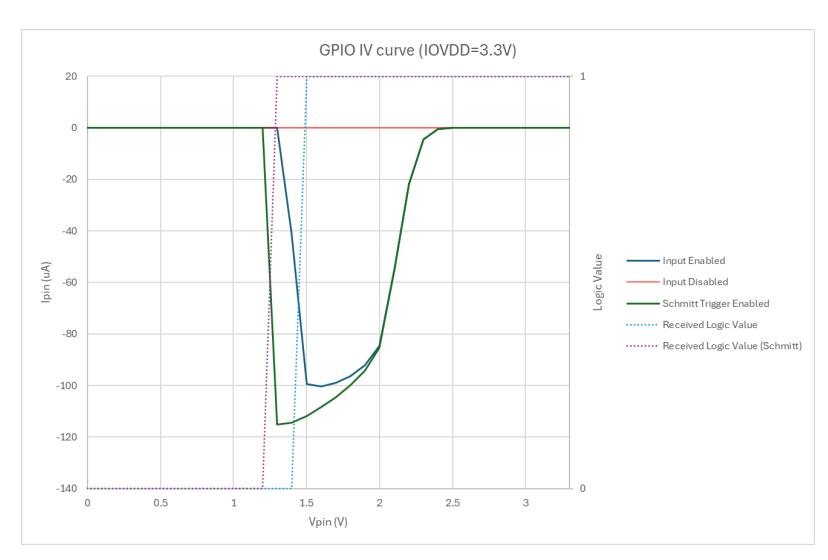
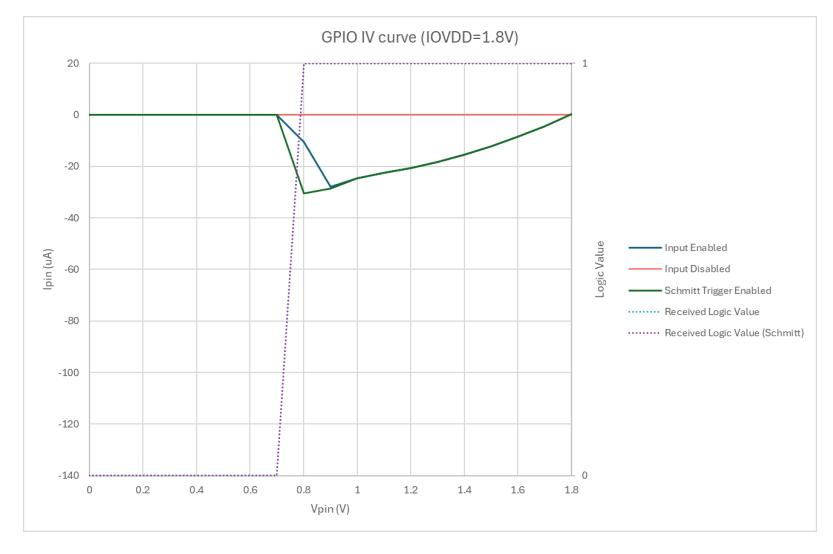

# <span id="page-1350-0"></span>**Appendix E: Errata**

Alphabetical by section.

# <span id="page-1350-1"></span>**ACCESSCTRL**

#### <span id="page-1350-2"></span>**RP2350-E3**

| Reference   | RP2350-E3                                                                                                                                                                                                                                                                                                                                                                                                                                                                      |  |  |
|-------------|--------------------------------------------------------------------------------------------------------------------------------------------------------------------------------------------------------------------------------------------------------------------------------------------------------------------------------------------------------------------------------------------------------------------------------------------------------------------------------|--|--|
| Summary     | In QFN-60 package, GPIO_NSMASK controls wrong PADS registers                                                                                                                                                                                                                                                                                                                                                                                                                   |  |  |
| Affects     | RP2350 A2, QFN-60 package only                                                                                                                                                                                                                                                                                                                                                                                                                                                 |  |  |
| Description | RP2350 remaps IOs, their control registers and their ADC channels so that both package sizes appear to<br>have consecutively numbered GPIOs, even though for physical design reasons the QFN-60 package<br>bonds out a sparse selection of IO pads.                                                                                                                                                                                                                            |  |  |
|             | The connection between the GPIO_NSMASK0/GPIO_NSMASK1 registers and the PADS registers does not<br>take this remapping into account. Consequently, in the QFN-60 package only, the GPIO_NSMASK0 register bits<br>are applied to registers for the wrong pads. Specifically, PADS_BANK0 registers 29 through 0 are controlled<br>by the concatenation of GPIO_NSMASK bits 47 through 44, 39 through 33, 30 through 28, 24 through 17 and<br>15 through 8 (all inclusive ranges). |  |  |
|             | This means that granting Non-secure access to the PADS registers in the QFN-60 package does not allow<br>Non-secure software to control the correct pads. It may also allow Non-secure control of pads that are<br>not granted in GPIO_NSMASK0.                                                                                                                                                                                                                                |  |  |
|             | Note that the QSPI PADS registers (Bank 1) are not affected, as these are not remapped for different<br>packages.                                                                                                                                                                                                                                                                                                                                                              |  |  |
| Workaround  | Disable Non-secure access to the PADS registers by clearing PADS_BANK0.NSP, NSU.                                                                                                                                                                                                                                                                                                                                                                                               |  |  |
|             | Implement a Secure Gateway (Arm) or ecall handler (RISC-V) to permit Non-Secure/U-mode code to<br>read/write its assigned PADS_BANK0 registers.                                                                                                                                                                                                                                                                                                                                |  |  |
| Fixed by    | Documentation, software                                                                                                                                                                                                                                                                                                                                                                                                                                                        |  |  |

# <span id="page-1350-3"></span>**Bootrom**

#### <span id="page-1350-4"></span>**RP2350-E10**

| Reference   | RP2350-E10                                                                                                                                                                                                                                        |  |
|-------------|---------------------------------------------------------------------------------------------------------------------------------------------------------------------------------------------------------------------------------------------------|--|
| Summary     | UF2 drag & drop doesn't work with partition tables                                                                                                                                                                                                |  |
| Affects     | RP2350 A2                                                                                                                                                                                                                                         |  |
| Description | When dragging & dropping a UF2 onto the USB Mass Storage Device, the bootrom on chip revision A2<br>does not set up the flash before checking the partition table. This causes the UF2 download to fail if there<br>is a partition table present. |  |

ACCESSCTRL **1350**

| Workaround | Add a single block at the start of the UF2 with an Absolute family ID, targeting the end of Flash, with block                                  |  |
|------------|------------------------------------------------------------------------------------------------------------------------------------------------|--|
|            | number set to 0 and number of blocks set to 2. This block will be written to flash first but doesn't reboot                                    |  |
|            | the device, and sets up the flash for the rest of the UF2 to be downloaded correctly.                                                          |  |
|            | This is handled for you automatically by picotool in the SDK, which adds this block when generating UF2s<br>if theabs-block flag is specified. |  |
| Fixed by   | Documentation, software                                                                                                                        |  |

<span id="page-1351-0"></span>

| Reference   | RP2350-E13                                                                                                                                                                                                                                                                                                                                    |  |
|-------------|-----------------------------------------------------------------------------------------------------------------------------------------------------------------------------------------------------------------------------------------------------------------------------------------------------------------------------------------------|--|
| Summary     | A binary containing both RP2040 and RP2350 IMAGE_DEFs (in that order) fails to boot                                                                                                                                                                                                                                                           |  |
| Affects     | RP2350 A2                                                                                                                                                                                                                                                                                                                                     |  |
| Description | When the block loop of a binary contains an IMAGE_DEF for RP2040 followed by an IMAGE_DEF for RP2350<br>(such as a universal binary), booting from that binary fails.                                                                                                                                                                         |  |
| Workaround  | Instead of an RP2040 IMAGE_DEF, use an IGNORED item. RP2040 does not require an IMAGE_DEF to boot a<br>binary.                                                                                                                                                                                                                                |  |
|             | SDK uses this workaround. When you set PICO_CRT0_INCLUDE_PICOBIN_BLOCK, the SDK uses an IGNORED item<br>instead of an IMAGE_DEF for RP2040 binaries. You can override this behaviour and use an IMAGE_DEF by<br>setting PICO_CRT0_INCLUDE_PICOBIN_IMAGE_TYPE_ITEM. For an additional example, see the universal binaries in<br>pico-examples. |  |
| Fixed by    | Documentation, software                                                                                                                                                                                                                                                                                                                       |  |

#### <span id="page-1351-1"></span>**RP2350-E14**

| Reference   | RP2350-E14                                                                                                                                                                                                                       |  |  |  |
|-------------|----------------------------------------------------------------------------------------------------------------------------------------------------------------------------------------------------------------------------------|--|--|--|
| Summary     | The bootrom connect_internal_flash() function always uses pin 0, ignoring any configured<br>FLASH_DEVINFO CS1 chip select pin                                                                                                    |  |  |  |
| Affects     | RP2350 A2                                                                                                                                                                                                                        |  |  |  |
| Description | When using the bootrom function connect_internal_flash() to configure CS1 (for instance, during a flash<br>boot), the bootrom always configures the pad registers for pin 0, ignoring any CS1 pin specified in<br>FLASH_DEVINFO. |  |  |  |
|             | As a result, the specified CS1 pin remains isolated (see Section 9.7). Accesses to the QSPI device<br>connected to the second chip select fails unless CS1 is connected to pin 0.                                                |  |  |  |
|             | FLASH_DEVINFO can be configured in OTP or at runtime. For more information, see flash_devinfo16_ptr.                                                                                                                             |  |  |  |
| Workaround  | Manually configure the CS1 pads registers to remove the isolation after using the bootrom<br>connect_internal_flash() function. Alternatively, connect CS1 to pin 0.                                                             |  |  |  |
| Fixed by    | Documentation, software                                                                                                                                                                                                          |  |  |  |

# <span id="page-1351-2"></span>**RP2350-E15**

| Reference | RP2350-E15                                                                             |
|-----------|----------------------------------------------------------------------------------------|
| Summary   | The bootrom otp_access() function applies incorrect access permission to pages 62 & 63 |

| Affects     | RP2350 A2                                                                                                                                                                                                                                                                                                                                                                                    |
|-------------|----------------------------------------------------------------------------------------------------------------------------------------------------------------------------------------------------------------------------------------------------------------------------------------------------------------------------------------------------------------------------------------------|
| Description | The bootrom otp_access() function incorrectly applies the access permissions specified in OTP rows<br>PAGE62_LOCK1 and PAGE63_LOCK1 to the entirety of their respective OTP pages (62 and 63). This is<br>incorrect, as pages 62 and 63 contain lock words for other pages: each lock word is instead protected by<br>the permissions of the corresponding page.                             |
|             | The ATE programming then locks down write access from non-Secure software and the bootloader to the<br>page 63 lock word (to prevent non-Secure setting of the RMA flag), and write access from non-Secure<br>software to the page 62 lock word. This prevents non-Secure software from modifying any of the OTP<br>page locks, and the bootloader from modifying the locks for pages 32-63. |
| Workaround  | When running code on the device, don't use the non-Secure otp_access() function to set locks for OTP<br>pages. To set OTP page locks from non-Secure code, implement your own Secure API to do this that can<br>be called from non-Secure code.                                                                                                                                              |
|             | Page locks for OTP pages 32-63 can be set by picotool using the picotool otp permissions command. This<br>command loads a Secure binary into XIP SRAM on the device to change the permissions before<br>rebooting back into the USB bootloader.                                                                                                                                              |
| Fixed by    | Documentation, software                                                                                                                                                                                                                                                                                                                                                                      |

<span id="page-1352-0"></span>

| Reference   | RP2350-E18                                                                                                                                                                                                                                                                                                                                                                                                                                             |
|-------------|--------------------------------------------------------------------------------------------------------------------------------------------------------------------------------------------------------------------------------------------------------------------------------------------------------------------------------------------------------------------------------------------------------------------------------------------------------|
| Summary     | The RP2350 will forever fail to boot if FLASH_PARTITION_SLOT_SIZE contains an invalid ECC bit pattern                                                                                                                                                                                                                                                                                                                                                  |
| Affects     | RP2350 A2                                                                                                                                                                                                                                                                                                                                                                                                                                              |
| Description | If ECC row programming is interrupted, an ECC row may contain a value which fails ECC validation.<br>Because any ECC could potentially contain an invalid, partially written value, the bootrom uses a separate<br>"enable" flag in OTP to indicate whether a particular ECC row is expected to contain a valid value. The<br>user is expected to only set this flag after a particular ECC row is known to have been written correctly.               |
|             | For<br>FLASH_PARTITION_SLOT_SIZE,<br>the<br>"enable"<br>flag<br>is<br>BOOT_FLAGS0.OVERRIDE_FLASH_PARTITION_SLOT_SIZE.<br>In the case of FLASH_PARTITION_SLOT_SIZE, the bootrom reads the row value and asserts the value is<br>valid<br>before<br>checking<br>the<br>enable<br>flag,<br>and<br>thus<br>the<br>boot<br>process<br>will<br>hang<br>if<br>the<br>BOOT_FLAGS0.OVERRIDE_FLASH_PARTITION_SLOT_SIZE row in OTP contains an invalid ECC value. |
| Workaround  | Don't program FLASH_PARTITION_SLOT_SIZE or at least be aware that doing so may brick your device if<br>the programming operation is interrupted or fails.                                                                                                                                                                                                                                                                                              |
| Fixed by    | Documentation                                                                                                                                                                                                                                                                                                                                                                                                                                          |

#### <span id="page-1352-1"></span>**RP2350-E19**

| Reference   | RP2350-E19                                                                                                                                                                                                 |
|-------------|------------------------------------------------------------------------------------------------------------------------------------------------------------------------------------------------------------|
| Summary     | RP2350 reboot hangs if certain bits are set in FRCE_OFF when rebooting.                                                                                                                                    |
| Affects     | RP2350 A2                                                                                                                                                                                                  |
| Description | An incorrect assertion in the boot path, assumes the all bits (other than FRCE_OFF.PROC1) are clear.<br>These bits can only be set during boot if the user had set them and then re-entered the boot path. |
| Workaround  | Do not perform a WATCHDOG or POWMAN boot, or a core0 reset with bits other than FRCE_OFF.PROC1 set.                                                                                                        |

<span id="page-1353-0"></span>

| Fixed by | Documentation |
|----------|---------------|
|          |               |

| Reference   | RP2350-E20                                                                                                                                                                                                                                                                                                                                                                                                                                                                                                                                                                                                                               |
|-------------|------------------------------------------------------------------------------------------------------------------------------------------------------------------------------------------------------------------------------------------------------------------------------------------------------------------------------------------------------------------------------------------------------------------------------------------------------------------------------------------------------------------------------------------------------------------------------------------------------------------------------------------|
| Summary     | An attacker with physical access to the chip and the ability to physically "glitch" the CPU at precise times,<br>could cause unsigned code execution on a secured RP2350 by targeting legitimate non-Secure calls to<br>the bootrom reboot() function                                                                                                                                                                                                                                                                                                                                                                                    |
| Affects     | RP2350 A2                                                                                                                                                                                                                                                                                                                                                                                                                                                                                                                                                                                                                                |
| Description | The RP2350 bootrom provides a reboot() function to reboot the RP2350. This method is potentially<br>accessible to non-Secure callers via the PICOBOOT interface (e.g. picotool) or, if the corresponding<br>permission is set, to non-Secure code running on the device.                                                                                                                                                                                                                                                                                                                                                                 |
|             | A particular reboot type (REBOOT_TYPE_PC_SP) is not allowed in the bootrom reboot() function when called<br>from non-Secure code as it launches user-provided code in a Secure state post reboot. The reboot()<br>function correctly disallows this reboot type when called from a non-Secure context, however if instead a<br>valid reboot type (e.g. REBOOT_TYPE_NORMAL) is passed to the function, a later precisely-timed processor<br>glitch can cause an incorrect code path to be taken which ends up configuring the WATCHDOG scratch<br>registers in such a way that allows secure execution of user provided code post reboot. |
| Workaround  | If any WATCHDOG based reboot types other than into the regular boot path are not required (note this<br>includes programmatic reboots into BOOTSEL mode and FLASH_UPDATE boots which are important<br>when using A/B partitions), the OTP flag BOOT_FLAGS0.DISABLE_WATCHDOG_SCRATCH can be set,<br>which causes the WATCHDOG scratch registers to be completely ignored during boot, meaning that the<br>only type of boot available via WATCHDOG reset is regular boot.                                                                                                                                                                 |
|             | A more refined approach would be to disable use of the reboot() function from non-Secure code. This is<br>the default case anyway for non-Secure code started by a secure application (see Section 5.4.2), however<br>the BOOTSEL mode bootloader is itself non-Secure application which does have access to the function.<br>BOOTSEL<br>mode<br>however<br>can<br>be<br>disabled<br>if<br>not<br>needed<br>via<br>BOOT_FLAGS0.DISABLE_BOOTSEL_UART_BOOT,<br>BOOT_FLAGS0.DISABLE_BOOTSEL_USB_PICOBOOT_IFC,<br>and<br>BOOT_FLAGS0.DISABLE_BOOTSEL_USB_MSD_IFC.                                                                            |
|             | Note that BOOT_FLAGS0.DISABLE_BOOTSEL_USB_PICOBOOT_IFC is the most important, as PICOBOOT<br>provides a conduit for a user to pass specific parameters to the bootrom reboot() function, however any<br>other use of BOOTSEL mode could be vulnerable in conjunction with some other future attack on the non<br>Secure code.                                                                                                                                                                                                                                                                                                            |
| Credit      | Marius Muench                                                                                                                                                                                                                                                                                                                                                                                                                                                                                                                                                                                                                            |
| Fixed by    | Documentation                                                                                                                                                                                                                                                                                                                                                                                                                                                                                                                                                                                                                            |

# <span id="page-1353-1"></span>**RP2350-E21**

| Reference | RP2350-E21                                                                                                                                                                                       |
|-----------|--------------------------------------------------------------------------------------------------------------------------------------------------------------------------------------------------|
| Summary   | An attacker with physical access to the chip, and the ability to physically "glitch" the CPU at precise times,<br>could potentially extract sensitive data from OTP on a RP2350 in BOOTSEL mode. |
| Affects   | RP2350 A2                                                                                                                                                                                        |

| Description | An attacker with physical access to the chip, could precisely time physical glitch attacks during entry to<br>BOOTSEL mode and cause some OTP page access permissions for BOOTSEL mode not to be applied,<br>leading to possible exposure of sensitive data.                                                                                                      |
|-------------|-------------------------------------------------------------------------------------------------------------------------------------------------------------------------------------------------------------------------------------------------------------------------------------------------------------------------------------------------------------------|
|             | The RP2350 BOOTSEL mode exposes an API over PICOBOOT such that a user can read/write OTP rows<br>via picotool. Of course, certain OTP rows (e.g. encryption keys or other secrets) should not be readable<br>via this method. Equally, certain rows might be protected against writes. This is handled at the page (64<br>row) level by page locks stored in OTP. |
|             | On entry to BOOTSEL mode, the OTP should be locked down such that no software (including Secure<br>software) can access anything not marked as accessible to BOOTSEL mode. However, with two precisely<br>timed processor glitches, it is possible to prevent a page being correctly locked.                                                                      |
| Workaround  | 1. Disable the BOOTSEL mode bootloader altogether via<br>BOOT_FLAGS0.DISABLE_BOOTSEL_UART_BOOT,<br>BOOT_FLAGS0.DISABLE_BOOTSEL_USB_PICOBOOT_IFC, and<br>BOOT_FLAGS0.DISABLE_BOOTSEL_USB_MSD_IFC.                                                                                                                                                                  |
|             | Note that BOOT_FLAGS0.DISABLE_BOOTSEL_USB_PICOBOOT_IFC is the most important, as PICOBOOT<br>provides the conduit for a user to access the OTP, however any other use of BOOTSEL mode could be<br>vulnerable in conjunction with some other future attack on the non-Secure code.                                                                                 |
|             | 1. Use an OTP access key (Section 13.5.2) to protect OTP data you do not want accessed from<br>BOOTSEL mode, although this only helps if the data is not needed until your application can provide<br>the key.                                                                                                                                                    |
| Credit      | Thomas Roth                                                                                                                                                                                                                                                                                                                                                       |
| Fixed by    | Documentation                                                                                                                                                                                                                                                                                                                                                     |

<span id="page-1354-0"></span>

| Reference   | RP2350-E22                                                                                                                                                                                                                                                                                                                                                                                                     |
|-------------|----------------------------------------------------------------------------------------------------------------------------------------------------------------------------------------------------------------------------------------------------------------------------------------------------------------------------------------------------------------------------------------------------------------|
| Summary     | Parsing a malformed "lollipop" block loop will cause a hang rather than a failure                                                                                                                                                                                                                                                                                                                              |
| Affects     | RP2350 A2                                                                                                                                                                                                                                                                                                                                                                                                      |
| Description | PARTITION_TABLEs and IMAGE_DEFs metadata are stored as part of a block loop. These block loops are parsed<br>during boot and at other times. A "lollipop" block loop is an invalid block loop, which loops back from the<br>last block to a block which is not the first. Such an invalid block loop is never generated by the SDK or by<br>picotool, however could potentially be generated by other tooling. |
| Workaround  | Don't use "lollipop" block loops. If you program a "lollipop" block loop into flash such that it is read during<br>the boot process, it will cause a boot hang and also a hang on entry into BOOTSEL mode. Therefore, to re<br>enable booting, you will to have clear the flash in some other way, for example from the debugger over<br>SWD.                                                                  |
| Fixed by    | Documentation                                                                                                                                                                                                                                                                                                                                                                                                  |

# <span id="page-1354-1"></span>**RP2350-E23**

| Reference | RP2350-E23                                                    |
|-----------|---------------------------------------------------------------|
| Summary   | PICOBOOT GET_INFO command always returns zero for PACKAGE_SEL |
| Affects   | RP2350 A2                                                     |

| Description | The PICOBOOT GET_INFO command can be used to get system information in a similar way to the<br>bootrom get_sys_info() function. This information can include the value read from PACKAGE_SEL which<br>indicates whether the RP2350 package is QFN60 or QFN80. |
|-------------|---------------------------------------------------------------------------------------------------------------------------------------------------------------------------------------------------------------------------------------------------------------|
|             | The SYSINFO block is erroneously left in reset when entering BOOTSEL mode, and thus this register is read<br>as zero when accessed via PICOBOOT.                                                                                                              |
|             | Note this problem does not affect use of the bootrom get_sys_info() function itself from user code.                                                                                                                                                           |
| Workaround  | Determine the package size by reading register_link_macro:[register=OTP_DATA_NUM_GPIOS_ROW] via<br>the PICOBOOT OTP_READ command instead. This workaround is used by picotool.                                                                                |
| Fixed by    | Documentation, Software                                                                                                                                                                                                                                       |

<span id="page-1355-0"></span>

| Reference   | RP2350-E24                                                                                                                                                                                                                                                                                                                                                                                                                                                                                                                                                                                         |
|-------------|----------------------------------------------------------------------------------------------------------------------------------------------------------------------------------------------------------------------------------------------------------------------------------------------------------------------------------------------------------------------------------------------------------------------------------------------------------------------------------------------------------------------------------------------------------------------------------------------------|
| Summary     | An attacker with physical access to the chip, moderate hardware, and the ability to physically "glitch" the<br>CPU at precise times, could cause unsigned code execution on a secured RP2350.                                                                                                                                                                                                                                                                                                                                                                                                      |
| Affects     | RP2350 A2                                                                                                                                                                                                                                                                                                                                                                                                                                                                                                                                                                                          |
| Description | An attacker with physical access to the chip, and the ability to switch the contents of "flash" as read by<br>the RP2350 over QSPI during boot at precise times, could, combined with a precisely-timed physical<br>"glitch" attack of the CPU, trick the bootrom into checking the signature of data other than the program<br>binary as loaded into memory during secure boot.<br>If this "other" data passes the signature check, then the attacker's binary is executed without itself having<br>passed a signature check, which allows the user to run arbitrary unsigned code on the RP2350. |
| Credit      | Kévin Courdesses (see https://courk.cc/rp2350-challenge-laser#flash-memory-organization)                                                                                                                                                                                                                                                                                                                                                                                                                                                                                                           |
| Workaround  | none                                                                                                                                                                                                                                                                                                                                                                                                                                                                                                                                                                                               |
| Fixed by    | not fixed                                                                                                                                                                                                                                                                                                                                                                                                                                                                                                                                                                                          |

# <span id="page-1355-1"></span>**RP2350-E25**

| Reference   | RP2350-E25                                                                                                                                                                                                                                                                                                                                                                                                                         |
|-------------|------------------------------------------------------------------------------------------------------------------------------------------------------------------------------------------------------------------------------------------------------------------------------------------------------------------------------------------------------------------------------------------------------------------------------------|
| Summary     | A LOAD_MAP which uses non-word sizes does not cause an error.                                                                                                                                                                                                                                                                                                                                                                      |
| Affects     | RP2350 A2                                                                                                                                                                                                                                                                                                                                                                                                                          |
| Description | Non-word sizes in a LOAD_MAP are not supported and were documented as such, however they do not<br>currently cause an error. Whilst non-word sizes may currently work in some certain cases, you should<br>never use them, as they may not work as you expect in all cases and may be properly treated as an error<br>in the future.<br>Note that the SDK and picotool do not generate such LOAD_MAPs with non-word sized entries. |
| Workaround  | Do not use non-word (not multiple of 4) sizes in a LOAD_MAP. A best practice is to make sure that linker<br>memory segments are both word-sized and word-aligned.                                                                                                                                                                                                                                                                  |
| Fixed by    | Documentation                                                                                                                                                                                                                                                                                                                                                                                                                      |

# <span id="page-1356-0"></span>**DMA**

# <span id="page-1356-1"></span>**RP2350-E5**

| Reference   | RP2350-E5                                                                                                                                                                                                                                                                                                                                                                                                                                                                                                                                                                                                                                                                                                                                          |
|-------------|----------------------------------------------------------------------------------------------------------------------------------------------------------------------------------------------------------------------------------------------------------------------------------------------------------------------------------------------------------------------------------------------------------------------------------------------------------------------------------------------------------------------------------------------------------------------------------------------------------------------------------------------------------------------------------------------------------------------------------------------------|
| Summary     | Interactions between CHAIN_TO and ABORT of active channels                                                                                                                                                                                                                                                                                                                                                                                                                                                                                                                                                                                                                                                                                         |
| Affects     | RP2350 A2                                                                                                                                                                                                                                                                                                                                                                                                                                                                                                                                                                                                                                                                                                                                          |
| Description | The CHAN_ABORT register commands a DMA channel to stop issuing transfers, and to clear its BUSY flag<br>once in-flight transfers have completed. This was originally intended for recovering channels which are<br>stuck with their DREQ low. An ABORT is initiated by writing a bitmap of aborted channels to CHAN_ABORT.<br>Bits remain set until each channel comes to rest.                                                                                                                                                                                                                                                                                                                                                                    |
|             | This erratum is a compound of two behaviours: first, aborting a channel will cause its CHAIN_TO to fire, if<br>and only if the aborted channel is the last channel to have completed a write transfer. Second, a channel<br>undergoing an ABORT is susceptible to be re-triggered on the last cycle before the ABORT register clears,<br>because the channel is both inactive and enabled on this cycle, and the ABORT itself does not inhibit<br>triggering. However, since the ABORT is still in effect, the transfer count is held at zero. On the cycle after<br>the ABORT finishes, the channel completes because its transfer counter is zero. This causes the channel's<br>IRQ and CHAIN_TO to fire on the cycle after the ABORT completes. |
|             | These two behaviours are problematic when aborting multiple channels that chain to one another, since<br>they may cause the channels to immediately restart post-abort.                                                                                                                                                                                                                                                                                                                                                                                                                                                                                                                                                                            |
| Workaround  | Before aborting an active channel, clear the EN bit (CH0_CTRL_TRIG.EN) of both the aborted channel and<br>any channel it chains to. This ensures the channel is not susceptible to re-triggering.                                                                                                                                                                                                                                                                                                                                                                                                                                                                                                                                                  |
| Fixed by    | Documentation                                                                                                                                                                                                                                                                                                                                                                                                                                                                                                                                                                                                                                                                                                                                      |

# <span id="page-1356-2"></span>**RP2350-E8**

| Reference   | RP2350-E8                                                                                                                                                                                                                                                                                                                                 |
|-------------|-------------------------------------------------------------------------------------------------------------------------------------------------------------------------------------------------------------------------------------------------------------------------------------------------------------------------------------------|
| Summary     | CHAIN_TO may not fire for zero-length transfers                                                                                                                                                                                                                                                                                           |
| Affects     | RP2350 A2                                                                                                                                                                                                                                                                                                                                 |
| Description | The CTRL.CHAIN_TO field configures a channel to start another channel once it completes its programmed<br>sequence of transfers. The CHAIN_TO takes place on the cycle where the channel's last write completes,<br>and the chainee becomes active on the next cycle.                                                                     |
|             | The hardware implementation assumes that CHAIN_TO always happens as a result of a write completion.<br>This is not the case when a channel is triggered with a transfer count of zero: in this case the channel<br>completes on the cycle immediately after the trigger, without performing any bus accesses.                             |
|             | A CHAIN_TO from a channel started with a transfer count of zero will fire if and only if that channel is the<br>last channel to have completed a write transfer. This is true only when the channel in question has<br>previously performed a non-zero-length sequence of transfers, and no other channel has completed a<br>write since. |
| Workaround  | Do not use CHAIN_TO in conjunction with zero-length transfers. Avoid zero-length transfers in the middle of<br>control block lists, and replace them with dummy transfers if possible.                                                                                                                                                    |
| Fixed by    | Documentation                                                                                                                                                                                                                                                                                                                             |

DMA **1356**

# <span id="page-1357-0"></span>**GPIO**

### <span id="page-1357-1"></span>**RP2350-E9**

| Reference | RP2350-E9                                                          |
|-----------|--------------------------------------------------------------------|
| Summary   | Increased leakage current on Bank 0 GPIO when pad input is enabled |
| Affects   | RP2350 A2                                                          |

GPIO **1357**

**Description** For GPIO pads 0 through 47:

Increased leakage current when Bank 0 GPIO pads are configured as inputs and the pad is somewhere between VIL and VIH (the undefined logic region).

When the pad is set as an input (input enable is enabled and output enable is disabled) and the voltage on the pad is within the undefined logic region, the leakage current exceeds the standard specified IIN leakage level. During this condition the pad can source current (the exact amount is dependent on the chip itself and the exact pad voltage, but typically around 120μA). This leakage will hold the pad at around 2.2 V as that is the effective source voltage of the leakage, and can only be overcome with a suitably low impedance driver / pull.

Note that the pad pull-down (if enabled) is significantly weaker than the leakage current in this state and therefore is not strong enough to pull the pad voltage low.

Driving / pulling the pad input low with a low impedance source of 8.2 kΩ or less will overcome the erroneous leakage and drive the voltage below the level where the leakage current occurs, so in this case if the pad is driven / pulled low it will stay low.

The erroneous leakage only occurs (and continues to occur) when the pad input enable is enabled; disabling the input enable will reset (remove) the leakage.

The pad pull-up still works. If enabled it will pull the pad to IOVDD as it will pull the input voltage out of the problematic range.

The voltages and currents above are based on IOVDD at 3.3 V. For IOVDD at 1.8 V the effective source voltage of the leakage becomes 1.8 V and the peak current is around 30μA. This is effectively a pull-up (separate to the standard pad pull-up) when the pad voltage is between 0.6 V and 1.8 V.

These graphs show the leakage current versus pad input voltage for a typical chip for IOVDD at 3.3 V [Figure 152](#page-1359-1) and 1.8 V [Figure 153.](#page-1359-2)

In detail, this issue presents under the following conditions, for any GPIO 0 through 47:

- 1. The voltage on the pad is in the undefined logic region.
- 2. Input buffer is enabled in [GPIO0.](#page-784-1)IE
- 3. Output buffer is disabled (e.g. selecting the NULL GPIO function)
- 4. Isolation is clear in [GPIO0](#page-784-1).ISO, or the previous were true at the point isolation was set

When all of the above conditions are met, the input leakage of the pad may exceed the specification.

This issue may affect a number of common circuits:

- Relying on floating pins to have a low leakage current
- Relying on the internal pull-down resistor

If the internal pull-up is enabled then any floating signal will be pulled high thus removing increased leakage condition as the excess leakage is only sourcing current. This of course can't prevent the increased leakage if the pad is fed via a strong source e.g. strong potential divider.

Note that this does not affect the pull-down behaviour of the pads immediately following a PoR or RUN reset, because the input enable field is initially clear. The pull-down resistor functions normally in this state.

This issue does not affect the QSPI pads, which use a different pad macro without the faulty circuitry. The USB PHY's pins are also unaffected.

This issue does also affect the SWD pads, which use the same fault-tolerant pad macro as the Bank 0 GPIOs. However, both SWD pads are pull-up by default, so there is no ill effect.

GPIO **1358**

# **Workaround** If pad pull-down behaviour is required, clear the pad input enable in [GPIO0](#page-784-1).IE (for GPIOs 0 through 47) to ensure that the pad pull-down resistor pulls the pad signal low. To read the state of a pad pulled-down GPIO from software, enable the input buffer by setting [GPIO0.](#page-784-1)IE immediately before reading, and then redisable immediately afterwards. Note that if the pad is already a logic-0, re-enabling the input does not disturb the pull-down state. Alternatively an external pull-down of 8.2 kΩ or less can be used. Note that PIO programs can't toggle pad controls and therefore external pulls may be required, depending on your application. As normal, if ADC channels are being used on a pin, clear the relevant GPIO input enable as stated in [Section 12.4.3](#page-1066-1).

*Figure 152. GPIO Pad leakage for IOVDD=3.3 V*

**Fixed by** Documentation

<span id="page-1359-1"></span>

*Figure 153. GPIO Pad leakage for IOVDD=1.8 V*

<span id="page-1359-2"></span>

# <span id="page-1359-0"></span>**Hazard3**

Hazard3 **1359**

<span id="page-1360-0"></span>

| Reference   | RP2350-E4                                                                                                                                                                                                                                                                                                                                                               |
|-------------|-------------------------------------------------------------------------------------------------------------------------------------------------------------------------------------------------------------------------------------------------------------------------------------------------------------------------------------------------------------------------|
| Summary     | System Bus Access stalls indefinitely when core 1 is in clock-gated sleep                                                                                                                                                                                                                                                                                               |
| Affects     | RP2350 A2                                                                                                                                                                                                                                                                                                                                                               |
| Description | System Bus Access (SBA) is a RISC-V debug feature that allows the Debug Module direct access to the<br>system bus, independent of the state of harts in the system. RP2350 implements SBA by arbitrating<br>Debug Module bus accesses with the core 1 load/store port.                                                                                                  |
|             | Hazard3 implements custom low-power states controlled by the MSLEEP CSR. When<br>MSLEEP.DEEPSLEEP is set, Hazard3 completely gates its clock, with the exception of the minimal logic<br>required to wake again. Due to a design oversight, this also clock-gates the arbiter between SBA and<br>load/store bus access. (This is addressed in upstream commit c11581e.) |
|             | Consequently, if you initiate an SBA transfer whilst MSLEEP.DEEPSLEEP is set on core 1, and core 1 is in<br>a WFI-equivalent sleep state, the SBA transfer will make no progress until core 1 wakes from the WFI<br>state. The processor wakes upon an enabled interrupt being asserted, or a debug halt request.                                                       |
| Workaround  | Either configure your debug translator to not use SBA, or do not enter clock-gated sleep on core 1. The A2<br>bootrom mitigates this issue by not setting DEEPSLEEP in the initial core 1 wait-for-launch code.                                                                                                                                                         |
|             | Note that the processors are synthesised with hierarchical clock gating, so the top-level clock gate<br>controlled by the DEEPSLEEP flag brings minimal power savings over a default WFI sleep state.                                                                                                                                                                   |
| Fixed by    | Documentation                                                                                                                                                                                                                                                                                                                                                           |

# <span id="page-1360-1"></span>**RP2350-E6**

| Reference   | RP2350-E6                                                                                                                                                                                                                                                                                                                                                                                                                                                                                                                                                                  |
|-------------|----------------------------------------------------------------------------------------------------------------------------------------------------------------------------------------------------------------------------------------------------------------------------------------------------------------------------------------------------------------------------------------------------------------------------------------------------------------------------------------------------------------------------------------------------------------------------|
| Summary     | PMPCFGx RWX fields are transposed                                                                                                                                                                                                                                                                                                                                                                                                                                                                                                                                          |
| Affects     | RP2350 A2                                                                                                                                                                                                                                                                                                                                                                                                                                                                                                                                                                  |
| Description | The Physical Memory Protection unit (PMP) defines read, write and execute permissions (RWX) for<br>configurable ranges of physical memory. The RWX permissions for four regions are packed into each 32-<br>bit PMPCFG register, PMPCFG0 through PMPCFG3.<br>Per the RISC-V privileged ISA specification, the permission fields are ordered X, W, R from MSB to LSB.<br>Hazard3 implements them in the order R, W, X. This means software using the correct bit order will have<br>its read permissions applied as execute, and vice versa. (See upstream commit 7d37029.) |
| Workaround  | When configuring PMP with X != R, use the bit order implemented by this version of Hazard3. In the SDK,<br>the hardware/regs/rvcsr.h register header provides bitfield definitions for the as-implemented order when<br>building for RP2350.                                                                                                                                                                                                                                                                                                                               |
| Fixed by    | Documentation                                                                                                                                                                                                                                                                                                                                                                                                                                                                                                                                                              |

# <span id="page-1360-2"></span>**RP2350-E7**

| Reference | RP2350-E7                          |
|-----------|------------------------------------|
| Summary   | U-mode does not ignore mstatus.mie |
| Affects   | RP2350 A2                          |

Hazard3 **1360**

| Description | The MSTATUS.MIE bit is a global enable for interrupts which target M-mode. Software generally clears<br>this momentarily to ensure short critical sections are atomic with respect to interrupt handlers.                                                 |
|-------------|-----------------------------------------------------------------------------------------------------------------------------------------------------------------------------------------------------------------------------------------------------------|
|             | The RISC-V privileged ISA specification requires that the interrupt enable flag for a given privilege mode is<br>treated as 1 when the hart is in a lower privilege mode. In this case, mstatus.mie should be treated as 1<br>when the core is in U-mode. |
|             | Hazard3 does not implement this rule, so entering U-mode with M-mode interrupts disabled results in no<br>M-mode interrupts being taken. (See upstream commit a84742a.)                                                                                   |
| Workaround  | When returning to U-mode from M-mode via an mret with mstatus.mpp == 0, ensure mstatus.mpie is set, so<br>that IRQs will be enabled by the return.                                                                                                        |
| Fixed by    | Documentation                                                                                                                                                                                                                                             |

# <span id="page-1361-0"></span>**OTP**

# <span id="page-1361-1"></span>**RP2350-E16**

| Reference   | RP2350-E16                                                                                                                                                                                                                                                                                                                                                                                                          |
|-------------|---------------------------------------------------------------------------------------------------------------------------------------------------------------------------------------------------------------------------------------------------------------------------------------------------------------------------------------------------------------------------------------------------------------------|
| Summary     | USB_OTP_VDD disruption can result in corrupt OTP row read data                                                                                                                                                                                                                                                                                                                                                      |
| Affects     | RP2350 A2                                                                                                                                                                                                                                                                                                                                                                                                           |
| Description | The OTP array has a read voltage generated from USB_OTP_VDD using an internal linear regulator. While the<br>regulator has a "power good" signal, it is not sampled outside of the initial power-on reset startup<br>sequence. External manipulation of USB_OTP_VDD can result in incorrect data being latched during the array<br>read phase.                                                                      |
|             | The erroneous behaviour includes, but is not limited to:                                                                                                                                                                                                                                                                                                                                                            |
|             | •<br>Latching the previous read cycle data from the array                                                                                                                                                                                                                                                                                                                                                           |
|             | •<br>One or many bitlines returning zeroes for programmed bits                                                                                                                                                                                                                                                                                                                                                      |
|             | •<br>Byte-shifted read data                                                                                                                                                                                                                                                                                                                                                                                         |
|             | In the case of guarded reads, the first failure mode can result in the guard read check passing and the<br>guard word also ending up as the read data. If the critical data are the CRIT0/CRIT1 flags, sampled by the<br>OTP PSM during boot, this can enable Hazard3 debug and disable the Arm cores which results in a<br>reversion of the effects of the CRIT1.SECURE_BOOT_ENABLE and CRIT1.DEBUG_DISABLE flags. |
|             | Guarded ECC reads are not typically vulnerable to corruption of this nature as the guard word is an invalid<br>ECC word, and bit deletion or byte shifting reliably invalidates the ECC check.                                                                                                                                                                                                                      |
| Credit      | Aedan Cullen (see https://github.com/aedancullen/hacking-the-rp2350)                                                                                                                                                                                                                                                                                                                                                |
| Workaround  | None                                                                                                                                                                                                                                                                                                                                                                                                                |
| Fixed by    | Not fixed                                                                                                                                                                                                                                                                                                                                                                                                           |

# <span id="page-1361-2"></span>**RP2350-E17**

| Reference | RP2350-E17 |
|-----------|------------|
|           |            |

OTP **1361**

| Summary     | Performing a guarded read on a single ECC OTP row causes a fault if the data in the adjacent row is not<br>also valid ECC data.                                                                                                                                                                                                                                                                                                          |
|-------------|------------------------------------------------------------------------------------------------------------------------------------------------------------------------------------------------------------------------------------------------------------------------------------------------------------------------------------------------------------------------------------------------------------------------------------------|
| Affects     | RP2350 A2                                                                                                                                                                                                                                                                                                                                                                                                                                |
| Description | Each "ECC row" in OTP stores 16 bits of user data along with error correction information used to correct<br>and/or detect bit errors. ECC rows are used to store data values which are written a full 16 bits at a time<br>into OTP.                                                                                                                                                                                                    |
|             | A "guarded" ECC row read is intended to be used by the RP2350 boot path, or other Secure software when<br>it expects to read an ECC row and cannot proceed if the row value is invalid. Reading such an invalid ECC<br>value via a "guarded" read will halt the chip until it is rebooted.                                                                                                                                               |
|             | If ECC row programming is interrupted, an ECC row may contain a value which fails ECC validation.<br>Because any ECC could potentially contain an invalid, partially written value, the bootrom uses a separate<br>"enable" flag in OTP to indicate whether a particular ECC row is expected to contain a valid value. The<br>user is expected to only set this flag after a particular ECC row is known to have been written correctly. |
|             | The RP2350 OTP hardware actually reads a pair of rows (starting on the even row) whenever an ECC read<br>is performed but only returns one row value. When performing a guarded ECC read, it actually checks<br>both rows validity, so the guarded read can cause a halt if either row in the pair is not a valid ECC value.                                                                                                             |
| Workaround  | •<br>Never store ECC rows and RAW rows in the same pair of rows (a pair of rows starting on an even<br>row number), since the RAW row is unlikely to always contain a valid ECC value. Note however that<br>zero in a RAW row is a valid ECC value.                                                                                                                                                                                      |
|             | •<br>Never store two ECC rows in the same pair of rows if they are protected by different "enable" flags.                                                                                                                                                                                                                                                                                                                                |
|             | This workaround is fine for user use of OTP, however certain pre-existing ECC row pairs used by the<br>bootrom violate workaround 2:                                                                                                                                                                                                                                                                                                     |
|             | •<br>FLASH_DEVINFO and FLASH_PARTITION_SLOT_SIZE                                                                                                                                                                                                                                                                                                                                                                                         |
|             | •<br>BOOTSEL_LED_CFG and BOOTSEL_PLL_CFG                                                                                                                                                                                                                                                                                                                                                                                                 |
|             | To be absolutely safe, you should not update and set the "enable" flag for one half of the pair after you<br>have set the "enable" flag for the other half. If you want to set both ECC values safely, set them both, then<br>set both "enable" flags.                                                                                                                                                                                   |
| Fixed by    | Documentation                                                                                                                                                                                                                                                                                                                                                                                                                            |

# <span id="page-1362-0"></span>**RCP**

# <span id="page-1362-1"></span>**RP2350-E26**

| Reference | RP2350-E26                                  |
|-----------|---------------------------------------------|
| Summary   | RCP random delays can create a side-channel |
| Affects   | RP2350 A2                                   |

RCP **1362**

| Description | The RCP delay is implemented as a coprocessor stall; this has the effect of completely pausing the<br>associated core. As the core is effectively halted for the duration of the delay, this represents a<br>significant reduction in gate toggle activity across the chip if there are no other bus managers active (e.g.<br>other CPU or DMA). The reduction in toggle activity causes a reduction in DVDD current, and the typical<br>length of the delay means that the reduction is measureable outside of the chip. The reduction in current<br>and subsequent increase may create a fault injection trigger point. Instructions immediately after an RCP<br>delay operation can be more reliably targeted, undoing the cumulative effect of clock randomisation.<br>A second-order effect of the RCP delay probability distribution is that after N RCP instructions for large N,<br>the added latency converges to a normal distribution centred on N * 63 cycles. Therefore instructions |
|-------------|---------------------------------------------------------------------------------------------------------------------------------------------------------------------------------------------------------------------------------------------------------------------------------------------------------------------------------------------------------------------------------------------------------------------------------------------------------------------------------------------------------------------------------------------------------------------------------------------------------------------------------------------------------------------------------------------------------------------------------------------------------------------------------------------------------------------------------------------------------------------------------------------------------------------------------------------------------------------------------------------------|
|             | after a known number of RCP delays are statistically easier to target.                                                                                                                                                                                                                                                                                                                                                                                                                                                                                                                                                                                                                                                                                                                                                                                                                                                                                                                            |
|             | With these two factors in mind, programmers should use RCP delays in Secure code with great care. In<br>particular, avoid using RCP delays:                                                                                                                                                                                                                                                                                                                                                                                                                                                                                                                                                                                                                                                                                                                                                                                                                                                       |
|             | •<br>Inside inner loops that may be executed many times                                                                                                                                                                                                                                                                                                                                                                                                                                                                                                                                                                                                                                                                                                                                                                                                                                                                                                                                           |
|             | •<br>As part of boilerplate assembly in function prologues/epilogues                                                                                                                                                                                                                                                                                                                                                                                                                                                                                                                                                                                                                                                                                                                                                                                                                                                                                                                              |
|             | •<br>Immediately prior to particularly critical actions, such as modifying ACCESSCTRL.                                                                                                                                                                                                                                                                                                                                                                                                                                                                                                                                                                                                                                                                                                                                                                                                                                                                                                            |
| Workaround  | Use of the non-delay RCP instruction variant is recommended.                                                                                                                                                                                                                                                                                                                                                                                                                                                                                                                                                                                                                                                                                                                                                                                                                                                                                                                                      |
| Fixed by    | Documentation, Software                                                                                                                                                                                                                                                                                                                                                                                                                                                                                                                                                                                                                                                                                                                                                                                                                                                                                                                                                                           |

# <span id="page-1363-0"></span>**SIO**

# <span id="page-1363-1"></span>**RP2350-E1**

| Reference   | RP2350-E1                                                                                                                                                                                                                                                                                                                                                                                    |
|-------------|----------------------------------------------------------------------------------------------------------------------------------------------------------------------------------------------------------------------------------------------------------------------------------------------------------------------------------------------------------------------------------------------|
| Summary     | Interpolator OVERF bits are broken by new right-rotate behaviour                                                                                                                                                                                                                                                                                                                             |
| Affects     | RP2350 A2                                                                                                                                                                                                                                                                                                                                                                                    |
| Description | RP2350 replaces the interpolator right-shift with a right-rotate, so that left shifts can be synthesised. This<br>is useful for scaled indexed addressing in tight address-generating loops.                                                                                                                                                                                                 |
|             | The OVERF flag functions by checking for nonzero bits in the post-shift value that have been masked out by<br>the MSB mask configured by the CTRL_LANE0_MASK_MSB and CTRL_LANE1_MASK_MSB register fields. This is used to<br>discard samples outside of the [0, 1) wrapping domain of UV coordinates represented by ACCUM0 and<br>ACCUM1, for example in affine-transformed sprite sampling. |
|             | The issue occurs because the right-rotate causes nonzero LSBs to be rotated up to the MSBs. These<br>nonzero bits spuriously set the OVERF flag.                                                                                                                                                                                                                                             |
| Workaround  | Either compute OVERF manually by checking the ACCUM0/ACCUM1 MSBs, or precompute the bounds in advance<br>to avoid per-sample checks.                                                                                                                                                                                                                                                         |
| Fixed by    | Documentation                                                                                                                                                                                                                                                                                                                                                                                |

# <span id="page-1363-2"></span>**RP2350-E2**

| Reference | RP2350-E2                                        |
|-----------|--------------------------------------------------|
| Summary   | SIO SPINLOCK writes are mirrored at +0x80 offset |

SIO **1363**

| Affects     | RP2350 A2                                                                                                                                                                                                                                                                                                                                                                      |
|-------------|--------------------------------------------------------------------------------------------------------------------------------------------------------------------------------------------------------------------------------------------------------------------------------------------------------------------------------------------------------------------------------|
| Description | The SIO contains spinlock registers, SPINLOCK0 through SPINLOCK31. Reading a spinlock register<br>attempts to claim it, returning nonzero if the claim was successful and 0 if unsuccessful. Writing to a<br>spinlock register releases it, so the next claim will be successful. SIO spinlock registers are at register<br>offsets 0x100 through 0x17c within SIO.            |
|             | RP2350 adds new SIO registers at register offsets 0x180 and above: Doorbells, the PERI_NONSEC register,<br>the RISC-V soft IRQ register, the RISC-V MTIME registers, and the TMDS encoder.                                                                                                                                                                                     |
|             | The SIO address decoder detects writes to spinlocks by decoding on bit 8 of the address. This means<br>writes in the range 0x180 through 0x1fc are spuriously detected as writes to the corresponding spinlock<br>address 128 bytes below, in the range 0x100 through 0x17c. Writing to any of these high registers will set<br>the corresponding lock to the unclaimed state. |
|             | This erratum only affects writes to the spinlock registers. Reads are correctly decoded, so are not<br>affected by accesses above 0x17c.                                                                                                                                                                                                                                       |
| Workaround  | Use processor atomic instructions instead of the SIO spinlocks. The SDK hardware_sync_spin_lock library<br>uses software lock variables by default when building for RP2350, instead of hardware spinlocks.                                                                                                                                                                    |
|             | The following SIO spinlocks can be used normally as they do not alias with writable registers: 5, 6, 7, 10,<br>11, and 18 through 31. Some of the other lock addresses may be used safely depending on which of the<br>high-addressed SIO registers are in use.                                                                                                                |
|             | Note that locks 18 through 24 alias with some read-only TMDS encoder registers, which is safe as only<br>writes are misdecoded.                                                                                                                                                                                                                                                |
| Fixed by    | Documentation, software                                                                                                                                                                                                                                                                                                                                                        |

# <span id="page-1364-0"></span>**XIP**

# <span id="page-1364-1"></span>**RP2350-E11**

| Reference | RP2350-E11                                                           |
|-----------|----------------------------------------------------------------------|
| Summary   | XIP cache clean by set/way operation modifies the tag of dirty lines |
| Affects   | RP2350 A2                                                            |

XIP **1364**

**Description** The 0x1 clean by set/way cache maintenance operation performs the following steps:

- 1. Selects a cache line: address bits 12:3 index the cache sets, and bit 13 selects from the two 8-byte cache lines which make up the ways of each set
- 2. Checks if the line contains uncommitted write data (a **dirty** line)
- 3. If the line is dirty, writes the data downstream and marks the line as **clean**

In the third step, in addition to marking the line as clean, the cache controller erroneously sets the cache line's tag to address bits 25:13 of the maintenance write which initiated the clean operation. The cache uses the tag to recall which of the many possible downstream addresses currently resides in each cache line. Therefore reading the newly tagged address returns cached data from the original address, breaking the memory contract.

Consider the following example scenario:

- QMI window 0 (starting at 0x10000000) has a flash device attached
- QMI window 1 (starting at 0x11000000) has a PSRAM device attached
- The cache possesses address 0x11000000 in the dirty state, and it is allocated in way 0 of the cache

The programmer cleans the cache, starting by writing to address 0x18000001 to clean set 0, way 0. This cleans the dirty line containing address 0x11000000. After cleaning, the cache updates this line's tag to allzeroes (the offset of the maintenance write). A subsequent read from 0x10000000 results in a spurious cache hit, returning PSRAM data in place of flash data.

See [Section 4.4.1.1](#page-342-0) for more information about cache maintenance operations. See [Section 4.4.1.2](#page-342-1) for more information about cache line states and state transitions.

The tag update *only* affects 0x1 clean by set/way; is either correct or harmless for the other four cache maintenance operations.

**Workaround** To avoid spurious cache hits, choose an address that cannot alias with cached data from the QMI. This remaps dirty lines outside of the QMI address space after cleaning them, which has the side effect of causing a cache miss on the next access to the dirty address. The SDK xip_cache_clean_all() function implements this workaround.

> The updated tag is predictable: it is always the address of the maintenance write. For example, use the upper 16 kB of the maintenance space to clean all cache lines:

```
1 volatile uint8_t *maintenance_ptr = (volatile uint8_t*)0x1bffc001u;
2 for (int i = 0; i < 0x4000; i += 8) {
3 maintenance_ptr[i] = 0;
4 }
```

Because the clean operation is a no-op for invalid, clean or pinned lines, this workaround does not interfere with lines pinned for cache-as-SRAM use.

**Fixed by** Documentation, software

# <span id="page-1365-0"></span>**USB**

# <span id="page-1365-1"></span>**RP2350-E12**

| Reference | RP2350-E12 |
|-----------|------------|
|           |            |

USB **1365**

| Summary     | Inadequate synchronisation of USB status signals                                                                                                                                                                                                                                                               |
|-------------|----------------------------------------------------------------------------------------------------------------------------------------------------------------------------------------------------------------------------------------------------------------------------------------------------------------|
| Affects     | RP2350 A2                                                                                                                                                                                                                                                                                                      |
| Description | Within the USB peripheral, certain Host and Device controller events cross from clk_usb to clk_sys. Many<br>of these signals do not have appropriate synchronisation methods to ensure that they are correctly<br>registered when clk_sys is equal to or slower than clk_usb.                                  |
|             | The following signals lack appropriate synchronisation methods:                                                                                                                                                                                                                                                |
|             | SIE_STATUS:                                                                                                                                                                                                                                                                                                    |
|             | •<br>TRANS_COMPLETE                                                                                                                                                                                                                                                                                            |
|             | •<br>SETUP_REC                                                                                                                                                                                                                                                                                                 |
|             | •<br>STALL_REC                                                                                                                                                                                                                                                                                                 |
|             | •<br>NAK_REC                                                                                                                                                                                                                                                                                                   |
|             | •<br>RX_SHORT_PACKET                                                                                                                                                                                                                                                                                           |
|             | •<br>ACK_REQ                                                                                                                                                                                                                                                                                                   |
|             | •<br>DATA_SEQ_ERROR                                                                                                                                                                                                                                                                                            |
|             | •<br>RX_OVERFLOW                                                                                                                                                                                                                                                                                               |
|             | INTR:                                                                                                                                                                                                                                                                                                          |
|             | •<br>HOST_SOF                                                                                                                                                                                                                                                                                                  |
|             | •<br>ERROR_CRC                                                                                                                                                                                                                                                                                                 |
|             | •<br>ERROR_BIT_STUFF                                                                                                                                                                                                                                                                                           |
|             | •<br>ERROR_RX_OVERFLOW                                                                                                                                                                                                                                                                                         |
|             | •<br>ERROR_RX_TIMEOUT                                                                                                                                                                                                                                                                                          |
|             | •<br>ERROR_DATA_SEQ                                                                                                                                                                                                                                                                                            |
|             | The bootrom's USB bootloader chains clk_sys from clk_usb, therefore the two clock frequencies are<br>identical and have a fixed phase relationship. In this condition and at extremes of PVT, lab testing has<br>observed that these events may be lost, which results in unreliable USB bootloader behaviour. |
| Workaround  | Run clk_sys faster than clk_usb by at least 10% when the peripheral is in use. Signalling of quasi-static bus<br>states such as reset, suspend, and resume are not affected by this erratum, so clk_sys can be lower in<br>these cases.                                                                        |
| Fixed by    | Documentation, Software                                                                                                                                                                                                                                                                                        |

USB **1366**

