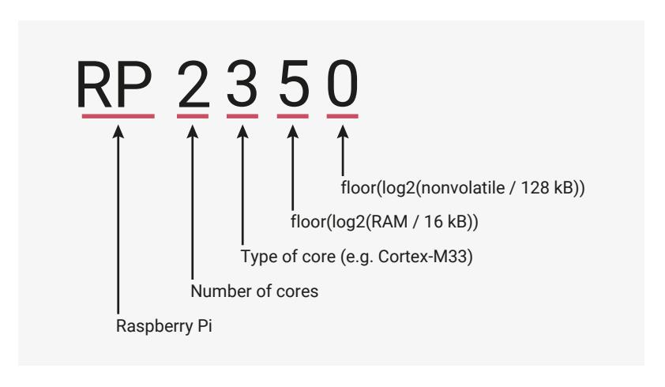

# **1.3. Why is the chip called RP2350?**

*Figure 4. An explanation for the name of the RP2350 chip.*

The post-fix numeral on RP2350 comes from the following,

- 1. Number of processor cores
  - **2** indicates a dual-core system
- 2. Loosely which type of processor
  - **3** indicates Cortex-M33 or Hazard3
- 3. Internal memory capacity:
  - **5** indicates at least 25 × 16 kB = 512 kB
  - RP2350 has 520 kB of main system SRAM
- 4. Internal storage capacity: (or 0 if no onboard nonvolatile storage)

- RP235**0** uses external flash
- RP235**4** has 24 × 128 kB = 2 MB of internal flash

