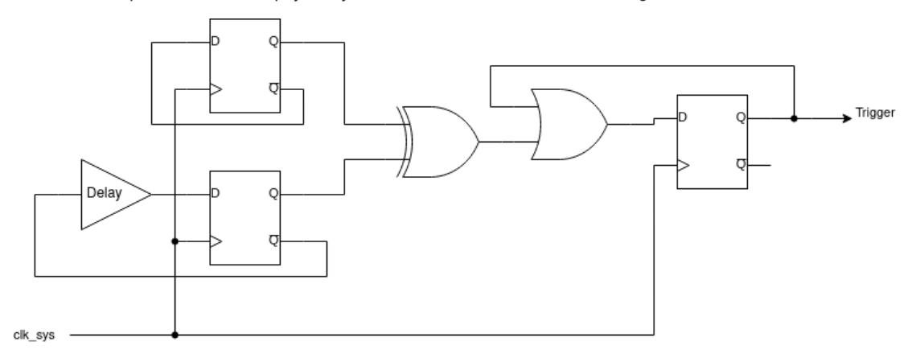

# **10.9.1. Theory of Operation**

The glitch detector is comprised of four identical detector circuits, based on a pair of D flip-flops. These detector circuits are each placed in different, physically distant locations within the core voltage domain.

*Figure 42. Glitch detector trigger circuit. Two flops each toggle on every system clock cycle. One has a programmable delay line in its feedback path, the other does not. Loss of setup or hold margin causes one of the flops to fail to toggle, so the flops values differ, setting the trigger output.*

The detector triggers when the two D-flops take on different values, which is impossible under normal circumstances. The delay line is programmable from 75% to 120% of the minimum system clock period in increments of 15%. Higher delays make the circuit more sensitive to loss of setup margin. To configure initial sensitivity, use the GLITCH_DETECTOR_SENS OTP flags. You can fine-tune sensitivity for each detector using the [SENSITIVITY](#page-869-0) register.

Because the circuit is constructed from digital standard cells, it closely tracks the changes in propagation delay to nearby cells caused by voltage and temperature fluctuations. Therefore the delay line's propagation delay is specified as a fraction of the maximum system clock data path delay, rather than a fixed time in nanoseconds.

