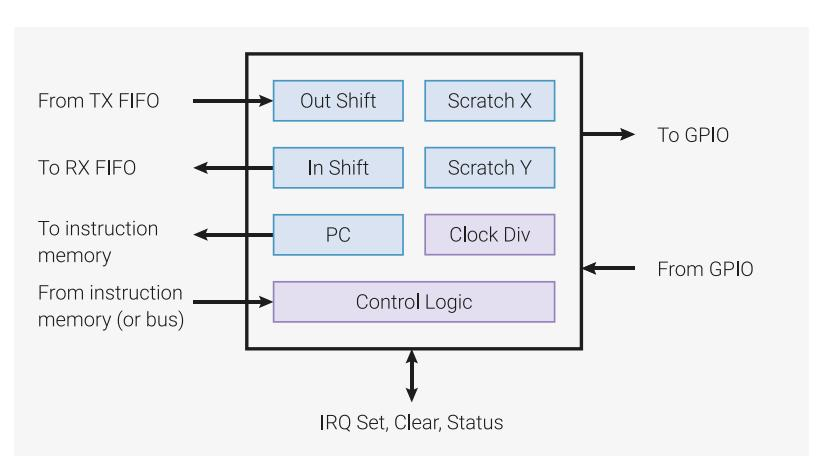

# **11.2. Programmer's Model**

The four state machines execute from shared instruction memory. System software loads programs into this memory, configures the state machines and IO mapping, and then sets the state machines running. PIO programs come from various sources: assembled directly by the user, drawn from the PIO library, or generated programmatically by user software.

From this point on, state machines are generally autonomous, and system software interacts through DMA, interrupts and control registers, as with other peripherals on RP2350. For more complex interfaces, PIO provides a small but flexible set of primitives which allow system software to be more hands-on with state machine control flow.

*Figure 44. State machine overview. Data flows in and out through a pair of FIFOs. The state machine executes a program which transfers data between these FIFOs, a set of internal registers, and the pins. The clock divider can reduce the state machine's execution speed by a constant factor.*

