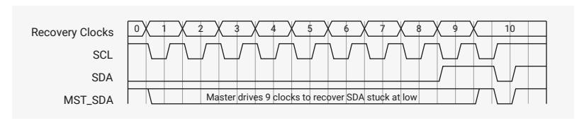
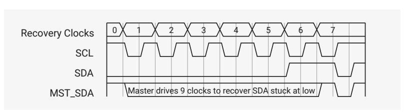

## **12.2.13. Bus Clear Feature**

DW_apb_i2c supports the bus clear feature that provides graceful recovery of data SDA and clock SCL lines during unlikely events in which either the clock or data line is stuck at LOW.

#### **12.2.13.1. SDA Line Stuck at LOW Recovery**

In case of SDA line stuck at LOW, the master performs the following actions to recover as shown in [Figure 87](#page-1000-1) and [Figure](#page-1000-2) [88:](#page-1000-2)

- 1. Master sends a maximum of nine clock pulses to recover the bus LOW within those nine clocks.
  - The number of clock pulses will vary with the number of bits that remain to be sent by the slave. As the maximum number of bits is nine, master sends up to nine clock pluses and allows the slave to recover.
  - The master attempts to assert a Logic 1 on the SDA line and check whether SDA is recovered. If the SDA is not recovered, it will continue to send a maximum of nine SCL clocks.
- 2. If SDA line is recovered within nine clock pulses, the master will send STOP to release the bus.
- 3. If SDA line is not recovered even after the ninth clock pulse, you must hardware reset the system.

*Figure 87.* SDA *Recovery with 9* SCL *Clocks*

*Figure 88.* SDA *Recovery with 6* SCL *Clocks*

#### **12.2.13.2. SCL Line is Stuck at LOW**

In the unlikely event (due to an electric failure of a circuit) where the clock (SCL) is stuck to LOW, there is no effective method to overcome this problem. Instead, reset the bus using the hardware reset signal.

