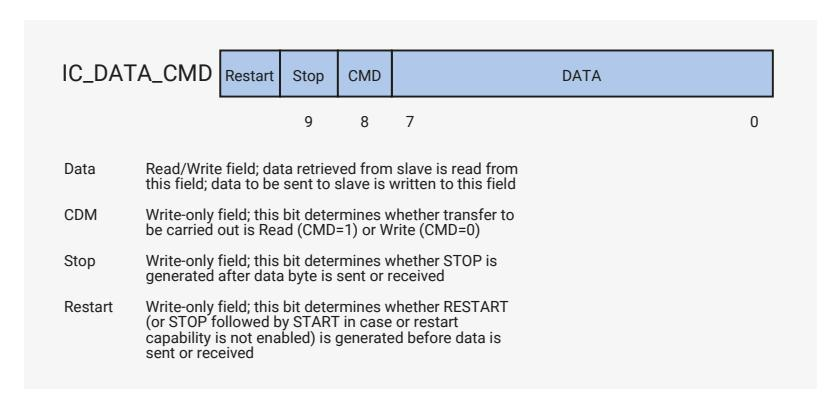
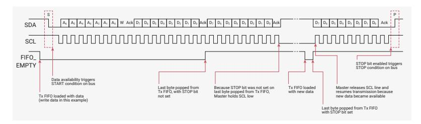
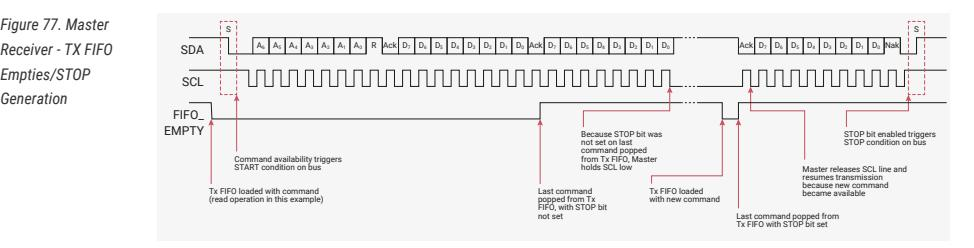
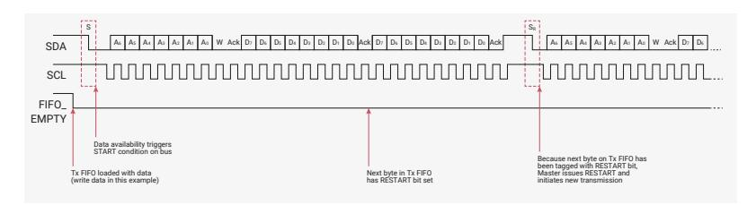
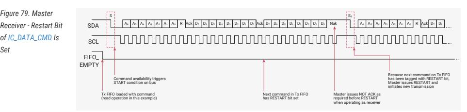
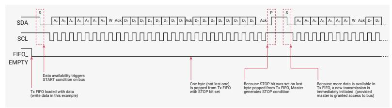
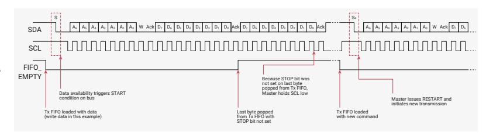
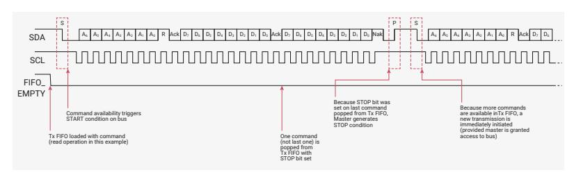
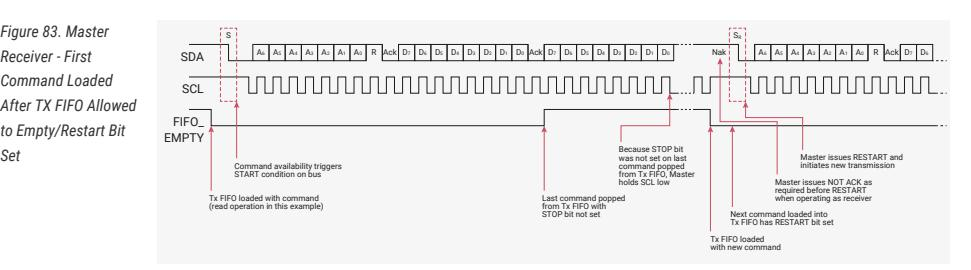

# **12.2.7. TX FIFO Management and START, STOP and RESTART Generation**

When operating as a master, the DW_apb_i2c component supports the mode of TX (transmit) FIFO management illustrated in [Figure 75.](#page-990-1)

#### **12.2.7.1. TX FIFO Management**

The component does not generate a STOP if the TX FIFO becomes empty; in this situation the component holds the SCL line low, stalling the bus until a new entry is available in the TX FIFO. A STOP condition is generated only when the user specifically requests it by setting bit nine (Stop bit) of the command written to [IC_DATA_CMD](#page-1011-0) register. [Figure 75](#page-990-1) shows the bits in the [IC_DATA_CMD](#page-1011-0) register.

*Figure 75. [IC_DATA_CMD](#page-1011-0) Register*

[Figure 76](#page-990-2) illustrates the behaviour of the DW_apb_i2c when the TX FIFO becomes empty while operating as a master transmitter, as well as the generation of a STOP condition.

*Figure 76. Master Transmitter - TX FIFO Empties/STOP Generation*

[Figure 77](#page-990-3) illustrates the behaviour of the DW_apb_i2c when the TX FIFO becomes empty while operating as a master receiver, as well as the generation of a STOP condition.

*Receiver - TX FIFO Empties/STOP Generation*

[Figure 78](#page-991-0) and [Figure 79](#page-991-1) illustrate configurations where the user can control the generation of RESTART conditions on the I2C bus. If bit 10 (Restart) of the [IC_DATA_CMD](#page-1011-0) register is set and the restart capability is enabled (IC_RESTART_EN=1), a RESTART is generated before the data byte is written to or read from the slave. If the restart capability is not enabled, a STOP followed by a START is generated in place of the RESTART. [Figure 78](#page-991-0) illustrates this situation during operation as a master transmitter.

*Figure 78. Master Transmitter - Restart Bit of [IC_DATA_CMD](#page-1011-0) Is Set*

[Figure 79](#page-991-1) illustrates the same situation, but during operation as a master receiver.

*Receiver - Restart Bit of [IC_DATA_CMD](#page-1011-0) Is Set*

[Figure 80](#page-991-2) illustrates operation as a master transmitter where the Stop bit of the [IC_DATA_CMD](#page-1011-0) register is set and the TX FIFO is not empty.

*Figure 80. Master Transmitter - Stop Bit of [IC_DATA_CMD](#page-1011-0) Set/TX FIFO not empty*

[Figure 81](#page-991-3) illustrates operation as a master transmitter where the first byte loaded into the TX FIFO is allowed to go empty with the Restart bit set.

*Figure 81. Master Transmitter - First Byte Loaded Into TX FIFO Allowed to Empty, Restart Bit Set*

[Figure 82](#page-991-4) illustrates operation as a master receiver where the Stop bit of the [IC_DATA_CMD](#page-1011-0) register is set and the TX FIFO is not empty.

*Figure 82. Master Receiver - Stop Bit of [IC_DATA_CMD](#page-1011-0) Set/TX FIFO Not Empty*

[Figure 83](#page-992-2) illustrates operation as a master receiver where the first command loaded after the TX FIFO is allowed to empty and the Restart bit is set.

*Receiver - First Command Loaded After TX FIFO Allowed to Empty/Restart Bit Set*

