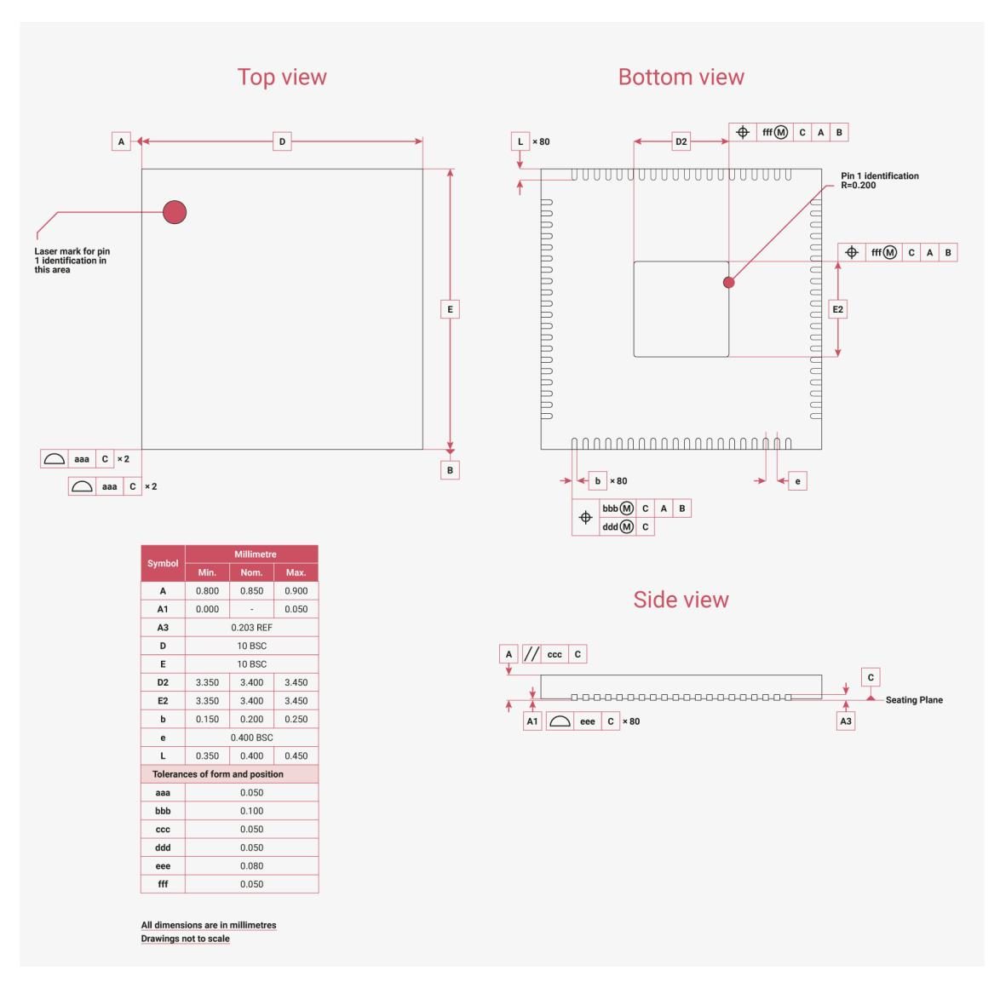

# **14.2. QFN-80 Package**

14.2. QFN-80 Package **1324**

*Figure 144. Top down view (left, top) and side view (right, bottom), along with bottom view (right, top) of the RP2350 QFN-80 package*

# **NOTE**

Leads have a matte Tin (Sn) finish. Annealing is done post-plating, baking at 150°C for 1 hour. Minimum thickness for lead plating is 8 microns, and the intermediate layer material is CuFe2P (roughened Copper (Cu)).

