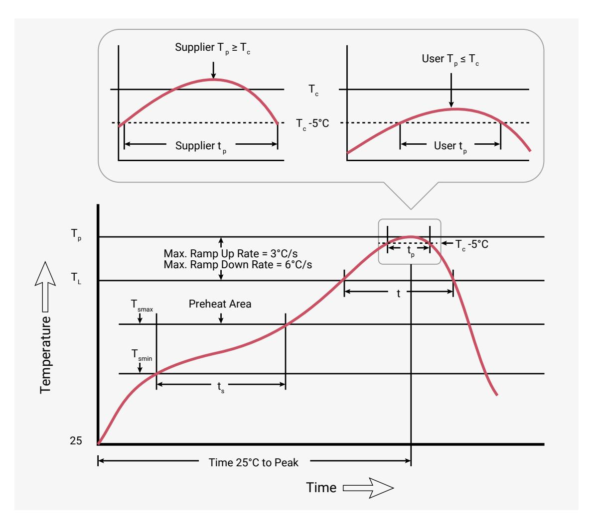

# **14.6. Solder profile**

RP2350 is a Pb-free part, with a Tp value of 260°C.

All temperatures refer to the centre of the package, measured on the package body surface that faces up during assembly reflow (live-bug orientation). If parts are reflowed in a different orientation (e.g. dead-bug), Tp shall be within ±2°C of the live-bug Tp and still meet the Tc requirements; otherwise, you must adjust the profile to achieve the latter.

14.4. Package Markings **1327**

*Figure 146. Classification profile (not to scale)*

# **NOTE**

Reflow profiles in this document are for classification/preconditioning, and are not meant to specify board assembly profiles. Actual board assembly profiles should be developed based on specific process needs and board designs, and should not exceed the parameters in [Table 1424](#page-1328-0).

*Table 1424. Solder profile values*

| Profile feature                                                       | Value             |
|-----------------------------------------------------------------------|-------------------|
| Temperature min (Tsmin)                                               | 150°C             |
| Temperature max (Tsmax)                                               | 200°C             |
| Time (ts) from (Tsmin to Tsmax)                                       | 60 - 120 seconds  |
| Ramp-up rate (TL to Tp)                                               | 3°C/second max.   |
| Liquidous temperature (TL)                                            | 217°C             |
| Time (tL) maintained above TL                                         | 60 to 150 seconds |
| Peak package body temperature (Tp)                                    | 260°C             |
| Classification temperature (Tc)                                       | 260°C             |
| Time (tp) within 5°C of the specified classification temperature (Tc) | 30 seconds        |
| Ramp-down rate (Tp to TL)                                             | 6°C/second max.   |
| Time 25°C to peak temperature                                         | 8 minutes max.    |

14.6. Solder profile **1328**

