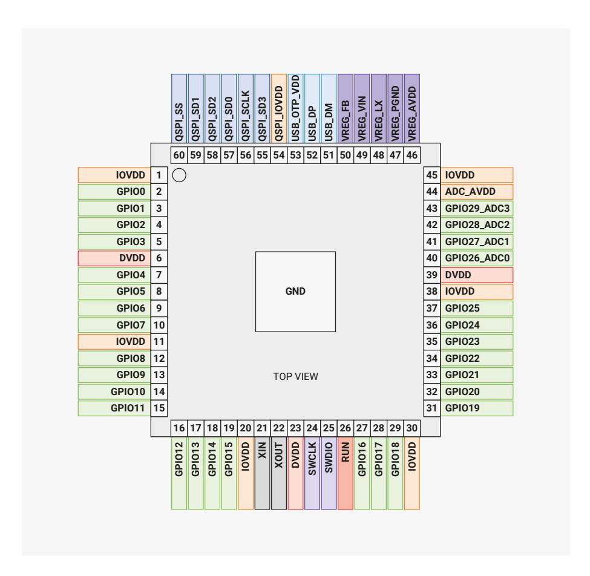
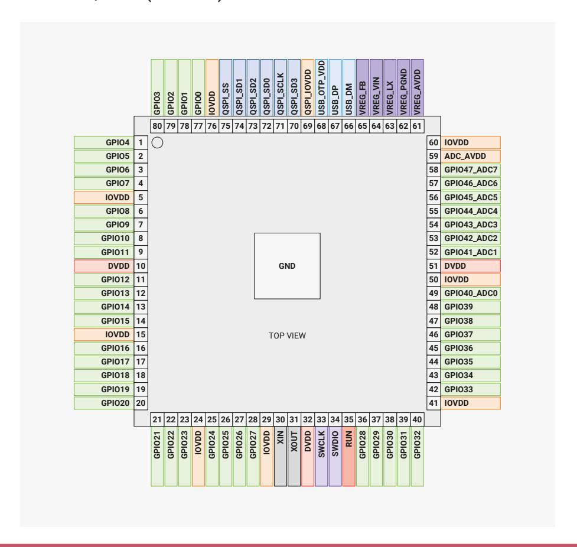

# **14.8.1. Pin Locations**

#### **14.8.1.1. QFN-60 (RP2350A)**

14.7. Compliance **1329**

Figure 147. RP2350 Pinout for QFN-60 7×7mm

#### 14.8.1.2. QFN-80 (RP2350B)

Figure 148. RP2350 Pinout for QFN-80 10×10mm

