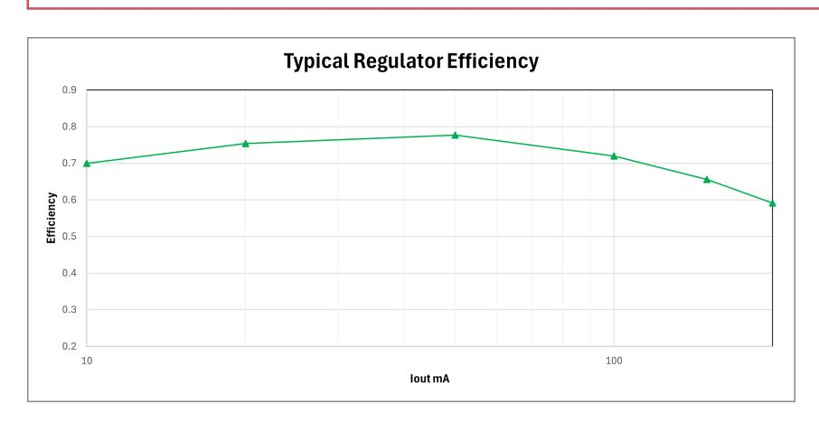

# **14.9.6. Core Voltage Regulator**

*Table 1441. Voltage Regulator Specifications*

| Parameter                    | Description                                                       | Min  | Typ | Max | Units                           |  |
|------------------------------|-------------------------------------------------------------------|------|-----|-----|---------------------------------|--|
| VOUT (normal mode)           | regulated output voltage range (normal mode)                | 0.55 | 1.1 | 3.3 | V                               |  |
| VOUT (low power mode)        | regulated output voltage range (low power mode)             | 0.55 | 1.1 | 1.3 | V                               |  |
| ΔVOUT (normal mode)          | voltage deviation from programmed value (normal mode)    | -3   |     | +3  | % of selected output voltage |  |
| ΔVOUT (low power mode)       | voltage deviation from programmed value (low power mode) | -9   |     | +9  | % of selected output voltage |  |
| IMAX (normal mode)           | output current (normal mode)                                   |      |     | 200 | mA                              |  |
| IMAX (low power mode)        | output current (low power mode)                                |      |     | 1   | mA                              |  |
| ILIMIT (normal mode startup) | current limit (normal mode startup)                         |      | 240 | 300 | mA                              |  |
| ILIMIT (normal mode)         | current limit (normal mode)                                    | 260  | 500 | 800 | mA                              |  |
| ILIMIT (low power mode)      | current limit (low power mode)                                 | 5    |     | 25  | mA                              |  |
| VOUT_OKTH.ASSERT             | VOUT_OK assertion threshold                                    | 87   | 90  | 93  | % of selected output voltage |  |

b Short term transients should be within +/-100mV.

ADC performance will be compromised at voltages below 2.97V

| Parameter                  | Description                          | Min | Typ | Max | Units                           |
|----------------------------|--------------------------------------|-----|-----|-----|---------------------------------|
| VOUT_OKTH.DEASSERT         | VOUT_OK de assertion threshold | 84  | 87  | 90  | % of selected output voltage |
| fsw                        | switching frequency               |     | 3   |     | MHz                             |
| Efficiency (V OUT=1.1V) | Iload=10mA, VREG_VIN=2.7V         |     | 74  |     | %                               |
|                            | Iload=10mA, VREG_VIN=3.3V         |     | 70  |     | %                               |
|                            | Iload=10mA, VREG_VIN=5.5V         |     | 59  |     | %                               |
|                            | Iload=100mA, VREG_VIN=2.7V        |     | 70  |     | %                               |
|                            | Iload=100mA, VREG_VIN=3.3V        |     | 72  |     | %                               |
|                            | Iload=100mA, VREG_VIN=5.5V        |     | 72  |     | %                               |
|                            | Iload=200mA, VREG_VIN=2.7V        |     | 70  |     | %                               |
|                            | Iload=200mA, VREG_VIN=3.3V        |     | 59  |     | %                               |
|                            | Iload=200mA, VREG_VIN=5.5V        |     | 63  |     | %                               |

# **WARNING**

VOUT can exceed the maximum core supply (DVDD). While there is a voltage limit to prevent this happening accidentally, the limit can be disabled under software control. For reliable operation DVDD should not exceed its maximum voltage rating.

*Figure 150. Typical Regulator Efficiency, Vout=1.1V, VREG_VIN=3.3V.*

