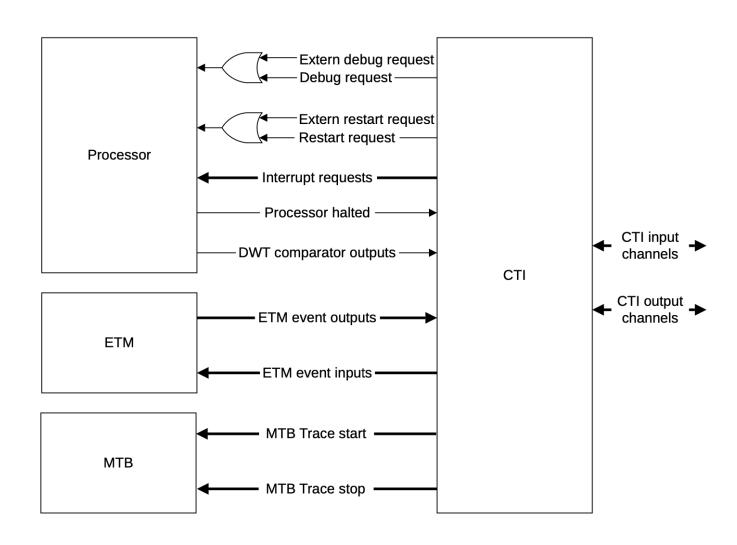

# <span id="page-131-0"></span>**3.7.4. Programmer's model**

The Cortex-M33 programmer's model is an implementation of the Armv8-M Main Extension architecture.

For a complete description of the programmers model, refer to the [Armv8-M Architecture Reference Manual,](https://developer.arm.com/documentation/ddi0553/latest/) which also contains the Armv8-M Thumb instructions. In addition, other options of the programmers model are described in the System Control, MPU, NVIC, FPU, Debug, DWT, ITM, and TPIU feature topics.

#### **3.7.4.1. Modes of operation and execution**

The Cortex-M33 processor supports Secure and Non-secure security states, Thread and Handler operating modes, and can run in either Thumb or Debug operating states. In addition, the processor can limit or exclude access to some resources by executing code in privileged or unprivileged mode.

See the [Armv8-M Architecture Reference Manual](https://developer.arm.com/documentation/ddi0553/latest/) for more information about the modes of operation and execution.

#### **3.7.4.1.1. Security states**

With the Armv8-M Security Extension, the programmer's model includes two orthogonal security states: *Secure* state and *Non-secure* state. The processor always resets into Secure state. Each security state includes a set of independent operating modes and supports both privileged and unprivileged user access. Registers in the System Control Space are banked across Secure and Non-secure state, with a Non-secure register view available to Secure state at an aliased address.

#### **3.7.4.1.2. Operating modes**

For each security state, the processor can operate in *Thread* or *Handler* mode. The following conditions cause the processor to enter Thread or Handler mode:

- The processor enters Thread mode on reset, or as a result of an exception return to Thread mode. Privileged and Unprivileged code can run in Thread mode.
- The processor enters Handler mode as a result of an exception. In Handler mode, all code is privileged.

The processor can change security state on taking an exception, for example when a Secure exception is taken from Non-secure state, the Thread mode enters the Secure state Handler mode. The processor can also call Secure functions

from Non-secure state and Non-secure functions from Secure state. The Security Extension includes requirements for these calls to prevent Secure data from being accessed in Non-secure state.

#### **3.7.4.1.3. Operating states**

The processor can operate in Thumb or Debug state:

- Thumb state is the state of normal execution running 16-bit and 32-bit halfword- aligned Thumb instructions.
- Debug state is the state when the processor is in Halting debug.

#### **3.7.4.1.4. Privileged access and unprivileged user access**

Code can execute as privileged or unprivileged. Unprivileged execution limits resource access appropriate to the current security state. Privileged execution has access to all resources available to the security state. Handler mode is always privileged. Thread mode can be privileged or unprivileged.

#### **3.7.4.2. Instruction set summary**

The processor implements the following instruction from Armv8-M:

- All base instructions
- All instructions in the Main Extension
- All instructions in the Security Extension
- All instructions in the DSP Extension
- All single-precision instructions and double precision load/store instructions in the Floating-point Extension

For more information about Armv8-M instructions, see the [Armv8-M Architecture Reference Manual.](https://developer.arm.com/documentation/ddi0553/latest/)

#### **3.7.4.3. Memory model**

The processor contains a bus matrix that arbitrates instruction fetches and memory accesses from the processor core between the external memory system and the internal System Control Space (SCS) and debug components.

Priority is usually given to the processor to keep debug accesses as non-intrusive as possible.

The system memory map is Armv8-M Main Extension compliant, and is common both to the debugger and processor accesses.

The default memory map provides user and privileged access to all regions except for the Private Peripheral Bus (PPB). The PPB space only allows privileged access.

The following table shows the default memory map. This is the memory map used when the included MPUs are disabled. The attributes and permissions of all regions, except that targeting the NVIC and debug components, can be modified using an implemented MPU.

*Table 113. Default memory map*

| Address Range (inclusive) | Region     | Interface                                                                                                                                             |
|---------------------------|------------|-------------------------------------------------------------------------------------------------------------------------------------------------------|
| 0x00000000 - 0x1FFFFFFF   | Code       | Instruction and data accesses.                                                                                                                        |
| 0x20000000 - 0x3FFFFFFF   | SRAM       | Instruction and data accesses.                                                                                                                        |
| 0x40000000 - 0x5FFFFFFF   | Peripheral | Instruction and data accesses. Any attempt to execute instructions<br>from the peripheral and external device region results in a<br>MemManage fault. |

| Address Range (inclusive) | Region          | Interface                                                                                                                                                                                                                                                                                                                                                                                                                                         |
|---------------------------|-----------------|---------------------------------------------------------------------------------------------------------------------------------------------------------------------------------------------------------------------------------------------------------------------------------------------------------------------------------------------------------------------------------------------------------------------------------------------------|
| 0x60000000 - 0x9FFFFFFF   | External RAM    | Instruction and data accesses. Any attempt to execute instructions<br>from the peripheral and external device region results in a<br>MemManage fault.                                                                                                                                                                                                                                                                                             |
| 0xA0000000 - 0xDFFFFFFF   | External device | Instruction and data accesses. Any attempt to execute instructions<br>from the peripheral and external device region results in a<br>MemManage fault.                                                                                                                                                                                                                                                                                             |
| 0xE0000000 - 0xE00FFFFF   | PPB             | Reserved for system control and debug. Cannot be used for<br>exception vector tables. Data accesses are either performed<br>internally or on EPPB. Accesses in the range 0xE0000000 - 0xE0043FFF<br>are handled within the processor. Accesses in the range 0xE0044000<br>- 0xE00FFFFF appear as APB transactions on the EPPB interface of<br>the processor. Any attempt to execute instructions from the region<br>results in a MemManage fault. |
| 0xE0100000 - 0xFFFFFFFF   | Vendor_SYS      | Partly reserved for future processor feature expansion. Any<br>attempt to execute instructions from the region results in a<br>MemManage fault.                                                                                                                                                                                                                                                                                                   |

The internal Secure Attribution Unit (SAU) determines the security level associated with an address. Some internal peripherals have memory-mapped registers in the PPB region which are banked between Secure and Non-secure state. When the processor is in Secure state, software can access both the Secure and Non-secure versions of these registers. The Non-secure versions are accessed using an aliased address.

For more information about the memory model, see the [Armv8-M Architecture Reference Manual.](https://developer.arm.com/documentation/ddi0553/latest/)

#### <span id="page-133-0"></span>**3.7.4.3.1. Private Peripheral Bus (PPB)**

The Private Peripheral Bus (PPB) memory region provides access to internal and external processor resources.

The internal PPB provides access to:

- The System Control Space (SCS), including the Memory Protection Unit (MPU), Secure Attribution Unit (SAU), and the Nested Vectored Interrupt Controller (NVIC).
- The Data Watchpoint and Trace (DWT) unit.
- The Breakpoint Unit (BPU).
- The Embedded Trace Macrocell (ETM).
- CoreSight Micro Trace Buffer (MTB).
- Cross Trigger Interface (CTI).
- The ROM table.

The external PPB (EPPB) provides access to implementation-specific external areas of the PPB memory map.

#### **3.7.4.3.2. Unaligned accesses**

The Cortex-M33 processor supports unaligned accesses. They are converted into two or more aligned AHB transactions on the C-AHB or S-AHB master ports on the processor.

Unaligned support is only available for load/store singles (LDR, LDRH, STR, STRH, TBH) to addresses in Normal memory. Load/store double and load/store multiple instructions already support word aligned accesses, but do not permit other unaligned accesses, and generate a fault if this is attempted. Unaligned accesses in Device memory are not permitted and fault. Unaligned accesses that cross memory map boundaries are architecturally **UNPREDICTABLE**.

# **NOTE**

If [CCR](#page-183-0).UNALIGN_TRP for the current Security state is set, any unaligned accesses generate a fault.

#### **3.7.4.4. Exclusive monitor**

The Cortex-M33 processor implements a local exclusive monitor. The local monitor within the processor has been constructed so that it does not hold any physical address, but instead treats any store-exclusive access as matching the address of the previous load-exclusive. This means that the implemented exclusives reservation granule is the entire memory address range. For more information about semaphores and the local exclusive monitor, see the [Armv8-M](https://developer.arm.com/documentation/ddi0553/latest/) [Architecture Reference Manual.](https://developer.arm.com/documentation/ddi0553/latest/)

#### **3.7.4.5. Processor core registers summary**

The following table shows the processor core register set summary. Each of these registers is 32 bits wide. When the Armv8-M Security Extension is included, some of the registers are banked. The Secure view of these registers is available when the Cortex-M33 processor is in Secure state and the Non-secure view when Cortex-M33 processor is in Non-secure state.

*Table 114. Processor core register set summary*

| Name      | Description                                                                                                                                                                                                                                                                                                        |
|-----------|--------------------------------------------------------------------------------------------------------------------------------------------------------------------------------------------------------------------------------------------------------------------------------------------------------------------|
| R0-R12    | R0-R12 are general-purpose registers for data operations.                                                                                                                                                                                                                                                          |
| MSP (R13) | The Stack Pointer (SP) is register R13. In Thread mode, the<br>CONTROL register indicates the stack pointer to use, Main<br>Stack Pointer (MSP) or Process Stack Pointer (PSP).<br>There are two MSP registers in the Cortex-M33 processor:<br>MSP_NS for the Non-secure state, and MSP_S for the Secure<br>state. |
| PSP (R13) | The Stack Pointer (SP) is register R13. In Thread mode, the<br>CONTROL register indicates the stack pointer to use, Main<br>Stack Pointer (MSP) or Process Stack Pointer (PSP).<br>There are two PSP registers in the Cortex-M33 processor:<br>PSP_NS for the Non-secure state, and PSP_S for the Secure<br>state. |
| MSPLIM    | The stack limit registers limit the extent to which the MSP<br>and PSP registers can descend respectively. There are<br>two MSPLIM registers in the Cortex-M33 processor:<br>MSPLIM_NS for the Non-secure state, and MSPLIM_S for the<br>Secure state.                                                             |
| PSPLIM    | The stack limit registers limit the extent to which the MSP<br>and PSP registers can descend respectively. There are<br>two PSPLIM registers in the Cortex-M33 processor:<br>PSPLIM_NS for the Non-secure state, and PSPLIM_S for the<br>Secure state.                                                             |
| LR (R14)  | The Link Register (LR) is register R14. It stores the return<br>information for subroutines, function calls, and<br>exceptions.                                                                                                                                                                                    |
| PC (R15)  | The Program Counter (PC) is register R15. It contains the<br>current program address.                                                                                                                                                                                                                              |

| Name      | Description                                                                                                                                                                                                                                                                          |
|-----------|--------------------------------------------------------------------------------------------------------------------------------------------------------------------------------------------------------------------------------------------------------------------------------------|
| PSR       | The Program Status Register (PSR) combines the<br>Application Program Status Register (APSR), Interrupt<br>Program Status Register (IPSR), and Execution Program<br>Status Register (EPSR). These registers provide different<br>views of the PSR.                                   |
| PRIMASK   | The PRIMASK register prevents activation of exceptions with<br>configurable priority. When the Armv8-M Security<br>Extension is included, there are two PRIMASK registers in the<br>Cortex-M33 processor: PRIMASK_NS for the Non-secure state<br>and PRIMASK_S for the Secure state. |
| BASEPRI   | The BASEPRI register defines the minimum priority for<br>exception processing. There are two BASEPRI registers in<br>the Cortex-M33 processor: BASEPRI_NS for the Non-secure<br>state, and BASEPRI_S for the Secure state.                                                           |
| FAULTMASK | The FAULTMASK register prevents activation of all exceptions<br>except for NON-MASKABLE INTERRUPT (NMI) and<br>Secure HardFault. There are two FAULTMASK registers in the<br>Cortex-M33 processor: FAULTMASK_NS for the Non-secure<br>state, and FAULTMASK_S for the Secure state.   |
| CONTROL   | The CONTROL register controls the stack used, and optionally<br>the privilege level, when the processor is in Thread mode.<br>There are two CONTROL registers in the Cortex-M33<br>processor: CONTROL_NS for the Non-secure state and<br>CONTROL_S for the Secure state.             |

#### <span id="page-135-0"></span>**3.7.4.6. Exceptions**

Exceptions are handled and prioritized by the processor and the NVIC. In addition to architecturally defined behaviour, the processor implements advanced exception and interrupt handling that reduces interrupt latency and includes implementation defined behaviour.

The processor core and the Nested Vectored Interrupt Controller (NVIC) together prioritize and handle all exceptions. When handling exceptions:

- All exceptions are handled in Handler mode.
- Processor state is automatically stored to the stack on an exception, and automatically restored from the stack at the end of the Interrupt Service Routine (ISR).
- The vector is fetched in parallel to the state saving, enabling efficient interrupt entry.

The processor supports tail-chaining that enables back-to-back interrupts without the overhead of state saving and restoration.

Software can choose only to enable a subset of the configured number of interrupts, and can choose how many bits of the configured priorities to use.

Exceptions can be specified as either Secure or Non-secure. When an exception occurs the processor switches to the associated security state. The priority of Secure and Non-secure exceptions can be programmed independently. You can deprioritise Non-secure configurable exceptions using the [AIRCR](#page-182-0).PRIS bit field to enable Secure interrupts to take priority.

When taking and returning from an exception, the register state is always stored using the stack pointer associated with the background security state. When taking a Non-secure exception from Secure state, all the register state is stacked and then registers are cleared to prevent Secure data being available to the Non-secure handler. The vector base

address is banked between Secure and Non-secure state. VTOR_S contains the Secure vector base address, and VTOR_NS contains the Non-secure vector base address. These registers can be programmed by software, and also initialized at reset by the system.

# **NOTE**

Vector table entries are compatible with interworking between Arm and Thumb instructions. This causes bit[0] of the vector value to load into the Execution Program Status Register (EPSR) T-bit on exception entry. All populated vectors in the vector table entries must have bit[0] set. Creating a table entry with bit[0] clear generates an INVSTATE fault on the first instruction of the handler corresponding to this vector.

#### **3.7.4.7. Security Attribution and Memory Protection**

Security attribution and memory protection in the processor is provided by the Security Attribution Unit (SAU) and the Memory Protection Units (MPUs).

The SAU is a programmable unit that determines the security of an address. RP2350 includes 8 memory regions.

For instructions and data, the SAU returns the security attribute that is associated with the address.

For instructions, the attribute determines the allowable Security state of the processor when the instruction is executed. It can also identify whether code at a Secure address can be called from Non-secure state.

For data, the attribute determines whether a memory address can be accessed from Non-secure state, and also whether the external memory request is marked as Secure or Non-secure.

If a data access is made from Non-secure state to an address marked as Secure, then a SecureFault exception is taken by the processor. If a data access is made from Secure state to an address marked as Non-secure, then the associated memory access is marked as Non-secure.

The security level returned by the SAU is a combination of the region type defined in the internal SAU, if configured, and the type that is returned on the associated Implementation Defined Attribution Unit (IDAU). If an address maps to regions defined by both internal and external attribution units, the region of the highest security level is selected.

The register fields [SAU_CTRL](#page-198-0).EN and [SAU_CTRL](#page-198-0).ALLNS control the enable state of the SAU and the default security level when the SAU is disabled. Both [SAU_CTRL](#page-198-0).EN and [SAU_CTRL](#page-198-0).ALLNS reset to zero disabling the SAU and setting all memory, apart from some specific regions in the PPB space to Secure level. If the SAU is not enabled, and [SAU_CTRL.](#page-198-0)ALLNS is zero, then the IDAU cannot set any regions of memory to a security level lower than Secure, for example Secure NSC or NS. If the SAU is enabled, then [SAU_CTRL](#page-198-0).ALLNS does not affect the Security level of memory.

RP2350 supports the Armv8-M Protected Memory System Architecture (PMSA). The MPU provides full support for:

- protection regions
- access permissions
- exporting memory attributes to the system

MPU mismatches and permission violations invoke the MemManage handler. For more information, see the [Armv8-M](https://developer.arm.com/documentation/ddi0553/latest/) [Architecture Reference Manual.](https://developer.arm.com/documentation/ddi0553/latest/)

You can use the MPU to:

- enforce privilege rules
- separate processes
- manage memory attributes

The MPU supports 16 memory regions: 8 secure and 8 non-secure. The MPU is banked between Secure and Non-secure states. The number of regions in the Secure and Non-secure MPU can be configured independently and each can be programmed to protect memory for the associated Security state.

#### **3.7.4.8. External coprocessors**

The external coprocessor interface:

- Supports low-latency data transfer from the processor to and from the accelerator components.
- Has a sustained bandwidth up to twice of the processor memory interface.

The following instruction types are supported:

- Register transfer from the Cortex-M33 processor to the coprocessor MCR, MCRR, MCR2, MCRR2.
- Register transfer from the coprocessor to the Cortex-M33 processor MRC, MRRC, MRC2, MRRC2.
- Data processing instructions CDP, CDP2.

#### **NOTE**

The regular and extension forms of the coprocessor instructions for example, MCR and MCRR2, have the same functionality but different encodings. The MRC and MRC2 instructions support the transfer of APSR.NZVC flags when the processor register field is set to PC, for example Rt == 0xF.

#### **3.7.4.8.1. Restrictions**

The following restrictions apply when to coprocessor instructions:

- The LDC(2) or STC(2) instructions are not supported. If these are included in software with the <coproc> field set to a value between 0-7 and the coprocessor is present and enabled in the appropriate fields in the [CPACR](#page-193-0)/[NSACR](#page-193-1) registers, the Cortex-M33 processor always attempts to take an *Undefined instruction* (UNDEFINSTR) UsageFault exception.
- The processor register fields for data transfer instructions must not include the stack pointer (Rt == 0xD), this encoding is **UNPREDICTABLE** in the Armv8-M architecture and results in an *Undefined instruction* (UNDEFINSTR) UsageFault exception in the [CPACR/](#page-193-0)[NSACR](#page-193-1) registers.
- If any coprocessor instruction is executed when the corresponding coprocessor is disabled in the [CPACR](#page-193-0)/[NSACR](#page-193-1) register, the Cortex-M33 processor always attempts to take a *No coprocessor* (NOCP) UsageFault exception.

#### **3.7.4.8.2. Data transfer rates**

The following table shows the ideal data transfer rates for the coprocessor interface. This means that the coprocessor responds immediately to an instruction. The ideal data transfer rates are sustainable if the corresponding coprocessor instructions are executed consecutively.

The following instructions have the following data transfer rates:

```
MCR, MCR2 (Processor to coprocessor)
    32 bits per cycle
MRC, MRC2 (Coprocessor to processor)
    32 bits per cycle
MCRR, MCRR2 (Processor to coprocessor)
    64 bits per cycle
MRRC, MRRC2 (Coprocessor to processor)
    64 bits per cycle
```

#### <span id="page-137-0"></span>**3.7.4.9. Execution Timing**

This section describes the execution time of various Cortex-M33 instructions. The results are based on measurements

of a limited and non-exceptional set of examples of the more common instructions and hence may not correctly cover some more unusual situations.

These measurements were taken with the following conditions:

- only one core is running
- there are no cache misses (in particular, no XIP cache misses)
- there there is no active DMA

Any of the above conditions can affect the timing of instruction fetch as well as of load and store operations. See the description of the [bus fabric](#page-24-1) elsewhere in this datasheet for information on possible contention for access to memory.

#### **3.7.4.9.1. Result delays**

Some instructions generate results with a two-cycle latency. Using such a result as a source operand for a subsequent instruction incurs a one-cycle **result-use penalty**. Most of the input values of any instruction count as source operands, including:

- any source register in a data processing (ALU) instruction
- any registers used in address generation by an LDR or LDM (including R13 in the case of POP)
- any registers used in address generation (but not those to be stored) by a STR or STM (including R13 in the case of PUSH).

The following example shows a load followed by a data-processing instruction, an instruction sequence which incurs this penalty:

```
LDR R0,[R1]
ADD R1,R0,R2
```

The following instructions generate results with a two-cycle latency:

- the destination register arising from some non-simple shifts in certain data-processing instructions (specified in more detail below)
- the destination register or registers of a multiply instruction
- the destination register of an LDR
- the *last* register in the register list of an LDM or POP unless that register is R15

Using results of the above instructions as a source operand for another instruction incurs a one-cycle penalty between the operations.

#### **3.7.4.9.2. Simple arithmetic and logical instructions**

Most data processing instructions execute in a single cycle. Some **complex** operations (including those listed above and SEL) incur a result-use penalty.

Complex operations meet at least one of the following criteria:

- a shifted operand where the shift is not LSL#0, LSL#1, LSL#2 or LSL#3
- an immediate operand which entails a shift (i.e., not of the form 0x000000XY, 0xXYXYXYXY, 0x00XY00XY or 0xXY00XY00)

When a complex instruction has the -S suffix to set flags, the one-cycle penalty is always incurred, even if the next instruction does not depend on those flag values.

The following operations *do not* incur a penalty:

```
AND R0,R1,R2,LSL#4
MOV R3,R4
```

However, the following operations *do* incur a penalty:

```
AND R0,R1,R2,LSL#4
MOV R3,R0
```

```
ANDS R0,R1,R2,LSL#4
MOV R3,R4
```

ADD and SUB are available in variants with a 12-bit plain immediate operand. These *do not* incur a penalty.

MOV and MOVS with an immediate operand, including MOV with a 16-bit plain immediate operand, *do not* incur a result-use penalty.

Despite their similarity to logical operations with a shifted operand, UBFX, SBFX and BFI *do not* incur a result-use penalty.

Simple shift instructions (LSL, LSR, ASR, and ROR, with the shift amount specified either as an immediate constant or in a register) take one cycle with no result-use penalty.

#### **3.7.4.9.3. Multiply instructions**

Multiply and multiply-accumulate instructions execute in a single cycle, but all have a result delay of one cycle.

However, the special case of using the result of a multiply instruction as the accumulate input to a following multiplyaccumulate instruction *does not* incur a one-cycle penalty. As a result, repeated multiply-accumulate operations can run at one per cycle, assuming all of the following conditions hold:

- the operations accumulate into the same register or register pair
- the multiplier and multiplicand operands come from other registers

Sequences such as the following can execute one instruction per cycle:

```
MLA R0,R1,R2,R3
MLA R3,R1,R2,R0
MLA R0,R1,R2,R3
MLA R3,R1,R2,R0
```

```
UMLAL R0,R1,R4,R5
UMLAL R2,R3,R6,R7
UMLAL R0,R1,R4,R5
UMLAL R2,R3,R6,R7
```

The multiplier requires its multiply operands on cycle n, requires its accumulate operand (if any) on cycle n+1, and makes its result available on cycle n+2.

As a further example, the following sequence completes in 4 cycles:

ADD R2,R0,R1,LSL#23 MLA R3,R4,R5,R2 MOV R6,R3

The ADD would normally incur a one-cycle result-use penalty, but in this case its result is not needed until the second cycle of the multiply-accumulate operation, eliminating the penalty.

#### **3.7.4.9.4. Divide instructions**

Let n be the difference between the bit positions of the most significant ones in the absolute value of the dividend and the absolute value of the divisor. If n is negative (in which case the result will be zero), division takes 2 cycles. Otherwise, division takes 4+n/4 cycles, rounded down.

Using the result of division as input for the next instruction incurs a a one-cycle result-use penalty.

#### <span id="page-140-3"></span>**3.7.4.9.5. Register loads (LDR and LDM)**

Loads execute in one cycle per register, plus a possible one-cycle result delay. Loads can slow down if the addressed memory is not able to accept the read request immediately, for example because of contention with instruction prefetch.

From the point of view of result delays, any register used in address generation counts as a source operand. For examples, see [Table 115.](#page-140-0)

*Table 115. Load instruction source operand examples*

<span id="page-140-0"></span>

| Instruction      | Source Operand | Not a Source Operand |
|------------------|----------------|----------------------|
| LDR R0,[R5,R6]   | R5, R6         | R0                   |
| LDMIA R7,{R0-R3} | R7             | R0, R1, R2, R3       |

There is one cycle of result delay associated with the destination register of an LDR and with the last register in the register list of an LDM or POP. For example, R7 has one cycle of result delay both in LDR R7,[R5,R6] and in LDMIA R0,{R1-R7}. The latter case incurs no result delay associated with R1 to R6.

Loading R15 does not cause any result delay; however, extra cycles will be taken as described in [Section 3.7.4.9.7](#page-140-1).

#### **3.7.4.9.6. Register stores (STR and STM)**

Stores, including those which depend on the contents of three different registers such as STR R0,[R1,R2,LSL#2], execute in one cycle. Like loads, stores can slow down if the addressed memory is not able to accept the request immediately.

The registers involved in address generation, but not the register or registers being stored, count as source operands from the point of view of result delays. For examples, see [Table 116](#page-140-2).

*Table 116. Register stores source operand examples*

<span id="page-140-2"></span>

| Instruction       | Source Operand | Not a Source Operand |
|-------------------|----------------|----------------------|
| STR R5,[R6,R7]    | R6, R7         | R5                   |
| STMFD R5!,{R0-R3} | R5             | R0, R1, R2, R3       |

#### <span id="page-140-1"></span>**3.7.4.9.7. Branches**

This section covers any instruction that can change R15, including the following:

• MOV R15,Rx

- BNE
- BL
- BX
- LDR R15,…
- POP {…,R15}

When a branch arises from a load (LDR R15,…, LDMxx Rx,{…,R15}, or POP {…,R15}), the basic time for the instruction is that taken by the load instruction itself, as described in [Section 3.7.4.9.5.](#page-140-3)

For other instructions that can change R15 (MOV R15,Rx, B<cond>, BL, BX), the basic time for the instruction is zero.

The total time required for a branch that *does* occur is the basic time + 2 + L + U- ( K & F ) cycles, and the time required for a branch that *does not* occur is the basic time + 1 - F cycles, where L, U, F, K are each 0 or 1 as described below:

**L**

1 when the branch arises from a load (LDR R15,[R6], LDMIA R13,{R0-R3,R15}, and so on); 0 otherwise.

**U**

1 when the *all* of following conditions are true:

- the target address of the branch is not word-aligned
- the instruction at that address is 32 bits long
- the instruction executed immediately prior to the branch is not POP or PUSH

If any of the above conditions are not true, U is 0.

**F**

indicates when the branch can be dual issued (or "folded") with the previous instruction, PrevInst (the instruction executed immediately prior to the branch). *F* is 1 when *all* of the following conditions are true:

- the branch instruction is B, B<cond>, or BX R14 (but not BX to any other register or MOV R15,R14)
- PrevInst is 16 bits long
- PrevInst was executed sequentially (i.e., not itself branched to), or PrevInst is word-aligned
- PrevInst itself was not itself folded with a previous instruction

If any of the above conditions are not true, F is 0.

**K**

1 when it is known that the branch will execute prior to executing PrevInst; 0 otherwise. In other words, K is 1 unless the branch is conditional and PrevInst sets the flags.

For example, the following delay loop takes 299 cycles:

```
10000002: MOVS R5,#100
10000004: SUBS R5,R5,#1
10000006: BNE 0x10000004
```

Those cycles come from the following timings:

- 1 cycle for MOVS R5,#100
- 1 cycle for each SUBS R5,R5,#1
- 2 cycles each for the first 99 BNE instructions (L=U=0, F=1, K=0)
- 0 cycles for the last, non-taken, BNE (L=U=0, F=1, K=0, using the formula 1-F)

At a different alignment, the same delay loop takes 300 cycles:

```
10000000: MOVS R5,#100
10000002: SUBS R5,R5,#1
10000004: BNE 0x10000002
```

Those cycles come from the following timings:

- 1 cycle for MOVS R5,#100;
- 1 cycle for each SUBS R5,R5,#1;
- 2 cycles for the first BNE (L=U=0, F=1, K=0);
- 2 cycles each for the next 98 BNE instructions (L=U=0, F=K=0);
- 1 cycle for the last, non-taken, BNE (L=U=0, F=K=0, using the formula 1-F).

This longer delay loop also takes 300 cycles:

```
10000000: MOVS R5,#100
10000002: SUBS R5,R5,#1
10000004: MOV R1,R2
10000006: BNE 0x10000002
```

Those cycles come from the following timings:

- 1 cycle for MOVS R5,#100;
- 1 cycle for each SUBS R5,R5,#1;
- 1 cycle for each MOV R1,R2;
- 1 cycle each for the first 99 BNE instructions (L=U=0, F=K=1);
- 0 cycles for the last, non-taken, BNE (L=U=0, F=K=1; using the formula 1-F).

This example illustrates that, if you can contrive to place an instruction between the loop-end test and the branch, it can potentially have *zero net cost* in execution time.

Another optimisation is to try to ensure that a branch target is either word-aligned or is a 16-bit instruction. Any instruction following a BL can be considered a branch target from this point of view as it is branched to by the return instruction from the subroutine.

If space and cache permit, unrolling loops and inlining subroutines avoids the branch cost altogether.

A sequence of branches not taken will alternately take 0 cycles and 1 cycle. That is the same as a sequence of NOP instructions, which can also be folded. However, this is *not* the same as sequence of instructions in an IT block that fail their condition.

#### **3.7.4.9.8. IT (if-then) blocks**

Instructions within an IT block whose condition fails execute in one cycle.

Most instructions within an IT block whose condition succeeds take the number of cycles they would have taken in their normal, unconditional state.

#### **3.7.4.9.9. Dual issue**

When a 16-bit instruction follows a NOP instruction (opcode 0xBF00, *not* 0x46C0), the instructions are **folded**, executing the NOP in zero cycles. In some situations, this can help align a branch target to a word-aligned address without an

execution-time penalty.

When a 16-bit opcode follows an IT instruction, the IT instruction executes in zero cycles.

The Cortex-M33 core folds a NOP with the previous instruction (PrevInst) if all of the following conditions are true:

- PrevInst is 16 bits long
- PrevInst was executed sequentially (not itself branched to) *or* PrevInst is word-aligned
- PrevInst was not itself folded with a previous instruction

Branches not taken are in this sense similar to NOP instructions: they can be folded according to the same rule. For further detail on when taken and not taken branches are folded, see [Section 3.7.4.9.7.](#page-140-1)

When two multi-cycle instructions are folded, at most one cycle can overlap between the instructions.

#### **3.7.4.9.10. Floating-point coprocessor operations**

This section describes operations involving the single-precision floating-point coprocessor (FPU). For timings relating to the GPIO coprocessor, the double-precision coprocessor, and the redundancy coprocessor, see [Section 3.7.4.9.11](#page-144-0) and the detailed descriptions of those coprocessors elsewhere in this document.

Issuing a floating-point instruction occupies the integer core for one cycle. After that, the integer core can proceed with other non-FPU operations without interruption.

Attempting to issue another FPU instruction stalls execution until the FPU is ready to accept the FPU instruction.

The following list details the timings of various FPU instructions:

• VADD.F32, VSUB.F32 and VMUL.F32 can execute in one cycle, but have an additional cycle of result delay. As a result, the following example sequence executes at two cycles per instruction:

```
VADD.F32 s0,s0,s2
VADD.F32 s0,s0,s3
VADD.F32 s0,s0,s4
VADD.F32 s0,s0,s5
```

The following interleaved example, however, executes at one cycle per instruction:

```
VADD.F32 s0,s0,s2
VADD.F32 s1,s1,s3
VADD.F32 s0,s0,s4
VADD.F32 s1,s1,s5
```

Furthermore, you can interleave VADD.F32, VSUB.F32 and VMUL.F32 instructions arbitrarily to execute in one cycle, as long as no instruction depends on the result of its predecessor.

• VMLA.F32 and VFMA.F32 occupy the FPU for 3 cycles, plus one cycle of result delay.

However, *consecutive* VMLA.F32 or VFMA.F32 instructions accumulating into the same register can run at one instruction every three cycles.

- When the work can be interleaved, separate VMUL.F32 and VADD.F32 instructions are faster than a single VMLA.F32 instruction.
- VDIV.F32 and VSQRT.F32 occupy the FPU for 14 cycles, plus one cycle of result delay.
- VMOV.F32 Sx,Ry (move one word from integer register to coprocessor) takes one cycle.

- VMOV.F32 Rx,Sy (move one word from coprocessor to integer register) takes one cycle plus one cycle of result delay.
- VMOV.F32 Sx,Sy (move one word between coprocessor registers) takes one cycle.
- VMOV.F64 Dx,Ry,Rz (move two words from integer registers to coprocessor) occupies the FPU for two cycles and the integer core for one cycle.
- VMOV.F64 Rx,Ry,Dz (move two words from coprocessor to integer registers) occupies both the FPU and the integer core for two cycles.

#### <span id="page-144-0"></span>**3.7.4.9.11. Other coprocessor operations**

A coprocessor can stall an operation if it is not ready. For more information, see the documentation for the specific coprocessor.

The following list details the timings of various coprocessor instructions:

- Assuming that no stalls occur, a CDP instruction takes one cycle.
- An MCR instruction (move one word from integer register to coprocessor) takes one cycle.
- An MRC instruction (move one word from coprocessor to integer register) takes one cycle, plus one cycle of result delay.
- An MCRR instruction (move two words from integer registers to coprocessor) takes one cycle.
- An MRRC instruction (move two words from coprocessor to integer registers) takes one cycle, plus one cycle of result delay.

#### **3.7.4.9.12. Instruction fetch**

Each Cortex-M33 core has separate instruction and data buses ("Harvard architecture"). Each core has a bandwidth to memory of 32 bits per cycle. Since each instruction is at most 32 bits long, for sequential code the instruction prefetcher has enough bandwidth to ensure that the processor core always has instructions.

In RP2350, contention can occur when the instruction and data buses attempt to access data stored in memory connected to the same downstream port of the AHB5 crossbar. For example, code running from the main SRAM might attempt to load a literal stored nearby. That load might conflict with an instruction prefetch to the same SRAM. To reduce the chance of this conflict, the main SRAM is striped into banks across groups of four words: words at addresses that are different modulo 16 are stored in different banks.

Since the prefetcher typically runs about two words (8 bytes) ahead of execution, that means that an instruction that reads 8 (modulo 16) bytes ahead of itself is liable to result in a conflict. For example, the following instruction, which reads 40 bytes ahead (because here PC means the address of the next instruction), can sometimes incur a penalty of one cycle:

LDR R8,[PC,#32] @ 32-bit instruction

#### **3.7.4.10. Debug**

Cortex-M33 debug functionality includes processor halt, single-step, processor core register access, Vector Catch, unlimited software breakpoints, and full system memory access.

The processor also includes support for hardware breakpoints and watchpoints configured during implementation:

- A breakpoint unit supporting eight instruction comparators
- A watchpoint unit supporting four data watchpoint comparators

The Cortex-M33 processor supports system level debug authentication to control access from a debugger to resources

and memory. Authentication via the Armv8-M Security Extension can be used to allow a debugger full access to Nonsecure code and data without exposing any Secure information.

The processor implementation can be partitioned to place the debug components in a separate power domain from the processor core and NVIC.

All debug registers are accessible by the D-AHB interface.

For more information, see the [Armv8-M Architecture Reference Manual.](https://developer.arm.com/documentation/ddi0553/latest/)

#### <span id="page-145-0"></span>**3.7.4.11. Data Watchpoint and Trace unit (DWT)**

The DWT is a full configuration, containing four comparators ([DWT_COMP0](#page-166-0) to [DWT_COMP3](#page-168-0)). These comparators support the following features:

- Hardware watchpoint support
- Hardware trace packet support
- CMPMATCH support for ETM/MTB/CTI triggers
- Cycle counter matching support ([DWT_COMP0](#page-166-0) only)
- Instruction address matching support
- Data address matching support
- Data value matching support ([DWT_COMP1](#page-167-0) only in a reduced DWT, [DWT_COMP3](#page-168-0) only in a Full DWT)
- Linked/limit matching support ([DWT_COMP1](#page-167-0) and [DWT_COMP3](#page-168-0) only)

The DWT contains counters for:

- Cycles ([DWT_CYCCNT.](#page-165-0)CYCCNT)
- Folded Instructions (FOLDCNT)
- Additional cycles required to execute all load/store instructions (LSUCNT)
- Processor sleep cycles (SLEEPCNT)
- Additional cycles required to execute multi-cycle instructions and instruction fetch stalls (CPICNT)
- Cycles spent in exception processing (EXCCNT)

Before using DWT, set the [DEMCR.](#page-201-0)TRCENA bit to 1.

The DWT provides periodic requests for protocol synchronization to the ITM and the TPIU.

#### **3.7.4.12. Cross Trigger Interface (CTI)**

The CTI enables the debug logic, MTB, and ETM to interact with each other and with other CoreSight components. This is called cross triggering. For example, you can configure the CTI to generate an interrupt when the ETM trigger event occurs or to start tracing when a DWT comparator match is detected.

The following figure shows the debug system components and the available trigger inputs and trigger outputs:

[Figure 15](#page-146-0) shows the components of the debug system.

*Figure 15. Debug system components*

<span id="page-146-0"></span>

The following table shows how the CTI trigger inputs are connected to the Cortex-M33 processor:

*Table 117. Trigger signals to the CTI*

| Signal       | Description                                  | Connection           | Acknowledge, handshake |
|--------------|----------------------------------------------|----------------------|------------------------|
| CTITRIGIN[7] |                                              | ETM to CTI           | Pulsed                 |
| CTITRIGIN[6] |                                              | ETM to CTI           | Pulsed                 |
| CTITRIGIN[5] | ETM Event Output 1                           | ETM to CTI           | Pulsed                 |
| CTITRIGIN[4] | ETM Event Output 0 or Comparator Output<br>3 | ETM/Processor to CTI | Pulsed                 |
| CTITRIGIN[3] | DWT Comparator Output 2                      | Processor to CTI     | Pulsed                 |
| CTITRIGIN[2] | DWT Comparator Output 1                      | Processor to CTI     | Pulsed                 |
| CTITRIGIN[1] | DWT Comparator Output 0                      | Processor to CTI     | Pulsed                 |
| CTITRIGIN[0] | Processor Halted                             | Processor to CTI     | Pulsed                 |

The following table shows how the CTI trigger outputs are connected to the processor and ETM:

*Table 118. Trigger signals from the CTI*

| Signal            | Description                          | Connection        | Acknowledge, handshake                                      |  |
|-------------------|--------------------------------------|-------------------|-------------------------------------------------------------|--|
| CTITRIGOUT[<br>7] | ETM Event Input 3                    | CTI to ETM        | Pulsed                                                      |  |
| CTITRIGOUT[<br>6] | ETM Event Input 2                    | CTI to ETM        | Pulsed                                                      |  |
| CTITRIGOUT[<br>5] | ETM Event Input 1 or MTB Trace stop  | CTI to ETM or MTB | Pulsed                                                      |  |
| CTITRIGOUT[<br>4] | ETM Event Input 1 or MTB Trace start | CTI to ETM or MTB | Pulsed                                                      |  |
| CTITRIGOUT[<br>3] | Interrupt request 1                  | CTI to system     | Acknowledged by writing to<br>the CTIINTACK register in ISR |  |
| CTITRIGOUT[<br>2] | Interrupt request 0                  | CTI to system     | Acknowledged by writing to<br>the CTIINTACK register in ISR |  |
| CTITRIGOUT[<br>1] | Processor Restart                    | CTI to Processor  | Processor Restarted                                         |  |

| Signal            | Description             | Connection       | Acknowledge, handshake                                               |
|-------------------|-------------------------|------------------|----------------------------------------------------------------------|
| CTITRIGOUT[<br>0] | Processor debug request | CTI to Processor | Acknowledged by the<br>debugger writing to the<br>CTIINTACK register |

After the processor is halted using CTI Trigger Output 0, the Processor Debug Request signal remains asserted. The debugger must write to [CTIINTACK](#page-224-0) to clear the halting request before restarting the processor.

After asserting an interrupt using the CTI Trigger Output 1 or 2, the Interrupt Service Routine (ISR) must clear the interrupt request by writing to the CTI Interrupt Acknowledge, [CTIINTACK](#page-224-0).

Interrupt requests from the CTI to the system are only asserted when invasive debug is enabled in the processor.

#### **3.7.4.12.1. CTI programmers model**

The following table shows the CTI programmable registers, with address offset, type, and reset value for each register. See the Arm [CoreSightTM SoC-400 Technical Reference Manual](https://developer.arm.com/documentation/100536/0302/apb-interconnect-components) for register descriptions.

*Table 119. Cortex-M33 CTI register summary*

| Address offset        | Name             | Type | Reset value | Description                                 |
|-----------------------|------------------|------|-------------|---------------------------------------------|
| 0xE0042000            | CTICONTROL       | RW   | 0x00000000  | CTI Control Register                        |
| 0xE0042010            | CTIINTACK        | WO   | UNKNOWN     | CTI Interrupt Acknowledge<br>Register       |
| 0xE0042014            | CTIAPPSET        | RW   | 0x00000000  | CTI Application Trigger Set<br>Register     |
| 0xE0042018            | CTIAPPCLEAR      | RW   | 0x00000000  | CTI Application Trigger Clear<br>Register   |
| 0xE004201C            | CTIAPPPULSE      | WO   | UNKNOWN     | CTI Application Pulse Register              |
| 0xE0042020-0xE004203C | CTIINEN[7:0]     | RW   | 0x00000000  | CTI Trigger to Channel Enable<br>Registers  |
| 0xE00420A0-0xE00420BC | CTIOUTEN[7:0]    | RW   | 0x00000000  | CTI Channel to Trigger Enable<br>Registers  |
| 0xE0042130            | CTITRIGINSTATUS  | RO   | 0x00000000  | CTI Trigger In Status Register              |
| 0xE0042134            | CTITRIGOUTSTATUS | RO   | 0x00000000  | CTI Trigger Out Status Register             |
| 0xE0042138            | CTICHINSTATUS    | RO   | 0x00000000  | CTI Channel In Status Register              |
| 0xE0042140            | CTIGATE          | RW   | 0x0000000F  | Enable CTI Channel Gate Register            |
| 0xE0042144            | ASICCTL          | RW   | 0x00000000  | External Multiplexer Control<br>Register    |
| 0xE0042EE4            | ITCHOUT          | WO   | UNKNOWN     | Integration Test Channel Output<br>Register |
| 0xE0042EE8            | ITTRIGOUT        | WO   | UNKNOWN     | Integration Test Trigger Output<br>Register |
| 0xE0042EF4            | ITCHIN           | RO   | 0x00000000  | Integration Test Channel Input<br>Register  |
| 0xE0042F00            | ITCTRL           | RW   | 0x00000000  | Integration Mode Control Register           |
| 0xE0042FC8            | DEVID            | RO   | 0x00040800  | Device Configuration Register               |
| 0xE0042FBC            | DEVARCH          | RO   | 0x47701A14  | Device Architecture Register                |

| Address offset | Name    | Type | Reset value | Description                     |
|----------------|---------|------|-------------|---------------------------------|
| 0xE0042FCC     | DEVTYPE | RO   | 0x00000014  | Device Type Identifier Register |
| 0xE0042FD0     | PIDR4   | RO   | 0x00000004  | Peripheral ID4 Register         |
| 0xE0042FD4     | PIDR5   | RO   | 0x00000000  | Peripheral ID5 Register         |
| 0xE0042FD8     | PIDR6   | RO   | 0x00000000  | Peripheral ID6 Register         |
| 0xE0042FDC     | PIDR7   | RO   | 0x00000000  | Peripheral ID7 Register         |
| 0xE0042FE0     | PIDR0   | RO   | 0x00000021  | Peripheral ID0 Register         |
| 0xE0042FE4     | PIDR1   | RO   | 0x000000BD  | Peripheral ID1 Register         |
| 0xE0042FE8     | PIDR2   | RO   | 0x0000000B  | Peripheral ID2 Register         |
| 0xE0042FEC     | PIDR3   | RO   | 0x00000001  | Peripheral ID3 Register         |
| 0xE0042FF0     | CIDR0   | RO   | 0x0000000D  | Component ID0 Register          |
| 0xE0042FF4     | CIDR1   | RO   | 0x00000090  | Component ID1 Register          |
| 0xE0042FF8     | CIDR2   | RO   | 0x00000005  | Component ID2 Register          |
| 0xE0042FFC     | CIDR3   | RO   | 0x000000B1  | Component ID3 Register          |

<span id="page-148-0"></span>The Arm Cortex-M33 registers start at a base address of 0xe0000000, defined as [PPB_BASE](#page-34-0) in the SDK.

*Table 120. List of M33 registers*

<span id="page-148-1"></span>

| Offset  | Name       | Info                          |
|---------|------------|-------------------------------|
| 0x00000 | ITM_STIM0  | ITM Stimulus Port Register 0  |
| 0x00004 | ITM_STIM1  | ITM Stimulus Port Register 1  |
| 0x00008 | ITM_STIM2  | ITM Stimulus Port Register 2  |
| 0x0000c | ITM_STIM3  | ITM Stimulus Port Register 3  |
| 0x00010 | ITM_STIM4  | ITM Stimulus Port Register 4  |
| 0x00014 | ITM_STIM5  | ITM Stimulus Port Register 5  |
| 0x00018 | ITM_STIM6  | ITM Stimulus Port Register 6  |
| 0x0001c | ITM_STIM7  | ITM Stimulus Port Register 7  |
| 0x00020 | ITM_STIM8  | ITM Stimulus Port Register 8  |
| 0x00024 | ITM_STIM9  | ITM Stimulus Port Register 9  |
| 0x00028 | ITM_STIM10 | ITM Stimulus Port Register 10 |
| 0x0002c | ITM_STIM11 | ITM Stimulus Port Register 11 |
| 0x00030 | ITM_STIM12 | ITM Stimulus Port Register 12 |
| 0x00034 | ITM_STIM13 | ITM Stimulus Port Register 13 |
| 0x00038 | ITM_STIM14 | ITM Stimulus Port Register 14 |
| 0x0003c | ITM_STIM15 | ITM Stimulus Port Register 15 |
| 0x00040 | ITM_STIM16 | ITM Stimulus Port Register 16 |
| 0x00044 | ITM_STIM17 | ITM Stimulus Port Register 17 |

| Offset  | Name        | Info                                                                  |
|---------|-------------|-----------------------------------------------------------------------|
| 0x00048 | ITM_STIM18  | ITM Stimulus Port Register 18                                         |
| 0x0004c | ITM_STIM19  | ITM Stimulus Port Register 19                                         |
| 0x00050 | ITM_STIM20  | ITM Stimulus Port Register 20                                         |
| 0x00054 | ITM_STIM21  | ITM Stimulus Port Register 21                                         |
| 0x00058 | ITM_STIM22  | ITM Stimulus Port Register 22                                         |
| 0x0005c | ITM_STIM23  | ITM Stimulus Port Register 23                                         |
| 0x00060 | ITM_STIM24  | ITM Stimulus Port Register 24                                         |
| 0x00064 | ITM_STIM25  | ITM Stimulus Port Register 25                                         |
| 0x00068 | ITM_STIM26  | ITM Stimulus Port Register 26                                         |
| 0x0006c | ITM_STIM27  | ITM Stimulus Port Register 27                                         |
| 0x00070 | ITM_STIM28  | ITM Stimulus Port Register 28                                         |
| 0x00074 | ITM_STIM29  | ITM Stimulus Port Register 29                                         |
| 0x00078 | ITM_STIM30  | ITM Stimulus Port Register 30                                         |
| 0x0007c | ITM_STIM31  | ITM Stimulus Port Register 31                                         |
| 0x00e00 | ITM_TER0    | Provide an individual enable bit for each ITM_STIM register           |
| 0x00e40 | ITM_TPR     | Controls which stimulus ports can be accessed by unprivileged<br>code |
| 0x00e80 | ITM_TCR     | Configures and controls transfers through the ITM interface           |
| 0x00ef0 | INT_ATREADY | Integration Mode: Read ATB Ready                                      |
| 0x00ef8 | INT_ATVALID | Integration Mode: Write ATB Valid                                     |
| 0x00f00 | ITM_ITCTRL  | Integration Mode Control Register                                     |
| 0x00fbc | ITM_DEVARCH | Provides CoreSight discovery information for the ITM                  |
| 0x00fcc | ITM_DEVTYPE | Provides CoreSight discovery information for the ITM                  |
| 0x00fd0 | ITM_PIDR4   | Provides CoreSight discovery information for the ITM                  |
| 0x00fd4 | ITM_PIDR5   | Provides CoreSight discovery information for the ITM                  |
| 0x00fd8 | ITM_PIDR6   | Provides CoreSight discovery information for the ITM                  |
| 0x00fdc | ITM_PIDR7   | Provides CoreSight discovery information for the ITM                  |
| 0x00fe0 | ITM_PIDR0   | Provides CoreSight discovery information for the ITM                  |
| 0x00fe4 | ITM_PIDR1   | Provides CoreSight discovery information for the ITM                  |
| 0x00fe8 | ITM_PIDR2   | Provides CoreSight discovery information for the ITM                  |
| 0x00fec | ITM_PIDR3   | Provides CoreSight discovery information for the ITM                  |
| 0x00ff0 | ITM_CIDR0   | Provides CoreSight discovery information for the ITM                  |
| 0x00ff4 | ITM_CIDR1   | Provides CoreSight discovery information for the ITM                  |
| 0x00ff8 | ITM_CIDR2   | Provides CoreSight discovery information for the ITM                  |
| 0x00ffc | ITM_CIDR3   | Provides CoreSight discovery information for the ITM                  |

| Offset  | Name          | Info                                                                                                                                                                                                      |
|---------|---------------|-----------------------------------------------------------------------------------------------------------------------------------------------------------------------------------------------------------|
| 0x01000 | DWT_CTRL      | Provides configuration and status information for the DWT unit,<br>and used to control features of the unit                                                                                               |
| 0x01004 | DWT_CYCCNT    | Shows or sets the value of the processor cycle counter, CYCCNT                                                                                                                                            |
| 0x0100c | DWT_EXCCNT    | Counts the total cycles spent in exception processing                                                                                                                                                     |
| 0x01014 | DWT_LSUCNT    | Increments on the additional cycles required to execute all load<br>or store instructions                                                                                                                 |
| 0x01018 | DWT_FOLDCNT   | Increments on the additional cycles required to execute all load<br>or store instructions                                                                                                                 |
| 0x01020 | DWT_COMP0     | Provides a reference value for use by watchpoint comparator 0                                                                                                                                             |
| 0x01028 | DWT_FUNCTION0 | Controls the operation of watchpoint comparator 0                                                                                                                                                         |
| 0x01030 | DWT_COMP1     | Provides a reference value for use by watchpoint comparator 1                                                                                                                                             |
| 0x01038 | DWT_FUNCTION1 | Controls the operation of watchpoint comparator 1                                                                                                                                                         |
| 0x01040 | DWT_COMP2     | Provides a reference value for use by watchpoint comparator 2                                                                                                                                             |
| 0x01048 | DWT_FUNCTION2 | Controls the operation of watchpoint comparator 2                                                                                                                                                         |
| 0x01050 | DWT_COMP3     | Provides a reference value for use by watchpoint comparator 3                                                                                                                                             |
| 0x01058 | DWT_FUNCTION3 | Controls the operation of watchpoint comparator 3                                                                                                                                                         |
| 0x01fbc | DWT_DEVARCH   | Provides CoreSight discovery information for the DWT                                                                                                                                                      |
| 0x01fcc | DWT_DEVTYPE   | Provides CoreSight discovery information for the DWT                                                                                                                                                      |
| 0x01fd0 | DWT_PIDR4     | Provides CoreSight discovery information for the DWT                                                                                                                                                      |
| 0x01fd4 | DWT_PIDR5     | Provides CoreSight discovery information for the DWT                                                                                                                                                      |
| 0x01fd8 | DWT_PIDR6     | Provides CoreSight discovery information for the DWT                                                                                                                                                      |
| 0x01fdc | DWT_PIDR7     | Provides CoreSight discovery information for the DWT                                                                                                                                                      |
| 0x01fe0 | DWT_PIDR0     | Provides CoreSight discovery information for the DWT                                                                                                                                                      |
| 0x01fe4 | DWT_PIDR1     | Provides CoreSight discovery information for the DWT                                                                                                                                                      |
| 0x01fe8 | DWT_PIDR2     | Provides CoreSight discovery information for the DWT                                                                                                                                                      |
| 0x01fec | DWT_PIDR3     | Provides CoreSight discovery information for the DWT                                                                                                                                                      |
| 0x01ff0 | DWT_CIDR0     | Provides CoreSight discovery information for the DWT                                                                                                                                                      |
| 0x01ff4 | DWT_CIDR1     | Provides CoreSight discovery information for the DWT                                                                                                                                                      |
| 0x01ff8 | DWT_CIDR2     | Provides CoreSight discovery information for the DWT                                                                                                                                                      |
| 0x01ffc | DWT_CIDR3     | Provides CoreSight discovery information for the DWT                                                                                                                                                      |
| 0x02000 | FP_CTRL       | Provides FPB implementation information, and the global enable<br>for the FPB unit                                                                                                                        |
| 0x02004 | FP_REMAP      | Indicates whether the implementation supports Flash Patch<br>remap and, if it does, holds the target address for remap                                                                                    |
| 0x02008 | FP_COMP0      | Holds an address for comparison. The effect of the match<br>depends on the configuration of the FPB and whether the<br>comparator is an instruction address comparator or a literal<br>address comparator |

| Offset  | Name       | Info                                                                                                                                                                                                      |
|---------|------------|-----------------------------------------------------------------------------------------------------------------------------------------------------------------------------------------------------------|
| 0x0200c | FP_COMP1   | Holds an address for comparison. The effect of the match<br>depends on the configuration of the FPB and whether the<br>comparator is an instruction address comparator or a literal<br>address comparator |
| 0x02010 | FP_COMP2   | Holds an address for comparison. The effect of the match<br>depends on the configuration of the FPB and whether the<br>comparator is an instruction address comparator or a literal<br>address comparator |
| 0x02014 | FP_COMP3   | Holds an address for comparison. The effect of the match<br>depends on the configuration of the FPB and whether the<br>comparator is an instruction address comparator or a literal<br>address comparator |
| 0x02018 | FP_COMP4   | Holds an address for comparison. The effect of the match<br>depends on the configuration of the FPB and whether the<br>comparator is an instruction address comparator or a literal<br>address comparator |
| 0x0201c | FP_COMP5   | Holds an address for comparison. The effect of the match<br>depends on the configuration of the FPB and whether the<br>comparator is an instruction address comparator or a literal<br>address comparator |
| 0x02020 | FP_COMP6   | Holds an address for comparison. The effect of the match<br>depends on the configuration of the FPB and whether the<br>comparator is an instruction address comparator or a literal<br>address comparator |
| 0x02024 | FP_COMP7   | Holds an address for comparison. The effect of the match<br>depends on the configuration of the FPB and whether the<br>comparator is an instruction address comparator or a literal<br>address comparator |
| 0x02fbc | FP_DEVARCH | Provides CoreSight discovery information for the FPB                                                                                                                                                      |
| 0x02fcc | FP_DEVTYPE | Provides CoreSight discovery information for the FPB                                                                                                                                                      |
| 0x02fd0 | FP_PIDR4   | Provides CoreSight discovery information for the FP                                                                                                                                                       |
| 0x02fd4 | FP_PIDR5   | Provides CoreSight discovery information for the FP                                                                                                                                                       |
| 0x02fd8 | FP_PIDR6   | Provides CoreSight discovery information for the FP                                                                                                                                                       |
| 0x02fdc | FP_PIDR7   | Provides CoreSight discovery information for the FP                                                                                                                                                       |
| 0x02fe0 | FP_PIDR0   | Provides CoreSight discovery information for the FP                                                                                                                                                       |
| 0x02fe4 | FP_PIDR1   | Provides CoreSight discovery information for the FP                                                                                                                                                       |
| 0x02fe8 | FP_PIDR2   | Provides CoreSight discovery information for the FP                                                                                                                                                       |
| 0x02fec | FP_PIDR3   | Provides CoreSight discovery information for the FP                                                                                                                                                       |
| 0x02ff0 | FP_CIDR0   | Provides CoreSight discovery information for the FP                                                                                                                                                       |
| 0x02ff4 | FP_CIDR1   | Provides CoreSight discovery information for the FP                                                                                                                                                       |
| 0x02ff8 | FP_CIDR2   | Provides CoreSight discovery information for the FP                                                                                                                                                       |
| 0x02ffc | FP_CIDR3   | Provides CoreSight discovery information for the FP                                                                                                                                                       |
| 0x0e004 | ICTR       | Provides information about the interrupt controller                                                                                                                                                       |

| Offset  | Name       | Info                                                                                                     |
|---------|------------|----------------------------------------------------------------------------------------------------------|
| 0x0e008 | ACTLR      | Provides IMPLEMENTATION DEFINED configuration and control<br>options                                     |
| 0x0e010 | SYST_CSR   | SysTick Control and Status Register                                                                      |
| 0x0e014 | SYST_RVR   | SysTick Reload Value Register                                                                            |
| 0x0e018 | SYST_CVR   | SysTick Current Value Register                                                                           |
| 0x0e01c | SYST_CALIB | SysTick Calibration Value Register                                                                       |
| 0x0e100 | NVIC_ISER0 | Enables or reads the enabled state of each group of 32 interrupts                                        |
| 0x0e104 | NVIC_ISER1 | Enables or reads the enabled state of each group of 32 interrupts                                        |
| 0x0e180 | NVIC_ICER0 | Clears or reads the enabled state of each group of 32 interrupts                                         |
| 0x0e184 | NVIC_ICER1 | Clears or reads the enabled state of each group of 32 interrupts                                         |
| 0x0e200 | NVIC_ISPR0 | Enables or reads the pending state of each group of 32 interrupts                                        |
| 0x0e204 | NVIC_ISPR1 | Enables or reads the pending state of each group of 32 interrupts                                        |
| 0x0e280 | NVIC_ICPR0 | Clears or reads the pending state of each group of 32 interrupts                                         |
| 0x0e284 | NVIC_ICPR1 | Clears or reads the pending state of each group of 32 interrupts                                         |
| 0x0e300 | NVIC_IABR0 | For each group of 32 interrupts, shows the active state of each<br>interrupt                             |
| 0x0e304 | NVIC_IABR1 | For each group of 32 interrupts, shows the active state of each<br>interrupt                             |
| 0x0e380 | NVIC_ITNS0 | For each group of 32 interrupts, determines whether each<br>interrupt targets Non-secure or Secure state |
| 0x0e384 | NVIC_ITNS1 | For each group of 32 interrupts, determines whether each<br>interrupt targets Non-secure or Secure state |
| 0x0e400 | NVIC_IPR0  | Sets or reads interrupt priorities                                                                       |
| 0x0e404 | NVIC_IPR1  | Sets or reads interrupt priorities                                                                       |
| 0x0e408 | NVIC_IPR2  | Sets or reads interrupt priorities                                                                       |
| 0x0e40c | NVIC_IPR3  | Sets or reads interrupt priorities                                                                       |
| 0x0e410 | NVIC_IPR4  | Sets or reads interrupt priorities                                                                       |
| 0x0e414 | NVIC_IPR5  | Sets or reads interrupt priorities                                                                       |
| 0x0e418 | NVIC_IPR6  | Sets or reads interrupt priorities                                                                       |
| 0x0e41c | NVIC_IPR7  | Sets or reads interrupt priorities                                                                       |
| 0x0e420 | NVIC_IPR8  | Sets or reads interrupt priorities                                                                       |
| 0x0e424 | NVIC_IPR9  | Sets or reads interrupt priorities                                                                       |
| 0x0e428 | NVIC_IPR10 | Sets or reads interrupt priorities                                                                       |
| 0x0e42c | NVIC_IPR11 | Sets or reads interrupt priorities                                                                       |
| 0x0e430 | NVIC_IPR12 | Sets or reads interrupt priorities                                                                       |
| 0x0e434 | NVIC_IPR13 | Sets or reads interrupt priorities                                                                       |
| 0x0e438 | NVIC_IPR14 | Sets or reads interrupt priorities                                                                       |

| Offset  | Name       | Info                                                                                                                   |
|---------|------------|------------------------------------------------------------------------------------------------------------------------|
| 0x0e43c | NVIC_IPR15 | Sets or reads interrupt priorities                                                                                     |
| 0x0ed00 | CPUID      | Provides identification information for the PE, including an<br>implementer code for the device and a device ID number |
| 0x0ed04 | ICSR       | Controls and provides status information for NMI, PendSV,<br>SysTick and interrupts                                    |
| 0x0ed08 | VTOR       | Vector Table Offset Register                                                                                           |
| 0x0ed0c | AIRCR      | Application Interrupt and Reset Control Register                                                                       |
| 0x0ed10 | SCR        | System Control Register                                                                                                |
| 0x0ed14 | CCR        | Sets or returns configuration and control data                                                                         |
| 0x0ed18 | SHPR1      | Sets or returns priority for system handlers 4 - 7                                                                     |
| 0x0ed1c | SHPR2      | Sets or returns priority for system handlers 8 - 11                                                                    |
| 0x0ed20 | SHPR3      | Sets or returns priority for system handlers 12 - 15                                                                   |
| 0x0ed24 | SHCSR      | Provides access to the active and pending status of system<br>exceptions                                               |
| 0x0ed28 | CFSR       | Contains the three Configurable Fault Status Registers.                                                                |
|         |            | 31:16 UFSR: Provides information on UsageFault exceptions                                                              |
|         |            | 15:8 BFSR: Provides information on BusFault exceptions                                                                 |
|         |            | 7:0 MMFSR: Provides information on MemManage exceptions                                                                |
| 0x0ed2c | HFSR       | Shows the cause of any HardFaults                                                                                      |
| 0x0ed30 | DFSR       | Shows which debug event occurred                                                                                       |
| 0x0ed34 | MMFAR      | Shows the address of the memory location that caused an MPU<br>fault                                                   |
| 0x0ed38 | BFAR       | Shows the address associated with a precise data access<br>BusFault                                                    |
| 0x0ed40 | ID_PFR0    | Gives top-level information about the instruction set supported<br>by the PE                                           |
| 0x0ed44 | ID_PFR1    | Gives information about the programmers' model and Extensions<br>support                                               |
| 0x0ed48 | ID_DFR0    | Provides top level information about the debug system                                                                  |
| 0x0ed4c | ID_AFR0    | Provides information about the IMPLEMENTATION DEFINED<br>features of the PE                                            |
| 0x0ed50 | ID_MMFR0   | Provides information about the implemented memory model and<br>memory management support                               |
| 0x0ed54 | ID_MMFR1   | Provides information about the implemented memory model and<br>memory management support                               |
| 0x0ed58 | ID_MMFR2   | Provides information about the implemented memory model and<br>memory management support                               |
| 0x0ed5c | ID_MMFR3   | Provides information about the implemented memory model and<br>memory management support                               |

| Offset  | Name        | Info                                                                                                                                                                                                                                                                |
|---------|-------------|---------------------------------------------------------------------------------------------------------------------------------------------------------------------------------------------------------------------------------------------------------------------|
| 0x0ed60 | ID_ISAR0    | Provides information about the instruction set implemented by<br>the PE                                                                                                                                                                                             |
| 0x0ed64 | ID_ISAR1    | Provides information about the instruction set implemented by<br>the PE                                                                                                                                                                                             |
| 0x0ed68 | ID_ISAR2    | Provides information about the instruction set implemented by<br>the PE                                                                                                                                                                                             |
| 0x0ed6c | ID_ISAR3    | Provides information about the instruction set implemented by<br>the PE                                                                                                                                                                                             |
| 0x0ed70 | ID_ISAR4    | Provides information about the instruction set implemented by<br>the PE                                                                                                                                                                                             |
| 0x0ed74 | ID_ISAR5    | Provides information about the instruction set implemented by<br>the PE                                                                                                                                                                                             |
| 0x0ed7c | CTR         | Provides information about the architecture of the caches. CTR<br>is RES0 if CLIDR is zero.                                                                                                                                                                         |
| 0x0ed88 | CPACR       | Specifies the access privileges for coprocessors and the FP<br>Extension                                                                                                                                                                                            |
| 0x0ed8c | NSACR       | Defines the Non-secure access permissions for both the FP<br>Extension and coprocessors CP0 to CP7                                                                                                                                                                  |
| 0x0ed90 | MPU_TYPE    | The MPU Type Register indicates how many regions the MPU<br>`FTSSS supports                                                                                                                                                                                         |
| 0x0ed94 | MPU_CTRL    | Enables the MPU and, when the MPU is enabled, controls<br>whether the default memory map is enabled as a background<br>region for privileged accesses, and whether the MPU is enabled<br>for HardFaults, NMIs, and exception handlers when FAULTMASK<br>is set to 1 |
| 0x0ed98 | MPU_RNR     | Selects the region currently accessed by MPU_RBAR and<br>MPU_RLAR                                                                                                                                                                                                   |
| 0x0ed9c | MPU_RBAR    | Provides indirect read and write access to the base address of<br>the currently selected MPU region `FTSSS                                                                                                                                                          |
| 0x0eda0 | MPU_RLAR    | Provides indirect read and write access to the limit address of<br>the currently selected MPU region `FTSSS                                                                                                                                                         |
| 0x0eda4 | MPU_RBAR_A1 | Provides indirect read and write access to the base address of<br>the MPU region selected by MPU_RNR[7:2]:(1[1:0]) `FTSSS                                                                                                                                           |
| 0x0eda8 | MPU_RLAR_A1 | Provides indirect read and write access to the limit address of<br>the currently selected MPU region selected by<br>MPU_RNR[7:2]:(1[1:0]) `FTSSS                                                                                                                    |
| 0x0edac | MPU_RBAR_A2 | Provides indirect read and write access to the base address of<br>the MPU region selected by MPU_RNR[7:2]:(2[1:0]) `FTSSS                                                                                                                                           |
| 0x0edb0 | MPU_RLAR_A2 | Provides indirect read and write access to the limit address of<br>the currently selected MPU region selected by<br>MPU_RNR[7:2]:(2[1:0]) `FTSSS                                                                                                                    |
| 0x0edb4 | MPU_RBAR_A3 | Provides indirect read and write access to the base address of<br>the MPU region selected by MPU_RNR[7:2]:(3[1:0]) `FTSSS                                                                                                                                           |

| Offset  | Name        | Info                                                                                                                                                                                                                                                                                          |
|---------|-------------|-----------------------------------------------------------------------------------------------------------------------------------------------------------------------------------------------------------------------------------------------------------------------------------------------|
| 0x0edb8 | MPU_RLAR_A3 | Provides indirect read and write access to the limit address of<br>the currently selected MPU region selected by<br>MPU_RNR[7:2]:(3[1:0]) `FTSSS                                                                                                                                              |
| 0x0edc0 | MPU_MAIR0   | Along with MPU_MAIR1, provides the memory attribute<br>encodings corresponding to the AttrIndex values                                                                                                                                                                                        |
| 0x0edc4 | MPU_MAIR1   | Along with MPU_MAIR0, provides the memory attribute<br>encodings corresponding to the AttrIndex values                                                                                                                                                                                        |
| 0x0edd0 | SAU_CTRL    | Allows enabling of the Security Attribution Unit                                                                                                                                                                                                                                              |
| 0x0edd4 | SAU_TYPE    | Indicates the number of regions implemented by the Security<br>Attribution Unit                                                                                                                                                                                                               |
| 0x0edd8 | SAU_RNR     | Selects the region currently accessed by SAU_RBAR and<br>SAU_RLAR                                                                                                                                                                                                                             |
| 0x0eddc | SAU_RBAR    | Provides indirect read and write access to the base address of<br>the currently selected SAU region                                                                                                                                                                                           |
| 0x0ede0 | SAU_RLAR    | Provides indirect read and write access to the limit address of<br>the currently selected SAU region                                                                                                                                                                                          |
| 0x0ede4 | SFSR        | Provides information about any security related faults                                                                                                                                                                                                                                        |
| 0x0ede8 | SFAR        | Shows the address of the memory location that caused a<br>Security violation                                                                                                                                                                                                                  |
| 0x0edf0 | DHCSR       | Controls halting debug                                                                                                                                                                                                                                                                        |
| 0x0edf4 | DCRSR       | With the DCRDR, provides debug access to the general-purpose<br>registers, special-purpose registers, and the FP extension<br>registers. A write to the DCRSR specifies the register to transfer,<br>whether the transfer is a read or write, and starts the transfer                         |
| 0x0edf8 | DCRDR       | With the DCRSR, provides debug access to the general-purpose<br>registers, special-purpose registers, and the FP Extension<br>registers. If the Main Extension is implemented, it can also be<br>used for message passing between an external debugger and a<br>debug agent running on the PE |
| 0x0edfc | DEMCR       | Manages vector catch behavior and DebugMonitor handling<br>when debugging                                                                                                                                                                                                                     |
| 0x0ee08 | DSCSR       | Provides control and status information for Secure debug                                                                                                                                                                                                                                      |
| 0x0ef00 | STIR        | Provides a mechanism for software to generate an interrupt                                                                                                                                                                                                                                    |
| 0x0ef34 | FPCCR       | Holds control data for the Floating-point extension                                                                                                                                                                                                                                           |
| 0x0ef38 | FPCAR       | Holds the location of the unpopulated floating-point register<br>space allocated on an exception stack frame                                                                                                                                                                                  |
| 0x0ef3c | FPDSCR      | Holds the default values for the floating-point status control data<br>that the PE assigns to the FPSCR when it creates a new floating<br>point context                                                                                                                                       |
| 0x0ef40 | MVFR0       | Describes the features provided by the Floating-point Extension                                                                                                                                                                                                                               |
| 0x0ef44 | MVFR1       | Describes the features provided by the Floating-point Extension                                                                                                                                                                                                                               |
| 0x0ef48 | MVFR2       | Describes the features provided by the Floating-point Extension                                                                                                                                                                                                                               |
| 0x0efbc | DDEVARCH    | Provides CoreSight discovery information for the SCS                                                                                                                                                                                                                                          |

| Offset  | Name          | Info                                                                                                                                                                                                                    |
|---------|---------------|-------------------------------------------------------------------------------------------------------------------------------------------------------------------------------------------------------------------------|
| 0x0efcc | DDEVTYPE      | Provides CoreSight discovery information for the SCS                                                                                                                                                                    |
| 0x0efd0 | DPIDR4        | Provides CoreSight discovery information for the SCS                                                                                                                                                                    |
| 0x0efd4 | DPIDR5        | Provides CoreSight discovery information for the SCS                                                                                                                                                                    |
| 0x0efd8 | DPIDR6        | Provides CoreSight discovery information for the SCS                                                                                                                                                                    |
| 0x0efdc | DPIDR7        | Provides CoreSight discovery information for the SCS                                                                                                                                                                    |
| 0x0efe0 | DPIDR0        | Provides CoreSight discovery information for the SCS                                                                                                                                                                    |
| 0x0efe4 | DPIDR1        | Provides CoreSight discovery information for the SCS                                                                                                                                                                    |
| 0x0efe8 | DPIDR2        | Provides CoreSight discovery information for the SCS                                                                                                                                                                    |
| 0x0efec | DPIDR3        | Provides CoreSight discovery information for the SCS                                                                                                                                                                    |
| 0x0eff0 | DCIDR0        | Provides CoreSight discovery information for the SCS                                                                                                                                                                    |
| 0x0eff4 | DCIDR1        | Provides CoreSight discovery information for the SCS                                                                                                                                                                    |
| 0x0eff8 | DCIDR2        | Provides CoreSight discovery information for the SCS                                                                                                                                                                    |
| 0x0effc | DCIDR3        | Provides CoreSight discovery information for the SCS                                                                                                                                                                    |
| 0x41004 | TRCPRGCTLR    | Programming Control Register                                                                                                                                                                                            |
| 0x4100c | TRCSTATR      | The TRCSTATR indicates the ETM-Teal status                                                                                                                                                                              |
| 0x41010 | TRCCONFIGR    | The TRCCONFIGR sets the basic tracing options for the trace<br>unit                                                                                                                                                     |
| 0x41020 | TRCEVENTCTL0R | The TRCEVENTCTL0R controls the tracing of events in the trace<br>stream. The events also drive the ETM-Teal external outputs.                                                                                           |
| 0x41024 | TRCEVENTCTL1R | The TRCEVENTCTL1R controls how the events selected by<br>TRCEVENTCTL0R behave                                                                                                                                           |
| 0x4102c | TRCSTALLCTLR  | The TRCSTALLCTLR enables ETM-Teal to stall the processor if<br>the ETM-Teal FIFO goes over the programmed level to minimize<br>risk of overflow                                                                         |
| 0x41030 | TRCTSCTLR     | The TRCTSCTLR controls the insertion of global timestamps into<br>the trace stream. A timestamp is always inserted into the<br>instruction trace stream                                                                 |
| 0x41034 | TRCSYNCPR     | The TRCSYNCPR specifies the period of trace synchronization of<br>the trace streams. TRCSYNCPR defines a number of bytes of<br>trace between requests for trace synchronization. This value is<br>always a power of two |
| 0x41038 | TRCCCCTLR     | The TRCCCCTLR sets the threshold value for instruction trace<br>cycle counting. The threshold represents the minimum interval<br>between cycle count trace packets                                                      |
| 0x41080 | TRCVICTLR     | The TRCVICTLR controls instruction trace filtering                                                                                                                                                                      |
| 0x41140 | TRCCNTRLDVR0  | The TRCCNTRLDVR defines the reload value for the reduced<br>function counter                                                                                                                                            |
| 0x41180 | TRCIDR8       | TRCIDR8                                                                                                                                                                                                                 |
| 0x41184 | TRCIDR9       | TRCIDR9                                                                                                                                                                                                                 |
| 0x41188 | TRCIDR10      | TRCIDR10                                                                                                                                                                                                                |

| Offset  | Name          | Info                                                                                                                           |
|---------|---------------|--------------------------------------------------------------------------------------------------------------------------------|
| 0x4118c | TRCIDR11      | TRCIDR11                                                                                                                       |
| 0x41190 | TRCIDR12      | TRCIDR12                                                                                                                       |
| 0x41194 | TRCIDR13      | TRCIDR13                                                                                                                       |
| 0x411c0 | TRCIMSPEC     | The TRCIMSPEC shows the presence of any IMPLEMENTATION<br>SPECIFIC features, and enables any features that are provided        |
| 0x411e0 | TRCIDR0       | TRCIDR0                                                                                                                        |
| 0x411e4 | TRCIDR1       | TRCIDR1                                                                                                                        |
| 0x411e8 | TRCIDR2       | TRCIDR2                                                                                                                        |
| 0x411ec | TRCIDR3       | TRCIDR3                                                                                                                        |
| 0x411f0 | TRCIDR4       | TRCIDR4                                                                                                                        |
| 0x411f4 | TRCIDR5       | TRCIDR5                                                                                                                        |
| 0x411f8 | TRCIDR6       | TRCIDR6                                                                                                                        |
| 0x411fc | TRCIDR7       | TRCIDR7                                                                                                                        |
| 0x41208 | TRCRSCTLR2    | The TRCRSCTLR controls the trace resources                                                                                     |
| 0x4120c | TRCRSCTLR3    | The TRCRSCTLR controls the trace resources                                                                                     |
| 0x412a0 | TRCSSCSR      | Controls the corresponding single-shot comparator resource                                                                     |
| 0x412c0 | TRCSSPCICR    | Selects the PE comparator inputs for Single-shot control                                                                       |
| 0x41310 | TRCPDCR       | Requests the system to provide power to the trace unit                                                                         |
| 0x41314 | TRCPDSR       | Returns the following information about the trace unit: - OS Lock<br>status Core power domain status Power interruption status |
| 0x41ee4 | TRCITATBIDR   | Trace Intergration ATB Identification Register                                                                                 |
| 0x41ef4 | TRCITIATBINR  | Trace Integration Instruction ATB In Register                                                                                  |
| 0x41efc | TRCITIATBOUTR | Trace Integration Instruction ATB Out Register                                                                                 |
| 0x41fa0 | TRCCLAIMSET   | Claim Tag Set Register                                                                                                         |
| 0x41fa4 | TRCCLAIMCLR   | Claim Tag Clear Register                                                                                                       |
| 0x41fb8 | TRCAUTHSTATUS | Returns the level of tracing that the trace unit can support                                                                   |
| 0x41fbc | TRCDEVARCH    | TRCDEVARCH                                                                                                                     |
| 0x41fc8 | TRCDEVID      | TRCDEVID                                                                                                                       |
| 0x41fcc | TRCDEVTYPE    | TRCDEVTYPE                                                                                                                     |
| 0x41fd0 | TRCPIDR4      | TRCPIDR4                                                                                                                       |
| 0x41fd4 | TRCPIDR5      | TRCPIDR5                                                                                                                       |
| 0x41fd8 | TRCPIDR6      | TRCPIDR6                                                                                                                       |
| 0x41fdc | TRCPIDR7      | TRCPIDR7                                                                                                                       |
| 0x41fe0 | TRCPIDR0      | TRCPIDR0                                                                                                                       |
| 0x41fe4 | TRCPIDR1      | TRCPIDR1                                                                                                                       |
| 0x41fe8 | TRCPIDR2      | TRCPIDR2                                                                                                                       |

| Offset  | Name             | Info                                     |
|---------|------------------|------------------------------------------|
| 0x41fec | TRCPIDR3         | TRCPIDR3                                 |
| 0x41ff0 | TRCCIDR0         | TRCCIDR0                                 |
| 0x41ff4 | TRCCIDR1         | TRCCIDR1                                 |
| 0x41ff8 | TRCCIDR2         | TRCCIDR2                                 |
| 0x41ffc | TRCCIDR3         | TRCCIDR3                                 |
| 0x42000 | CTICONTROL       | CTI Control Register                     |
| 0x42010 | CTIINTACK        | CTI Interrupt Acknowledge Register       |
| 0x42014 | CTIAPPSET        | CTI Application Trigger Set Register     |
| 0x42018 | CTIAPPCLEAR      | CTI Application Trigger Clear Register   |
| 0x4201c | CTIAPPPULSE      | CTI Application Pulse Register           |
| 0x42020 | CTIINEN0         | CTI Trigger to Channel Enable Registers  |
| 0x42024 | CTIINEN1         | CTI Trigger to Channel Enable Registers  |
| 0x42028 | CTIINEN2         | CTI Trigger to Channel Enable Registers  |
| 0x4202c | CTIINEN3         | CTI Trigger to Channel Enable Registers  |
| 0x42030 | CTIINEN4         | CTI Trigger to Channel Enable Registers  |
| 0x42034 | CTIINEN5         | CTI Trigger to Channel Enable Registers  |
| 0x42038 | CTIINEN6         | CTI Trigger to Channel Enable Registers  |
| 0x4203c | CTIINEN7         | CTI Trigger to Channel Enable Registers  |
| 0x420a0 | CTIOUTEN0        | CTI Trigger to Channel Enable Registers  |
| 0x420a4 | CTIOUTEN1        | CTI Trigger to Channel Enable Registers  |
| 0x420a8 | CTIOUTEN2        | CTI Trigger to Channel Enable Registers  |
| 0x420ac | CTIOUTEN3        | CTI Trigger to Channel Enable Registers  |
| 0x420b0 | CTIOUTEN4        | CTI Trigger to Channel Enable Registers  |
| 0x420b4 | CTIOUTEN5        | CTI Trigger to Channel Enable Registers  |
| 0x420b8 | CTIOUTEN6        | CTI Trigger to Channel Enable Registers  |
| 0x420bc | CTIOUTEN7        | CTI Trigger to Channel Enable Registers  |
| 0x42130 | CTITRIGINSTATUS  | CTI Trigger to Channel Enable Registers  |
| 0x42134 | CTITRIGOUTSTATUS | CTI Trigger In Status Register           |
| 0x42138 | CTICHINSTATUS    | CTI Channel In Status Register           |
| 0x42140 | CTIGATE          | Enable CTI Channel Gate register         |
| 0x42144 | ASICCTL          | External Multiplexer Control register    |
| 0x42ee4 | ITCHOUT          | Integration Test Channel Output register |
| 0x42ee8 | ITTRIGOUT        | Integration Test Trigger Output register |
| 0x42ef4 | ITCHIN           | Integration Test Channel Input register  |
| 0x42f00 | ITCTRL           | Integration Mode Control register        |
| 0x42fbc | DEVARCH          | Device Architecture register             |

| Offset  | Name    | Info                            |
|---------|---------|---------------------------------|
| 0x42fc8 | DEVID   | Device Configuration register   |
| 0x42fcc | DEVTYPE | Device Type Identifier register |
| 0x42fd0 | PIDR4   | CoreSight Periperal ID4         |
| 0x42fd4 | PIDR5   | CoreSight Periperal ID5         |
| 0x42fd8 | PIDR6   | CoreSight Periperal ID6         |
| 0x42fdc | PIDR7   | CoreSight Periperal ID7         |
| 0x42fe0 | PIDR0   | CoreSight Periperal ID0         |
| 0x42fe4 | PIDR1   | CoreSight Periperal ID1         |
| 0x42fe8 | PIDR2   | CoreSight Periperal ID2         |
| 0x42fec | PIDR3   | CoreSight Periperal ID3         |
| 0x42ff0 | CIDR0   | CoreSight Component ID0         |
| 0x42ff4 | CIDR1   | CoreSight Component ID1         |
| 0x42ff8 | CIDR2   | CoreSight Component ID2         |
| 0x42ffc | CIDR3   | CoreSight Component ID3         |

# <span id="page-159-0"></span>**[M33](#page-148-1): ITM_STIM0, ITM_STIM1, …, ITM_STIM30, ITM_STIM31 Registers**

**Offsets**: 0x00000, 0x00004, …, 0x00078, 0x0007c

#### **Description**

Provides the interface for generating Instrumentation packets

*Table 121. ITM_STIM0, ITM_STIM1, …, ITM_STIM30, ITM_STIM31 Registers*

| Bits | Description                                                                                                                                                                             | Type | Reset      |
|------|-----------------------------------------------------------------------------------------------------------------------------------------------------------------------------------------|------|------------|
| 31:0 | STIMULUS: Data to write to the Stimulus Port FIFO, for forwarding as an<br>Instrumentation packet. The size of write access determines the type of<br>Instrumentation packet generated. | RW   | 0x00000000 |

# <span id="page-159-1"></span>**[M33](#page-148-1): ITM_TER0 Register**

**Offset**: 0x00e00

#### **Description**

Provide an individual enable bit for each ITM_STIM register

*Table 122. ITM_TER0 Register*

| Bits | Description                                                                             | Type | Reset      |
|------|-----------------------------------------------------------------------------------------|------|------------|
| 31:0 | STIMENA: For STIMENA[m] in ITM_TER*n, controls whether ITM_STIM(32*n +<br>m) is enabled | RW   | 0x00000000 |

# <span id="page-159-2"></span>**[M33](#page-148-1): ITM_TPR Register**

**Offset**: 0x00e40

#### **Description**

Controls which stimulus ports can be accessed by unprivileged code

*Table 123. ITM_TPR Register*

| Bits | Description | Type | Reset |
|------|-------------|------|-------|
| 31:4 | Reserved.   | -    | -     |

| Bits | Description                                                | Type | Reset |
|------|------------------------------------------------------------|------|-------|
| 3:0  | PRIVMASK: Bit mask to enable tracing on ITM stimulus ports | RW   | 0x0   |

#### <span id="page-160-0"></span>**[M33](#page-148-1): ITM_TCR Register**

**Offset**: 0x00e80

#### **Description**

Configures and controls transfers through the ITM interface

*Table 124. ITM_TCR Register*

| Bits  | Description                                                                                                                                                                    | Type | Reset |
|-------|--------------------------------------------------------------------------------------------------------------------------------------------------------------------------------|------|-------|
| 31:24 | Reserved.                                                                                                                                                                      | -    | -     |
| 23    | BUSY: Indicates whether the ITM is currently processing events                                                                                                                 | RO   | 0x0   |
| 22:16 | TRACEBUSID: Identifier for multi-source trace stream formatting. If multi<br>source trace is in use, the debugger must write a unique non-zero trace ID<br>value to this field | RW   | 0x00  |
| 15:12 | Reserved.                                                                                                                                                                      | -    | -     |
| 11:10 | GTSFREQ: Defines how often the ITM generates a global timestamp, based on<br>the global timestamp clock frequency, or disables generation of global<br>timestamps              | RW   | 0x0   |
| 9:8   | TSPRESCALE: Local timestamp prescaler, used with the trace packet<br>reference clock                                                                                           | RW   | 0x0   |
| 7:6   | Reserved.                                                                                                                                                                      | -    | -     |
| 5     | STALLENA: Stall the PE to guarantee delivery of Data Trace packets.                                                                                                            | RW   | 0x0   |
| 4     | SWOENA: Enables asynchronous clocking of the timestamp counter                                                                                                                 | RW   | 0x0   |
| 3     | TXENA: Enables forwarding of hardware event packet from the DWT unit to<br>the ITM for output to the TPIU                                                                      | RW   | 0x0   |
| 2     | SYNCENA: Enables Synchronization packet transmission for a synchronous<br>TPIU                                                                                                 | RW   | 0x0   |
| 1     | TSENA: Enables Local timestamp generation                                                                                                                                      | RW   | 0x0   |
| 0     | ITMENA: Enables the ITM                                                                                                                                                        | RW   | 0x0   |

## <span id="page-160-1"></span>**[M33](#page-148-1): INT_ATREADY Register**

**Offset**: 0x00ef0

#### **Description**

Integration Mode: Read ATB Ready

*Table 125. INT_ATREADY Register*

| Bits | Description                                              | Type | Reset |
|------|----------------------------------------------------------|------|-------|
| 31:2 | Reserved.                                                | -    | -     |
| 1    | AFVALID: A read of this bit returns the value of AFVALID | RO   | 0x0   |
| 0    | ATREADY: A read of this bit returns the value of ATREADY | RO   | 0x0   |

#### <span id="page-160-2"></span>**[M33](#page-148-1): INT_ATVALID Register**

**Offset**: 0x00ef8

Integration Mode: Write ATB Valid

*Table 126. INT_ATVALID Register*

|   | Bits | Description                                             | Type | Reset |
|---|------|---------------------------------------------------------|------|-------|
|   | 31:2 | Reserved.                                               | -    | -     |
| 1 |      | AFREADY: A write to this bit gives the value of AFREADY | RW   | 0x0   |
| 0 |      | ATREADY: A write to this bit gives the value of ATVALID | RW   | 0x0   |

# <span id="page-161-0"></span>**[M33](#page-148-1): ITM_ITCTRL Register**

**Offset**: 0x00f00

#### **Description**

Integration Mode Control Register

*Table 127. ITM_ITCTRL Register*

| Bits | Description                                                                                                                                                                                                                                                                      | Type | Reset |
|------|----------------------------------------------------------------------------------------------------------------------------------------------------------------------------------------------------------------------------------------------------------------------------------|------|-------|
| 31:1 | Reserved.                                                                                                                                                                                                                                                                        | -    | -     |
| 0    | IME: Integration mode enable bit - The possible values are: 0 - The trace unit is<br>not in integration mode. 1 - The trace unit is in integration mode. This mode<br>enables: A debug agent to perform topology detection. SoC test software to<br>perform integration testing. | RW   | 0x0   |

# <span id="page-161-1"></span>**[M33](#page-148-1): ITM_DEVARCH Register**

**Offset**: 0x00fbc

#### **Description**

Provides CoreSight discovery information for the ITM

*Table 128. ITM_DEVARCH Register*

| Bits  | Description                                                                                                                                                               | Type | Reset |
|-------|---------------------------------------------------------------------------------------------------------------------------------------------------------------------------|------|-------|
| 31:21 | ARCHITECT: Defines the architect of the component. Bits [31:28] are the<br>JEP106 continuation code (JEP106 bank ID, minus 1) and bits [27:21] are the<br>JEP106 ID code. | RO   | 0x23b |
| 20    | PRESENT: Defines that the DEVARCH register is present                                                                                                                     | RO   | 0x1   |
| 19:16 | REVISION: Defines the architecture revision of the component                                                                                                              | RO   | 0x0   |
| 15:12 | ARCHVER: Defines the architecture version of the component                                                                                                                | RO   | 0x1   |
| 11:0  | ARCHPART: Defines the architecture of the component                                                                                                                       | RO   | 0xa01 |

### <span id="page-161-2"></span>**[M33](#page-148-1): ITM_DEVTYPE Register**

**Offset**: 0x00fcc

#### **Description**

Provides CoreSight discovery information for the ITM

*Table 129. ITM_DEVTYPE Register*

| Bits | Description                 | Type | Reset |
|------|-----------------------------|------|-------|
| 31:8 | Reserved.                   | -    | -     |
| 7:4  | SUB: Component sub-type     | RO   | 0x4   |
| 3:0  | MAJOR: Component major type | RO   | 0x3   |

# <span id="page-161-3"></span>**[M33](#page-148-1): ITM_PIDR4 Register**

**Offset**: 0x00fd0

#### **Description**

Provides CoreSight discovery information for the ITM

*Table 130. ITM_PIDR4 Register*

| Bits | Description                                     | Type | Reset |
|------|-------------------------------------------------|------|-------|
| 31:8 | Reserved.                                       | -    | -     |
| 7:4  | SIZE: See CoreSight Architecture Specification  | RO   | 0x0   |
| 3:0  | DES_2: See CoreSight Architecture Specification | RO   | 0x4   |

# <span id="page-162-0"></span>**[M33](#page-148-1): ITM_PIDR5 Register**

**Offset**: 0x00fd4 **Description**

Provides CoreSight discovery information for the ITM

*Table 131. ITM_PIDR5 Register*

| Bits | Description | Type | Reset |
|------|-------------|------|-------|
| 31:0 | Reserved.   | -    | -     |

# <span id="page-162-1"></span>**[M33](#page-148-1): ITM_PIDR6 Register**

**Offset**: 0x00fd8

#### **Description**

Provides CoreSight discovery information for the ITM

*Table 132. ITM_PIDR6 Register*

| Bits | Description | Type | Reset |
|------|-------------|------|-------|
| 31:0 | Reserved.   | -    | -     |

#### <span id="page-162-2"></span>**[M33](#page-148-1): ITM_PIDR7 Register**

**Offset**: 0x00fdc

#### **Description**

Provides CoreSight discovery information for the ITM

*Table 133. ITM_PIDR7 Register*

| Bits | Description | Type | Reset |
|------|-------------|------|-------|
| 31:0 | Reserved.   | -    | -     |

#### <span id="page-162-3"></span>**[M33](#page-148-1): ITM_PIDR0 Register**

**Offset**: 0x00fe0

**Description**

Provides CoreSight discovery information for the ITM

*Table 134. ITM_PIDR0 Register*

| Bits | Description                                      | Type | Reset |
|------|--------------------------------------------------|------|-------|
| 31:8 | Reserved.                                        | -    | -     |
| 7:0  | PART_0: See CoreSight Architecture Specification | RO   | 0x21  |

# <span id="page-163-0"></span>**[M33](#page-148-1): ITM_PIDR1 Register**

**Offset**: 0x00fe4

#### **Description**

Provides CoreSight discovery information for the ITM

*Table 135. ITM_PIDR1 Register*

| Bits | Description                                      | Type | Reset |
|------|--------------------------------------------------|------|-------|
| 31:8 | Reserved.                                        | -    | -     |
| 7:4  | DES_0: See CoreSight Architecture Specification  | RO   | 0xb   |
| 3:0  | PART_1: See CoreSight Architecture Specification | RO   | 0xd   |

# <span id="page-163-1"></span>**[M33](#page-148-1): ITM_PIDR2 Register**

**Offset**: 0x00fe8

#### **Description**

Provides CoreSight discovery information for the ITM

*Table 136. ITM_PIDR2 Register*

| Bits | Description                                        | Type | Reset |
|------|----------------------------------------------------|------|-------|
| 31:8 | Reserved.                                          | -    | -     |
| 7:4  | REVISION: See CoreSight Architecture Specification | RO   | 0x0   |
| 3    | JEDEC: See CoreSight Architecture Specification    | RO   | 0x1   |
| 2:0  | DES_1: See CoreSight Architecture Specification    | RO   | 0x3   |

# <span id="page-163-2"></span>**[M33](#page-148-1): ITM_PIDR3 Register**

**Offset**: 0x00fec

#### **Description**

Provides CoreSight discovery information for the ITM

*Table 137. ITM_PIDR3 Register*

| Bits | Description                                      | Type | Reset |
|------|--------------------------------------------------|------|-------|
| 31:8 | Reserved.                                        | -    | -     |
| 7:4  | REVAND: See CoreSight Architecture Specification | RO   | 0x0   |
| 3:0  | CMOD: See CoreSight Architecture Specification   | RO   | 0x0   |

#### <span id="page-163-3"></span>**[M33](#page-148-1): ITM_CIDR0 Register**

**Offset**: 0x00ff0

**Description**

Provides CoreSight discovery information for the ITM

*Table 138. ITM_CIDR0 Register*

| Bits | Description                                       | Type | Reset |
|------|---------------------------------------------------|------|-------|
| 31:8 | Reserved.                                         | -    | -     |
| 7:0  | PRMBL_0: See CoreSight Architecture Specification | RO   | 0x0d  |

# <span id="page-164-0"></span>**[M33](#page-148-1): ITM_CIDR1 Register**

**Offset**: 0x00ff4

#### **Description**

Provides CoreSight discovery information for the ITM

*Table 139. ITM_CIDR1 Register*

| Bits | Description                                       | Type | Reset |
|------|---------------------------------------------------|------|-------|
| 31:8 | Reserved.                                         | -    | -     |
| 7:4  | CLASS: See CoreSight Architecture Specification   | RO   | 0x9   |
| 3:0  | PRMBL_1: See CoreSight Architecture Specification | RO   | 0x0   |

# <span id="page-164-1"></span>**[M33](#page-148-1): ITM_CIDR2 Register**

**Offset**: 0x00ff8

#### **Description**

Provides CoreSight discovery information for the ITM

*Table 140. ITM_CIDR2 Register*

| Bits | Description                                       | Type | Reset |
|------|---------------------------------------------------|------|-------|
| 31:8 | Reserved.                                         | -    | -     |
| 7:0  | PRMBL_2: See CoreSight Architecture Specification | RO   | 0x05  |

# <span id="page-164-2"></span>**[M33](#page-148-1): ITM_CIDR3 Register**

**Offset**: 0x00ffc

#### **Description**

Provides CoreSight discovery information for the ITM

*Table 141. ITM_CIDR3 Register*

| Bits | Description                                       | Type | Reset |
|------|---------------------------------------------------|------|-------|
| 31:8 | Reserved.                                         | -    | -     |
| 7:0  | PRMBL_3: See CoreSight Architecture Specification | RO   | 0xb1  |

#### <span id="page-164-3"></span>**[M33](#page-148-1): DWT_CTRL Register**

**Offset**: 0x01000

#### **Description**

Provides configuration and status information for the DWT unit, and used to control features of the unit

*Table 142. DWT_CTRL Register*

| Bits  | Description                                                                        | Type | Reset |
|-------|------------------------------------------------------------------------------------|------|-------|
| 31:28 | NUMCOMP: Number of DWT comparators implemented                                     | RO   | 0x7   |
| 27    | NOTRCPKT: Indicates whether the implementation does not support trace              | RO   | 0x0   |
| 26    | NOEXTTRIG: Reserved, RAZ                                                           | RO   | 0x0   |
| 25    | NOCYCCNT: Indicates whether the implementation does not include a cycle<br>counter | RO   | 0x1   |

| Bits  | Description                                                                                                                                       | Type | Reset |
|-------|---------------------------------------------------------------------------------------------------------------------------------------------------|------|-------|
| 24    | NOPRFCNT: Indicates whether the implementation does not include the<br>profiling counters                                                         | RO   | 0x1   |
| 23    | CYCDISS: Controls whether the cycle counter is disabled in Secure state                                                                           | RW   | 0x0   |
| 22    | CYCEVTENA: Enables Event Counter packet generation on POSTCNT<br>underflow                                                                        | RW   | 0x1   |
| 21    | FOLDEVTENA: Enables DWT_FOLDCNT counter                                                                                                           | RW   | 0x1   |
| 20    | LSUEVTENA: Enables DWT_LSUCNT counter                                                                                                             | RW   | 0x1   |
| 19    | SLEEPEVTENA: Enable DWT_SLEEPCNT counter                                                                                                          | RW   | 0x0   |
| 18    | EXCEVTENA: Enables DWT_EXCCNT counter                                                                                                             | RW   | 0x1   |
| 17    | CPIEVTENA: Enables DWT_CPICNT counter                                                                                                             | RW   | 0x0   |
| 16    | EXTTRCENA: Enables generation of Exception Trace packets                                                                                          | RW   | 0x0   |
| 15:13 | Reserved.                                                                                                                                         | -    | -     |
| 12    | PCSAMPLENA: Enables use of POSTCNT counter as a timer for Periodic PC<br>Sample packet generation                                                 | RW   | 0x1   |
| 11:10 | SYNCTAP: Selects the position of the synchronization packet counter tap on<br>the CYCCNT counter. This determines the Synchronization packet rate | RW   | 0x2   |
| 9     | CYCTAP: Selects the position of the POSTCNT tap on the CYCCNT counter                                                                             | RW   | 0x0   |
| 8:5   | POSTINIT: Initial value for the POSTCNT counter                                                                                                   | RW   | 0x1   |
| 4:1   | POSTPRESET: Reload value for the POSTCNT counter                                                                                                  | RW   | 0x2   |
| 0     | CYCCNTENA: Enables CYCCNT                                                                                                                         | RW   | 0x0   |

# <span id="page-165-0"></span>**[M33](#page-148-1): DWT_CYCCNT Register**

**Offset**: 0x01004

#### **Description**

Shows or sets the value of the processor cycle counter, CYCCNT

*Table 143. DWT_CYCCNT Register*

| Bits | Description                                                                                                              | Type | Reset      |
|------|--------------------------------------------------------------------------------------------------------------------------|------|------------|
| 31:0 | CYCCNT: Increments one on each processor clock cycle when<br>DWT_CTRL.CYCCNTENA == 1 and DEMCR.TRCENA == 1. On overflow, | RW   | 0x00000000 |
|      | CYCCNT wraps to zero                                                                                                     |      |            |

#### <span id="page-165-1"></span>**[M33](#page-148-1): DWT_EXCCNT Register**

**Offset**: 0x0100c

#### **Description**

Counts the total cycles spent in exception processing

*Table 144. DWT_EXCCNT Register*

| Bits | Description | Type | Reset |
|------|-------------|------|-------|
| 31:8 | Reserved.   | -    | -     |

| Bits | Description                                                                                                                                                                                                                                                                                                                                                                                  | Type | Reset |
|------|----------------------------------------------------------------------------------------------------------------------------------------------------------------------------------------------------------------------------------------------------------------------------------------------------------------------------------------------------------------------------------------------|------|-------|
| 7:0  | EXCCNT: Counts one on each cycle when all of the following are true: -<br>DWT_CTRL.EXCEVTENA == 1 and DEMCR.TRCENA == 1 No instruction is<br>executed, see DWT_CPICNT An exception-entry or exception-exit related<br>operation is in progress Either SecureNoninvasiveDebugAllowed() == TRUE,<br>or NS-Req for the operation is set to Non-secure and<br>NoninvasiveDebugAllowed() == TRUE. | RW   | 0x00  |

# <span id="page-166-1"></span>**[M33](#page-148-1): DWT_LSUCNT Register**

**Offset**: 0x01014

#### **Description**

Increments on the additional cycles required to execute all load or store instructions

*Table 145. DWT_LSUCNT Register*

| Bits | Description                                                                                                                                                                                                                                                                                                                                                                                                                                | Type | Reset |
|------|--------------------------------------------------------------------------------------------------------------------------------------------------------------------------------------------------------------------------------------------------------------------------------------------------------------------------------------------------------------------------------------------------------------------------------------------|------|-------|
| 31:8 | Reserved.                                                                                                                                                                                                                                                                                                                                                                                                                                  | -    | -     |
| 7:0  | LSUCNT: Counts one on each cycle when all of the following are true: -<br>DWT_CTRL.LSUEVTENA == 1 and DEMCR.TRCENA == 1 No instruction is<br>executed, see DWT_CPICNT No exception-entry or exception-exit operation<br>is in progress, see DWT_EXCCNT A load-store operation is in progress<br>Either SecureNoninvasiveDebugAllowed() == TRUE, or NS-Req for the<br>operation is set to Non-secure and NoninvasiveDebugAllowed() == TRUE. | RW   | 0x00  |

# <span id="page-166-2"></span>**[M33](#page-148-1): DWT_FOLDCNT Register**

**Offset**: 0x01018

#### **Description**

Increments on the additional cycles required to execute all load or store instructions

*Table 146. DWT_FOLDCNT Register*

| Bits | Description                                                                                                                                                                                                                                                                                                                                                                                   | Type | Reset |
|------|-----------------------------------------------------------------------------------------------------------------------------------------------------------------------------------------------------------------------------------------------------------------------------------------------------------------------------------------------------------------------------------------------|------|-------|
| 31:8 | Reserved.                                                                                                                                                                                                                                                                                                                                                                                     | -    | -     |
| 7:0  | FOLDCNT: Counts on each cycle when all of the following are true: -<br>DWT_CTRL.FOLDEVTENA == 1 and DEMCR.TRCENA == 1 At least two<br>instructions are executed, see DWT_CPICNT Either<br>SecureNoninvasiveDebugAllowed() == TRUE, or the PE is in Non-secure state<br>and NoninvasiveDebugAllowed() == TRUE. The counter is incremented by the<br>number of instructions executed, minus one | RW   | 0x00  |

# <span id="page-166-0"></span>**[M33](#page-148-1): DWT_COMP0 Register**

**Offset**: 0x01020

*Table 147. DWT_COMP0 Register*

| Bits | Description                                                   | Type | Reset      |
|------|---------------------------------------------------------------|------|------------|
| 31:0 | Provides a reference value for use by watchpoint comparator 0 | RW   | 0x00000000 |

#### <span id="page-166-3"></span>**[M33](#page-148-1): DWT_FUNCTION0 Register**

**Offset**: 0x01028

#### **Description**

Controls the operation of watchpoint comparator 0

*Table 148. DWT_FUNCTION0 Register*

| Bits  | Description                                                                                                                        | Type | Reset |
|-------|------------------------------------------------------------------------------------------------------------------------------------|------|-------|
| 31:27 | ID: Identifies the capabilities for MATCH for comparator *n                                                                        | RO   | 0x0b  |
| 26:25 | Reserved.                                                                                                                          | -    | -     |
| 24    | MATCHED: Set to 1 when the comparator matches                                                                                      | RO   | 0x0   |
| 23:12 | Reserved.                                                                                                                          | -    | -     |
| 11:10 | DATAVSIZE: Defines the size of the object being watched for by Data Value<br>and Data Address comparators                          | RW   | 0x0   |
| 9:6   | Reserved.                                                                                                                          | -    | -     |
| 5:4   | ACTION: Defines the action on a match. This field is ignored and the<br>comparator generates no actions if it is disabled by MATCH | RW   | 0x0   |
| 3:0   | MATCH: Controls the type of match generated by this comparator                                                                     | RW   | 0x0   |

# <span id="page-167-0"></span>**[M33](#page-148-1): DWT_COMP1 Register**

**Offset**: 0x01030

*Table 149. DWT_COMP1 Register*

| Bits | Description                                                   | Type | Reset      |
|------|---------------------------------------------------------------|------|------------|
| 31:0 | Provides a reference value for use by watchpoint comparator 1 | RW   | 0x00000000 |

# <span id="page-167-1"></span>**[M33](#page-148-1): DWT_FUNCTION1 Register**

**Offset**: 0x01038

#### **Description**

Controls the operation of watchpoint comparator 1

*Table 150. DWT_FUNCTION1 Register*

| Bits  | Description                                                                                                                        | Type | Reset |
|-------|------------------------------------------------------------------------------------------------------------------------------------|------|-------|
| 31:27 | ID: Identifies the capabilities for MATCH for comparator *n                                                                        | RO   | 0x11  |
| 26:25 | Reserved.                                                                                                                          | -    | -     |
| 24    | MATCHED: Set to 1 when the comparator matches                                                                                      | RO   | 0x1   |
| 23:12 | Reserved.                                                                                                                          | -    | -     |
| 11:10 | DATAVSIZE: Defines the size of the object being watched for by Data Value<br>and Data Address comparators                          | RW   | 0x2   |
| 9:6   | Reserved.                                                                                                                          | -    | -     |
| 5:4   | ACTION: Defines the action on a match. This field is ignored and the<br>comparator generates no actions if it is disabled by MATCH | RW   | 0x2   |
| 3:0   | MATCH: Controls the type of match generated by this comparator                                                                     | RW   | 0x8   |

#### <span id="page-167-2"></span>**[M33](#page-148-1): DWT_COMP2 Register**

**Offset**: 0x01040

*Table 151. DWT_COMP2 Register*

| Bits | Description                                                   | Type | Reset      |
|------|---------------------------------------------------------------|------|------------|
| 31:0 | Provides a reference value for use by watchpoint comparator 2 | RW   | 0x00000000 |

# <span id="page-168-1"></span>**[M33](#page-148-1): DWT_FUNCTION2 Register**

**Offset**: 0x01048

#### **Description**

Controls the operation of watchpoint comparator 2

*Table 152. DWT_FUNCTION2 Register*

| Bits  | Description                                                                                                                        | Type | Reset |
|-------|------------------------------------------------------------------------------------------------------------------------------------|------|-------|
| 31:27 | ID: Identifies the capabilities for MATCH for comparator *n                                                                        | RO   | 0x0a  |
| 26:25 | Reserved.                                                                                                                          | -    | -     |
| 24    | MATCHED: Set to 1 when the comparator matches                                                                                      | RO   | 0x0   |
| 23:12 | Reserved.                                                                                                                          | -    | -     |
| 11:10 | DATAVSIZE: Defines the size of the object being watched for by Data Value<br>and Data Address comparators                          | RW   | 0x0   |
| 9:6   | Reserved.                                                                                                                          | -    | -     |
| 5:4   | ACTION: Defines the action on a match. This field is ignored and the<br>comparator generates no actions if it is disabled by MATCH | RW   | 0x0   |
| 3:0   | MATCH: Controls the type of match generated by this comparator                                                                     | RW   | 0x0   |

# <span id="page-168-0"></span>**[M33](#page-148-1): DWT_COMP3 Register**

**Offset**: 0x01050

*Table 153. DWT_COMP3 Register*

| Bits | Description                                                   | Type | Reset      |
|------|---------------------------------------------------------------|------|------------|
| 31:0 | Provides a reference value for use by watchpoint comparator 3 | RW   | 0x00000000 |

# <span id="page-168-2"></span>**[M33](#page-148-1): DWT_FUNCTION3 Register**

**Offset**: 0x01058

#### **Description**

Controls the operation of watchpoint comparator 3

*Table 154. DWT_FUNCTION3 Register*

<span id="page-168-3"></span>

| Bits  | Description                                                                                                                        | Type | Reset |
|-------|------------------------------------------------------------------------------------------------------------------------------------|------|-------|
| 31:27 | ID: Identifies the capabilities for MATCH for comparator *n                                                                        | RO   | 0x04  |
| 26:25 | Reserved.                                                                                                                          | -    | -     |
| 24    | MATCHED: Set to 1 when the comparator matches                                                                                      | RO   | 0x0   |
| 23:12 | Reserved.                                                                                                                          | -    | -     |
| 11:10 | DATAVSIZE: Defines the size of the object being watched for by Data Value<br>and Data Address comparators                          | RW   | 0x2   |
| 9:6   | Reserved.                                                                                                                          | -    | -     |
| 5:4   | ACTION: Defines the action on a match. This field is ignored and the<br>comparator generates no actions if it is disabled by MATCH | RW   | 0x0   |
| 3:0   | MATCH: Controls the type of match generated by this comparator                                                                     | RW   | 0x0   |

# **[M33](#page-148-1): DWT_DEVARCH Register**

**Offset**: 0x01fbc

#### **Description**

Provides CoreSight discovery information for the DWT

*Table 155. DWT_DEVARCH Register*

| Bits  | Description                                                                                                                                                               | Type | Reset |
|-------|---------------------------------------------------------------------------------------------------------------------------------------------------------------------------|------|-------|
| 31:21 | ARCHITECT: Defines the architect of the component. Bits [31:28] are the<br>JEP106 continuation code (JEP106 bank ID, minus 1) and bits [27:21] are the<br>JEP106 ID code. | RO   | 0x23b |
| 20    | PRESENT: Defines that the DEVARCH register is present                                                                                                                     | RO   | 0x1   |
| 19:16 | REVISION: Defines the architecture revision of the component                                                                                                              | RO   | 0x0   |
| 15:12 | ARCHVER: Defines the architecture version of the component                                                                                                                | RO   | 0x1   |
| 11:0  | ARCHPART: Defines the architecture of the component                                                                                                                       | RO   | 0xa02 |

# <span id="page-169-0"></span>**[M33](#page-148-1): DWT_DEVTYPE Register**

**Offset**: 0x01fcc

#### **Description**

Provides CoreSight discovery information for the DWT

*Table 156. DWT_DEVTYPE Register*

| Bits | Description                 | Type | Reset |
|------|-----------------------------|------|-------|
| 31:8 | Reserved.                   | -    | -     |
| 7:4  | SUB: Component sub-type     | RO   | 0x0   |
| 3:0  | MAJOR: Component major type | RO   | 0x0   |

#### <span id="page-169-1"></span>**[M33](#page-148-1): DWT_PIDR4 Register**

**Offset**: 0x01fd0 **Description**

Provides CoreSight discovery information for the DWT

*Table 157. DWT_PIDR4 Register*

| Bits | Description                                     | Type | Reset |
|------|-------------------------------------------------|------|-------|
| 31:8 | Reserved.                                       | -    | -     |
| 7:4  | SIZE: See CoreSight Architecture Specification  | RO   | 0x0   |
| 3:0  | DES_2: See CoreSight Architecture Specification | RO   | 0x4   |

#### <span id="page-169-2"></span>**[M33](#page-148-1): DWT_PIDR5 Register**

**Offset**: 0x01fd4

#### **Description**

Provides CoreSight discovery information for the DWT

*Table 158. DWT_PIDR5 Register*

| Bits | Description | Type | Reset |
|------|-------------|------|-------|
| 31:0 | Reserved.   | -    | -     |

# <span id="page-170-0"></span>**[M33](#page-148-1): DWT_PIDR6 Register**

**Offset**: 0x01fd8

#### **Description**

Provides CoreSight discovery information for the DWT

*Table 159. DWT_PIDR6 Register*

| Bits |      | Description | Type | Reset |
|------|------|-------------|------|-------|
|      | 31:0 | Reserved.   | -    | -     |

# <span id="page-170-1"></span>**[M33](#page-148-1): DWT_PIDR7 Register**

**Offset**: 0x01fdc

#### **Description**

Provides CoreSight discovery information for the DWT

*Table 160. DWT_PIDR7 Register*

| Bits | Description | Type | Reset |
|------|-------------|------|-------|
| 31:0 | Reserved.   | -    | -     |

# <span id="page-170-2"></span>**[M33](#page-148-1): DWT_PIDR0 Register**

**Offset**: 0x01fe0

#### **Description**

Provides CoreSight discovery information for the DWT

*Table 161. DWT_PIDR0 Register*

| Bits | Description                                      | Type | Reset |
|------|--------------------------------------------------|------|-------|
| 31:8 | Reserved.                                        | -    | -     |
| 7:0  | PART_0: See CoreSight Architecture Specification | RO   | 0x21  |

# <span id="page-170-3"></span>**[M33](#page-148-1): DWT_PIDR1 Register**

**Offset**: 0x01fe4

#### **Description**

Provides CoreSight discovery information for the DWT

*Table 162. DWT_PIDR1 Register*

| Bits | Description                                      | Type | Reset |
|------|--------------------------------------------------|------|-------|
| 31:8 | Reserved.                                        | -    | -     |
| 7:4  | DES_0: See CoreSight Architecture Specification  | RO   | 0xb   |
| 3:0  | PART_1: See CoreSight Architecture Specification | RO   | 0xd   |

## <span id="page-170-4"></span>**[M33](#page-148-1): DWT_PIDR2 Register**

**Offset**: 0x01fe8

#### **Description**

Provides CoreSight discovery information for the DWT

*Table 163. DWT_PIDR2 Register*

| Bits | Description                                        | Type | Reset |
|------|----------------------------------------------------|------|-------|
| 31:8 | Reserved.                                          | -    | -     |
| 7:4  | REVISION: See CoreSight Architecture Specification | RO   | 0x0   |
| 3    | JEDEC: See CoreSight Architecture Specification    | RO   | 0x1   |
| 2:0  | DES_1: See CoreSight Architecture Specification    | RO   | 0x3   |

# <span id="page-171-0"></span>**[M33](#page-148-1): DWT_PIDR3 Register**

**Offset**: 0x01fec

#### **Description**

Provides CoreSight discovery information for the DWT

*Table 164. DWT_PIDR3 Register*

| Bits | Description                                      | Type | Reset |
|------|--------------------------------------------------|------|-------|
| 31:8 | Reserved.                                        | -    | -     |
| 7:4  | REVAND: See CoreSight Architecture Specification | RO   | 0x0   |
| 3:0  | CMOD: See CoreSight Architecture Specification   | RO   | 0x0   |

# <span id="page-171-1"></span>**[M33](#page-148-1): DWT_CIDR0 Register**

**Offset**: 0x01ff0

#### **Description**

Provides CoreSight discovery information for the DWT

*Table 165. DWT_CIDR0 Register*

| Bits | Description                                       | Type | Reset |
|------|---------------------------------------------------|------|-------|
| 31:8 | Reserved.                                         | -    | -     |
| 7:0  | PRMBL_0: See CoreSight Architecture Specification | RO   | 0x0d  |

# <span id="page-171-2"></span>**[M33](#page-148-1): DWT_CIDR1 Register**

**Offset**: 0x01ff4

#### **Description**

Provides CoreSight discovery information for the DWT

*Table 166. DWT_CIDR1 Register*

| Bits | Description                                       | Type | Reset |
|------|---------------------------------------------------|------|-------|
| 31:8 | Reserved.                                         | -    | -     |
| 7:4  | CLASS: See CoreSight Architecture Specification   | RO   | 0x9   |
| 3:0  | PRMBL_1: See CoreSight Architecture Specification | RO   | 0x0   |

#### <span id="page-171-3"></span>**[M33](#page-148-1): DWT_CIDR2 Register**

**Offset**: 0x01ff8

#### **Description**

Provides CoreSight discovery information for the DWT

*Table 167. DWT_CIDR2 Register*

| Bits | Description                                       | Type | Reset |
|------|---------------------------------------------------|------|-------|
| 31:8 | Reserved.                                         | -    | -     |
| 7:0  | PRMBL_2: See CoreSight Architecture Specification | RO   | 0x05  |

# <span id="page-172-0"></span>**[M33](#page-148-1): DWT_CIDR3 Register**

**Offset**: 0x01ffc

#### **Description**

Provides CoreSight discovery information for the DWT

*Table 168. DWT_CIDR3 Register*

| Bits | Description                                       | Type | Reset |
|------|---------------------------------------------------|------|-------|
| 31:8 | Reserved.                                         | -    | -     |
| 7:0  | PRMBL_3: See CoreSight Architecture Specification | RO   | 0xb1  |

# <span id="page-172-1"></span>**[M33](#page-148-1): FP_CTRL Register**

**Offset**: 0x02000

#### **Description**

Provides FPB implementation information, and the global enable for the FPB unit

*Table 169. FP_CTRL Register*

| Bits  | Description                                                                                                                                                                                                                               | Type | Reset |
|-------|-------------------------------------------------------------------------------------------------------------------------------------------------------------------------------------------------------------------------------------------|------|-------|
| 31:28 | REV: Flash Patch and Breakpoint Unit architecture revision                                                                                                                                                                                | RO   | 0x6   |
| 27:15 | Reserved.                                                                                                                                                                                                                                 | -    | -     |
| 14:12 | NUM_CODE_14_12_: Indicates the number of implemented instruction<br>address comparators. Zero indicates no Instruction Address comparators are<br>implemented. The Instruction Address comparators are numbered from 0 to<br>NUM_CODE - 1 | RO   | 0x5   |
| 11:8  | NUM_LIT: Indicates the number of implemented literal address comparators.<br>The Literal Address comparators are numbered from NUM_CODE to<br>NUM_CODE + NUM_LIT - 1                                                                      | RO   | 0x5   |
| 7:4   | NUM_CODE_7_4_: Indicates the number of implemented instruction address<br>comparators. Zero indicates no Instruction Address comparators are<br>implemented. The Instruction Address comparators are numbered from 0 to<br>NUM_CODE - 1   | RO   | 0x8   |
| 3:2   | Reserved.                                                                                                                                                                                                                                 | -    | -     |
| 1     | KEY: Writes to the FP_CTRL are ignored unless KEY is concurrently written to<br>one                                                                                                                                                       | RW   | 0x0   |
| 0     | ENABLE: Enables the FPB                                                                                                                                                                                                                   | RW   | 0x0   |

#### <span id="page-172-2"></span>**[M33](#page-148-1): FP_REMAP Register**

**Offset**: 0x02004

#### **Description**

Indicates whether the implementation supports Flash Patch remap and, if it does, holds the target address for remap

*Table 170. FP_REMAP Register*

| Bits  | Description | Type | Reset |
|-------|-------------|------|-------|
| 31:30 | Reserved.   | -    | -     |

| Bits | Description                                                                       | Type | Reset    |
|------|-----------------------------------------------------------------------------------|------|----------|
| 29   | RMPSPT: Indicates whether the FPB unit supports the Flash Patch remap<br>function | RO   | 0x0      |
| 28:5 | REMAP: Holds the bits[28:5] of the Flash Patch remap address                      | RO   | 0x000000 |
| 4:0  | Reserved.                                                                         | -    | -        |

# <span id="page-173-0"></span>**[M33](#page-148-1): FP_COMP0, FP_COMP1, …, FP_COMP6, FP_COMP7 Registers**

**Offsets**: 0x02008, 0x0200c, …, 0x02020, 0x02024

#### **Description**

Holds an address for comparison. The effect of the match depends on the configuration of the FPB and whether the comparator is an instruction address comparator or a literal address comparator

*Table 171. FP_COMP0, FP_COMP1, …, FP_COMP6, FP_COMP7 Registers*

| Bits | Description                                                 | Type | Reset |
|------|-------------------------------------------------------------|------|-------|
| 31:1 | Reserved.                                                   | -    | -     |
| 0    | BE: Selects between flashpatch and breakpoint functionality | RW   | 0x0   |

# <span id="page-173-1"></span>**[M33](#page-148-1): FP_DEVARCH Register**

**Offset**: 0x02fbc

#### **Description**

Provides CoreSight discovery information for the FPB

*Table 172. FP_DEVARCH Register*

| Bits  | Description                                                                                                                                                               | Type | Reset |
|-------|---------------------------------------------------------------------------------------------------------------------------------------------------------------------------|------|-------|
| 31:21 | ARCHITECT: Defines the architect of the component. Bits [31:28] are the<br>JEP106 continuation code (JEP106 bank ID, minus 1) and bits [27:21] are the<br>JEP106 ID code. | RO   | 0x23b |
| 20    | PRESENT: Defines that the DEVARCH register is present                                                                                                                     | RO   | 0x1   |
| 19:16 | REVISION: Defines the architecture revision of the component                                                                                                              | RO   | 0x0   |
| 15:12 | ARCHVER: Defines the architecture version of the component                                                                                                                | RO   | 0x1   |
| 11:0  | ARCHPART: Defines the architecture of the component                                                                                                                       | RO   | 0xa03 |

#### <span id="page-173-2"></span>**[M33](#page-148-1): FP_DEVTYPE Register**

**Offset**: 0x02fcc

**Description**

Provides CoreSight discovery information for the FPB

*Table 173. FP_DEVTYPE Register*

|  | Bits | Description                 | Type | Reset |
|--|------|-----------------------------|------|-------|
|  | 31:8 | Reserved.                   | -    | -     |
|  | 7:4  | SUB: Component sub-type     | RO   | 0x0   |
|  | 3:0  | MAJOR: Component major type | RO   | 0x0   |

## <span id="page-173-3"></span>**[M33](#page-148-1): FP_PIDR4 Register**

**Offset**: 0x02fd0

Provides CoreSight discovery information for the FP

*Table 174. FP_PIDR4 Register*

| Bits | Description                                     | Type | Reset |
|------|-------------------------------------------------|------|-------|
| 31:8 | Reserved.                                       | -    | -     |
| 7:4  | SIZE: See CoreSight Architecture Specification  | RO   | 0x0   |
| 3:0  | DES_2: See CoreSight Architecture Specification | RO   | 0x4   |

# <span id="page-174-0"></span>**[M33](#page-148-1): FP_PIDR5 Register**

**Offset**: 0x02fd4

#### **Description**

Provides CoreSight discovery information for the FP

*Table 175. FP_PIDR5 Register*

| Bits | Description | Type | Reset |
|------|-------------|------|-------|
| 31:0 | Reserved.   | -    | -     |

# <span id="page-174-1"></span>**[M33](#page-148-1): FP_PIDR6 Register**

**Offset**: 0x02fd8

#### **Description**

Provides CoreSight discovery information for the FP

*Table 176. FP_PIDR6 Register*

| Bits | Description | Type | Reset |
|------|-------------|------|-------|
| 31:0 | Reserved.   | -    | -     |

#### <span id="page-174-2"></span>**[M33](#page-148-1): FP_PIDR7 Register**

**Offset**: 0x02fdc

#### **Description**

Provides CoreSight discovery information for the FP

*Table 177. FP_PIDR7 Register*

| Bits | Description | Type | Reset |
|------|-------------|------|-------|
| 31:0 | Reserved.   | -    | -     |

#### <span id="page-174-3"></span>**[M33](#page-148-1): FP_PIDR0 Register**

**Offset**: 0x02fe0

#### **Description**

Provides CoreSight discovery information for the FP

*Table 178. FP_PIDR0 Register*

| Bits | Description                                      | Type | Reset |
|------|--------------------------------------------------|------|-------|
| 31:8 | Reserved.                                        | -    | -     |
| 7:0  | PART_0: See CoreSight Architecture Specification | RO   | 0x21  |

# <span id="page-175-0"></span>**[M33](#page-148-1): FP_PIDR1 Register**

**Offset**: 0x02fe4

#### **Description**

Provides CoreSight discovery information for the FP

*Table 179. FP_PIDR1 Register*

| Bits | Description                                      | Type | Reset |
|------|--------------------------------------------------|------|-------|
| 31:8 | Reserved.                                        | -    | -     |
| 7:4  | DES_0: See CoreSight Architecture Specification  | RO   | 0xb   |
| 3:0  | PART_1: See CoreSight Architecture Specification | RO   | 0xd   |

# <span id="page-175-1"></span>**[M33](#page-148-1): FP_PIDR2 Register**

**Offset**: 0x02fe8

#### **Description**

Provides CoreSight discovery information for the FP

*Table 180. FP_PIDR2 Register*

| Bits | Description                                        | Type | Reset |
|------|----------------------------------------------------|------|-------|
| 31:8 | Reserved.                                          | -    | -     |
| 7:4  | REVISION: See CoreSight Architecture Specification | RO   | 0x0   |
| 3    | JEDEC: See CoreSight Architecture Specification    | RO   | 0x1   |
| 2:0  | DES_1: See CoreSight Architecture Specification    | RO   | 0x3   |

# <span id="page-175-2"></span>**[M33](#page-148-1): FP_PIDR3 Register**

**Offset**: 0x02fec

#### **Description**

Provides CoreSight discovery information for the FP

*Table 181. FP_PIDR3 Register*

| Bits | Description                                      | Type | Reset |
|------|--------------------------------------------------|------|-------|
| 31:8 | Reserved.                                        | -    | -     |
| 7:4  | REVAND: See CoreSight Architecture Specification | RO   | 0x0   |
| 3:0  | CMOD: See CoreSight Architecture Specification   | RO   | 0x0   |

#### <span id="page-175-3"></span>**[M33](#page-148-1): FP_CIDR0 Register**

**Offset**: 0x02ff0

**Description**

Provides CoreSight discovery information for the FP

*Table 182. FP_CIDR0 Register*

| Bits | Description                                       | Type | Reset |
|------|---------------------------------------------------|------|-------|
| 31:8 | Reserved.                                         | -    | -     |
| 7:0  | PRMBL_0: See CoreSight Architecture Specification | RO   | 0x0d  |

# <span id="page-176-0"></span>**[M33](#page-148-1): FP_CIDR1 Register**

**Offset**: 0x02ff4

#### **Description**

Provides CoreSight discovery information for the FP

*Table 183. FP_CIDR1 Register*

| Bits | Description                                       | Type | Reset |
|------|---------------------------------------------------|------|-------|
| 31:8 | Reserved.                                         | -    | -     |
| 7:4  | CLASS: See CoreSight Architecture Specification   | RO   | 0x9   |
| 3:0  | PRMBL_1: See CoreSight Architecture Specification | RO   | 0x0   |

# <span id="page-176-1"></span>**[M33](#page-148-1): FP_CIDR2 Register**

**Offset**: 0x02ff8

#### **Description**

Provides CoreSight discovery information for the FP

*Table 184. FP_CIDR2 Register*

| Bits | Description                                       | Type | Reset |
|------|---------------------------------------------------|------|-------|
| 31:8 | Reserved.                                         | -    | -     |
| 7:0  | PRMBL_2: See CoreSight Architecture Specification | RO   | 0x05  |

### <span id="page-176-2"></span>**[M33](#page-148-1): FP_CIDR3 Register**

**Offset**: 0x02ffc

#### **Description**

Provides CoreSight discovery information for the FP

*Table 185. FP_CIDR3 Register*

| Bits | Description                                       | Type | Reset |
|------|---------------------------------------------------|------|-------|
| 31:8 | Reserved.                                         | -    | -     |
| 7:0  | PRMBL_3: See CoreSight Architecture Specification | RO   | 0xb1  |

#### <span id="page-176-3"></span>**[M33](#page-148-1): ICTR Register**

**Offset**: 0x0e004

#### **Description**

Provides information about the interrupt controller

*Table 186. ICTR Register*

| Bits | Description                                                                                                                                                        | Type | Reset |
|------|--------------------------------------------------------------------------------------------------------------------------------------------------------------------|------|-------|
| 31:4 | Reserved.                                                                                                                                                          | -    | -     |
| 3:0  | INTLINESNUM: Indicates the number of the highest implemented register in<br>each of the NVIC control register sets, or in the case of NVIC_IPR*n,<br>4×INTLINESNUM | RO   | 0x1   |

# <span id="page-177-0"></span>**[M33](#page-148-1): ACTLR Register**

**Offset**: 0x0e008

#### **Description**

Provides IMPLEMENTATION DEFINED configuration and control options

*Table 187. ACTLR Register*

| Bits  | Description                                             | Type | Reset |
|-------|---------------------------------------------------------|------|-------|
| 31:30 | Reserved.                                               | -    | -     |
| 29    | EXTEXCLALL: External Exclusives Allowed with no MPU     | RW   | 0x0   |
| 28:13 | Reserved.                                               | -    | -     |
| 12    | DISITMATBFLUSH: Disable ATB Flush                       | RW   | 0x0   |
| 11    | Reserved.                                               | -    | -     |
| 10    | FPEXCODIS: Disable FPU exception outputs                | RW   | 0x0   |
| 9     | DISOOFP: Disable out-of-order FP instruction completion | RW   | 0x0   |
| 8:3   | Reserved.                                               | -    | -     |
| 2     | DISFOLD: Disable dual-issue.                            | RW   | 0x0   |
| 1     | Reserved.                                               | -    | -     |
| 0     | DISMCYCINT: Disable dual-issue.                         | RW   | 0x0   |

#### <span id="page-177-1"></span>**[M33](#page-148-1): SYST_CSR Register**

**Offset**: 0x0e010

#### **Description**

Use the SysTick Control and Status Register to enable the SysTick features.

*Table 188. SYST_CSR Register*

| Bits  | Description                                                                                                                                                                                    | Type | Reset |
|-------|------------------------------------------------------------------------------------------------------------------------------------------------------------------------------------------------|------|-------|
| 31:17 | Reserved.                                                                                                                                                                                      | -    | -     |
| 16    | COUNTFLAG: Returns 1 if timer counted to 0 since last time this was read.<br>Clears on read by application or debugger.                                                                        | RO   | 0x0   |
| 15:3  | Reserved.                                                                                                                                                                                      | -    | -     |
| 2     | CLKSOURCE: SysTick clock source. Always reads as one if SYST_CALIB<br>reports NOREF.<br>Selects the SysTick timer clock source:<br>0 = External reference clock.<br>1 = Processor clock.       | RW   | 0x0   |
| 1     | TICKINT: Enables SysTick exception request:<br>0 = Counting down to zero does not assert the SysTick exception request.<br>1 = Counting down to zero to asserts the SysTick exception request. | RW   | 0x0   |

| Bits | Description                     | Type | Reset |
|------|---------------------------------|------|-------|
| 0    | ENABLE: Enable SysTick counter: | RW   | 0x0   |
|      | 0 = Counter disabled.           |      |       |
|      | 1 = Counter enabled.            |      |       |

# <span id="page-178-0"></span>**[M33](#page-148-1): SYST_RVR Register**

**Offset**: 0x0e014

#### **Description**

Use the SysTick Reload Value Register to specify the start value to load into the current value register when the counter reaches 0. It can be any value between 0 and 0x00FFFFFF. A start value of 0 is possible, but has no effect because the SysTick interrupt and COUNTFLAG are activated when counting from 1 to 0. The reset value of this register is UNKNOWN.

To generate a multi-shot timer with a period of N processor clock cycles, use a RELOAD value of N-1. For example, if the SysTick interrupt is required every 100 clock pulses, set RELOAD to 99.

*Table 189. SYST_RVR Register*

| Bits  | Description                                                                                  | Type | Reset    |
|-------|----------------------------------------------------------------------------------------------|------|----------|
| 31:24 | Reserved.                                                                                    | -    | -        |
| 23:0  | RELOAD: Value to load into the SysTick Current Value Register when the<br>counter reaches 0. | RW   | 0x000000 |

# <span id="page-178-1"></span>**[M33](#page-148-1): SYST_CVR Register**

**Offset**: 0x0e018

#### **Description**

Use the SysTick Current Value Register to find the current value in the register. The reset value of this register is UNKNOWN.

*Table 190. SYST_CVR Register*

| Bits  | Description                                                                                                                                                                                                                                                    | Type | Reset    |
|-------|----------------------------------------------------------------------------------------------------------------------------------------------------------------------------------------------------------------------------------------------------------------|------|----------|
| 31:24 | Reserved.                                                                                                                                                                                                                                                      | -    | -        |
| 23:0  | CURRENT: Reads return the current value of the SysTick counter. This register<br>is write-clear. Writing to it with any value clears the register to 0. Clearing this<br>register also clears the COUNTFLAG bit of the SysTick Control and Status<br>Register. | RW   | 0x000000 |

## <span id="page-178-2"></span>**[M33](#page-148-1): SYST_CALIB Register**

**Offset**: 0x0e01c

#### **Description**

Use the SysTick Calibration Value Register to enable software to scale to any required speed using divide and multiply.

*Table 191. SYST_CALIB Register*

| Bits  | Description                                                                                                                                                                    | Type | Reset |
|-------|--------------------------------------------------------------------------------------------------------------------------------------------------------------------------------|------|-------|
| 31    | NOREF: If reads as 1, the Reference clock is not provided - the CLKSOURCE bit<br>of the SysTick Control and Status register will be forced to 1 and cannot be<br>cleared to 0. | RO   | 0x0   |
| 30    | SKEW: If reads as 1, the calibration value for 10ms is inexact (due to clock<br>frequency).                                                                                    | RO   | 0x0   |
| 29:24 | Reserved.                                                                                                                                                                      | -    | -     |

| Bits | Description                                                                                                                                                                 | Type | Reset    |
|------|-----------------------------------------------------------------------------------------------------------------------------------------------------------------------------|------|----------|
| 23:0 | TENMS: An optional Reload value to be used for 10ms (100Hz) timing, subject<br>to system clock skew errors. If the value reads as 0, the calibration value is not<br>known. | RO   | 0x000000 |

# <span id="page-179-1"></span>**[M33](#page-148-1): NVIC_ISER0, NVIC_ISER1 Registers**

**Offsets**: 0x0e100, 0x0e104

#### **Description**

Enables or reads the enabled state of each group of 32 interrupts

*Table 192. NVIC_ISER0, NVIC_ISER1 Registers*

| Bits | Description                                                                | Type | Reset      |
|------|----------------------------------------------------------------------------|------|------------|
| 31:0 | SETENA: For SETENA[m] in NVIC_ISER*n, indicates whether interrupt 32*n + m | RW   | 0x00000000 |
|      | is enabled                                                                 |      |            |

# <span id="page-179-2"></span>**[M33](#page-148-1): NVIC_ICER0, NVIC_ICER1 Registers**

**Offsets**: 0x0e180, 0x0e184

#### **Description**

Clears or reads the enabled state of each group of 32 interrupts

*Table 193. NVIC_ICER0, NVIC_ICER1 Registers*

| Bits | Description                                                              | Type | Reset      |
|------|--------------------------------------------------------------------------|------|------------|
| 31:0 | CLRENA: For CLRENA[m] in NVIC_ICER*n, indicates whether interrupt 32*n + | RW   | 0x00000000 |
|      | m is enabled                                                             |      |            |

# <span id="page-179-0"></span>**[M33](#page-148-1): NVIC_ISPR0, NVIC_ISPR1 Registers**

**Offsets**: 0x0e200, 0x0e204

#### **Description**

Enables or reads the pending state of each group of 32 interrupts

*Table 194. NVIC_ISPR0, NVIC_ISPR1 Registers*

| Bits | Description                                                              | Type | Reset      |
|------|--------------------------------------------------------------------------|------|------------|
| 31:0 | SETPEND: For SETPEND[m] in NVIC_ISPR*n, indicates whether interrupt 32*n | RW   | 0x00000000 |
|      | + m is pending                                                           |      |            |

# <span id="page-179-3"></span>**[M33](#page-148-1): NVIC_ICPR0, NVIC_ICPR1 Registers**

**Offsets**: 0x0e280, 0x0e284

#### **Description**

Clears or reads the pending state of each group of 32 interrupts

*Table 195. NVIC_ICPR0, NVIC_ICPR1 Registers*

| Bits | Description                                                              | Type | Reset      |
|------|--------------------------------------------------------------------------|------|------------|
| 31:0 | CLRPEND: For CLRPEND[m] in NVIC_ICPR*n, indicates whether interrupt 32*n | RW   | 0x00000000 |
|      | + m is pending                                                           |      |            |

## <span id="page-179-4"></span>**[M33](#page-148-1): NVIC_IABR0, NVIC_IABR1 Registers**

**Offsets**: 0x0e300, 0x0e304

#### **Description**

For each group of 32 interrupts, shows the active state of each interrupt

*Table 196. NVIC_IABR0, NVIC_IABR1 Registers*

| Bits | Description                                                                    | Type | Reset      |
|------|--------------------------------------------------------------------------------|------|------------|
| 31:0 | ACTIVE: For ACTIVE[m] in NVIC_IABR*n, indicates the active state for interrupt | RW   | 0x00000000 |
|      | 32*n+m                                                                         |      |            |

# <span id="page-180-2"></span>**[M33](#page-148-1): NVIC_ITNS0, NVIC_ITNS1 Registers**

**Offsets**: 0x0e380, 0x0e384

#### **Description**

For each group of 32 interrupts, determines whether each interrupt targets Non-secure or Secure state

*Table 197. NVIC_ITNS0, NVIC_ITNS1 Registers*

| Bits | Description                                                                                | Type | Reset      |
|------|--------------------------------------------------------------------------------------------|------|------------|
| 31:0 | ITNS: For ITNS[m] in NVIC_ITNS*n, `IAAMO the target Security state for<br>interrupt 32*n+m | RW   | 0x00000000 |

# <span id="page-180-1"></span>**[M33](#page-148-1): NVIC_IPR0, NVIC_IPR1, …, NVIC_IPR14, NVIC_IPR15 Registers**

**Offsets**: 0x0e400, 0x0e404, …, 0x0e438, 0x0e43c

#### **Description**

Sets or reads interrupt priorities

*Table 198. NVIC_IPR0, NVIC_IPR1, …, NVIC_IPR14, NVIC_IPR15 Registers*

| Bits  | Description                                                                                                                    | Type | Reset |
|-------|--------------------------------------------------------------------------------------------------------------------------------|------|-------|
| 31:28 | PRI_N3: For register NVIC_IPRn, the priority of interrupt number 4*n+3, or<br>RES0 if the PE does not implement this interrupt | RW   | 0x0   |
| 27:24 | Reserved.                                                                                                                      | -    | -     |
| 23:20 | PRI_N2: For register NVIC_IPRn, the priority of interrupt number 4*n+2, or<br>RES0 if the PE does not implement this interrupt | RW   | 0x0   |
| 19:16 | Reserved.                                                                                                                      | -    | -     |
| 15:12 | PRI_N1: For register NVIC_IPRn, the priority of interrupt number 4*n+1, or<br>RES0 if the PE does not implement this interrupt | RW   | 0x0   |
| 11:8  | Reserved.                                                                                                                      | -    | -     |
| 7:4   | PRI_N0: For register NVIC_IPRn, the priority of interrupt number 4*n+0, or<br>RES0 if the PE does not implement this interrupt | RW   | 0x0   |
| 3:0   | Reserved.                                                                                                                      | -    | -     |

#### <span id="page-180-0"></span>**[M33](#page-148-1): CPUID Register**

**Offset**: 0x0ed00

#### **Description**

Provides identification information for the PE, including an implementer code for the device and a device ID number

*Table 199. CPUID Register*

| Bits  | Description                                                                                                                                                            | Type | Reset |
|-------|------------------------------------------------------------------------------------------------------------------------------------------------------------------------|------|-------|
| 31:24 | IMPLEMENTER: This field must hold an implementer code that has been<br>assigned by ARM                                                                                 | RO   | 0x41  |
| 23:20 | VARIANT: IMPLEMENTATION DEFINED variant number. Typically, this field is<br>used to distinguish between different product variants, or major revisions of a<br>product | RO   | 0x1   |
| 19:16 | ARCHITECTURE: Defines the Architecture implemented by the PE                                                                                                           | RO   | 0xf   |

| Bits | Description                                                       | Type | Reset |
|------|-------------------------------------------------------------------|------|-------|
| 15:4 | PARTNO: IMPLEMENTATION DEFINED primary part number for the device | RO   | 0xd21 |
| 3:0  | REVISION: IMPLEMENTATION DEFINED revision number for the device   | RO   | 0x0   |

#### <span id="page-181-0"></span>**[M33](#page-148-1): ICSR Register**

**Offset**: 0x0ed04

#### **Description**

Controls and provides status information for NMI, PendSV, SysTick and interrupts

*Table 200. ICSR Register*

| Bits  | Description                                                                                         | Type | Reset |
|-------|-----------------------------------------------------------------------------------------------------|------|-------|
| 31    | PENDNMISET: Indicates whether the NMI exception is pending                                          | RO   | 0x0   |
| 30    | PENDNMICLR: Allows the NMI exception pend state to be cleared                                       | RW   | 0x0   |
| 29    | Reserved.                                                                                           | -    | -     |
| 28    | PENDSVSET: Indicates whether the PendSV `FTSSS exception is pending                                 | RO   | 0x0   |
| 27    | PENDSVCLR: Allows the PendSV exception pend state to be cleared `FTSSS                              | RW   | 0x0   |
| 26    | PENDSTSET: Indicates whether the SysTick `FTSSS exception is pending                                | RO   | 0x0   |
| 25    | PENDSTCLR: Allows the SysTick exception pend state to be cleared `FTSSS                             | RW   | 0x0   |
| 24    | STTNS: Controls whether in a single SysTick implementation, the SysTick is<br>Secure or Non-secure  | RW   | 0x0   |
| 23    | ISRPREEMPT: Indicates whether a pending exception will be serviced on exit<br>from debug halt state | RO   | 0x0   |
| 22    | ISRPENDING: Indicates whether an external interrupt, generated by the NVIC,<br>is pending           | RO   | 0x0   |
| 21    | Reserved.                                                                                           | -    | -     |
| 20:12 | VECTPENDING: The exception number of the highest priority pending and<br>enabled interrupt          | RO   | 0x000 |
| 11    | RETTOBASE: In Handler mode, indicates whether there is more than one<br>active exception            | RO   | 0x0   |
| 10:9  | Reserved.                                                                                           | -    | -     |
| 8:0   | VECTACTIVE: The exception number of the current executing exception                                 | RO   | 0x000 |

# <span id="page-181-1"></span>**[M33](#page-148-1): VTOR Register**

**Offset**: 0x0ed08

#### **Description**

The VTOR indicates the offset of the vector table base address from memory address 0x00000000.

*Table 201. VTOR Register*

| Bits | Description                                                                                                                          | Type | Reset     |
|------|--------------------------------------------------------------------------------------------------------------------------------------|------|-----------|
| 31:7 | TBLOFF: Vector table base offset field. It contains bits[31:7] of the offset of<br>the table base from the bottom of the memory map. | RW   | 0x0000000 |
| 6:0  | Reserved.                                                                                                                            | -    | -         |

## <span id="page-182-0"></span>**[M33](#page-148-1): AIRCR Register**

**Offset**: 0x0ed0c

#### **Description**

Use the Application Interrupt and Reset Control Register to: determine data endianness, clear all active state information from debug halt mode, request a system reset.

*Table 202. AIRCR Register*

| Bits  | Description                                                                                                                                                                                                                                                                                                                                                        | Type | Reset  |
|-------|--------------------------------------------------------------------------------------------------------------------------------------------------------------------------------------------------------------------------------------------------------------------------------------------------------------------------------------------------------------------|------|--------|
| 31:16 | VECTKEY: Register key:<br>Reads as Unknown<br>On writes, write 0x05FA to VECTKEY, otherwise the write is ignored.                                                                                                                                                                                                                                                  | RW   | 0x0000 |
| 15    | ENDIANESS: Data endianness implemented:<br>0 = Little-endian.                                                                                                                                                                                                                                                                                                      | RO   | 0x0    |
| 14    | PRIS: Prioritize Secure exceptions. The value of this bit defines whether<br>Secure exception priority boosting is enabled.<br>0 Priority ranges of Secure and Non-secure exceptions are identical.<br>1 Non-secure exceptions are de-prioritized.                                                                                                                 | RW   | 0x0    |
| 13    | BFHFNMINS: BusFault, HardFault, and NMI Non-secure enable.<br>0 BusFault, HardFault, and NMI are Secure.<br>1 BusFault and NMI are Non-secure and exceptions can target Non-secure<br>HardFault.                                                                                                                                                                   | RW   | 0x0    |
| 12:11 | Reserved.                                                                                                                                                                                                                                                                                                                                                          | -    | -      |
| 10:8  | PRIGROUP: Interrupt priority grouping field. This field determines the split of<br>group priority from subpriority.<br>See https://developer.arm.com/documentation/100235/0004/the-cortex<br>m33-peripherals/system-control-block/application-interrupt-and-reset-control<br>register?lang=en                                                                      | RW   | 0x0    |
| 7:4   | Reserved.                                                                                                                                                                                                                                                                                                                                                          | -    | -      |
| 3     | SYSRESETREQS: System reset request, Secure state only.<br>0 SYSRESETREQ functionality is available to both Security states.<br>1 SYSRESETREQ functionality is only available to Secure state.                                                                                                                                                                      | RW   | 0x0    |
| 2     | SYSRESETREQ: Writing 1 to this bit causes the SYSRESETREQ signal to the<br>outer system to be asserted to request a reset. The intention is to force a large<br>system reset of all major components except for debug. The C_HALT bit in the<br>DHCSR is cleared as a result of the system reset requested. The debugger<br>does not lose contact with the device. | RW   | 0x0    |
| 1     | VECTCLRACTIVE: Clears all active state information for fixed and<br>configurable exceptions. This bit: is self-clearing, can only be set by the DAP<br>when the core is halted. When set: clears all active exception status of the<br>processor, forces a return to Thread mode, forces an IPSR of 0. A debugger<br>must re-initialize the stack.                 | RW   | 0x0    |
| 0     | Reserved.                                                                                                                                                                                                                                                                                                                                                          | -    | -      |

# <span id="page-183-1"></span>**[M33](#page-148-1): SCR Register**

**Offset**: 0x0ed10

#### **Description**

System Control Register. Use the System Control Register for power-management functions: signal to the system when the processor can enter a low power state, control how the processor enters and exits low power states.

*Table 203. SCR Register*

| Bits | Description                                                                                                                                                                                                                                                                                                                                                                                                                                                                                                                                              | Type | Reset |
|------|----------------------------------------------------------------------------------------------------------------------------------------------------------------------------------------------------------------------------------------------------------------------------------------------------------------------------------------------------------------------------------------------------------------------------------------------------------------------------------------------------------------------------------------------------------|------|-------|
| 31:5 | Reserved.                                                                                                                                                                                                                                                                                                                                                                                                                                                                                                                                                | -    | -     |
| 4    | SEVONPEND: Send Event on Pending bit:<br>0 = Only enabled interrupts or events can wakeup the processor, disabled<br>interrupts are excluded.<br>1 = Enabled events and all interrupts, including disabled interrupts, can<br>wakeup the processor.<br>When an event or interrupt becomes pending, the event signal wakes up the<br>processor from WFE. If the<br>processor is not waiting for an event, the event is registered and affects the<br>next WFE.<br>The processor also wakes up on execution of an SEV instruction or an external<br>event. | RW   | 0x0   |
| 3    | SLEEPDEEPS: 0 SLEEPDEEP is available to both security states<br>1 SLEEPDEEP is only available to Secure state                                                                                                                                                                                                                                                                                                                                                                                                                                            | RW   | 0x0   |
| 2    | SLEEPDEEP: Controls whether the processor uses sleep or deep sleep as its<br>low power mode:<br>0 = Sleep.<br>1 = Deep sleep.                                                                                                                                                                                                                                                                                                                                                                                                                            | RW   | 0x0   |
| 1    | SLEEPONEXIT: Indicates sleep-on-exit when returning from Handler mode to<br>Thread mode:<br>0 = Do not sleep when returning to Thread mode.<br>1 = Enter sleep, or deep sleep, on return from an ISR to Thread mode.<br>Setting this bit to 1 enables an interrupt driven application to avoid returning to<br>an empty main application.                                                                                                                                                                                                                | RW   | 0x0   |
| 0    | Reserved.                                                                                                                                                                                                                                                                                                                                                                                                                                                                                                                                                | -    | -     |

# <span id="page-183-0"></span>**[M33](#page-148-1): CCR Register**

**Offset**: 0x0ed14

#### **Description**

Sets or returns configuration and control data

*Table 204. CCR Register*

| Bits  | Description                                                                              | Type | Reset |
|-------|------------------------------------------------------------------------------------------|------|-------|
| 31:19 | Reserved.                                                                                | -    | -     |
| 18    | BP: Enables program flow prediction `FTSSS                                               | RO   | 0x0   |
| 17    | IC: This is a global enable bit for instruction caches in the selected Security<br>state | RO   | 0x0   |
| 16    | DC: Enables data caching of all data accesses to Normal memory `FTSSS                    | RO   | 0x0   |
| 15:11 | Reserved.                                                                                | -    | -     |

| Bits | Description                                                                                                         | Type | Reset |
|------|---------------------------------------------------------------------------------------------------------------------|------|-------|
| 10   | STKOFHFNMIGN: Controls the effect of a stack limit violation while executing<br>at a requested priority less than 0 | RW   | 0x0   |
| 9    | RES1: Reserved, RES1                                                                                                | RO   | 0x1   |
| 8    | BFHFNMIGN: Determines the effect of precise BusFaults on handlers running<br>at a requested priority less than 0    | RW   | 0x0   |
| 7:5  | Reserved.                                                                                                           | -    | -     |
| 4    | DIV_0_TRP: Controls the generation of a DIVBYZERO UsageFault when<br>attempting to perform integer division by zero | RW   | 0x0   |
| 3    | UNALIGN_TRP: Controls the trapping of unaligned word or halfword accesses                                           | RW   | 0x0   |
| 2    | Reserved.                                                                                                           | -    | -     |
| 1    | USERSETMPEND: Determines whether unprivileged accesses are permitted to<br>pend interrupts via the STIR             | RW   | 0x0   |
| 0    | RES1_1: Reserved, RES1                                                                                              | RO   | 0x1   |

# <span id="page-184-0"></span>**[M33](#page-148-1): SHPR1 Register**

**Offset**: 0x0ed18

#### **Description**

Sets or returns priority for system handlers 4 - 7

*Table 205. SHPR1 Register*

| Bits  | Description                                        | Type | Reset |
|-------|----------------------------------------------------|------|-------|
| 31:29 | PRI_7_3: Priority of system handler 7, SecureFault | RW   | 0x0   |
| 28:24 | Reserved.                                          | -    | -     |
| 23:21 | PRI_6_3: Priority of system handler 6, SecureFault | RW   | 0x0   |
| 20:16 | Reserved.                                          | -    | -     |
| 15:13 | PRI_5_3: Priority of system handler 5, SecureFault | RW   | 0x0   |
| 12:8  | Reserved.                                          | -    | -     |
| 7:5   | PRI_4_3: Priority of system handler 4, SecureFault | RW   | 0x0   |
| 4:0   | Reserved.                                          | -    | -     |

#### <span id="page-184-1"></span>**[M33](#page-148-1): SHPR2 Register**

**Offset**: 0x0ed1c

#### **Description**

Sets or returns priority for system handlers 8 - 11

*Table 206. SHPR2 Register*

| Bits  | Description                                          | Type | Reset |
|-------|------------------------------------------------------|------|-------|
| 31:29 | PRI_11_3: Priority of system handler 11, SecureFault | RW   | 0x0   |
| 28:24 | Reserved.                                            | -    | -     |
| 23:16 | PRI_10: Reserved, RES0                               | RO   | 0x00  |
| 15:8  | PRI_9: Reserved, RES0                                | RO   | 0x00  |

| Bits | Description           | Type | Reset |
|------|-----------------------|------|-------|
| 7:0  | PRI_8: Reserved, RES0 | RO   | 0x00  |

## <span id="page-185-0"></span>**[M33](#page-148-1): SHPR3 Register**

**Offset**: 0x0ed20

#### **Description**

Sets or returns priority for system handlers 12 - 15

*Table 207. SHPR3 Register*

| Bits  | Description                                          | Type | Reset |
|-------|------------------------------------------------------|------|-------|
| 31:29 | PRI_15_3: Priority of system handler 15, SecureFault | RW   | 0x0   |
| 28:24 | Reserved.                                            | -    | -     |
| 23:21 | PRI_14_3: Priority of system handler 14, SecureFault | RW   | 0x0   |
| 20:16 | Reserved.                                            | -    | -     |
| 15:8  | PRI_13: Reserved, RES0                               | RO   | 0x00  |
| 7:5   | PRI_12_3: Priority of system handler 12, SecureFault | RW   | 0x0   |
| 4:0   | Reserved.                                            | -    | -     |

# <span id="page-185-1"></span>**[M33](#page-148-1): SHCSR Register**

**Offset**: 0x0ed24

#### **Description**

Provides access to the active and pending status of system exceptions

*Table 208. SHCSR Register*

| Bits  | Description                                                                                                                                | Type | Reset |
|-------|--------------------------------------------------------------------------------------------------------------------------------------------|------|-------|
| 31:22 | Reserved.                                                                                                                                  | -    | -     |
| 21    | HARDFAULTPENDED: `IAAMO the pending state of the HardFault exception<br>`CTTSSS                                                            | RW   | 0x0   |
| 20    | SECUREFAULTPENDED: `IAAMO the pending state of the SecureFault<br>exception                                                                | RW   | 0x0   |
| 19    | SECUREFAULTENA: `DW the SecureFault exception is enabled                                                                                   | RW   | 0x0   |
| 18    | USGFAULTENA: `DW the UsageFault exception is enabled `FTSSS                                                                                | RW   | 0x0   |
| 17    | BUSFAULTENA: `DW the BusFault exception is enabled                                                                                         | RW   | 0x0   |
| 16    | MEMFAULTENA: `DW the MemManage exception is enabled `FTSSS                                                                                 | RW   | 0x0   |
| 15    | SVCALLPENDED: `IAAMO the pending state of the SVCall exception `FTSSS                                                                      | RW   | 0x0   |
| 14    | BUSFAULTPENDED: `IAAMO the pending state of the BusFault exception                                                                         | RW   | 0x0   |
| 13    | MEMFAULTPENDED: `IAAMO the pending state of the MemManage exception<br>`FTSSS                                                              | RW   | 0x0   |
| 12    | USGFAULTPENDED: The UsageFault exception is banked between Security<br>states, `IAAMO the pending state of the UsageFault exception `FTSSS | RW   | 0x0   |
| 11    | SYSTICKACT: `IAAMO the active state of the SysTick exception `FTSSS                                                                        | RW   | 0x0   |
| 10    | PENDSVACT: `IAAMO the active state of the PendSV exception `FTSSS                                                                          | RW   | 0x0   |

| Bits | Description                                                                                                      | Type | Reset |
|------|------------------------------------------------------------------------------------------------------------------|------|-------|
| 9    | Reserved.                                                                                                        | -    | -     |
| 8    | MONITORACT: `IAAMO the active state of the DebugMonitor exception                                                | RW   | 0x0   |
| 7    | SVCALLACT: `IAAMO the active state of the SVCall exception `FTSSS                                                | RW   | 0x0   |
| 6    | Reserved.                                                                                                        | -    | -     |
| 5    | NMIACT: `IAAMO the active state of the NMI exception                                                             | RW   | 0x0   |
| 4    | SECUREFAULTACT: `IAAMO the active state of the SecureFault exception                                             | RW   | 0x0   |
| 3    | USGFAULTACT: `IAAMO the active state of the UsageFault exception `FTSSS                                          | RW   | 0x0   |
| 2    | HARDFAULTACT: Indicates and allows limited modification of the active state<br>of the HardFault exception `FTSSS | RW   | 0x0   |
| 1    | BUSFAULTACT: `IAAMO the active state of the BusFault exception                                                   | RW   | 0x0   |
| 0    | MEMFAULTACT: `IAAMO the active state of the MemManage exception<br>`FTSSS                                        | RW   | 0x0   |

## <span id="page-186-0"></span>**[M33](#page-148-1): CFSR Register**

**Offset**: 0x0ed28

#### **Description**

Contains the three Configurable Fault Status Registers.

31:16 UFSR: Provides information on UsageFault exceptions

15:8 BFSR: Provides information on BusFault exceptions

7:0 MMFSR: Provides information on MemManage exceptions

*Table 209. CFSR Register*

| Bits  | Description                                                                                           | Type | Reset |
|-------|-------------------------------------------------------------------------------------------------------|------|-------|
| 31:26 | Reserved.                                                                                             | -    | -     |
| 25    | UFSR_DIVBYZERO: Sticky flag indicating whether an integer division by zero<br>error has occurred      | RW   | 0x0   |
| 24    | UFSR_UNALIGNED: Sticky flag indicating whether an unaligned access error<br>has occurred              | RW   | 0x0   |
| 23:21 | Reserved.                                                                                             | -    | -     |
| 20    | UFSR_STKOF: Sticky flag indicating whether a stack overflow error has<br>occurred                     | RW   | 0x0   |
| 19    | UFSR_NOCP: Sticky flag indicating whether a coprocessor disabled or not<br>present error has occurred | RW   | 0x0   |
| 18    | UFSR_INVPC: Sticky flag indicating whether an integrity check error has<br>occurred                   | RW   | 0x0   |
| 17    | UFSR_INVSTATE: Sticky flag indicating whether an EPSR.T or EPSR.IT validity<br>error has occurred     | RW   | 0x0   |
| 16    | UFSR_UNDEFINSTR: Sticky flag indicating whether an undefined instruction<br>error has occurred        | RW   | 0x0   |
| 15    | BFSR_BFARVALID: Indicates validity of the contents of the BFAR register                               | RW   | 0x0   |
| 14    | Reserved.                                                                                             | -    | -     |

| Bits | Description                                                                                      | Type | Reset |
|------|--------------------------------------------------------------------------------------------------|------|-------|
| 13   | BFSR_LSPERR: Records whether a BusFault occurred during FP lazy state<br>preservation            | RW   | 0x0   |
| 12   | BFSR_STKERR: Records whether a derived BusFault occurred during<br>exception entry stacking      | RW   | 0x0   |
| 11   | BFSR_UNSTKERR: Records whether a derived BusFault occurred during<br>exception return unstacking | RW   | 0x0   |
| 10   | BFSR_IMPRECISERR: Records whether an imprecise data access error has<br>occurred                 | RW   | 0x0   |
| 9    | BFSR_PRECISERR: Records whether a precise data access error has occurred                         | RW   | 0x0   |
| 8    | BFSR_IBUSERR: Records whether a BusFault on an instruction prefetch has<br>occurred              | RW   | 0x0   |
| 7:0  | MMFSR: Provides information on MemManage exceptions                                              | RW   | 0x00  |

# <span id="page-187-0"></span>**[M33](#page-148-1): HFSR Register**

**Offset**: 0x0ed2c

#### **Description**

Shows the cause of any HardFaults

*Table 210. HFSR Register*

| Bits | Description                                                                                                                                                                                       | Type | Reset |
|------|---------------------------------------------------------------------------------------------------------------------------------------------------------------------------------------------------|------|-------|
| 31   | DEBUGEVT: Indicates when a Debug event has occurred                                                                                                                                               | RW   | 0x0   |
| 30   | FORCED: Indicates that a fault with configurable priority has been escalated to<br>a HardFault exception, because it could not be made active, because of<br>priority, or because it was disabled | RW   | 0x0   |
| 29:2 | Reserved.                                                                                                                                                                                         | -    | -     |
| 1    | VECTTBL: Indicates when a fault has occurred because of a vector table read<br>error on exception processing                                                                                      | RW   | 0x0   |
| 0    | Reserved.                                                                                                                                                                                         | -    | -     |

## <span id="page-187-1"></span>**[M33](#page-148-1): DFSR Register**

**Offset**: 0x0ed30

#### **Description**

Shows which debug event occurred

*Table 211. DFSR Register*

| Bits | Description                                                                                    | Type | Reset |
|------|------------------------------------------------------------------------------------------------|------|-------|
| 31:5 | Reserved.                                                                                      | -    | -     |
| 4    | EXTERNAL: Sticky flag indicating whether an External debug request debug<br>event has occurred | RW   | 0x0   |
| 3    | VCATCH: Sticky flag indicating whether a Vector catch debug event has<br>occurred              | RW   | 0x0   |
| 2    | DWTTRAP: Sticky flag indicating whether a Watchpoint debug event has<br>occurred               | RW   | 0x0   |
| 1    | BKPT: Sticky flag indicating whether a Breakpoint debug event has occurred                     | RW   | 0x0   |

| Bits | Description                                                                                        | Type | Reset |
|------|----------------------------------------------------------------------------------------------------|------|-------|
| 0    | HALTED: Sticky flag indicating that a Halt request debug event or Step debug<br>event has occurred | RW   | 0x0   |

# <span id="page-188-0"></span>**[M33](#page-148-1): MMFAR Register**

**Offset**: 0x0ed34

#### **Description**

Shows the address of the memory location that caused an MPU fault

*Table 212. MMFAR Register*

| Bits | Description                                                                   | Type | Reset      |
|------|-------------------------------------------------------------------------------|------|------------|
| 31:0 | ADDRESS: This register is updated with the address of a location that         | RW   | 0x00000000 |
|      | produced a MemManage fault. The MMFSR shows the cause of the fault, and       |      |            |
|      | whether this field is valid. This field is valid only when MMFSR.MMARVALID is |      |            |
|      | set, otherwise it is UNKNOWN                                                  |      |            |

# <span id="page-188-1"></span>**[M33](#page-148-1): BFAR Register**

**Offset**: 0x0ed38

#### **Description**

Shows the address associated with a precise data access BusFault

*Table 213. BFAR Register*

| Bits | Description                                                                                                                                                                                                            | Type | Reset      |
|------|------------------------------------------------------------------------------------------------------------------------------------------------------------------------------------------------------------------------|------|------------|
| 31:0 | ADDRESS: This register is updated with the address of a location that<br>produced a BusFault. The BFSR shows the reason for the fault. This field is<br>valid only when BFSR.BFARVALID is set, otherwise it is UNKNOWN | RW   | 0x00000000 |

### <span id="page-188-2"></span>**[M33](#page-148-1): ID_PFR0 Register**

**Offset**: 0x0ed40

#### **Description**

Gives top-level information about the instruction set supported by the PE

*Table 214. ID_PFR0 Register*

| Bits | Description                         | Type | Reset |
|------|-------------------------------------|------|-------|
| 31:8 | Reserved.                           | -    | -     |
| 7:4  | STATE1: T32 instruction set support | RO   | 0x3   |
| 3:0  | STATE0: A32 instruction set support | RO   | 0x0   |

#### <span id="page-188-3"></span>**[M33](#page-148-1): ID_PFR1 Register**

**Offset**: 0x0ed44

#### **Description**

Gives information about the programmers' model and Extensions support

*Table 215. ID_PFR1 Register*

| Bits  | Description                                                                  | Type | Reset |
|-------|------------------------------------------------------------------------------|------|-------|
| 31:12 | Reserved.                                                                    | -    | -     |
| 11:8  | MPROGMOD: Identifies support for the M-Profile programmers' model support RO |      | 0x5   |
| 7:4   | SECURITY: Identifies whether the Security Extension is implemented           | RO   | 0x2   |
| 3:0   | Reserved.                                                                    | -    | -     |

# <span id="page-189-0"></span>**[M33](#page-148-1): ID_DFR0 Register**

**Offset**: 0x0ed48

#### **Description**

Provides top level information about the debug system

*Table 216. ID_DFR0 Register*

| Bits  | Description                                                    | Type | Reset |
|-------|----------------------------------------------------------------|------|-------|
| 31:24 | Reserved.                                                      | -    | -     |
| 23:20 | MPROFDBG: Indicates the supported M-profile debug architecture | RO   | 0x2   |
| 19:0  | Reserved.                                                      | -    | -     |

# <span id="page-189-1"></span>**[M33](#page-148-1): ID_AFR0 Register**

**Offset**: 0x0ed4c

#### **Description**

Provides information about the IMPLEMENTATION DEFINED features of the PE

*Table 217. ID_AFR0 Register*

| Bits  | Description                             | Type | Reset |
|-------|-----------------------------------------|------|-------|
| 31:16 | Reserved.                               | -    | -     |
| 15:12 | IMPDEF3: IMPLEMENTATION DEFINED meaning | RO   | 0x0   |
| 11:8  | IMPDEF2: IMPLEMENTATION DEFINED meaning | RO   | 0x0   |
| 7:4   | IMPDEF1: IMPLEMENTATION DEFINED meaning | RO   | 0x0   |
| 3:0   | IMPDEF0: IMPLEMENTATION DEFINED meaning | RO   | 0x0   |

#### <span id="page-189-2"></span>**[M33](#page-148-1): ID_MMFR0 Register**

**Offset**: 0x0ed50

#### **Description**

Provides information about the implemented memory model and memory management support

*Table 218. ID_MMFR0 Register*

| Bits  | Description                                                                    | Type | Reset |
|-------|--------------------------------------------------------------------------------|------|-------|
| 31:24 | Reserved.                                                                      | -    | -     |
| 23:20 | AUXREG: Indicates support for Auxiliary Control Registers                      | RO   | 0x1   |
| 19:16 | TCM: Indicates support for tightly coupled memories (TCMs)                     | RO   | 0x0   |
| 15:12 | SHARELVL: Indicates the number of shareability levels implemented              | RO   | 0x1   |
| 11:8  | OUTERSHR: Indicates the outermost shareability domain implemented              | RO   | 0xf   |
| 7:4   | PMSA: Indicates support for the protected memory system architecture<br>(PMSA) | RO   | 0x4   |
| 3:0   | Reserved.                                                                      | -    | -     |

# <span id="page-189-3"></span>**[M33](#page-148-1): ID_MMFR1 Register**

**Offset**: 0x0ed54

Provides information about the implemented memory model and memory management support

*Table 219. ID_MMFR1 Register*

| Bits | Description | Type | Reset |
|------|-------------|------|-------|
| 31:0 | Reserved.   | -    | -     |

# <span id="page-190-0"></span>**[M33](#page-148-1): ID_MMFR2 Register**

**Offset**: 0x0ed58

#### **Description**

Provides information about the implemented memory model and memory management support

*Table 220. ID_MMFR2 Register*

| Bits  | Description                                                           | Type | Reset |
|-------|-----------------------------------------------------------------------|------|-------|
| 31:28 | Reserved.                                                             | -    | -     |
| 27:24 | WFISTALL: Indicates the support for Wait For Interrupt (WFI) stalling | RO   | 0x1   |
| 23:0  | Reserved.                                                             | -    | -     |

# <span id="page-190-1"></span>**[M33](#page-148-1): ID_MMFR3 Register**

**Offset**: 0x0ed5c

#### **Description**

Provides information about the implemented memory model and memory management support

*Table 221. ID_MMFR3 Register*

| Bits  | Description                                                                  | Type | Reset |
|-------|------------------------------------------------------------------------------|------|-------|
| 31:12 | Reserved.                                                                    | -    | -     |
| 11:8  | BPMAINT: Indicates the supported branch predictor maintenance                | RO   | 0x0   |
| 7:4   | CMAINTSW: Indicates the supported cache maintenance operations by<br>set/way | RO   | 0x0   |
| 3:0   | CMAINTVA: Indicates the supported cache maintenance operations by<br>address | RO   | 0x0   |

# <span id="page-190-2"></span>**[M33](#page-148-1): ID_ISAR0 Register**

**Offset**: 0x0ed60

#### **Description**

Provides information about the instruction set implemented by the PE

*Table 222. ID_ISAR0 Register*

| Bits  | Description                                                                    | Type | Reset |
|-------|--------------------------------------------------------------------------------|------|-------|
| 31:28 | Reserved.                                                                      | -    | -     |
| 27:24 | DIVIDE: Indicates the supported Divide instructions                            | RO   | 0x8   |
| 23:20 | DEBUG: Indicates the implemented Debug instructions                            | RO   | 0x0   |
| 19:16 | COPROC: Indicates the supported Coprocessor instructions                       | RO   | 0x9   |
| 15:12 | CMPBRANCH: Indicates the supported combined Compare and Branch<br>instructions | RO   | 0x2   |
| 11:8  | BITFIELD: Indicates the supported bit field instructions                       | RO   | 0x3   |

| Bits | Description                                              | Type | Reset |
|------|----------------------------------------------------------|------|-------|
| 7:4  | BITCOUNT: Indicates the supported bit count instructions | RO   | 0x0   |
| 3:0  | Reserved.                                                | -    | -     |

# <span id="page-191-0"></span>**[M33](#page-148-1): ID_ISAR1 Register**

**Offset**: 0x0ed64

#### **Description**

Provides information about the instruction set implemented by the PE

*Table 223. ID_ISAR1 Register*

| Bits  | Description                                                                                   | Type | Reset |
|-------|-----------------------------------------------------------------------------------------------|------|-------|
| 31:28 | Reserved.                                                                                     | -    | -     |
| 27:24 | INTERWORK: Indicates the implemented Interworking instructions                                | RO   | 0x5   |
| 23:20 | IMMEDIATE: Indicates the implemented for data-processing instructions with<br>long immediates | RO   | 0x7   |
| 19:16 | IFTHEN: Indicates the implemented If-Then instructions                                        | RO   | 0x2   |
| 15:12 | EXTEND: Indicates the implemented Extend instructions                                         | RO   | 0x5   |
| 11:0  | Reserved.                                                                                     | -    | -     |

# <span id="page-191-1"></span>**[M33](#page-148-1): ID_ISAR2 Register**

**Offset**: 0x0ed68

#### **Description**

Provides information about the instruction set implemented by the PE

*Table 224. ID_ISAR2 Register*

| Bits  | Description                                                                          | Type | Reset |
|-------|--------------------------------------------------------------------------------------|------|-------|
| 31:28 | REVERSAL: Indicates the implemented Reversal instructions                            | RO   | 0x3   |
| 27:24 | Reserved.                                                                            | -    | -     |
| 23:20 | MULTU: Indicates the implemented advanced unsigned Multiply instructions             | RO   | 0x1   |
| 19:16 | MULTS: Indicates the implemented advanced signed Multiply instructions               | RO   | 0x7   |
| 15:12 | MULT: Indicates the implemented additional Multiply instructions                     | RO   | 0x3   |
| 11:8  | MULTIACCESSINT: Indicates the support for interruptible multi-access<br>instructions | RO   | 0x4   |
| 7:4   | MEMHINT: Indicates the implemented Memory Hint instructions                          | RO   | 0x2   |
| 3:0   | LOADSTORE: Indicates the implemented additional load/store instructions              | RO   | 0x6   |

#### <span id="page-191-2"></span>**[M33](#page-148-1): ID_ISAR3 Register**

**Offset**: 0x0ed6c

#### **Description**

Provides information about the instruction set implemented by the PE

*Table 225. ID_ISAR3 Register*

| Bits  | Description | Type | Reset |
|-------|-------------|------|-------|
| 31:28 | Reserved.   | -    | -     |

| Bits  | Description                                                                                                                       | Type | Reset |
|-------|-----------------------------------------------------------------------------------------------------------------------------------|------|-------|
| 27:24 | TRUENOP: Indicates the implemented true NOP instructions                                                                          | RO   | 0x7   |
| 23:20 | T32COPY: Indicates the support for T32 non flag-setting MOV instructions                                                          | RO   | 0x8   |
| 19:16 | TABBRANCH: Indicates the implemented Table Branch instructions                                                                    | RO   | 0x9   |
| 15:12 | SYNCHPRIM: Used in conjunction with ID_ISAR4.SynchPrim_frac to indicate<br>the implemented Synchronization Primitive instructions | RO   | 0x5   |
| 11:8  | SVC: Indicates the implemented SVC instructions                                                                                   | RO   | 0x7   |
| 7:4   | SIMD: Indicates the implemented SIMD instructions                                                                                 | RO   | 0x2   |
| 3:0   | SATURATE: Indicates the implemented saturating instructions                                                                       | RO   | 0x9   |

# <span id="page-192-0"></span>**[M33](#page-148-1): ID_ISAR4 Register**

**Offset**: 0x0ed70

#### **Description**

Provides information about the instruction set implemented by the PE

*Table 226. ID_ISAR4 Register*

| Bits  | Description                                                                                                                      | Type | Reset |
|-------|----------------------------------------------------------------------------------------------------------------------------------|------|-------|
| 31:28 | Reserved.                                                                                                                        | -    | -     |
| 27:24 | PSR_M: Indicates the implemented M profile instructions to modify the PSRs                                                       | RO   | 0x1   |
| 23:20 | SYNCPRIM_FRAC: Used in conjunction with ID_ISAR3.SynchPrim to indicate<br>the implemented Synchronization Primitive instructions | RO   | 0x3   |
| 19:16 | BARRIER: Indicates the implemented Barrier instructions                                                                          | RO   | 0x1   |
| 15:12 | Reserved.                                                                                                                        | -    | -     |
| 11:8  | WRITEBACK: Indicates the support for writeback addressing modes                                                                  | RO   | 0x1   |
| 7:4   | WITHSHIFTS: Indicates the support for writeback addressing modes                                                                 | RO   | 0x3   |
| 3:0   | UNPRIV: Indicates the implemented unprivileged instructions                                                                      | RO   | 0x2   |

# <span id="page-192-1"></span>**[M33](#page-148-1): ID_ISAR5 Register**

**Offset**: 0x0ed74

#### **Description**

Provides information about the instruction set implemented by the PE

*Table 227. ID_ISAR5 Register*

| Bits | Description | Type | Reset |
|------|-------------|------|-------|
| 31:0 | Reserved.   | -    | -     |

#### <span id="page-192-2"></span>**[M33](#page-148-1): CTR Register**

**Offset**: 0x0ed7c

#### **Description**

Provides information about the architecture of the caches. CTR is RES0 if CLIDR is zero.

*Table 228. CTR Register*

| Bits | Description          | Type | Reset |
|------|----------------------|------|-------|
| 31   | RES1: Reserved, RES1 | RO   | 0x1   |

| Bits  | Description                                                                                                                                                                             | Type | Reset |
|-------|-----------------------------------------------------------------------------------------------------------------------------------------------------------------------------------------|------|-------|
| 30:28 | Reserved.                                                                                                                                                                               | -    | -     |
| 27:24 | CWG: Log2 of the number of words of the maximum size of memory that can<br>be overwritten as a result of the eviction of a cache entry that has had a<br>memory location in it modified | RO   | 0x0   |
| 23:20 | ERG: Log2 of the number of words of the maximum size of the reservation<br>granule that has been implemented for the Load-Exclusive and Store-Exclusive<br>instructions                 | RO   | 0x0   |
| 19:16 | DMINLINE: Log2 of the number of words in the smallest cache line of all the<br>data caches and unified caches that are controlled by the PE                                             | RO   | 0x0   |
| 15:14 | RES1_1: Reserved, RES1                                                                                                                                                                  | RO   | 0x3   |
| 13:4  | Reserved.                                                                                                                                                                               | -    | -     |
| 3:0   | IMINLINE: Log2 of the number of words in the smallest cache line of all the<br>instruction caches that are controlled by the PE                                                         | RO   | 0x0   |

# <span id="page-193-0"></span>**[M33](#page-148-1): CPACR Register**

**Offset**: 0x0ed88

#### **Description**

Specifies the access privileges for coprocessors and the FP Extension

*Table 229. CPACR Register*

| Bits  | Description                                                                                                                                                                                                                              | Type | Reset |
|-------|------------------------------------------------------------------------------------------------------------------------------------------------------------------------------------------------------------------------------------------|------|-------|
| 31:24 | Reserved.                                                                                                                                                                                                                                | -    | -     |
| 23:22 | CP11: The value in this field is ignored. If the implementation does not include<br>the FP Extension, this field is RAZ/WI. If the value of this bit is not<br>programmed to the same value as the CP10 field, then the value is UNKNOWN | RW   | 0x0   |
| 21:20 | CP10: Defines the access rights for the floating-point functionality                                                                                                                                                                     | RW   | 0x0   |
| 19:16 | Reserved.                                                                                                                                                                                                                                | -    | -     |
| 15:14 | CP7: Controls access privileges for coprocessor 7                                                                                                                                                                                        | RW   | 0x0   |
| 13:12 | CP6: Controls access privileges for coprocessor 6                                                                                                                                                                                        | RW   | 0x0   |
| 11:10 | CP5: Controls access privileges for coprocessor 5                                                                                                                                                                                        | RW   | 0x0   |
| 9:8   | CP4: Controls access privileges for coprocessor 4                                                                                                                                                                                        | RW   | 0x0   |
| 7:6   | CP3: Controls access privileges for coprocessor 3                                                                                                                                                                                        | RW   | 0x0   |
| 5:4   | CP2: Controls access privileges for coprocessor 2                                                                                                                                                                                        | RW   | 0x0   |
| 3:2   | CP1: Controls access privileges for coprocessor 1                                                                                                                                                                                        | RW   | 0x0   |
| 1:0   | CP0: Controls access privileges for coprocessor 0                                                                                                                                                                                        | RW   | 0x0   |

#### <span id="page-193-1"></span>**[M33](#page-148-1): NSACR Register**

**Offset**: 0x0ed8c

#### **Description**

Defines the Non-secure access permissions for both the FP Extension and coprocessors CP0 to CP7

*Table 230. NSACR Register*

| Bits  | Description                                                     | Type | Reset |
|-------|-----------------------------------------------------------------|------|-------|
| 31:12 | Reserved.                                                       | -    | -     |
| 11    | CP11: Enables Non-secure access to the Floating-point Extension | RW   | 0x0   |
| 10    | CP10: Enables Non-secure access to the Floating-point Extension | RW   | 0x0   |
| 9:8   | Reserved.                                                       | -    | -     |
| 7     | CP7: Enables Non-secure access to coprocessor CP7               | RW   | 0x0   |
| 6     | CP6: Enables Non-secure access to coprocessor CP6               | RW   | 0x0   |
| 5     | CP5: Enables Non-secure access to coprocessor CP5               | RW   | 0x0   |
| 4     | CP4: Enables Non-secure access to coprocessor CP4               | RW   | 0x0   |
| 3     | CP3: Enables Non-secure access to coprocessor CP3               | RW   | 0x0   |
| 2     | CP2: Enables Non-secure access to coprocessor CP2               | RW   | 0x0   |
| 1     | CP1: Enables Non-secure access to coprocessor CP1               | RW   | 0x0   |
| 0     | CP0: Enables Non-secure access to coprocessor CP0               | RW   | 0x0   |

# <span id="page-194-0"></span>**[M33](#page-148-1): MPU_TYPE Register**

**Offset**: 0x0ed90

#### **Description**

The MPU Type Register indicates how many regions the MPU `FTSSS supports

*Table 231. MPU_TYPE Register*

| Bits  | Description                                                                       | Type | Reset |
|-------|-----------------------------------------------------------------------------------|------|-------|
| 31:16 | Reserved.                                                                         | -    | -     |
| 15:8  | DREGION: Number of regions supported by the MPU                                   | RO   | 0x08  |
| 7:1   | Reserved.                                                                         | -    | -     |
| 0     | SEPARATE: Indicates support for separate instructions and data address<br>regions | RO   | 0x0   |

#### <span id="page-194-1"></span>**[M33](#page-148-1): MPU_CTRL Register**

**Offset**: 0x0ed94

#### **Description**

Enables the MPU and, when the MPU is enabled, controls whether the default memory map is enabled as a background region for privileged accesses, and whether the MPU is enabled for HardFaults, NMIs, and exception handlers when FAULTMASK is set to 1

*Table 232. MPU_CTRL Register*

<span id="page-194-2"></span>

| Bits | Description                                                                                                                                                                                                       | Type | Reset |
|------|-------------------------------------------------------------------------------------------------------------------------------------------------------------------------------------------------------------------|------|-------|
| 31:3 | Reserved.                                                                                                                                                                                                         | -    | -     |
| 2    | PRIVDEFENA: Controls whether the default memory map is enabled for<br>privileged software                                                                                                                         | RW   | 0x0   |
| 1    | HFNMIENA: Controls whether handlers executing with priority less than 0<br>access memory with the MPU enabled or disabled. This applies to HardFaults,<br>NMIs, and exception handlers when FAULTMASK is set to 1 | RW   | 0x0   |
| 0    | ENABLE: Enables the MPU                                                                                                                                                                                           | RW   | 0x0   |

# **[M33](#page-148-1): MPU_RNR Register**

**Offset**: 0x0ed98

#### **Description**

Selects the region currently accessed by MPU_RBAR and MPU_RLAR

*Table 233. MPU_RNR Register*

| Bits | Description                                                              | Type | Reset |
|------|--------------------------------------------------------------------------|------|-------|
| 31:3 | Reserved.                                                                | -    | -     |
| 2:0  | REGION: Indicates the memory region accessed by MPU_RBAR and<br>MPU_RLAR | RW   | 0x0   |

# <span id="page-195-0"></span>**[M33](#page-148-1): MPU_RBAR Register**

**Offset**: 0x0ed9c

#### **Description**

Provides indirect read and write access to the base address of the currently selected MPU region `FTSSS

*Table 234. MPU_RBAR Register*

| Bits | Description                                                                                                                                                                    | Type | Reset     |
|------|--------------------------------------------------------------------------------------------------------------------------------------------------------------------------------|------|-----------|
| 31:5 | BASE: Contains bits [31:5] of the lower inclusive limit of the selected MPU<br>memory region. This value is zero extended to provide the base address to be<br>checked against | RW   | 0x0000000 |
| 4:3  | SH: Defines the Shareability domain of this region for Normal memory                                                                                                           | RW   | 0x0       |
| 2:1  | AP: Defines the access permissions for this region                                                                                                                             | RW   | 0x0       |
| 0    | XN: Defines whether code can be executed from this region                                                                                                                      | RW   | 0x0       |

# <span id="page-195-1"></span>**[M33](#page-148-1): MPU_RLAR Register**

**Offset**: 0x0eda0

#### **Description**

Provides indirect read and write access to the limit address of the currently selected MPU region `FTSSS

*Table 235. MPU_RLAR Register*

| Bits | Description                                                                                                                                                                            | Type | Reset     |
|------|----------------------------------------------------------------------------------------------------------------------------------------------------------------------------------------|------|-----------|
| 31:5 | LIMIT: Contains bits [31:5] of the upper inclusive limit of the selected MPU<br>memory region. This value is postfixed with 0x1F to provide the limit address<br>to be checked against | RW   | 0x0000000 |
| 4    | Reserved.                                                                                                                                                                              | -    | -         |
| 3:1  | ATTRINDX: Associates a set of attributes in the MPU_MAIR0 and MPU_MAIR1<br>fields                                                                                                      | RW   | 0x0       |
| 0    | EN: Region enable                                                                                                                                                                      | RW   | 0x0       |

#### <span id="page-195-2"></span>**[M33](#page-148-1): MPU_RBAR_A1 Register**

**Offset**: 0x0eda4

#### **Description**

Provides indirect read and write access to the base address of the MPU region selected by MPU_RNR[7:2]:(1[1:0]) `FTSSS

*Table 236. MPU_RBAR_A1 Register*

| Bits | Description                                                                                                                                                                    | Type | Reset     |
|------|--------------------------------------------------------------------------------------------------------------------------------------------------------------------------------|------|-----------|
| 31:5 | BASE: Contains bits [31:5] of the lower inclusive limit of the selected MPU<br>memory region. This value is zero extended to provide the base address to be<br>checked against | RW   | 0x0000000 |
| 4:3  | SH: Defines the Shareability domain of this region for Normal memory                                                                                                           | RW   | 0x0       |
| 2:1  | AP: Defines the access permissions for this region                                                                                                                             | RW   | 0x0       |
| 0    | XN: Defines whether code can be executed from this region                                                                                                                      | RW   | 0x0       |

# <span id="page-196-0"></span>**[M33](#page-148-1): MPU_RLAR_A1 Register**

**Offset**: 0x0eda8

#### **Description**

Provides indirect read and write access to the limit address of the currently selected MPU region selected by MPU_RNR[7:2]:(1[1:0]) `FTSSS

*Table 237. MPU_RLAR_A1 Register*

| Bits | Description                                                                                                                                                                            | Type | Reset     |
|------|----------------------------------------------------------------------------------------------------------------------------------------------------------------------------------------|------|-----------|
| 31:5 | LIMIT: Contains bits [31:5] of the upper inclusive limit of the selected MPU<br>memory region. This value is postfixed with 0x1F to provide the limit address<br>to be checked against | RW   | 0x0000000 |
| 4    | Reserved.                                                                                                                                                                              | -    | -         |
| 3:1  | ATTRINDX: Associates a set of attributes in the MPU_MAIR0 and MPU_MAIR1<br>fields                                                                                                      | RW   | 0x0       |
| 0    | EN: Region enable                                                                                                                                                                      | RW   | 0x0       |

# <span id="page-196-1"></span>**[M33](#page-148-1): MPU_RBAR_A2 Register**

**Offset**: 0x0edac

#### **Description**

Provides indirect read and write access to the base address of the MPU region selected by MPU_RNR[7:2]:(2[1:0]) `FTSSS

*Table 238. MPU_RBAR_A2 Register*

| Bits | Description                                                                                                                                                                    | Type | Reset     |
|------|--------------------------------------------------------------------------------------------------------------------------------------------------------------------------------|------|-----------|
| 31:5 | BASE: Contains bits [31:5] of the lower inclusive limit of the selected MPU<br>memory region. This value is zero extended to provide the base address to be<br>checked against | RW   | 0x0000000 |
| 4:3  | SH: Defines the Shareability domain of this region for Normal memory                                                                                                           | RW   | 0x0       |
| 2:1  | AP: Defines the access permissions for this region                                                                                                                             | RW   | 0x0       |
| 0    | XN: Defines whether code can be executed from this region                                                                                                                      | RW   | 0x0       |

#### <span id="page-196-2"></span>**[M33](#page-148-1): MPU_RLAR_A2 Register**

**Offset**: 0x0edb0

#### **Description**

Provides indirect read and write access to the limit address of the currently selected MPU region selected by MPU_RNR[7:2]:(2[1:0]) `FTSSS

*Table 239. MPU_RLAR_A2 Register*

| Bits | Description                                                                                                                                                                            | Type | Reset     |
|------|----------------------------------------------------------------------------------------------------------------------------------------------------------------------------------------|------|-----------|
| 31:5 | LIMIT: Contains bits [31:5] of the upper inclusive limit of the selected MPU<br>memory region. This value is postfixed with 0x1F to provide the limit address<br>to be checked against | RW   | 0x0000000 |
| 4    | Reserved.                                                                                                                                                                              | -    | -         |
| 3:1  | ATTRINDX: Associates a set of attributes in the MPU_MAIR0 and MPU_MAIR1<br>fields                                                                                                      | RW   | 0x0       |
| 0    | EN: Region enable                                                                                                                                                                      | RW   | 0x0       |

# <span id="page-197-0"></span>**[M33](#page-148-1): MPU_RBAR_A3 Register**

**Offset**: 0x0edb4

#### **Description**

Provides indirect read and write access to the base address of the MPU region selected by MPU_RNR[7:2]:(3[1:0]) `FTSSS

*Table 240. MPU_RBAR_A3 Register*

| Bits | Description                                                                                                                                                                    | Type | Reset     |
|------|--------------------------------------------------------------------------------------------------------------------------------------------------------------------------------|------|-----------|
| 31:5 | BASE: Contains bits [31:5] of the lower inclusive limit of the selected MPU<br>memory region. This value is zero extended to provide the base address to be<br>checked against | RW   | 0x0000000 |
| 4:3  | SH: Defines the Shareability domain of this region for Normal memory                                                                                                           | RW   | 0x0       |
| 2:1  | AP: Defines the access permissions for this region                                                                                                                             | RW   | 0x0       |
| 0    | XN: Defines whether code can be executed from this region                                                                                                                      | RW   | 0x0       |

# <span id="page-197-1"></span>**[M33](#page-148-1): MPU_RLAR_A3 Register**

**Offset**: 0x0edb8

#### **Description**

Provides indirect read and write access to the limit address of the currently selected MPU region selected by MPU_RNR[7:2]:(3[1:0]) `FTSSS

*Table 241. MPU_RLAR_A3 Register*

| Bits | Description                                                                                                                                                                            | Type | Reset     |
|------|----------------------------------------------------------------------------------------------------------------------------------------------------------------------------------------|------|-----------|
| 31:5 | LIMIT: Contains bits [31:5] of the upper inclusive limit of the selected MPU<br>memory region. This value is postfixed with 0x1F to provide the limit address<br>to be checked against | RW   | 0x0000000 |
| 4    | Reserved.                                                                                                                                                                              | -    | -         |
| 3:1  | ATTRINDX: Associates a set of attributes in the MPU_MAIR0 and MPU_MAIR1<br>fields                                                                                                      | RW   | 0x0       |
| 0    | EN: Region enable                                                                                                                                                                      | RW   | 0x0       |

#### <span id="page-197-2"></span>**[M33](#page-148-1): MPU_MAIR0 Register**

**Offset**: 0x0edc0

#### **Description**

Along with MPU_MAIR1, provides the memory attribute encodings corresponding to the AttrIndex values

*Table 242. MPU_MAIR0 Register*

| Bits  | Description                                                             | Type | Reset |
|-------|-------------------------------------------------------------------------|------|-------|
| 31:24 | ATTR3: Memory attribute encoding for MPU regions with an AttrIndex of 3 | RW   | 0x00  |

| Bits  | Description                                                             | Type | Reset |
|-------|-------------------------------------------------------------------------|------|-------|
| 23:16 | ATTR2: Memory attribute encoding for MPU regions with an AttrIndex of 2 | RW   | 0x00  |
| 15:8  | ATTR1: Memory attribute encoding for MPU regions with an AttrIndex of 1 | RW   | 0x00  |
| 7:0   | ATTR0: Memory attribute encoding for MPU regions with an AttrIndex of 0 | RW   | 0x00  |

# <span id="page-198-1"></span>**[M33](#page-148-1): MPU_MAIR1 Register**

**Offset**: 0x0edc4

#### **Description**

Along with MPU_MAIR0, provides the memory attribute encodings corresponding to the AttrIndex values

*Table 243. MPU_MAIR1 Register*

| Bits  | Description                                                             | Type | Reset |
|-------|-------------------------------------------------------------------------|------|-------|
| 31:24 | ATTR7: Memory attribute encoding for MPU regions with an AttrIndex of 7 | RW   | 0x00  |
| 23:16 | ATTR6: Memory attribute encoding for MPU regions with an AttrIndex of 6 | RW   | 0x00  |
| 15:8  | ATTR5: Memory attribute encoding for MPU regions with an AttrIndex of 5 | RW   | 0x00  |
| 7:0   | ATTR4: Memory attribute encoding for MPU regions with an AttrIndex of 4 | RW   | 0x00  |

# <span id="page-198-0"></span>**[M33](#page-148-1): SAU_CTRL Register**

**Offset**: 0x0edd0

#### **Description**

Allows enabling of the Security Attribution Unit

*Table 244. SAU_CTRL Register*

| Bits | Description                                                                                           | Type | Reset |
|------|-------------------------------------------------------------------------------------------------------|------|-------|
| 31:2 | Reserved.                                                                                             | -    | -     |
| 1    | ALLNS: When SAU_CTRL.ENABLE is 0 this bit controls if the memory is<br>marked as Non-secure or Secure | RW   | 0x0   |
| 0    | ENABLE: Enables the SAU                                                                               | RW   | 0x0   |

# <span id="page-198-2"></span>**[M33](#page-148-1): SAU_TYPE Register**

**Offset**: 0x0edd4

#### **Description**

Indicates the number of regions implemented by the Security Attribution Unit

*Table 245. SAU_TYPE Register*

| Bits | Description                                    | Type | Reset |
|------|------------------------------------------------|------|-------|
| 31:8 | Reserved.                                      | -    | -     |
| 7:0  | SREGION: The number of implemented SAU regions | RO   | 0x08  |

#### <span id="page-198-3"></span>**[M33](#page-148-1): SAU_RNR Register**

**Offset**: 0x0edd8

#### **Description**

Selects the region currently accessed by SAU_RBAR and SAU_RLAR

*Table 246. SAU_RNR Register*

| Bits | Description | Type | Reset |
|------|-------------|------|-------|
| 31:8 | Reserved.   | -    | -     |

| Bits | Description                                                        | Type | Reset |
|------|--------------------------------------------------------------------|------|-------|
| 7:0  | REGION: Indicates the SAU region accessed by SAU_RBAR and SAU_RLAR | RW   | 0x00  |

# <span id="page-199-0"></span>**[M33](#page-148-1): SAU_RBAR Register**

**Offset**: 0x0eddc

#### **Description**

Provides indirect read and write access to the base address of the currently selected SAU region

*Table 247. SAU_RBAR Register*

| Bits | Description                                                              | Type | Reset     |
|------|--------------------------------------------------------------------------|------|-----------|
| 31:5 | BADDR: Holds bits [31:5] of the base address for the selected SAU region | RW   | 0x0000000 |
| 4:0  | Reserved.                                                                | -    | -         |

# <span id="page-199-1"></span>**[M33](#page-148-1): SAU_RLAR Register**

**Offset**: 0x0ede0

#### **Description**

Provides indirect read and write access to the limit address of the currently selected SAU region

*Table 248. SAU_RLAR Register*

| Bits | Description                                                                                          | Type | Reset     |
|------|------------------------------------------------------------------------------------------------------|------|-----------|
| 31:5 | LADDR: Holds bits [31:5] of the limit address for the selected SAU region                            | RW   | 0x0000000 |
| 4:2  | Reserved.                                                                                            | -    | -         |
| 1    | NSC: Controls whether Non-secure state is permitted to execute an SG<br>instruction from this region | RW   | 0x0       |
| 0    | ENABLE: SAU region enable                                                                            | RW   | 0x0       |

#### <span id="page-199-2"></span>**[M33](#page-148-1): SFSR Register**

**Offset**: 0x0ede4

#### **Description**

Provides information about any security related faults

*Table 249. SFSR Register*

| Bits | Description                                                                                                                                                                                                       | Type | Reset |
|------|-------------------------------------------------------------------------------------------------------------------------------------------------------------------------------------------------------------------|------|-------|
| 31:8 | Reserved.                                                                                                                                                                                                         | -    | -     |
| 7    | LSERR: Sticky flag indicating that an error occurred during lazy state activation<br>or deactivation                                                                                                              | RW   | 0x0   |
| 6    | SFARVALID: This bit is set when the SFAR register contains a valid value. As<br>with similar fields, such as BFSR.BFARVALID and MMFSR.MMARVALID, this<br>bit can be cleared by other exceptions, such as BusFault | RW   | 0x0   |
| 5    | LSPERR: Stick flag indicating that an SAU or IDAU violation occurred during<br>the lazy preservation of floating-point state                                                                                      | RW   | 0x0   |
| 4    | INVTRAN: Sticky flag indicating that an exception was raised due to a branch<br>that was not flagged as being domain crossing causing a transition from<br>Secure to Non-secure memory                            | RW   | 0x0   |

| Bits | Description                                                                                                                                                                                                                                                                 | Type | Reset |
|------|-----------------------------------------------------------------------------------------------------------------------------------------------------------------------------------------------------------------------------------------------------------------------------|------|-------|
| 3    | AUVIOL: Sticky flag indicating that an attempt was made to access parts of<br>the address space that are marked as Secure with NS-Req for the transaction<br>set to Non-secure. This bit is not set if the violation occurred during lazy state<br>preservation. See LSPERR | RW   | 0x0   |
| 2    | INVER: This can be caused by EXC_RETURN.DCRS being set to 0 when<br>returning from an exception in the Non-secure state, or by EXC_RETURN.ES<br>being set to 1 when returning from an exception in the Non-secure state                                                     | RW   | 0x0   |
| 1    | INVIS: This bit is set if the integrity signature in an exception stack frame is<br>found to be invalid during the unstacking operation                                                                                                                                     | RW   | 0x0   |
| 0    | INVEP: This bit is set if a function call from the Non-secure state or exception<br>targets a non-SG instruction in the Secure state. This bit is also set if the<br>target address is a SG instruction, but there is no matching SAU/IDAU region<br>with the NSC flag set  | RW   | 0x0   |

# <span id="page-200-0"></span>**[M33](#page-148-1): SFAR Register**

**Offset**: 0x0ede8

#### **Description**

Shows the address of the memory location that caused a Security violation

*Table 250. SFAR Register*

| Bits | Description                                                                                                                                                                                                                                                                                                                                                                                                                                                                                                                                              | Type | Reset      |
|------|----------------------------------------------------------------------------------------------------------------------------------------------------------------------------------------------------------------------------------------------------------------------------------------------------------------------------------------------------------------------------------------------------------------------------------------------------------------------------------------------------------------------------------------------------------|------|------------|
| 31:0 | ADDRESS: The address of an access that caused a attribution unit violation.<br>This field is only valid when SFSR.SFARVALID is set. This allows the actual flip<br>flops associated with this register to be shared with other fault address<br>registers. If an implementation chooses to share the storage in this way, care<br>must be taken to not leak Secure address information to the Non-secure state.<br>One way of achieving this is to share the SFAR register with the MMFAR_S<br>register, which is not accessible to the Non-secure state | RW   | 0x00000000 |

#### <span id="page-200-1"></span>**[M33](#page-148-1): DHCSR Register**

**Offset**: 0x0edf0

#### **Description**

Controls halting debug

*Table 251. DHCSR Register*

| Bits  | Description                                                                                                                                                                                    | Type | Reset |
|-------|------------------------------------------------------------------------------------------------------------------------------------------------------------------------------------------------|------|-------|
| 31:27 | Reserved.                                                                                                                                                                                      | -    | -     |
| 26    | S_RESTART_ST: Indicates the PE has processed a request to clear<br>DHCSR.C_HALT to 0. That is, either a write to DHCSR that clears<br>DHCSR.C_HALT from 1 to 0, or an External Restart Request | RO   | 0x0   |
| 25    | S_RESET_ST: Indicates whether the PE has been reset since the last read of<br>the DHCSR                                                                                                        | RO   | 0x0   |
| 24    | S_RETIRE_ST: Set to 1 every time the PE retires one of more instructions                                                                                                                       | RO   | 0x0   |
| 23:21 | Reserved.                                                                                                                                                                                      | -    | -     |
| 20    | S_SDE: Indicates whether Secure invasive debug is allowed                                                                                                                                      | RO   | 0x0   |
| 19    | S_LOCKUP: Indicates whether the PE is in Lockup state                                                                                                                                          | RO   | 0x0   |
| 18    | S_SLEEP: Indicates whether the PE is sleeping                                                                                                                                                  | RO   | 0x0   |

| Description                                                                                                                           | Type | Reset |
|---------------------------------------------------------------------------------------------------------------------------------------|------|-------|
| S_HALT: Indicates whether the PE is in Debug state                                                                                    | RO   | 0x0   |
| S_REGRDY: Handshake flag to transfers through the DCRDR                                                                               | RO   | 0x0   |
| Reserved.                                                                                                                             | -    | -     |
| C_SNAPSTALL: Allow imprecise entry to Debug state                                                                                     | RW   | 0x0   |
| Reserved.                                                                                                                             | -    | -     |
| C_MASKINTS: When debug is enabled, the debugger can write to this bit to<br>mask PendSV, SysTick and external configurable interrupts | RW   | 0x0   |
| C_STEP: Enable single instruction step                                                                                                | RW   | 0x0   |
| C_HALT: PE enter Debug state halt request                                                                                             | RW   | 0x0   |
| C_DEBUGEN: Enable Halting debug                                                                                                       | RW   | 0x0   |
|                                                                                                                                       |      |       |

# <span id="page-201-1"></span>**[M33](#page-148-1): DCRSR Register**

**Offset**: 0x0edf4

#### **Description**

With the DCRDR, provides debug access to the general-purpose registers, special-purpose registers, and the FP extension registers. A write to the DCRSR specifies the register to transfer, whether the transfer is a read or write, and starts the transfer

*Table 252. DCRSR Register*

| Bits  | Description                                                                                             | Type | Reset |
|-------|---------------------------------------------------------------------------------------------------------|------|-------|
| 31:17 | Reserved.                                                                                               | -    | -     |
| 16    | REGWNR: Specifies the access type for the transfer                                                      | RW   | 0x0   |
| 15:7  | Reserved.                                                                                               | -    | -     |
| 6:0   | REGSEL: Specifies the general-purpose register, special-purpose register, or<br>FP register to transfer | RW   | 0x00  |

## <span id="page-201-2"></span>**[M33](#page-148-1): DCRDR Register**

**Offset**: 0x0edf8

#### **Description**

With the DCRSR, provides debug access to the general-purpose registers, special-purpose registers, and the FP Extension registers. If the Main Extension is implemented, it can also be used for message passing between an external debugger and a debug agent running on the PE

*Table 253. DCRDR Register*

| Bits | Description                                                                                                                                               | Type | Reset      |
|------|-----------------------------------------------------------------------------------------------------------------------------------------------------------|------|------------|
| 31:0 | DBGTMP: Provides debug access for reading and writing the general-purpose<br>registers, special-purpose registers, and Floating-point Extension registers | RW   | 0x00000000 |

# <span id="page-201-0"></span>**[M33](#page-148-1): DEMCR Register**

**Offset**: 0x0edfc

#### **Description**

Manages vector catch behavior and DebugMonitor handling when debugging

*Table 254. DEMCR Register*

| Bits  | Description | Type | Reset |
|-------|-------------|------|-------|
| 31:25 | Reserved.   | -    | -     |

| Bits  | Description                                                                                                                                            | Type | Reset |
|-------|--------------------------------------------------------------------------------------------------------------------------------------------------------|------|-------|
| 24    | TRCENA: Global enable for all DWT and ITM features                                                                                                     | RW   | 0x0   |
| 23:21 | Reserved.                                                                                                                                              | -    | -     |
| 20    | SDME: Indicates whether the DebugMonitor targets the Secure or the Non<br>secure state and whether debug events are allowed in Secure state            | RO   | 0x0   |
| 19    | MON_REQ: DebugMonitor semaphore bit                                                                                                                    | RW   | 0x0   |
| 18    | MON_STEP: Enable DebugMonitor stepping                                                                                                                 | RW   | 0x0   |
| 17    | MON_PEND: Sets or clears the pending state of the DebugMonitor exception                                                                               | RW   | 0x0   |
| 16    | MON_EN: Enable the DebugMonitor exception                                                                                                              | RW   | 0x0   |
| 15:12 | Reserved.                                                                                                                                              | -    | -     |
| 11    | VC_SFERR: SecureFault exception halting debug vector catch enable                                                                                      | RW   | 0x0   |
| 10    | VC_HARDERR: HardFault exception halting debug vector catch enable                                                                                      | RW   | 0x0   |
| 9     | VC_INTERR: Enable halting debug vector catch for faults during exception<br>entry and return                                                           | RW   | 0x0   |
| 8     | VC_BUSERR: BusFault exception halting debug vector catch enable                                                                                        | RW   | 0x0   |
| 7     | VC_STATERR: Enable halting debug trap on a UsageFault exception caused by<br>a state information error, for example an Undefined Instruction exception | RW   | 0x0   |
| 6     | VC_CHKERR: Enable halting debug trap on a UsageFault exception caused by<br>a checking error, for example an alignment check error                     | RW   | 0x0   |
| 5     | VC_NOCPERR: Enable halting debug trap on a UsageFault caused by an<br>access to a coprocessor                                                          | RW   | 0x0   |
| 4     | VC_MMERR: Enable halting debug trap on a MemManage exception                                                                                           | RW   | 0x0   |
| 3:1   | Reserved.                                                                                                                                              | -    | -     |
| 0     | VC_CORERESET: Enable Reset Vector Catch. This causes a warm reset to halt<br>a running system                                                          | RW   | 0x0   |

#### <span id="page-202-0"></span>**[M33](#page-148-1): DSCSR Register**

**Offset**: 0x0ee08

#### **Description**

Provides control and status information for Secure debug

*Table 255. DSCSR Register*

| Bits  | Description                                                                                                                                                       | Type | Reset |
|-------|-------------------------------------------------------------------------------------------------------------------------------------------------------------------|------|-------|
| 31:18 | Reserved.                                                                                                                                                         | -    | -     |
| 17    | CDSKEY: Writes to the CDS bit are ignored unless CDSKEY is concurrently<br>written to zero                                                                        | RW   | 0x0   |
| 16    | CDS: This field indicates the current Security state of the processor                                                                                             | RW   | 0x0   |
| 15:2  | Reserved.                                                                                                                                                         | -    | -     |
| 1     | SBRSEL: If SBRSELEN is 1 this bit selects whether the Non-secure or the<br>Secure version of the memory-mapped Banked registers are accessible to the<br>debugger | RW   | 0x0   |

| Bits | Description                                                                                                                                                                               | Type | Reset |
|------|-------------------------------------------------------------------------------------------------------------------------------------------------------------------------------------------|------|-------|
| 0    | SBRSELEN: Controls whether the SBRSEL field or the current Security state of<br>the processor selects which version of the memory-mapped Banked registers<br>are accessed to the debugger | RW   | 0x0   |

#### <span id="page-203-0"></span>**[M33](#page-148-1): STIR Register**

**Offset**: 0x0ef00

#### **Description**

Provides a mechanism for software to generate an interrupt

*Table 256. STIR Register*

| Bits | Description                                                                                 | Type | Reset |
|------|---------------------------------------------------------------------------------------------|------|-------|
| 31:9 | Reserved.                                                                                   | -    | -     |
| 8:0  | INTID: Indicates the interrupt to be pended. The value written is<br>(ExceptionNumber - 16) | RW   | 0x000 |

# <span id="page-203-1"></span>**[M33](#page-148-1): FPCCR Register**

**Offset**: 0x0ef34

#### **Description**

Holds control data for the Floating-point extension

*Table 257. FPCCR Register*

| Bits  | Description                                                                                                                                                                                                                                                                                       | Type | Reset |
|-------|---------------------------------------------------------------------------------------------------------------------------------------------------------------------------------------------------------------------------------------------------------------------------------------------------|------|-------|
| 31    | ASPEN: When this bit is set to 1, execution of a floating-point instruction sets<br>the CONTROL.FPCA bit to 1                                                                                                                                                                                     | RW   | 0x0   |
| 30    | LSPEN: Enables lazy context save of floating-point state                                                                                                                                                                                                                                          | RW   | 0x0   |
| 29    | LSPENS: This bit controls whether the LSPEN bit is writeable from the Non<br>secure state                                                                                                                                                                                                         | RW   | 0x1   |
| 28    | CLRONRET: Clear floating-point caller saved registers on exception return                                                                                                                                                                                                                         | RW   | 0x0   |
| 27    | CLRONRETS: This bit controls whether the CLRONRET bit is writeable from the<br>Non-secure state                                                                                                                                                                                                   | RW   | 0x0   |
| 26    | TS: Treat floating-point registers as Secure enable                                                                                                                                                                                                                                               | RW   | 0x0   |
| 25:11 | Reserved.                                                                                                                                                                                                                                                                                         | -    | -     |
| 10    | UFRDY: Indicates whether the software executing when the PE allocated the<br>floating-point stack frame was able to set the UsageFault exception to<br>pending                                                                                                                                    | RW   | 0x1   |
| 9     | SPLIMVIOL: This bit is banked between the Security states and indicates<br>whether the floating-point context violates the stack pointer limit that was<br>active when lazy state preservation was activated. SPLIMVIOL modifies the<br>lazy floating-point state preservation behavior           | RW   | 0x0   |
| 8     | MONRDY: Indicates whether the software executing when the PE allocated the<br>floating-point stack frame was able to set the DebugMonitor exception to<br>pending                                                                                                                                 | RW   | 0x0   |
| 7     | SFRDY: Indicates whether the software executing when the PE allocated the<br>floating-point stack frame was able to set the SecureFault exception to<br>pending. This bit is only present in the Secure version of the register, and<br>behaves as RAZ/WI when accessed from the Non-secure state | RW   | 0x0   |

| Bits | Description                                                                                                                                                                                                                                                                                                   | Type | Reset |
|------|---------------------------------------------------------------------------------------------------------------------------------------------------------------------------------------------------------------------------------------------------------------------------------------------------------------|------|-------|
| 6    | BFRDY: Indicates whether the software executing when the PE allocated the<br>floating-point stack frame was able to set the BusFault exception to pending                                                                                                                                                     | RW   | 0x1   |
| 5    | MMRDY: Indicates whether the software executing when the PE allocated the<br>floating-point stack frame was able to set the MemManage exception to<br>pending                                                                                                                                                 | RW   | 0x1   |
| 4    | HFRDY: Indicates whether the software executing when the PE allocated the<br>floating-point stack frame was able to set the HardFault exception to pending                                                                                                                                                    | RW   | 0x1   |
| 3    | THREAD: Indicates the PE mode when it allocated the floating-point stack<br>frame                                                                                                                                                                                                                             | RW   | 0x0   |
| 2    | S: Security status of the floating-point context. This bit is only present in the<br>Secure version of the register, and behaves as RAZ/WI when accessed from<br>the Non-secure state. This bit is updated whenever lazy state preservation is<br>activated, or when a floating-point instruction is executed | RW   | 0x0   |
| 1    | USER: Indicates the privilege level of the software executing when the PE<br>allocated the floating-point stack frame                                                                                                                                                                                         | RW   | 0x1   |
| 0    | LSPACT: Indicates whether lazy preservation of the floating-point state is<br>active                                                                                                                                                                                                                          | RW   | 0x0   |

# <span id="page-204-0"></span>**[M33](#page-148-1): FPCAR Register**

**Offset**: 0x0ef38

#### **Description**

Holds the location of the unpopulated floating-point register space allocated on an exception stack frame

*Table 258. FPCAR Register*

| Bits | Description                                                                                                     | Type | Reset      |
|------|-----------------------------------------------------------------------------------------------------------------|------|------------|
| 31:3 | ADDRESS: The location of the unpopulated floating-point register space<br>allocated on an exception stack frame | RW   | 0x00000000 |
| 2:0  | Reserved.                                                                                                       | -    | -          |

#### <span id="page-204-1"></span>**[M33](#page-148-1): FPDSCR Register**

**Offset**: 0x0ef3c

#### **Description**

Holds the default values for the floating-point status control data that the PE assigns to the FPSCR when it creates a new floating-point context

*Table 259. FPDSCR Register*

<span id="page-204-2"></span>

| Bits  | Description                          | Type | Reset |
|-------|--------------------------------------|------|-------|
| 31:27 | Reserved.                            | -    | -     |
| 26    | AHP: Default value for FPSCR.AHP     | RW   | 0x0   |
| 25    | DN: Default value for FPSCR.DN       | RW   | 0x0   |
| 24    | FZ: Default value for FPSCR.FZ       | RW   | 0x0   |
| 23:22 | RMODE: Default value for FPSCR.RMode | RW   | 0x0   |
| 21:0  | Reserved.                            | -    | -     |

# **[M33](#page-148-1): MVFR0 Register**

**Offset**: 0x0ef40

#### **Description**

Describes the features provided by the Floating-point Extension

*Table 260. MVFR0 Register*

| Bits  | Description                                                         | Type | Reset |
|-------|---------------------------------------------------------------------|------|-------|
| 31:28 | FPROUND: Indicates the rounding modes supported by the FP Extension | RO   | 0x6   |
| 27:24 | Reserved.                                                           | -    | -     |
| 23:20 | FPSQRT: Indicates the support for FP square root operations         | RO   | 0x5   |
| 19:16 | FPDIVIDE: Indicates the support for FP divide operations            | RO   | 0x4   |
| 15:12 | Reserved.                                                           | -    | -     |
| 11:8  | FPDP: Indicates support for FP double-precision operations          | RO   | 0x6   |
| 7:4   | FPSP: Indicates support for FP single-precision operations          | RO   | 0x0   |
| 3:0   | SIMDREG: Indicates size of FP register file                         | RO   | 0x1   |

# <span id="page-205-0"></span>**[M33](#page-148-1): MVFR1 Register**

**Offset**: 0x0ef44

#### **Description**

Describes the features provided by the Floating-point Extension

*Table 261. MVFR1 Register*

| Bits  | Description                                                                                       | Type | Reset |
|-------|---------------------------------------------------------------------------------------------------|------|-------|
| 31:28 | FMAC: Indicates whether the FP Extension implements the fused multiply<br>accumulate instructions | RO   | 0x8   |
| 27:24 | FPHP: Indicates whether the FP Extension implements half-precision FP<br>conversion instructions  | RO   | 0x5   |
| 23:8  | Reserved.                                                                                         | -    | -     |
| 7:4   | FPDNAN: Indicates whether the FP hardware implementation supports NaN<br>propagation              | RO   | 0x8   |
| 3:0   | FPFTZ: Indicates whether subnormals are always flushed-to-zero                                    | RO   | 0x9   |

# <span id="page-205-1"></span>**[M33](#page-148-1): MVFR2 Register**

**Offset**: 0x0ef48

#### **Description**

Describes the features provided by the Floating-point Extension

*Table 262. MVFR2 Register*

| Bits | Description                                             | Type | Reset |
|------|---------------------------------------------------------|------|-------|
| 31:8 | Reserved.                                               | -    | -     |
| 7:4  | FPMISC: Indicates support for miscellaneous FP features | RO   | 0x6   |
| 3:0  | Reserved.                                               | -    | -     |

## <span id="page-205-2"></span>**[M33](#page-148-1): DDEVARCH Register**

**Offset**: 0x0efbc

Provides CoreSight discovery information for the SCS

*Table 263. DDEVARCH Register*

| Bits  | Description                                                                                                                                                               | Type | Reset |
|-------|---------------------------------------------------------------------------------------------------------------------------------------------------------------------------|------|-------|
| 31:21 | ARCHITECT: Defines the architect of the component. Bits [31:28] are the<br>JEP106 continuation code (JEP106 bank ID, minus 1) and bits [27:21] are the<br>JEP106 ID code. | RO   | 0x23b |
| 20    | PRESENT: Defines that the DEVARCH register is present                                                                                                                     | RO   | 0x1   |
| 19:16 | REVISION: Defines the architecture revision of the component                                                                                                              | RO   | 0x0   |
| 15:12 | ARCHVER: Defines the architecture version of the component                                                                                                                | RO   | 0x2   |
| 11:0  | ARCHPART: Defines the architecture of the component                                                                                                                       | RO   | 0xa04 |

# <span id="page-206-0"></span>**[M33](#page-148-1): DDEVTYPE Register**

**Offset**: 0x0efcc

#### **Description**

Provides CoreSight discovery information for the SCS

*Table 264. DDEVTYPE Register*

| Bits | Description                 | Type | Reset |
|------|-----------------------------|------|-------|
| 31:8 | Reserved.                   | -    | -     |
| 7:4  | SUB: Component sub-type     | RO   | 0x0   |
| 3:0  | MAJOR: CoreSight major type | RO   | 0x0   |

# <span id="page-206-1"></span>**[M33](#page-148-1): DPIDR4 Register**

**Offset**: 0x0efd0

#### **Description**

Provides CoreSight discovery information for the SCS

*Table 265. DPIDR4 Register*

| Bits | Description                                     | Type | Reset |
|------|-------------------------------------------------|------|-------|
| 31:8 | Reserved.                                       | -    | -     |
| 7:4  | SIZE: See CoreSight Architecture Specification  | RO   | 0x0   |
| 3:0  | DES_2: See CoreSight Architecture Specification | RO   | 0x4   |

#### <span id="page-206-2"></span>**[M33](#page-148-1): DPIDR5 Register**

**Offset**: 0x0efd4

#### **Description**

Provides CoreSight discovery information for the SCS

*Table 266. DPIDR5 Register*

| Bits | Description | Type | Reset |
|------|-------------|------|-------|
| 31:0 | Reserved.   | -    | -     |

## <span id="page-206-3"></span>**[M33](#page-148-1): DPIDR6 Register**

**Offset**: 0x0efd8

Provides CoreSight discovery information for the SCS

*Table 267. DPIDR6 Register*

| Bits | Description | Type | Reset |
|------|-------------|------|-------|
| 31:0 | Reserved.   | -    | -     |

# <span id="page-207-0"></span>**[M33](#page-148-1): DPIDR7 Register**

**Offset**: 0x0efdc

#### **Description**

Provides CoreSight discovery information for the SCS

*Table 268. DPIDR7 Register*

| Bits | Description | Type | Reset |
|------|-------------|------|-------|
| 31:0 | Reserved.   | -    | -     |

# <span id="page-207-1"></span>**[M33](#page-148-1): DPIDR0 Register**

**Offset**: 0x0efe0

#### **Description**

Provides CoreSight discovery information for the SCS

*Table 269. DPIDR0 Register*

| Bits | Description                                      | Type | Reset |
|------|--------------------------------------------------|------|-------|
| 31:8 | Reserved.                                        | -    | -     |
| 7:0  | PART_0: See CoreSight Architecture Specification | RO   | 0x21  |

# <span id="page-207-2"></span>**[M33](#page-148-1): DPIDR1 Register**

**Offset**: 0x0efe4

#### **Description**

Provides CoreSight discovery information for the SCS

*Table 270. DPIDR1 Register*

| Bits | Description                                      | Type | Reset |
|------|--------------------------------------------------|------|-------|
| 31:8 | Reserved.                                        | -    | -     |
| 7:4  | DES_0: See CoreSight Architecture Specification  | RO   | 0xb   |
| 3:0  | PART_1: See CoreSight Architecture Specification | RO   | 0xd   |

#### <span id="page-207-3"></span>**[M33](#page-148-1): DPIDR2 Register**

**Offset**: 0x0efe8

#### **Description**

Provides CoreSight discovery information for the SCS

*Table 271. DPIDR2 Register*

| Bits | Description                                        | Type | Reset |
|------|----------------------------------------------------|------|-------|
| 31:8 | Reserved.                                          | -    | -     |
| 7:4  | REVISION: See CoreSight Architecture Specification | RO   | 0x0   |
| 3    | JEDEC: See CoreSight Architecture Specification    | RO   | 0x1   |
| 2:0  | DES_1: See CoreSight Architecture Specification    | RO   | 0x3   |

# <span id="page-208-0"></span>**[M33](#page-148-1): DPIDR3 Register**

**Offset**: 0x0efec

#### **Description**

Provides CoreSight discovery information for the SCS

*Table 272. DPIDR3 Register*

| Bits | Description                                      | Type | Reset |
|------|--------------------------------------------------|------|-------|
| 31:8 | Reserved.                                        | -    | -     |
| 7:4  | REVAND: See CoreSight Architecture Specification | RO   | 0x0   |
| 3:0  | CMOD: See CoreSight Architecture Specification   | RO   | 0x0   |

# <span id="page-208-1"></span>**[M33](#page-148-1): DCIDR0 Register**

**Offset**: 0x0eff0

#### **Description**

Provides CoreSight discovery information for the SCS

*Table 273. DCIDR0 Register*

| Bits | Description                                       | Type | Reset |
|------|---------------------------------------------------|------|-------|
| 31:8 | Reserved.                                         | -    | -     |
| 7:0  | PRMBL_0: See CoreSight Architecture Specification | RO   | 0x0d  |

# <span id="page-208-2"></span>**[M33](#page-148-1): DCIDR1 Register**

**Offset**: 0x0eff4

#### **Description**

Provides CoreSight discovery information for the SCS

*Table 274. DCIDR1 Register*

| Bits | Description                                       | Type | Reset |
|------|---------------------------------------------------|------|-------|
| 31:8 | Reserved.                                         | -    | -     |
| 7:4  | CLASS: See CoreSight Architecture Specification   | RO   | 0x9   |
| 3:0  | PRMBL_1: See CoreSight Architecture Specification | RO   | 0x0   |

# <span id="page-208-3"></span>**[M33](#page-148-1): DCIDR2 Register**

**Offset**: 0x0eff8

#### **Description**

Provides CoreSight discovery information for the SCS

*Table 275. DCIDR2 Register*

| Bits | Description                                       | Type | Reset |
|------|---------------------------------------------------|------|-------|
| 31:8 | Reserved.                                         | -    | -     |
| 7:0  | PRMBL_2: See CoreSight Architecture Specification | RO   | 0x05  |

# <span id="page-208-4"></span>**[M33](#page-148-1): DCIDR3 Register**

**Offset**: 0x0effc

#### **Description**

Provides CoreSight discovery information for the SCS

*Table 276. DCIDR3 Register*

| Bits | Description                                       | Type | Reset |
|------|---------------------------------------------------|------|-------|
| 31:8 | Reserved.                                         | -    | -     |
| 7:0  | PRMBL_3: See CoreSight Architecture Specification | RO   | 0xb1  |

# <span id="page-209-0"></span>**[M33](#page-148-1): TRCPRGCTLR Register**

**Offset**: 0x41004

#### **Description**

Programming Control Register

*Table 277. TRCPRGCTLR Register*

| Bits | Description           | Type | Reset |
|------|-----------------------|------|-------|
| 31:1 | Reserved.             | -    | -     |
| 0    | EN: Trace Unit Enable | RW   | 0x0   |

# <span id="page-209-1"></span>**[M33](#page-148-1): TRCSTATR Register**

**Offset**: 0x4100c

**Description**

The TRCSTATR indicates the ETM-Teal status

*Table 278. TRCSTATR Register*

| Bits | Description                                                                      | Type | Reset |
|------|----------------------------------------------------------------------------------|------|-------|
| 31:2 | Reserved.                                                                        | -    | -     |
| 1    | PMSTABLE: Indicates whether the ETM-Teal registers are stable and can be<br>read | RO   | 0x0   |
| 0    | IDLE: Indicates that the trace unit is inactive                                  | RO   | 0x0   |

# <span id="page-209-2"></span>**[M33](#page-148-1): TRCCONFIGR Register**

**Offset**: 0x41010

**Description**

The TRCCONFIGR sets the basic tracing options for the trace unit

*Table 279. TRCCONFIGR Register*

| Bits  | Description                              | Type | Reset |
|-------|------------------------------------------|------|-------|
| 31:13 | Reserved.                                | -    | -     |
| 12    | RS: Resturn stack enable                 | RW   | 0x0   |
| 11    | TS: Global timestamp tracing             | RW   | 0x0   |
| 10:5  | COND: Conditional instruction tracing    | RW   | 0x00  |
| 4     | CCI: Cycle counting in instruction trace | RW   | 0x0   |
| 3     | BB: Branch broadcast mode                | RW   | 0x0   |
| 2:0   | Reserved.                                | -    | -     |

#### <span id="page-209-3"></span>**[M33](#page-148-1): TRCEVENTCTL0R Register**

**Offset**: 0x41020

#### **Description**

The TRCEVENTCTL0R controls the tracing of events in the trace stream. The events also drive the ETM-Teal

external outputs.

*Table 280. TRCEVENTCTL0R Register*

| Bits  | Description                                                                                                                                                                                                                                          | Type | Reset |
|-------|------------------------------------------------------------------------------------------------------------------------------------------------------------------------------------------------------------------------------------------------------|------|-------|
| 31:16 | Reserved.                                                                                                                                                                                                                                            | -    | -     |
| 15    | TYPE1: Selects the resource type for event 1                                                                                                                                                                                                         | RW   | 0x0   |
| 14:11 | Reserved.                                                                                                                                                                                                                                            | -    | -     |
| 10:8  | SEL1: Selects the resource number, based on the value of TYPE1: When<br>TYPE1 is 0, selects a single selected resource from 0-15 defined by SEL1[2:0].<br>When TYPE1 is 1, selects a Boolean combined resource pair from 0-7 defined<br>by SEL1[2:0] | RW   | 0x0   |
| 7     | TYPE0: Selects the resource type for event 0                                                                                                                                                                                                         | RW   | 0x0   |
| 6:3   | Reserved.                                                                                                                                                                                                                                            | -    | -     |
| 2:0   | SEL0: Selects the resource number, based on the value of TYPE0: When<br>TYPE1 is 0, selects a single selected resource from 0-15 defined by SEL0[2:0].<br>When TYPE1 is 1, selects a Boolean combined resource pair from 0-7 defined<br>by SEL0[2:0] | RW   | 0x0   |

# <span id="page-210-0"></span>**[M33](#page-148-1): TRCEVENTCTL1R Register**

**Offset**: 0x41024

#### **Description**

The TRCEVENTCTL1R controls how the events selected by TRCEVENTCTL0R behave

*Table 281. TRCEVENTCTL1R Register*

| Bits  | Description                                                                                                                            | Type | Reset |
|-------|----------------------------------------------------------------------------------------------------------------------------------------|------|-------|
| 31:13 | Reserved.                                                                                                                              | -    | -     |
| 12    | LPOVERRIDE: Low power state behavior override                                                                                          | RW   | 0x0   |
| 11    | ATB: ATB enabled                                                                                                                       | RW   | 0x0   |
| 10:2  | Reserved.                                                                                                                              | -    | -     |
| 1     | INSTEN1: One bit per event, to enable generation of an event element in the<br>instruction trace stream when the selected event occurs | RW   | 0x0   |
| 0     | INSTEN0: One bit per event, to enable generation of an event element in the<br>instruction trace stream when the selected event occurs | RW   | 0x0   |

#### <span id="page-210-1"></span>**[M33](#page-148-1): TRCSTALLCTLR Register**

**Offset**: 0x4102c

#### **Description**

The TRCSTALLCTLR enables ETM-Teal to stall the processor if the ETM-Teal FIFO goes over the programmed level to minimize risk of overflow

*Table 282. TRCSTALLCTLR Register*

| Bits  | Description                                                     | Type | Reset |
|-------|-----------------------------------------------------------------|------|-------|
| 31:11 | Reserved.                                                       | -    | -     |
| 10    | INSTPRIORITY: Reserved, RES0                                    | RO   | 0x0   |
| 9     | Reserved.                                                       | -    | -     |
| 8     | ISTALL: Stall processor based on instruction trace buffer space | RW   | 0x0   |
| 7:4   | Reserved.                                                       | -    | -     |

| Bits | Description                                                                                                                                                                                                     | Type | Reset |
|------|-----------------------------------------------------------------------------------------------------------------------------------------------------------------------------------------------------------------|------|-------|
| 3:2  | LEVEL: Threshold at which stalling becomes active. This provides four levels.<br>This level can be varied to optimize the level of invasion caused by stalling,<br>balanced against the risk of a FIFO overflow | RW   | 0x0   |
| 1:0  | Reserved.                                                                                                                                                                                                       | -    | -     |

## <span id="page-211-0"></span>**[M33](#page-148-1): TRCTSCTLR Register**

**Offset**: 0x41030

#### **Description**

The TRCTSCTLR controls the insertion of global timestamps into the trace stream. A timestamp is always inserted into the instruction trace stream

*Table 283. TRCTSCTLR Register*

| Bits | Description                                                                                                                                                                                                                                          | Type | Reset |
|------|------------------------------------------------------------------------------------------------------------------------------------------------------------------------------------------------------------------------------------------------------|------|-------|
| 31:8 | Reserved.                                                                                                                                                                                                                                            | -    | -     |
| 7    | TYPE0: Selects the resource type for event 0                                                                                                                                                                                                         | RW   | 0x0   |
| 6:2  | Reserved.                                                                                                                                                                                                                                            | -    | -     |
| 1:0  | SEL0: Selects the resource number, based on the value of TYPE0: When<br>TYPE1 is 0, selects a single selected resource from 0-15 defined by SEL0[2:0].<br>When TYPE1 is 1, selects a Boolean combined resource pair from 0-7 defined<br>by SEL0[2:0] | RW   | 0x0   |

# <span id="page-211-1"></span>**[M33](#page-148-1): TRCSYNCPR Register**

**Offset**: 0x41034

#### **Description**

The TRCSYNCPR specifies the period of trace synchronization of the trace streams. TRCSYNCPR defines a number of bytes of trace between requests for trace synchronization. This value is always a power of two

*Table 284. TRCSYNCPR Register*

| Bits | Description                                                                                                                                                                                                                                                                                                                                                                                                                                                                                                                                                                                              | Type | Reset |
|------|----------------------------------------------------------------------------------------------------------------------------------------------------------------------------------------------------------------------------------------------------------------------------------------------------------------------------------------------------------------------------------------------------------------------------------------------------------------------------------------------------------------------------------------------------------------------------------------------------------|------|-------|
| 31:5 | Reserved.                                                                                                                                                                                                                                                                                                                                                                                                                                                                                                                                                                                                | -    | -     |
| 4:0  | PERIOD: Defines the number of bytes of trace between trace synchronization<br>requests as a total of the number of bytes generated by the instruction<br>stream. The number of bytes is 2N where N is the value of this field: - A value<br>of zero disables these periodic trace synchronization requests, but does not<br>disable other trace synchronization requests The minimum value that can be<br>programmed, other than zero, is 8, providing a minimum trace synchronization<br>period of 256 bytes The maximum value is 20, providing a maximum trace<br>synchronization period of 2^20 bytes | RO   | 0x0a  |

#### <span id="page-211-2"></span>**[M33](#page-148-1): TRCCCCTLR Register**

**Offset**: 0x41038

#### **Description**

The TRCCCCTLR sets the threshold value for instruction trace cycle counting. The threshold represents the minimum interval between cycle count trace packets

*Table 285. TRCCCCTLR Register*

| Bits  | Description | Type | Reset |
|-------|-------------|------|-------|
| 31:12 | Reserved.   | -    | -     |

| Bits | Description                                        | Type | Reset |
|------|----------------------------------------------------|------|-------|
| 11:0 | THRESHOLD: Instruction trace cycle count threshold | RW   | 0x000 |

# <span id="page-212-0"></span>**[M33](#page-148-1): TRCVICTLR Register**

**Offset**: 0x41080

#### **Description**

The TRCVICTLR controls instruction trace filtering

*Table 286. TRCVICTLR Register*

| Bits  | Description                                                                                                                                                                                                                                          | Type | Reset |
|-------|------------------------------------------------------------------------------------------------------------------------------------------------------------------------------------------------------------------------------------------------------|------|-------|
| 31:20 | Reserved.                                                                                                                                                                                                                                            | -    | -     |
| 19    | EXLEVEL_S3: In Secure state, each bit controls whether instruction tracing is<br>enabled for the corresponding exception level                                                                                                                       | RW   | 0x0   |
| 18:17 | Reserved.                                                                                                                                                                                                                                            | -    | -     |
| 16    | EXLEVEL_S0: In Secure state, each bit controls whether instruction tracing is<br>enabled for the corresponding exception level                                                                                                                       | RW   | 0x0   |
| 15:12 | Reserved.                                                                                                                                                                                                                                            | -    | -     |
| 11    | TRCERR: Selects whether a system error exception must always be traced                                                                                                                                                                               | RW   | 0x0   |
| 10    | TRCRESET: Selects whether a reset exception must always be traced                                                                                                                                                                                    | RW   | 0x0   |
| 9     | SSSTATUS: Indicates the current status of the start/stop logic                                                                                                                                                                                       | RW   | 0x0   |
| 8     | Reserved.                                                                                                                                                                                                                                            | -    | -     |
| 7     | TYPE0: Selects the resource type for event 0                                                                                                                                                                                                         | RW   | 0x0   |
| 6:2   | Reserved.                                                                                                                                                                                                                                            | -    | -     |
| 1:0   | SEL0: Selects the resource number, based on the value of TYPE0: When<br>TYPE1 is 0, selects a single selected resource from 0-15 defined by SEL0[2:0].<br>When TYPE1 is 1, selects a Boolean combined resource pair from 0-7 defined<br>by SEL0[2:0] | RW   | 0x0   |

## <span id="page-212-1"></span>**[M33](#page-148-1): TRCCNTRLDVR0 Register**

**Offset**: 0x41140

#### **Description**

The TRCCNTRLDVR defines the reload value for the reduced function counter

*Table 287. TRCCNTRLDVR0 Register*

| Bits  | Description                                                                                                                 | Type | Reset  |
|-------|-----------------------------------------------------------------------------------------------------------------------------|------|--------|
| 31:16 | Reserved.                                                                                                                   | -    | -      |
| 15:0  | VALUE: Defines the reload value for the counter. This value is loaded into the<br>counter each time the reload event occurs | RW   | 0x0000 |

#### <span id="page-212-2"></span>**[M33](#page-148-1): TRCIDR8 Register**

**Offset**: 0x41180

**Description**

TRCIDR8

*Table 288. TRCIDR8 Register*

| Bits | Description               | Type | Reset      |
|------|---------------------------|------|------------|
| 31:0 | MAXSPEC: reads as `ImpDef | RO   | 0x00000000 |

# <span id="page-213-0"></span>**[M33](#page-148-1): TRCIDR9 Register**

**Offset**: 0x41184

**Description**

TRCIDR9

*Table 289. TRCIDR9 Register*

| Bits | Description                | Type | Reset      |
|------|----------------------------|------|------------|
| 31:0 | NUMP0KEY: reads as `ImpDef | RO   | 0x00000000 |

# <span id="page-213-1"></span>**[M33](#page-148-1): TRCIDR10 Register**

**Offset**: 0x41188

**Description**

TRCIDR10

*Table 290. TRCIDR10 Register*

| Bits | Description                | Type | Reset      |
|------|----------------------------|------|------------|
| 31:0 | NUMP1KEY: reads as `ImpDef | RO   | 0x00000000 |

# <span id="page-213-2"></span>**[M33](#page-148-1): TRCIDR11 Register**

**Offset**: 0x4118c

**Description**

TRCIDR11

*Table 291. TRCIDR11 Register*

| Bits | Description                | Type | Reset      |
|------|----------------------------|------|------------|
| 31:0 | NUMP1SPC: reads as `ImpDef | RO   | 0x00000000 |

# <span id="page-213-3"></span>**[M33](#page-148-1): TRCIDR12 Register**

**Offset**: 0x41190

**Description**

TRCIDR12

*Table 292. TRCIDR12 Register*

| Bits | Description                  | Type | Reset      |
|------|------------------------------|------|------------|
| 31:0 | NUMCONDKEY: reads as `ImpDef | RO   | 0x00000001 |

#### <span id="page-213-4"></span>**[M33](#page-148-1): TRCIDR13 Register**

**Offset**: 0x41194

**Description**

TRCIDR13

*Table 293. TRCIDR13 Register*

| Bits | Description                  | Type | Reset      |
|------|------------------------------|------|------------|
| 31:0 | NUMCONDSPC: reads as `ImpDef | RO   | 0x00000000 |

# <span id="page-214-0"></span>**[M33](#page-148-1): TRCIMSPEC Register**

**Offset**: 0x411c0

#### **Description**

The TRCIMSPEC shows the presence of any IMPLEMENTATION SPECIFIC features, and enables any features that are provided

*Table 294. TRCIMSPEC Register*

| Bits | Description             | Type | Reset |
|------|-------------------------|------|-------|
| 31:4 | Reserved.               | -    | -     |
| 3:0  | SUPPORT: Reserved, RES0 | RO   | 0x0   |

# <span id="page-214-1"></span>**[M33](#page-148-1): TRCIDR0 Register**

**Offset**: 0x411e0

#### **Description**

TRCIDR0

*Table 295. TRCIDR0 Register*

| Bits  | Description                 | Type | Reset |
|-------|-----------------------------|------|-------|
| 31:30 | Reserved.                   | -    | -     |
| 29    | COMMOPT: reads as `ImpDef   | RO   | 0x1   |
| 28:24 | TSSIZE: reads as `ImpDef    | RO   | 0x08  |
| 23:18 | Reserved.                   | -    | -     |
| 17    | TRCEXDATA: reads as `ImpDef | RO   | 0x0   |
| 16:15 | QSUPP: reads as `ImpDef     | RO   | 0x0   |
| 14    | QFILT: reads as `ImpDef     | RO   | 0x0   |
| 13:12 | CONDTYPE: reads as `ImpDef  | RO   | 0x0   |
| 11:10 | NUMEVENT: reads as `ImpDef  | RO   | 0x1   |
| 9     | RETSTACK: reads as `ImpDef  | RO   | 0x1   |
| 8     | Reserved.                   | -    | -     |
| 7     | TRCCCI: reads as `ImpDef    | RO   | 0x1   |
| 6     | TRCCOND: reads as `ImpDef   | RO   | 0x1   |
| 5     | TRCBB: reads as `ImpDef     | RO   | 0x1   |
| 4:3   | TRCDATA: reads as `ImpDef   | RO   | 0x0   |
| 2:1   | INSTP0: reads as `ImpDef    | RO   | 0x0   |
| 0     | RES1: Reserved, RES1        | RO   | 0x1   |

#### <span id="page-214-2"></span>**[M33](#page-148-1): TRCIDR1 Register**

**Offset**: 0x411e4

**Description**

TRCIDR1

*Table 296. TRCIDR1 Register*

| Bits  | Description                 | Type | Reset |
|-------|-----------------------------|------|-------|
| 31:24 | DESIGNER: reads as `ImpDef  | RO   | 0x41  |
| 23:16 | Reserved.                   | -    | -     |
| 15:12 | RES1: Reserved, RES1        | RO   | 0xf   |
| 11:8  | TRCARCHMAJ: reads as 0b0100 | RO   | 0x4   |
| 7:4   | TRCARCHMIN: reads as 0b0000 | RO   | 0x2   |
| 3:0   | REVISION: reads as `ImpDef  | RO   | 0x1   |

# <span id="page-215-0"></span>**[M33](#page-148-1): TRCIDR2 Register**

**Offset**: 0x411e8

#### **Description**

TRCIDR2

*Table 297. TRCIDR2 Register*

| Bits  | Description                | Type | Reset |
|-------|----------------------------|------|-------|
| 31:29 | Reserved.                  | -    | -     |
| 28:25 | CCSIZE: reads as `ImpDef   | RO   | 0x0   |
| 24:20 | DVSIZE: reads as `ImpDef   | RO   | 0x00  |
| 19:15 | DASIZE: reads as `ImpDef   | RO   | 0x00  |
| 14:10 | VMIDSIZE: reads as `ImpDef | RO   | 0x00  |
| 9:5   | CIDSIZE: reads as `ImpDef  | RO   | 0x00  |
| 4:0   | IASIZE: reads as `ImpDef   | RO   | 0x04  |

#### <span id="page-215-1"></span>**[M33](#page-148-1): TRCIDR3 Register**

**Offset**: 0x411ec

#### **Description**

TRCIDR3

*Table 298. TRCIDR3 Register*

| Bits  | Description                  | Type | Reset |
|-------|------------------------------|------|-------|
| 31    | NOOVERFLOW: reads as `ImpDef | RO   | 0x0   |
| 30:28 | NUMPROC: reads as `ImpDef    | RO   | 0x0   |
| 27    | SYSSTALL: reads as `ImpDef   | RO   | 0x1   |
| 26    | STALLCTL: reads as `ImpDef   | RO   | 0x1   |
| 25    | SYNCPR: reads as `ImpDef     | RO   | 0x1   |
| 24    | TRCERR: reads as `ImpDef     | RO   | 0x1   |
| 23:20 | EXLEVEL_NS: reads as `ImpDef | RO   | 0x0   |
| 19:16 | EXLEVEL_S: reads as `ImpDef  | RO   | 0x9   |
| 15:12 | Reserved.                    | -    | -     |
| 11:0  | CCITMIN: reads as `ImpDef    | RO   | 0x004 |

# <span id="page-215-2"></span>**[M33](#page-148-1): TRCIDR4 Register**

**Offset**: 0x411f0

#### **Description**

TRCIDR4

*Table 299. TRCIDR4 Register*

| Bits  | Description                  | Type | Reset |
|-------|------------------------------|------|-------|
| 31:28 | NUMVMIDC: reads as `ImpDef   | RO   | 0x0   |
| 27:24 | NUMCIDC: reads as `ImpDef    | RO   | 0x0   |
| 23:20 | NUMSSCC: reads as `ImpDef    | RO   | 0x1   |
| 19:16 | NUMRSPAIR: reads as `ImpDef  | RO   | 0x1   |
| 15:12 | NUMPC: reads as `ImpDef      | RO   | 0x4   |
| 11:9  | Reserved.                    | -    | -     |
| 8     | SUPPDAC: reads as `ImpDef    | RO   | 0x0   |
| 7:4   | NUMDVC: reads as `ImpDef     | RO   | 0x0   |
| 3:0   | NUMACPAIRS: reads as `ImpDef | RO   | 0x0   |
|       |                              |      |       |

# <span id="page-216-0"></span>**[M33](#page-148-1): TRCIDR5 Register**

**Offset**: 0x411f4

#### **Description**

TRCIDR5

*Table 300. TRCIDR5 Register*

| Bits  | Description                   | Type | Reset |
|-------|-------------------------------|------|-------|
| 31    | REDFUNCNTR: reads as `ImpDef  | RO   | 0x1   |
| 30:28 | NUMCNTR: reads as `ImpDef     | RO   | 0x1   |
| 27:25 | NUMSEQSTATE: reads as `ImpDef | RO   | 0x0   |
| 24    | Reserved.                     | -    | -     |
| 23    | LPOVERRIDE: reads as `ImpDef  | RO   | 0x1   |
| 22    | ATBTRIG: reads as `ImpDef     | RO   | 0x1   |
| 21:16 | TRACEIDSIZE: reads as 0x07    | RO   | 0x07  |
| 15:12 | Reserved.                     | -    | -     |
| 11:9  | NUMEXTINSEL: reads as `ImpDef | RO   | 0x0   |
| 8:0   | NUMEXTIN: reads as `ImpDef    | RO   | 0x004 |

#### <span id="page-216-1"></span>**[M33](#page-148-1): TRCIDR6 Register**

**Offset**: 0x411f8

**Description**

TRCIDR6

*Table 301. TRCIDR6 Register*

| Bits | Description | Type | Reset |
|------|-------------|------|-------|
| 31:0 | Reserved.   | -    | -     |

# <span id="page-217-0"></span>**[M33](#page-148-1): TRCIDR7 Register**

**Offset**: 0x411fc

#### **Description**

TRCIDR7

*Table 302. TRCIDR7 Register*

| Bits | Description | Type | Reset |
|------|-------------|------|-------|
| 31:0 | Reserved.   | -    | -     |

# <span id="page-217-1"></span>**[M33](#page-148-1): TRCRSCTLR2 Register**

**Offset**: 0x41208

#### **Description**

The TRCRSCTLR controls the trace resources

*Table 303. TRCRSCTLR2 Register*

| Bits  | Description                                                                                                                                         | Type | Reset |
|-------|-----------------------------------------------------------------------------------------------------------------------------------------------------|------|-------|
| 31:22 | Reserved.                                                                                                                                           | -    | -     |
| 21    | PAIRINV: Inverts the result of a combined pair of resources. This bit is only<br>implemented on the lower register for a pair of resource selectors | RW   | 0x0   |
| 20    | INV: Inverts the selected resources                                                                                                                 | RW   | 0x0   |
| 19    | Reserved.                                                                                                                                           | -    | -     |
| 18:16 | GROUP: Selects a group of resource                                                                                                                  | RW   | 0x0   |
| 15:8  | Reserved.                                                                                                                                           | -    | -     |
| 7:0   | SELECT: Selects one or more resources from the wanted group. One bit is<br>provided per resource from the group                                     | RW   | 0x00  |

# <span id="page-217-2"></span>**[M33](#page-148-1): TRCRSCTLR3 Register**

**Offset**: 0x4120c

#### **Description**

The TRCRSCTLR controls the trace resources

*Table 304. TRCRSCTLR3 Register*

| Bits  | Description                                                                                                                                         | Type | Reset |
|-------|-----------------------------------------------------------------------------------------------------------------------------------------------------|------|-------|
| 31:22 | Reserved.                                                                                                                                           | -    | -     |
| 21    | PAIRINV: Inverts the result of a combined pair of resources. This bit is only<br>implemented on the lower register for a pair of resource selectors | RW   | 0x0   |
| 20    | INV: Inverts the selected resources                                                                                                                 | RW   | 0x0   |
| 19    | Reserved.                                                                                                                                           | -    | -     |
| 18:16 | GROUP: Selects a group of resource                                                                                                                  | RW   | 0x0   |
| 15:8  | Reserved.                                                                                                                                           | -    | -     |

| Bits | Description                                                             | Type | Reset |
|------|-------------------------------------------------------------------------|------|-------|
| 7:0  | SELECT: Selects one or more resources from the wanted group. One bit is | RW   | 0x00  |
|      | provided per resource from the group                                    |      |       |

# <span id="page-218-0"></span>**[M33](#page-148-1): TRCSSCSR Register**

**Offset**: 0x412a0

#### **Description**

Controls the corresponding single-shot comparator resource

*Table 305. TRCSSCSR Register*

| Bits | Description                                                                                                                       | Type | Reset |
|------|-----------------------------------------------------------------------------------------------------------------------------------|------|-------|
| 31   | STATUS: Single-shot status bit. Indicates if any of the comparators, that<br>TRCSSCCRn.SAC or TRCSSCCRn.ARC selects, have matched | RW   | 0x0   |
| 30:4 | Reserved.                                                                                                                         | -    | -     |
| 3    | PC: Reserved, RES1                                                                                                                | RO   | 0x0   |
| 2    | DV: Reserved, RES0                                                                                                                | RO   | 0x0   |
| 1    | DA: Reserved, RES0                                                                                                                | RO   | 0x0   |
| 0    | INST: Reserved, RES0                                                                                                              | RO   | 0x0   |

# <span id="page-218-1"></span>**[M33](#page-148-1): TRCSSPCICR Register**

**Offset**: 0x412c0

#### **Description**

Selects the PE comparator inputs for Single-shot control

*Table 306. TRCSSPCICR Register*

| Bits | Description                                                                                                                                                                                                                                                                       | Type | Reset |
|------|-----------------------------------------------------------------------------------------------------------------------------------------------------------------------------------------------------------------------------------------------------------------------------------|------|-------|
| 31:4 | Reserved.                                                                                                                                                                                                                                                                         | -    | -     |
| 3:0  | PC: Selects one or more PE comparator inputs for Single-shot control.<br>TRCIDR4.NUMPC defines the size of the PC field. 1 bit is provided for each<br>implemented PE comparator input. For example, if bit[1] == 1 this selects PE<br>comparator input 1 for Single-shot control | RW   | 0x0   |

#### <span id="page-218-2"></span>**[M33](#page-148-1): TRCPDCR Register**

**Offset**: 0x41310

#### **Description**

Requests the system to provide power to the trace unit

*Table 307. TRCPDCR Register*

| Bits | Description              | Type | Reset |
|------|--------------------------|------|-------|
| 31:4 | Reserved.                | -    | -     |
| 3    | PU: Powerup request bit: | RW   | 0x0   |
| 2:0  | Reserved.                | -    | -     |

#### <span id="page-218-3"></span>**[M33](#page-148-1): TRCPDSR Register**

**Offset**: 0x41314

Returns the following information about the trace unit: - OS Lock status. - Core power domain status. - Power interruption status

*Table 308. TRCPDSR Register*

| Bits | Description                                                                                    | Type | Reset |
|------|------------------------------------------------------------------------------------------------|------|-------|
| 31:6 | Reserved.                                                                                      | -    | -     |
| 5    | OSLK: OS Lock status bit:                                                                      | RO   | 0x0   |
| 4:2  | Reserved.                                                                                      | -    | -     |
| 1    | STICKYPD: Sticky powerdown status bit. Indicates whether the trace register<br>state is valid: | RO   | 0x1   |
| 0    | POWER: Power status bit:                                                                       | RO   | 0x1   |

# <span id="page-219-0"></span>**[M33](#page-148-1): TRCITATBIDR Register**

**Offset**: 0x41ee4

#### **Description**

Trace Intergration ATB Identification Register

*Table 309. TRCITATBIDR Register*

| Bits | Description  | Type | Reset |
|------|--------------|------|-------|
| 31:7 | Reserved.    | -    | -     |
| 6:0  | ID: Trace ID | RW   | 0x00  |

# <span id="page-219-1"></span>**[M33](#page-148-1): TRCITIATBINR Register**

**Offset**: 0x41ef4

#### **Description**

Trace Integration Instruction ATB In Register

*Table 310. TRCITIATBINR Register*

| Bits | Description                                        | Type | Reset |
|------|----------------------------------------------------|------|-------|
| 31:2 | Reserved.                                          | -    | -     |
| 1    | AFVALIDM: Integration Mode instruction AFVALIDM in | RW   | 0x0   |
| 0    | ATREADYM: Integration Mode instruction ATREADYM in | RW   | 0x0   |

#### <span id="page-219-2"></span>**[M33](#page-148-1): TRCITIATBOUTR Register**

**Offset**: 0x41efc

#### **Description**

Trace Integration Instruction ATB Out Register

*Table 311. TRCITIATBOUTR Register*

| Bits | Description                                       | Type | Reset |
|------|---------------------------------------------------|------|-------|
| 31:2 | Reserved.                                         | -    | -     |
| 1    | AFREADY: Integration Mode instruction AFREADY out | RW   | 0x0   |
| 0    | ATVALID: Integration Mode instruction ATVALID out | RW   | 0x0   |

### <span id="page-219-3"></span>**[M33](#page-148-1): TRCCLAIMSET Register**

**Offset**: 0x41fa0

Claim Tag Set Register

*Table 312. TRCCLAIMSET Register*

| Bits | Description                                                     | Type | Reset |
|------|-----------------------------------------------------------------|------|-------|
| 31:4 | Reserved.                                                       | -    | -     |
| 3    | SET3: When a write to one of these bits occurs, with the value: | RW   | 0x1   |
| 2    | SET2: When a write to one of these bits occurs, with the value: | RW   | 0x1   |
| 1    | SET1: When a write to one of these bits occurs, with the value: | RW   | 0x1   |
| 0    | SET0: When a write to one of these bits occurs, with the value: | RW   | 0x1   |

# <span id="page-220-0"></span>**[M33](#page-148-1): TRCCLAIMCLR Register**

**Offset**: 0x41fa4

#### **Description**

Claim Tag Clear Register

*Table 313. TRCCLAIMCLR Register*

| Bits | Description                                                     | Type | Reset |
|------|-----------------------------------------------------------------|------|-------|
| 31:4 | Reserved.                                                       | -    | -     |
| 3    | CLR3: When a write to one of these bits occurs, with the value: | RW   | 0x0   |
| 2    | CLR2: When a write to one of these bits occurs, with the value: | RW   | 0x0   |
| 1    | CLR1: When a write to one of these bits occurs, with the value: | RW   | 0x0   |
| 0    | CLR0: When a write to one of these bits occurs, with the value: | RW   | 0x0   |

# <span id="page-220-1"></span>**[M33](#page-148-1): TRCAUTHSTATUS Register**

**Offset**: 0x41fb8

#### **Description**

Returns the level of tracing that the trace unit can support

*Table 314. TRCAUTHSTATUS Register*

| Bits | Description                                                                                             | Type | Reset |
|------|---------------------------------------------------------------------------------------------------------|------|-------|
| 31:8 | Reserved.                                                                                               | -    | -     |
| 7:6  | SNID: Indicates whether the system enables the trace unit to support Secure<br>non-invasive debug:      | RO   | 0x0   |
| 5:4  | SID: Indicates whether the trace unit supports Secure invasive debug:                                   | RO   | 0x0   |
| 3:2  | NSNID: Indicates whether the system enables the trace unit to support Non<br>secure non-invasive debug: | RO   | 0x0   |
| 1:0  | NSID: Indicates whether the trace unit supports Non-secure invasive debug:                              | RO   | 0x0   |

#### <span id="page-220-2"></span>**[M33](#page-148-1): TRCDEVARCH Register**

**Offset**: 0x41fbc

#### **Description**

TRCDEVARCH

*Table 315. TRCDEVARCH Register*

| Bits  | Description                       | Type | Reset |
|-------|-----------------------------------|------|-------|
| 31:21 | ARCHITECT: reads as 0b01000111011 | RO   | 0x23b |

| Bits  | Description                         | Type | Reset  |
|-------|-------------------------------------|------|--------|
| 20    | PRESENT: reads as 0b1               | RO   | 0x1    |
| 19:16 | REVISION: reads as 0b0000           | RO   | 0x2    |
| 15:0  | ARCHID: reads as 0b0100101000010011 | RO   | 0x4a13 |

# <span id="page-221-0"></span>**[M33](#page-148-1): TRCDEVID Register**

**Offset**: 0x41fc8

#### **Description**

TRCDEVID

*Table 316. TRCDEVID Register*

| Bits | Description | Type | Reset |
|------|-------------|------|-------|
| 31:0 | Reserved.   | -    | -     |

# <span id="page-221-1"></span>**[M33](#page-148-1): TRCDEVTYPE Register**

**Offset**: 0x41fcc

#### **Description**

TRCDEVTYPE

*Table 317. TRCDEVTYPE Register*

| Bits | Description            | Type | Reset |
|------|------------------------|------|-------|
| 31:8 | Reserved.              | -    | -     |
| 7:4  | SUB: reads as 0b0001   | RO   | 0x1   |
| 3:0  | MAJOR: reads as 0b0011 | RO   | 0x3   |

#### <span id="page-221-2"></span>**[M33](#page-148-1): TRCPIDR4 Register**

**Offset**: 0x41fd0

#### **Description**

TRCPIDR4

*Table 318. TRCPIDR4 Register*

| Bits | Description             | Type | Reset |
|------|-------------------------|------|-------|
| 31:8 | Reserved.               | -    | -     |
| 7:4  | SIZE: reads as `ImpDef  | RO   | 0x0   |
| 3:0  | DES_2: reads as `ImpDef | RO   | 0x4   |

#### <span id="page-221-3"></span>**[M33](#page-148-1): TRCPIDR5 Register**

**Offset**: 0x41fd4

#### **Description**

TRCPIDR5

*Table 319. TRCPIDR5 Register*

| Bits | Description | Type | Reset |
|------|-------------|------|-------|
| 31:0 | Reserved.   | -    | -     |

# <span id="page-222-0"></span>**[M33](#page-148-1): TRCPIDR6 Register**

**Offset**: 0x41fd8

#### **Description**

TRCPIDR6

*Table 320. TRCPIDR6 Register*

| Bits | Description | Type | Reset |
|------|-------------|------|-------|
| 31:0 | Reserved.   | -    | -     |

# <span id="page-222-1"></span>**[M33](#page-148-1): TRCPIDR7 Register**

**Offset**: 0x41fdc

#### **Description**

TRCPIDR7

*Table 321. TRCPIDR7 Register*

| Bits | Description | Type | Reset |
|------|-------------|------|-------|
| 31:0 | Reserved.   | -    | -     |

# <span id="page-222-2"></span>**[M33](#page-148-1): TRCPIDR0 Register**

**Offset**: 0x41fe0

#### **Description**

TRCPIDR0

*Table 322. TRCPIDR0 Register*

| Bits | Description              | Type | Reset |
|------|--------------------------|------|-------|
| 31:8 | Reserved.                | -    | -     |
| 7:0  | PART_0: reads as `ImpDef | RO   | 0x21  |

# <span id="page-222-3"></span>**[M33](#page-148-1): TRCPIDR1 Register**

**Offset**: 0x41fe4

#### **Description**

TRCPIDR1

*Table 323. TRCPIDR1 Register*

| Bits | Description              | Type | Reset |
|------|--------------------------|------|-------|
| 31:8 | Reserved.                | -    | -     |
| 7:4  | DES_0: reads as `ImpDef  | RO   | 0xb   |
| 3:0  | PART_0: reads as `ImpDef | RO   | 0xd   |

## <span id="page-222-4"></span>**[M33](#page-148-1): TRCPIDR2 Register**

**Offset**: 0x41fe8

#### **Description**

TRCPIDR2

*Table 324. TRCPIDR2 Register*

| Bits | Description                | Type | Reset |
|------|----------------------------|------|-------|
| 31:8 | Reserved.                  | -    | -     |
| 7:4  | REVISION: reads as `ImpDef | RO   | 0x2   |
| 3    | JEDEC: reads as 0b1        | RO   | 0x1   |
| 2:0  | DES_0: reads as `ImpDef    | RO   | 0x3   |

# <span id="page-223-0"></span>**[M33](#page-148-1): TRCPIDR3 Register**

**Offset**: 0x41fec

#### **Description**

TRCPIDR3

*Table 325. TRCPIDR3 Register*

| Bits | Description              | Type | Reset |
|------|--------------------------|------|-------|
| 31:8 | Reserved.                | -    | -     |
| 7:4  | REVAND: reads as `ImpDef | RO   | 0x0   |
| 3:0  | CMOD: reads as `ImpDef   | RO   | 0x0   |

# <span id="page-223-1"></span>**[M33](#page-148-1): TRCCIDR0 Register**

**Offset**: 0x41ff0

#### **Description**

TRCCIDR0

*Table 326. TRCCIDR0 Register*

| Bits | Description                  | Type | Reset |
|------|------------------------------|------|-------|
| 31:8 | Reserved.                    | -    | -     |
| 7:0  | PRMBL_0: reads as 0b00001101 | RO   | 0x0d  |

# <span id="page-223-2"></span>**[M33](#page-148-1): TRCCIDR1 Register**

**Offset**: 0x41ff4

#### **Description**

TRCCIDR1

*Table 327. TRCCIDR1 Register*

| Bits | Description              | Type | Reset |
|------|--------------------------|------|-------|
| 31:8 | Reserved.                | -    | -     |
| 7:4  | CLASS: reads as 0b1001   | RO   | 0x9   |
| 3:0  | PRMBL_1: reads as 0b0000 | RO   | 0x0   |

#### <span id="page-223-3"></span>**[M33](#page-148-1): TRCCIDR2 Register**

**Offset**: 0x41ff8

**Description**

TRCCIDR2

*Table 328. TRCCIDR2 Register*

| Bits | Description                  | Type | Reset |
|------|------------------------------|------|-------|
| 31:8 | Reserved.                    | -    | -     |
| 7:0  | PRMBL_2: reads as 0b00000101 | RO   | 0x05  |

# <span id="page-224-3"></span>**[M33](#page-148-1): TRCCIDR3 Register**

**Offset**: 0x41ffc

#### **Description**

TRCCIDR3

*Table 329. TRCCIDR3 Register*

| Bits | Description                  | Type | Reset |
|------|------------------------------|------|-------|
| 31:8 | Reserved.                    | -    | -     |
| 7:0  | PRMBL_3: reads as 0b10110001 | RO   | 0xb1  |

# <span id="page-224-1"></span>**[M33](#page-148-1): CTICONTROL Register**

**Offset**: 0x42000

#### **Description**

CTI Control Register

*Table 330. CTICONTROL Register*

| Bits | Description                        | Type | Reset |
|------|------------------------------------|------|-------|
| 31:1 | Reserved.                          | -    | -     |
| 0    | GLBEN: Enables or disables the CTI | RW   | 0x0   |

# <span id="page-224-0"></span>**[M33](#page-148-1): CTIINTACK Register**

**Offset**: 0x42010

#### **Description**

CTI Interrupt Acknowledge Register

*Table 331. CTIINTACK Register*

| Bits | Description                                                                                                                                                                                                                                            | Type | Reset |
|------|--------------------------------------------------------------------------------------------------------------------------------------------------------------------------------------------------------------------------------------------------------|------|-------|
| 31:8 | Reserved.                                                                                                                                                                                                                                              | -    | -     |
| 7:0  | INTACK: Acknowledges the corresponding ctitrigout output. There is one bit<br>of the register for each ctitrigout output. When a 1 is written to a bit in this<br>register, the corresponding ctitrigout is acknowledged, causing it to be<br>cleared. | RW   | 0x00  |

#### <span id="page-224-2"></span>**[M33](#page-148-1): CTIAPPSET Register**

**Offset**: 0x42014

#### **Description**

CTI Application Trigger Set Register

*Table 332. CTIAPPSET Register*

| Bits | Description                                                                                                                         | Type | Reset |
|------|-------------------------------------------------------------------------------------------------------------------------------------|------|-------|
| 31:4 | Reserved.                                                                                                                           | -    | -     |
| 3:0  | APPSET: Setting a bit HIGH generates a channel event for the selected<br>channel. There is one bit of the register for each channel | RW   | 0x0   |

# <span id="page-225-0"></span>**[M33](#page-148-1): CTIAPPCLEAR Register**

**Offset**: 0x42018

#### **Description**

CTI Application Trigger Clear Register

*Table 333. CTIAPPCLEAR Register*

| Bits | Description                                                                                                        | Type | Reset |
|------|--------------------------------------------------------------------------------------------------------------------|------|-------|
| 31:4 | Reserved.                                                                                                          | -    | -     |
| 3:0  | APPCLEAR: Sets the corresponding bits in the CTIAPPSET to 0. There is one<br>bit of the register for each channel. | RW   | 0x0   |

# <span id="page-225-1"></span>**[M33](#page-148-1): CTIAPPPULSE Register**

**Offset**: 0x4201c

#### **Description**

CTI Application Pulse Register

*Table 334. CTIAPPPULSE Register*

| Bits | Description                                                                                                                                 | Type | Reset |
|------|---------------------------------------------------------------------------------------------------------------------------------------------|------|-------|
| 31:4 | Reserved.                                                                                                                                   | -    | -     |
| 3:0  | APPULSE: Setting a bit HIGH generates a channel event pulse for the selected<br>channel. There is one bit of the register for each channel. | RW   | 0x0   |

# <span id="page-225-2"></span>**[M33](#page-148-1): CTIINEN0, CTIINEN1, …, CTIINEN6, CTIINEN7 Registers**

**Offsets**: 0x42020, 0x42024, …, 0x42038, 0x4203c

#### **Description**

CTI Trigger to Channel Enable Registers

*Table 335. CTIINEN0, CTIINEN1, …, CTIINEN6, CTIINEN7 Registers*

| Bits | Description                                                                                                                                                                 | Type | Reset |
|------|-----------------------------------------------------------------------------------------------------------------------------------------------------------------------------|------|-------|
| 31:4 | Reserved.                                                                                                                                                                   | -    | -     |
| 3:0  | TRIGINEN: Enables a cross trigger event to the corresponding channel when a<br>ctitrigin input is activated. There is one bit of the field for each of the four<br>channels | RW   | 0x0   |

# <span id="page-225-3"></span>**[M33](#page-148-1): CTIOUTEN0, CTIOUTEN1, …, CTIOUTEN6, CTIOUTEN7 Registers**

**Offsets**: 0x420a0, 0x420a4, …, 0x420b8, 0x420bc

#### **Description**

CTI Trigger to Channel Enable Registers

*Table 336. CTIOUTEN0, CTIOUTEN1, …, CTIOUTEN6, CTIOUTEN7 Registers*

| Bits | Description | Type | Reset |
|------|-------------|------|-------|
| 31:4 | Reserved.   | -    | -     |

| Bits | Description                                                                                                                                                            | Type | Reset |
|------|------------------------------------------------------------------------------------------------------------------------------------------------------------------------|------|-------|
| 3:0  | TRIGOUTEN: Enables a cross trigger event to ctitrigout when the<br>corresponding channel is activated. There is one bit of the field for each of the<br>four channels. | RW   | 0x0   |

# <span id="page-226-0"></span>**[M33](#page-148-1): CTITRIGINSTATUS Register**

**Offset**: 0x42130

#### **Description**

CTI Trigger to Channel Enable Registers

*Table 337. CTITRIGINSTATUS Register*

| Bits | Description                                                                                                                                                                                                      | Type | Reset |
|------|------------------------------------------------------------------------------------------------------------------------------------------------------------------------------------------------------------------|------|-------|
| 31:8 | Reserved.                                                                                                                                                                                                        | -    | -     |
| 7:0  | TRIGINSTATUS: Shows the status of the ctitrigin inputs. There is one bit of the<br>field for each trigger input.Because the register provides a view of the raw<br>ctitrigin inputs, the reset value is UNKNOWN. | RO   | 0x00  |

# <span id="page-226-1"></span>**[M33](#page-148-1): CTITRIGOUTSTATUS Register**

**Offset**: 0x42134

#### **Description**

CTI Trigger In Status Register

*Table 338. CTITRIGOUTSTATUS Register*

| Bits | Description                                                                                                          | Type | Reset |
|------|----------------------------------------------------------------------------------------------------------------------|------|-------|
| 31:8 | Reserved.                                                                                                            | -    | -     |
| 7:0  | TRIGOUTSTATUS: Shows the status of the ctitrigout outputs. There is one bit<br>of the field for each trigger output. | RO   | 0x00  |

#### <span id="page-226-2"></span>**[M33](#page-148-1): CTICHINSTATUS Register**

**Offset**: 0x42138

#### **Description**

CTI Channel In Status Register

*Table 339. CTICHINSTATUS Register*

| Bits | Description                                                                                                        | Type | Reset |
|------|--------------------------------------------------------------------------------------------------------------------|------|-------|
| 31:4 | Reserved.                                                                                                          | -    | -     |
| 3:0  | CTICHOUTSTATUS: Shows the status of the ctichout outputs. There is one bit<br>of the field for each channel output | RO   | 0x0   |

#### <span id="page-226-3"></span>**[M33](#page-148-1): CTIGATE Register**

**Offset**: 0x42140

#### **Description**

Enable CTI Channel Gate register

*Table 340. CTIGATE Register*

| Bits | Description                                                            | Type | Reset |
|------|------------------------------------------------------------------------|------|-------|
| 31:4 | Reserved.                                                              | -    | -     |
| 3    | CTIGATEEN3: Enable ctichout3. Set to 0 to disable channel propagation. | RW   | 0x1   |
| 2    | CTIGATEEN2: Enable ctichout2. Set to 0 to disable channel propagation. | RW   | 0x1   |

| Bits | Description                                                            | Type | Reset |
|------|------------------------------------------------------------------------|------|-------|
| 1    | CTIGATEEN1: Enable ctichout1. Set to 0 to disable channel propagation. | RW   | 0x1   |
| 0    | CTIGATEEN0: Enable ctichout0. Set to 0 to disable channel propagation. | RW   | 0x1   |

# <span id="page-227-0"></span>**[M33](#page-148-1): ASICCTL Register**

**Offset**: 0x42144

#### **Description**

External Multiplexer Control register

*Table 341. ASICCTL Register*

| Bits | Description | Type | Reset |
|------|-------------|------|-------|
| 31:0 | Reserved.   | -    | -     |

# <span id="page-227-1"></span>**[M33](#page-148-1): ITCHOUT Register**

**Offset**: 0x42ee4

#### **Description**

Integration Test Channel Output register

*Table 342. ITCHOUT Register*

| Bits | Description                                     | Type | Reset |
|------|-------------------------------------------------|------|-------|
| 31:4 | Reserved.                                       | -    | -     |
| 3:0  | CTCHOUT: Sets the value of the ctichout outputs | RW   | 0x0   |

# <span id="page-227-2"></span>**[M33](#page-148-1): ITTRIGOUT Register**

**Offset**: 0x42ee8

#### **Description**

Integration Test Trigger Output register

*Table 343. ITTRIGOUT Register*

| Bits | Description                                         | Type | Reset |
|------|-----------------------------------------------------|------|-------|
| 31:8 | Reserved.                                           | -    | -     |
| 7:0  | CTTRIGOUT: Sets the value of the ctitrigout outputs | RW   | 0x00  |

# <span id="page-227-3"></span>**[M33](#page-148-1): ITCHIN Register**

**Offset**: 0x42ef4

#### **Description**

Integration Test Channel Input register

*Table 344. ITCHIN Register*

| Bits | Description                                    | Type | Reset |
|------|------------------------------------------------|------|-------|
| 31:4 | Reserved.                                      | -    | -     |
| 3:0  | CTCHIN: Reads the value of the ctichin inputs. | RO   | 0x0   |

# <span id="page-227-4"></span>**[M33](#page-148-1): ITCTRL Register**

**Offset**: 0x42f00

#### **Description**

Integration Mode Control register

*Table 345. ITCTRL Register*

| Bits | Description                  | Type | Reset |
|------|------------------------------|------|-------|
| 31:1 | Reserved.                    | -    | -     |
| 0    | IME: Integration Mode Enable | RW   | 0x0   |

# <span id="page-228-1"></span>**[M33](#page-148-1): DEVARCH Register**

**Offset**: 0x42fbc

#### **Description**

Device Architecture register

*Table 346. DEVARCH Register*

| Bits  | Description                                                | Type | Reset  |
|-------|------------------------------------------------------------|------|--------|
| 31:21 | ARCHITECT: Indicates the component architect               | RO   | 0x23b  |
| 20    | PRESENT: Indicates whether the DEVARCH register is present | RO   | 0x1    |
| 19:16 | REVISION: Indicates the architecture revision              | RO   | 0x0    |
| 15:0  | ARCHID: Indicates the component                            | RO   | 0x1a14 |

# <span id="page-228-0"></span>**[M33](#page-148-1): DEVID Register**

**Offset**: 0x42fc8

#### **Description**

Device Configuration register

*Table 347. DEVID Register*

| Bits  | Description                                                                                                                                                                                                                                                                                                  | Type | Reset |
|-------|--------------------------------------------------------------------------------------------------------------------------------------------------------------------------------------------------------------------------------------------------------------------------------------------------------------|------|-------|
| 31:20 | Reserved.                                                                                                                                                                                                                                                                                                    | -    | -     |
| 19:16 | NUMCH: Number of ECT channels available                                                                                                                                                                                                                                                                      | RO   | 0x4   |
| 15:8  | NUMTRIG: Number of ECT triggers available.                                                                                                                                                                                                                                                                   | RO   | 0x08  |
| 7:5   | Reserved.                                                                                                                                                                                                                                                                                                    | -    | -     |
| 4:0   | EXTMUXNUM: Indicates the number of multiplexers available on Trigger<br>Inputs and Trigger Outputs that are using asicctl. The default value of<br>0b00000 indicates that no multiplexing is present. This value of this bit<br>depends on the Verilog define EXTMUXNUM that you must change<br>accordingly. | RO   | 0x00  |

#### <span id="page-228-2"></span>**[M33](#page-148-1): DEVTYPE Register**

**Offset**: 0x42fcc

#### **Description**

Device Type Identifier register

*Table 348. DEVTYPE Register*

<span id="page-228-3"></span>

| Bits | Description                                                                                                                                                                          | Type | Reset |
|------|--------------------------------------------------------------------------------------------------------------------------------------------------------------------------------------|------|-------|
| 31:8 | Reserved.                                                                                                                                                                            | -    | -     |
| 7:4  | SUB: Sub-classification of the type of the debug component as specified in the<br>ARM Architecture Specification within the major classification as specified in<br>the MAJOR field. | RO   | 0x1   |
| 3:0  | MAJOR: Major classification of the type of the debug component as specified<br>in the ARM Architecture Specification for this debug and trace component.                             | RO   | 0x4   |

## **[M33](#page-148-1): PIDR4 Register**

**Offset**: 0x42fd0

#### **Description**

CoreSight Periperal ID4

*Table 349. PIDR4 Register*

| Bits | Description                                                                                           | Type | Reset |
|------|-------------------------------------------------------------------------------------------------------|------|-------|
| 31:8 | Reserved.                                                                                             | -    | -     |
| 7:4  | SIZE: Always 0b0000. Indicates that the device only occupies 4KB of memory                            | RO   | 0x0   |
| 3:0  | DES_2: Together, PIDR1.DES_0, PIDR2.DES_1, and PIDR4.DES_2 identify the<br>designer of the component. | RO   | 0x4   |

# <span id="page-229-0"></span>**[M33](#page-148-1): PIDR5 Register**

**Offset**: 0x42fd4

#### **Description**

CoreSight Periperal ID5

*Table 350. PIDR5 Register*

| Bits | Description | Type | Reset |
|------|-------------|------|-------|
| 31:0 | Reserved.   | -    | -     |

# <span id="page-229-1"></span>**[M33](#page-148-1): PIDR6 Register**

**Offset**: 0x42fd8

#### **Description**

CoreSight Periperal ID6

*Table 351. PIDR6 Register*

| Bits | Description | Type | Reset |
|------|-------------|------|-------|
| 31:0 | Reserved.   | -    | -     |

# <span id="page-229-2"></span>**[M33](#page-148-1): PIDR7 Register**

**Offset**: 0x42fdc

#### **Description**

CoreSight Periperal ID7

*Table 352. PIDR7 Register*

| Bits | Description | Type | Reset |
|------|-------------|------|-------|
| 31:0 | Reserved.   | -    | -     |

#### <span id="page-229-3"></span>**[M33](#page-148-1): PIDR0 Register**

**Offset**: 0x42fe0

#### **Description**

CoreSight Periperal ID0

*Table 353. PIDR0 Register*

| Bits | Description | Type | Reset |
|------|-------------|------|-------|
| 31:8 | Reserved.   | -    | -     |

| Bits | Description                                                                   | Type | Reset |
|------|-------------------------------------------------------------------------------|------|-------|
| 7:0  | PART_0: Bits[7:0] of the 12-bit part number of the component. The designer of | RO   | 0x21  |
|      | the component assigns this part number.                                       |      |       |

# <span id="page-230-0"></span>**[M33](#page-148-1): PIDR1 Register**

**Offset**: 0x42fe4

#### **Description**

CoreSight Periperal ID1

*Table 354. PIDR1 Register*

| Bits | Description                                                                                                               | Type | Reset |
|------|---------------------------------------------------------------------------------------------------------------------------|------|-------|
| 31:8 | Reserved.                                                                                                                 | -    | -     |
| 7:4  | DES_0: Together, PIDR1.DES_0, PIDR2.DES_1, and PIDR4.DES_2 identify the<br>designer of the component.                     | RO   | 0xb   |
| 3:0  | PART_1: Bits[11:8] of the 12-bit part number of the component. The designer<br>of the component assigns this part number. | RO   | 0xd   |

# <span id="page-230-1"></span>**[M33](#page-148-1): PIDR2 Register**

**Offset**: 0x42fe8

#### **Description**

CoreSight Periperal ID2

*Table 355. PIDR2 Register*

| Bits | Description                                                                                           | Type | Reset |
|------|-------------------------------------------------------------------------------------------------------|------|-------|
| 31:8 | Reserved.                                                                                             | -    | -     |
| 7:4  | REVISION: This device is at r1p0                                                                      | RO   | 0x0   |
| 3    | JEDEC: Always 1. Indicates that the JEDEC-assigned designer ID is used.                               | RO   | 0x1   |
| 2:0  | DES_1: Together, PIDR1.DES_0, PIDR2.DES_1, and PIDR4.DES_2 identify the<br>designer of the component. | RO   | 0x3   |

#### <span id="page-230-2"></span>**[M33](#page-148-1): PIDR3 Register**

**Offset**: 0x42fec

#### **Description**

CoreSight Periperal ID3

*Table 356. PIDR3 Register*

| Bits | Description                                                                                                                                                                                                                                                                                                                                                      | Type | Reset |
|------|------------------------------------------------------------------------------------------------------------------------------------------------------------------------------------------------------------------------------------------------------------------------------------------------------------------------------------------------------------------|------|-------|
| 31:8 | Reserved.                                                                                                                                                                                                                                                                                                                                                        | -    | -     |
| 7:4  | REVAND: Indicates minor errata fixes specific to the revision of the<br>component being used, for example metal fixes after implementation. In most<br>cases, this field is 0b0000. ARM recommends that the component designers<br>ensure that a metal fix can change this field if required, for example, by driving<br>it from registers that reset to 0b0000. | RO   | 0x0   |
| 3:0  | CMOD: Customer Modified. Indicates whether the customer has modified the<br>behavior of the component. In most cases, this field is 0b0000. Customers<br>change this value when they make authorized modifications to this<br>component.                                                                                                                         | RO   | 0x0   |

# <span id="page-230-3"></span>**[M33](#page-148-1): CIDR0 Register**

**Offset**: 0x42ff0

#### **Description**

CoreSight Component ID0

*Table 357. CIDR0 Register*

| Bits | Description                                                                      | Type | Reset |
|------|----------------------------------------------------------------------------------|------|-------|
| 31:8 | Reserved.                                                                        | -    | -     |
| 7:0  | PRMBL_0: Preamble[0]. Contains bits[7:0] of the component identification<br>code | RO   | 0x0d  |

# <span id="page-231-1"></span>**[M33](#page-148-1): CIDR1 Register**

**Offset**: 0x42ff4

#### **Description**

CoreSight Component ID1

*Table 358. CIDR1 Register*

| Bits | Description                                                                                                                                                                         | Type | Reset |
|------|-------------------------------------------------------------------------------------------------------------------------------------------------------------------------------------|------|-------|
| 31:8 | Reserved.                                                                                                                                                                           | -    | -     |
| 7:4  | CLASS: Class of the component, for example, whether the component is a<br>ROM table or a generic CoreSight component. Contains bits[15:12] of the<br>component identification code. | RO   | 0x9   |
| 3:0  | PRMBL_1: Preamble[1]. Contains bits[11:8] of the component identification<br>code.                                                                                                  | RO   | 0x0   |

# <span id="page-231-2"></span>**[M33](#page-148-1): CIDR2 Register**

**Offset**: 0x42ff8

#### **Description**

CoreSight Component ID2

*Table 359. CIDR2 Register*

| Bits | Description                                                                         | Type | Reset |
|------|-------------------------------------------------------------------------------------|------|-------|
| 31:8 | Reserved.                                                                           | -    | -     |
| 7:0  | PRMBL_2: Preamble[2]. Contains bits[23:16] of the component identification<br>code. | RO   | 0x05  |

#### <span id="page-231-3"></span>**[M33](#page-148-1): CIDR3 Register**

**Offset**: 0x42ffc

#### **Description**

CoreSight Component ID3

*Table 360. CIDR3 Register*

| Bits | Description                                                                | Type | Reset |
|------|----------------------------------------------------------------------------|------|-------|
| 31:8 | Reserved.                                                                  | -    | -     |
| 7:0  | PRMBL_3: Preamble[3]. Contains bits[31:24] of the component identification | RO   | 0xb1  |
|      | code.                                                                      |      |       |

#### <span id="page-231-0"></span>**3.7.5.1. Cortex-M33 EPPB Registers**

The EPPB (Extended Private Peripheral Bus) contains registers implemented by Raspberry Pi and integrated into the Cortex-M33 PPB to provide per-processor controls for certain RP2350 features. There is one copy of these registers per

core (they are core-local), and they reset on a warm reset of the core.

These registers start at a base address of 0xe0080000, defined as [EPPB_BASE](#page-34-0) in the SDK.

*Table 361. List of M33_EPPB registers*

<span id="page-232-3"></span>

| Offset | Name      | Info                                                                                                    |
|--------|-----------|---------------------------------------------------------------------------------------------------------|
| 0x0    | NMI_MASK0 | NMI mask for IRQs 0 through 31. This register is core-local, and<br>is reset by a processor warm reset. |
| 0x4    | NMI_MASK1 | NMI mask for IRQs 0 though 51. This register is core-local, and is<br>reset by a processor warm reset.  |
| 0x8    | SLEEPCTRL | Nonstandard sleep control register                                                                      |

# <span id="page-232-0"></span>**[M33_EPPB](#page-232-3): NMI_MASK0 Register**

**Offset**: 0x0

*Table 362. NMI_MASK0 Register*

| Bits | Description                                                                                             | Type | Reset      |
|------|---------------------------------------------------------------------------------------------------------|------|------------|
| 31:0 | NMI mask for IRQs 0 through 31. This register is core-local, and is reset by a<br>processor warm reset. | RW   | 0x00000000 |

# <span id="page-232-1"></span>**[M33_EPPB](#page-232-3): NMI_MASK1 Register**

**Offset**: 0x4

*Table 363. NMI_MASK1 Register*

| Bits  | Description                                                                                            | Type | Reset   |
|-------|--------------------------------------------------------------------------------------------------------|------|---------|
| 31:20 | Reserved.                                                                                              | -    | -       |
| 19:0  | NMI mask for IRQs 0 though 51. This register is core-local, and is reset by a<br>processor warm reset. | RW   | 0x00000 |

### <span id="page-232-2"></span>**[M33_EPPB](#page-232-3): SLEEPCTRL Register**

**Offset**: 0x8

#### **Description**

Nonstandard sleep control register

*Table 364. SLEEPCTRL Register*

| Bits | Description                                                                                                                                                                                                                                                 | Type | Reset |
|------|-------------------------------------------------------------------------------------------------------------------------------------------------------------------------------------------------------------------------------------------------------------|------|-------|
| 31:3 | Reserved.                                                                                                                                                                                                                                                   | -    | -     |
| 2    | WICENACK: Status signal from the processor's interrupt controller. Changes<br>to WICENREQ are eventually reflected in WICENACK.                                                                                                                             | RO   | 0x0   |
| 1    | WICENREQ: Request that the next processor deep sleep is a WIC sleep. After<br>setting this bit, before sleeping, poll WICENACK to ensure the processor<br>interrupt controller has acknowledged the change.                                                 | RW   | 0x1   |
| 0    | LIGHT_SLEEP: By default, any processor sleep will deassert the system-level<br>clock request. Reenabling the clocks incurs 5 cycles of additional latency on<br>wakeup.                                                                                     | RW   | 0x0   |
|      | Setting LIGHT_SLEEP to 1 keeps the clock request asserted during a normal<br>sleep (Arm SCR.SLEEPDEEP = 0), for faster wakeup. Processor deep sleep<br>(Arm SCR.SLEEPDEEP = 1) is not affected, and will always deassert the<br>system-level clock request. |      |       |

<span id="page-233-0"></span>Hazard3 is a low-area, high-performance RISC-V processor with a 3-stage in-order pipeline. RP2350 configures the following standard RISC-V extensions:

- RV32I: 32-bit base instruction set
- <sup>M</sup>: Integer multiply/divide/modulo instructions
- <sup>A</sup>: Atomic memory operations
- <sup>C</sup>: Compressed 16-bit instructions (equivalently spelled Zca)
- Zba: Address generation instructions
- Zbb: Basic bit manipulation instructions
- Zbs: Single-bit manipulation instructions
- Zbkb: Basic bit manipulation for scalar cryptography
- Zcb: Basic additional compressed instructions
- Zcmp: Push/pop and double-move compressed instructions
- Zicsr: CSR access instructions
- Debug, Machine and User execution modes
- Physical Memory Protection unit (PMP) with eight regions, 32-byte granule, NAPOT
- External debug support with four instruction address triggers

Additionally, RP2350 enables the following Hazard3 custom extensions:

- Xh3power: Power management instructions and CSRs
- Xh3bextm: Bit-extract-multiple instruction (used in bootrom)
- Xh3irq: Local interrupt controller with nested, prioritised IRQ support
- Xh3pmpm: Unlocked M-mode PMP regions

#### **Hazard3 Source Code**

All hardware source files for Hazard3 are available under Apache 2.0 licensing at:

[github.com/wren6991/hazard3](https://github.com/wren6991/hazard3)

