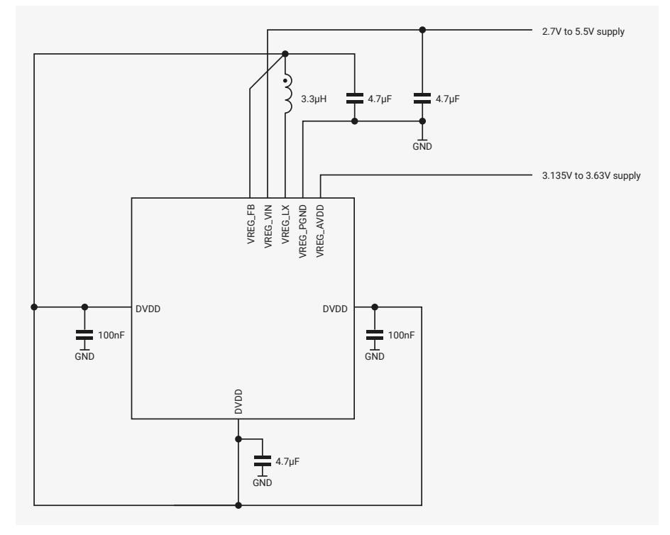

# **6.3.7. Application Circuit**

The regulator requires two external power supplies, the input supply (VREG_VIN), and a separate low noise supply for its analogue control circuits (VREG_AVDD). VREG_VIN must be in the range 2.7 V to 5.5 V, and VREG_AVDD must be in the range 3.135 V to 3.63 V.

If VREG_VIN is limited to the range 3.135 V to 3.63 V, a single combined supply can be used for both VREG_VIN and VREG_AVDD. This approach is shown in [Figure 19](#page-449-1). Care must be taken to minimise noise on VREG_AVDD.

*Figure 19. core voltage regulator with combined supplies*

Alternatively, to support input voltages above 3.63 V, VREG_VIN and VREG_AVDD can be powered separately. This is shown in [Figure 20](#page-449-2).

*Figure 20. core voltage regulator with separate supplies*

