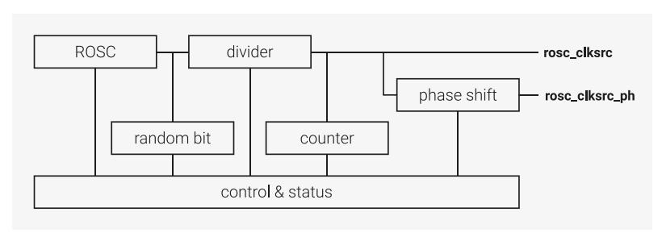

# **8.3.1. Overview**

The Ring Oscillator (ROSC) is an on-chip oscillator built from a ring of inverters. It requires no external components and is started automatically during RP2350 power up. It provides the clock to the cores during boot. The frequency of the ROSC is programmable and it can directly provide a high speed clock to the cores, but the frequency varies with Process, Voltage, and Temperature (PVT) so it cannot provide clocks for components which require an accurate frequency such as the AON Timer, USB, and ADC. The frequency can be randomised to provide some protection against attempts to recover the system clock from power traces. Methods for mitigating unwanted frequency variation are discussed in [Section 8.1, "Overview"](#page-510-1), but these are only relevant to very low power designs. For most applications requiring accurate clock frequencies, switch to the XOSC and PLLs. During boot, the ROSC runs at a nominal 11MHz and is guaranteed to be in the range 4.6MHz to 19.6MHz without randomisation and 4.6MHz to 24.0MHz with randomisation.

Once the chip has booted, the programmer can choose to continue running from the ROSC and increase its frequency or start the Crystal Oscillator (XOSC) and PLLs. You can disable the ROSC once you've switched the system clocks to the XOSC. Each oscillator has advantages; switch between them to achieve the best solution for your application.

*Figure 38. ROSC overview.*

